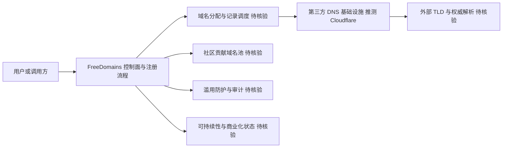

# stackryze/FreeDomains

## 一句话定位
免费域名注册服务——面向开发者、Homelab 爱好者和开源项目，提供零成本二级域名，降低个人项目上线的门槛。

## 它解决的问题
独立开发者和小型项目在部署时面临一个尴尬：云服务（Vercel、Cloudflare Pages）大多免费，但自定义域名却需要年费（.com 约 $10/年，优质 TLD 更贵）。对于 Homelab、个人博客、作品集、MVP 原型等非商业项目，域名成本成为不必要的门槛。FreeDomains 通过提供免费的二级域名（如 `yourname.stackryze.com` 或自有 TLD 下的子域名），让开发者无需购买域名即可获得专业的访问地址。

## 为什么值得关注
- **Stars:** 9,307 stars，对于一个域名服务来说热度异常高
- **Homelab 生态:** 精准切入 Homelab/Self-hosted 社区的刚需
- **增长速度:** 创建于 2025 年 12 月，6 个月内近万星，增速显著
- **开源 + 免费:** AGPL-3.0 许可证，代码完全开放，社区可自部署

## 热度来源判断
热度来自 Homelab/Self-hosted 社区的强力传播。Reddit r/homelab、r/selfhosted、Hacker News、以及中文技术社区（V2EX、NodeSeek）对免费资源有天然的传播动力。Stackryze 品牌在域名社区已有积累，FreeDomains 作为其免费层产品获得了品牌势能的加持。

## 关键技术亮点亮点
- 自动化域名分配系统：API 驱动，支持 DNS 记录自动配置
- 支持 A/AAAA/CNAME/MX/TXT 等主流记录类型
- 基于 Cloudflare DNS 的后端（推测），利用其免费 DNS 托管
- JavaScript/Node.js 实现，轻量可自部署
- 社区贡献模式：用户可贡献自己的域名到免费池

## 架构师速览

| 决策问题 | 研究判断 | 证据边界 |
|---|---|---|
| 系统边界 | FreeDomains 的核心边界是「用户/调用方 → 自有 API 控制面 → DNS 基础设施」，其中 API 控制面负责域名分配与记录管理，DNS 基础设施由第三方（推测 Cloudflare）承担。 | 控制面职责与 DNS 后端依赖基于档案描述；具体控制面模块拆分、是否为自建权威 DNS，档案未证实，标注待核验。 |
| 主路径 | 注册请求 → API 控制面校验/分配 → DNS 记录（A/AAAA/CNAME/MX/TXT）写入第三方 DNS 提供商 → 用户域名解析生效。 | 记录类型与分配逻辑见档案；分配调度策略、TTL 默认值、API 鉴权方式、控制台 UI 实现，档案未给出细节。 |
| 关键权衡 | 可持续运营成本（DNS 查询、管理面板、滥用防护）与「免费层零费用承诺」之间的张力，是该项目最核心的结构性权衡；其次是开源 AGPL-3.0 与潜在商业化路径的兼容性。 | 运营成本项与许可信息有档案原文支撑；具体滥用防护机制、商业化计划、第三方 DNS 合同条款均无证据，标注待核验。 |
| 最小 PoC | 申请一个免费二级域名，验证：(1) API/控制台注册与域名分配是否自助完成；(2) A/CNAME/TXT 记录写入后 DNS 全球生效时间；(3) 域名在邮件/反垃圾名单中的信誉状态。 | PoC 范围仅覆盖档案明示能力；SLA、可用性承诺、恢复策略档案未给出，结论不能外推至生产。 |

## 架构启发
FreeDomains 代表了一种"基础设施免费化"的趋势——当底层资源（DNS 解析、CDN、TLS）的成本趋近于零时，聚合和分发这些资源本身就是有价值的社区服务。对架构师的启发是：**在云原生时代，"免费层"是最有效的用户获取渠道**，但需要清晰的商业化路径来支撑长期运营。

## 架构图（MMD）

> 证据边界：此图只采用本档案已有可核验描述；“待核验”节点不应视为项目实现事实。

## 定位判断
**工具型（社区服务）。** 本质是一个社区运营的基础设施服务，而非技术密集型产品。其价值在于服务可用性和社区信任，而非代码复杂度。

## 风险/局限/泡沫点
- **可持续性风险最大:** 免费服务的运营成本（DNS 查询、管理面板、滥用防护）需要持续投入，无明确盈利模式
- 域名滥用风险：免费域名容易被钓鱼、垃圾邮件利用，可能导致 TLD 被拉黑
- 依赖第三方基础设施：底层 DNS 服务商变更政策时可能影响可用性
- AGPL-3.0 许可证可能限制企业使用和商业化
- 9k stars 中"收藏未使用"的比例可能很高

## 与同类项目的关系
- 与 **DuckDNS**、**FreeDNS (afraid.org)**、**No-IP** 是直接竞品
- 与 **is-a.dev**、**js.org** 等 GitHub 管理的免费域名项目模式相似
- 在 Homelab 生态中，与 Cloudflare Tunnel、Tailscale 等网络工具互补
- 与 Nginx Proxy Manager、Traefik 等反向代理配合使用

## 是否值得持续跟踪
**选择性跟踪。** 作为实用工具值得了解和使用，但作为研究对象价值有限。建议关注其可持续性——如果服务能稳定运营 2 年以上，说明商业模式成立。

## 后续观察点
- 服务可用性和 SLA 表现
- 是否引入付费层或增值服务（如自定义 TLD、API 高级功能）
- 域名滥用治理策略和效果
- 社区贡献的域名池规模变化
- 是否面临 DNS 服务商的政策风险

---
> 数据来源: GitHub API (stackryze/FreeDomains) | 星标: 9,307 | 语言: JavaScript | 许可证: AGPL-3.0
