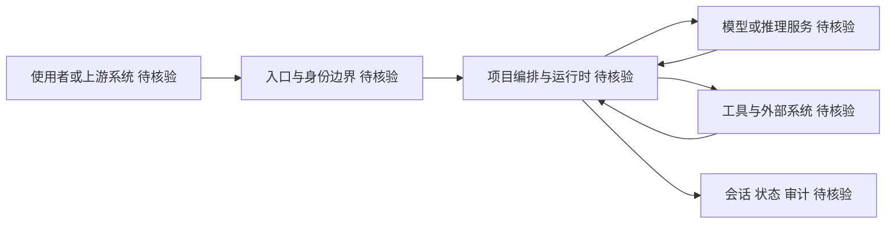

# thedaviddias/Front-End-Checklist

## 一句话定位
现代 Web 开发必备清单——面向人类和 AI agent 的前端项目交付前检查表，涵盖 HTML/CSS/JS/可访问性/性能/SEO/安全全维度。

## 它解决的问题
前端项目发布前需要检查大量细节（meta 标签、可访问性、性能优化、安全头、SEO 配置等），容易遗漏。这个项目提供了一份结构化的检查清单，确保每个环节都经过验证。2026 年版本特别加入了"面向 AI agent"的设计，让 AI 工具也能消费这份清单自动检查。

## 为什么值得关注
- **Stars:** 73,456 stars！前端领域最高 star 项目之一
- **MDX 格式**：结构化内容，适合工具消费
- **全面性**：覆盖前端开发所有关键维度
- **AI agent 适配**：标签含 ai-agent/ai-agents，说明专为 AI 时代优化
- 经典老牌项目，长期维护更新
- 被 frontend 开发者社区广泛引用

## 热度来源判断
- **前端开发者基数（极高）**：全球数百万前端开发者
- **Checklist 文化（高）**：开发者热爱清单类工具
- **长期 SEO 优势（高）**：运营多年，搜索引擎排名极高
- **AI agent 新角度（中）**：为 AI 工具消费优化的版本带来新流量

## 关键技术亮点亮点
1. **全维度覆盖**：HEAD/HTML/CSS/JS/可访问性/性能/SEO/安全/测试
2. **优先级分级**：每项标记为 High/Medium/Low，帮助聚焦
3. **MDX 结构化**：内容可被工具解析和自动化检查
4. **AI agent 可消费**：设计为 AI 工具能读取和执行的检查规则
5. **国际化**：多语言版本（含中文）

## 架构师速览

| 决策问题 | 研究判断 | 证据边界 |
|---|---|---|
| 系统边界 | 这是一个以 MDX 文档形式承载的检查清单资源，覆盖 HTML/CSS/JS、可访问性、性能、SEO、安全等前端交付维度；其"系统边界"实质是内容覆盖面与优先级分级（High/Medium/Low），而非软件组件边界 | 档案明确为"资源型"，仓库语言标注 MDX；未描述任何运行时、API、数据库或服务组件 |
| 主路径 | 使用者的使用路径是：查阅清单条目 → 按维度逐项核对（HEAD → HTML → CSS → JS → 可访问性 → 性能 → SEO → 安全 → 测试）→ 标记完成；AI agent 消费路径是：解析 MDX 结构 → 自动化执行可机器检查的条目 | 档案明确提及"AI agent 可消费"和"MDX 结构化"两点，但未提供具体解析 schema 或 CLI 实现 |
| 关键权衡 | 通用覆盖广度 vs. 项目特异性的取舍：清单越全则越通用，但对具体技术栈的深度指导越弱；同时面临被 Lighthouse/axe-core 等自动化工具功能重叠的替代风险 | 档案在"风险/局限"段直接列出"工具碎片化"与"表面化"两条权衡依据 |
| 最小 PoC | 在现有前端项目中选 1–2 个维度（如可访问性、SEO），人工对照清单逐项核对完成度，验证清单条目对实际项目的适用性和冗余度 | 档案未提供 CLI、CI 插件或程序化消费接口的证据，故最小 PoC 仅限人工核验 |

## 架构启发
- **Checklist 即标准**：将最佳实践固化为可执行的清单
- **面向 AI 的文档设计**：不仅写给人看，也写给 AI 消费
- **MDX 作为知识载体**：结构化文档格式让工具化成为可能

## 架构图（MMD）

> 证据边界：此图只采用本档案已有可核验描述；“待核验”节点不应视为项目实现事实。

## 定位判断
**经典资源型项目**。前端领域的事实标准清单。不是技术工具但影响力巨大，是前端工程文化的组成部分。

## 风险/局限/泡沫点
- **AI 自动化替代**：AI 工具可能自动检测这些问题，降低手动清单价值
- **技术迭代**：前端技术快速变化，部分检查项可能过时
- **维护压力**：73k stars 项目需要持续更新跟上技术发展
- **工具碎片化**：Lighthouse、axe-core 等工具覆盖部分检查项
- **表面化**：Checklist 只能覆盖通用问题，项目特殊需求需额外处理

## 与同类项目的关系
- **vs Lighthouse**：Lighthouse 自动检测，Front-End-Checklist 提供全面人工清单
- **vs axe-core**：axe-core 专注可访问性，Front-End-Checklist 覆盖全维度
- **vs Web.dev**：Google 的 Web.dev 提供学习和检测，此项目更聚焦清单
- **vs前端面试清单**：面试清单偏知识考核，此清单偏工程实践

## 是否值得持续跟踪
**一般关注。** 作为参考工具直接使用即可。关注 AI agent 版本的进展和自动化检测能力。

## 后续观察点
- AI agent 消费模式的实际应用（是否有工具集成此清单自动检查）
- 是否推出自动化检测工具（CLI/CI 集成）
- 新前端技术（React Server Components、View Transitions 等）的覆盖
- 国际化和社区维护情况

---
> 数据来源: GitHub API (2026-06-18) | Stars: 73,456 | Forks: 6,663 | 语言: MDX
