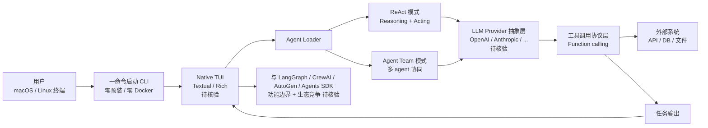

# ApodexAI/FrontierAgent

## 一句话定位
**Agent framework + native CLI TUI**——以"零预装、零硬 Docker 依赖、一命令 macOS & Linux 启动"为核心卖点，支持 ReAct / Agent Team 模式的 agent 编排框架。

## 它解决的问题
2026 下半年 agent frameworks 爆发（LangGraph / CrewAI / AutoGen / OpenAI Agents SDK 等），但开发者面临两个真实痛点：(1) **环境配置复杂**——大多数 framework 需要 Python 环境、Docker、依赖管理，新手门槛高；(2) **UI 体验割裂**——agent 运行状态需要 CLI + 浏览器 + 终端切换，难以集中管理。FrontierAgent 直击这两个痛点：(a) **零预装 + 零硬 Docker 依赖**——一命令即可启动；(b) **native CLI TUI**——终端内统一的 agent 运行状态可视化；(c) **ReAct / Agent Team 双模式**——单 agent 推理循环或多 agent 团队协作可切换。配合 Apache-2.0 许可，是"低门槛部署 + 跨平台 + 多模式"的 agent framework 综合体。

## 为什么值得关注
- **Stars:** 1,389（截至 2026-09-03），12 天即破 1k⭐，**首日即达 1097⭐**——发布即爆
- **Forks:** 130，9.4% fork/star 中等偏高（典型"真实部署"信号）
- **License:** Apache-2.0（商业友好）
- **语言:** Python（6.7MB），核心框架 + CLI TUI
- **活跃度:** created 2026-08-22，pushed 2026-09-02，12 天内持续高活跃
- **规模:** 6.7MB Python
- **Topics:** `agent-orchestration` `agentic-ai` `agentic-framework` `ai-agents` `harness` `multi-agent` `terminal-agent` `tui`——精准命中 agent framework + TUI 赛道

## 热度来源判断
FrontierAgent 的热度是 **"agent framework 部署门槛刚需 × native TUI 差异化 × Apache-2.0 友好 × 一命令启动卖点"** 的组合。agent frameworks 在 2026 下半年极度饱和，但**真正"零依赖一命令启动 + native TUI"的产品极少**——这是 FrontierAgent 的真实差异化。9.4% fork/star 是典型"真实部署"信号（高于纯围观项目 1-3%，低于纯工具型 15%+）。热度**真实且具差异化价值**——但需警惕：与 LangGraph / CrewAI / AutoGen / OpenAI Agents SDK 等头部 framework 的功能边界与生态竞争。

## 关键技术亮点
1. **零预装 + 零硬 Docker 依赖**——一命令在 macOS / Linux 启动，Python 虚拟环境内置（推测）
2. **Native CLI TUI**——终端内统一管理 agent 运行状态、消息流、工具调用，无需切换浏览器
3. **ReAct / Agent Team 双模式**——单 agent 推理循环（Reasoning + Acting）与多 agent 团队协作可切换
4. **Apache-2.0 许可**——商业友好，企业可用
5. **Agent orchestration + multi-agent**——支持多 agent 协同编排
6. **Cross-platform（macOS + Linux）**——主流开发平台原生支持

## 架构师速览

| 决策问题 | 研究判断 | 证据边界 |
|---|---|---|
| 系统边界 | Agent framework runtime + native CLI TUI + ReAct / Agent Team 模式适配层 + 工具调用协议层 + LLM provider 抽象层 | 五要素是 topics 与 description 明示；具体 TUI 实现（Textual / Rich / prompt_toolkit）、ReAct 实现细节（tool selection / memory）需 README 核验 |
| 主路径 | 一命令启动 → CLI TUI 加载 → 用户输入任务 → ReAct 模式单 agent 推理循环 或 Agent Team 模式多 agent 协作 → 工具调用 + LLM provider 切换 → TUI 实时可视化 → 输出结果 | 主路径为 description 抽象；具体 CLI 命令、TUI 交互细节、ReAct / Agent Team 切换协议需 README 核验 |
| 关键权衡 | "零依赖一命令启动" 部署便利 vs "生态成熟度"（与 LangGraph / CrewAI 比）；"native TUI" 终端体验 vs "Web UI" 远程访问；"Apache-2.0" 商业友好 vs "个人 / 小团队" 可持续性；"ReAct + Agent Team" 双模式 vs "单一模式深度" | 6.7MB 来自 API；Apache-2.0 商业可用；具体功能深度、生态兼容性需 README 核验 |
| 最小 PoC | 在 macOS / Linux 上 clone 仓库 → 执行"一命令启动" → CLI TUI 启动 → 配置 LLM API key → 执行 1 个 ReAct 模式任务（如"查天气 + 写邮件"）→ 切换到 Agent Team 模式执行 1 个多 agent 任务 → 对比 LangGraph / CrewAI 部署体验 | 安装命令需 README 独立核验；具体 TUI 交互、ReAct / Agent Team 切换协议需文档指引 |

## 架构图（MMD）

> 证据边界：此图只采用本档案已有可核验描述；"待核验"节点不应视为项目实现事实。

## 架构启发

`ApodexAI/FrontierAgent` 的核心启发是 **"agent framework 从'重型 LangGraph 路线'分化出'轻量低门槛 + TUI'的细分市场"**。当前 agent frameworks（LangGraph / CrewAI / AutoGen / OpenAI Agents SDK）大多功能强大但部署复杂——Python 环境、Docker、依赖管理，新手门槛高。FrontierAgent 直击这一痛点：(a) 零预装 + 零硬 Docker 依赖 + 一命令启动；(b) native CLI TUI 提供终端内统一的 agent 运行状态管理；(c) ReAct / Agent Team 双模式可切换。更深层的启发是：**"低门槛 + 原生体验"是 framework 差异化的真实路径**——9.4% fork/star 中等偏高说明真实部署而非纯围观。但 agent framework 赛道极度饱和，能否长期差异化取决于 TUI 体验是否真"好"、ReAct / Agent Team 模式深度是否够用。

## 定位判断
**工具型 / agent framework 候选。** FrontierAgent 不是"又一个 LangGraph 替代品"，而是"零依赖一命令启动 + native TUI"差异化路线——目标是"低门槛 + 终端原生体验"的开发者细分市场。12 天 1,389⭐ + 9.4% fork/star（中等偏高）+ Apache-2.0 商业友好 + 一命令启动卖点共同说明这是个真实需求驱动的产品。能否持续，取决于：(a) TUI 体验是否真的"好"；(b) ReAct / Agent Team 模式深度是否够用；(c) 与头部 framework 的差异化是否长期成立。

## 风险/局限/泡沫点
- **agent framework 赛道极度饱和**——LangGraph / CrewAI / AutoGen / OpenAI Agents SDK 等头部产品功能完整，FrontierAgent 差异化能否长期成立待观察
- **"零依赖一命令启动"是真实差异化还是营销话术**——具体技术细节（Python venv / static binary / shell installer）需 README 核验
- **个人 / 小团队项目可持续性**——ApodexAI 是创业公司（待核验），但 agent framework 类项目长期需要大量维护
- **TUI 体验上限**——终端 UI 不可能比 Web UI 更丰富（图片 / 视频 / 复杂表单）
- **LLM Provider 锁定风险**——若主要绑定某一 provider（OpenAI / Anthropic），多 provider 切换体验可能不成熟
- **生态碎片化**——agent framework 数量膨胀，开发者选择困难，每个 framework 都有"早期采用者红利"但难以统一标准

## 与同类项目的关系
- **vs LangGraph（LangChain）：** LangGraph 是"图编排"路线，FrontierAgent 是"TUI + 一命令"路线——一个偏深度、一个偏便利
- **vs CrewAI：** CrewAI 是"role-based multi-agent"路线，FrontierAgent 的 Agent Team 模式类似但 TUI 体验差异化
- **vs AutoGen（Microsoft）：** AutoGen 是"conversational multi-agent"路线，FrontierAgent 是"ReAct + TUI"路线
- **vs OpenAI Agents SDK：** OpenAI Agents SDK 是"OpenAI 生态深度集成"，FrontierAgent 是"LLM Provider 抽象 + TUI"
- **vs yetone/cumora / CopilotKit/OpenBot：** 这些是"团队 chat + AI coworker"路线，FrontierAgent 是"agent framework + TUI"路线——一个偏应用层、一个偏基础设施

## 是否值得持续跟踪
**值得跟踪（低门槛 agent framework）。** FrontierAgent 代表了 agent framework 从"重型 LangGraph 路线"分化出"轻量低门槛 + TUI"的细分市场。对 agent 开发者，这个框架值得试用评估"部署便利度 + TUI 体验"；对 agent framework 观察者，它是"低门槛路线"的头部样本。建议关注：(a) TUI 体验是否真差异化；(b) ReAct / Agent Team 模式深度；(c) Apache-2.0 商业采用案例。

## 后续观察点
- TUI 体验是否被独立评测（vs Web UI）
- ReAct / Agent Team 模式的功能深度（是否达到 LangGraph / CrewAI 同等水平）
- Apache-2.0 商业采用案例（企业 / 创业公司）
- LLM Provider 抽象是否完整支持主流 provider
- 是否从 agent framework 演化为"agent platform"（集成 marketplace / monitoring / deployment）

---
> 数据来源: GitHub API (2026-09-03) | Stars: 1,389 | Forks: 130 | License: Apache-2.0 | 语言: Python | 创建: 2026-08-22