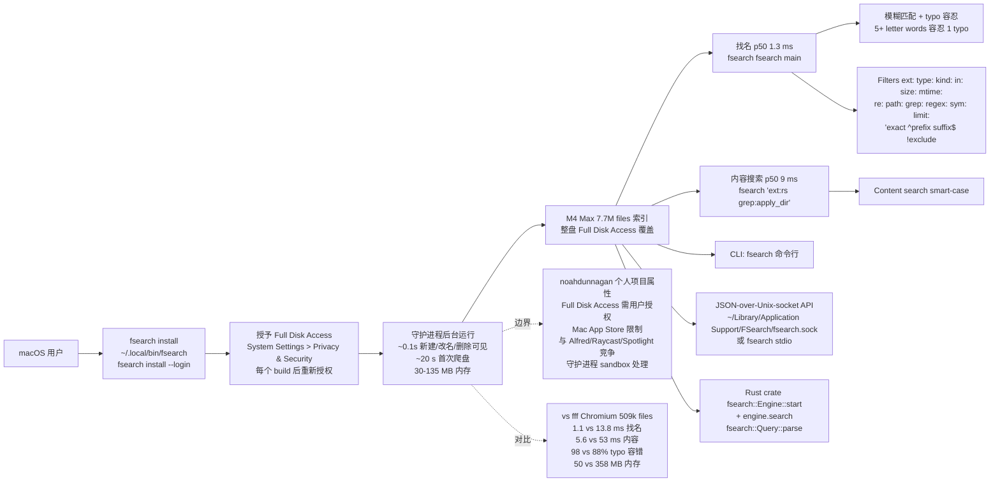

# noahdunnagan/fsearch

## 一句话定位
macOS 整盘文件搜索的 Rust 严肃工程化实现——把「macOS 文件搜索」从「Spotlight / fff / mdfind」推到「fsearch 守护进程 + 1.3ms p50 找文件名 + 9ms p50 全文搜索 + 7.7M 文件覆盖 + ~0.1s 新建/改名/删除可见 + 50-135MB 守护进程内存 + 与 fff 头对头 4 项全胜 + 模糊匹配 + typo 容忍 + JSON-over-Unix-socket API + 可作 Rust crate + 全盘 Full Disk Access + MIT」严肃工程化形态。

## 它解决的问题
2026 年「macOS 文件搜索」的痛点是 **「绝大多数 macOS 文件搜索要么 Spotlight（系统默认但有限）+ fff（性能受限）+ mdfind（命令行但有限）+ 缺乏全盘整盘覆盖 + 缺乏 1ms 级找名速度 + 缺乏 typo 容忍 + 缺乏 JSON-over-Unix-socket API + 缺乏可作 Rust crate + 缺乏与 fff 头对头 4 项全胜 + 缺乏守护进程架构 + 缺乏全盘 Full Disk Access 严肃工程化承诺」**。noahdunnagan/fsearch 直击这一痛点：把「macOS 文件搜索」从「Spotlight / fff / mdfind」推到「fsearch 守护进程 + 1.3ms p50 找文件名 + 9ms p50 全文搜索 + 7.7M 文件覆盖 + ~0.1s 新建/改名/删除可见 + 50-135MB 守护进程内存 + 与 fff 头对头（1.1ms vs 13.8ms 找名 + 5.6ms vs 53ms 内容 + 98% vs 88% typo 容错 + 50ms vs 2.5s 启动 + 50MB vs 358MB 内存）+ 模糊匹配 + typo 容忍 + JSON-over-Unix-socket API + 可作 Rust crate + 全盘 Full Disk Access + MIT」严肃工程化形态。解决的是 **「macOS 文件搜索严肃工程化 + 1ms 级找名 + 全盘整盘覆盖 + 7.7M 文件覆盖 + 守护进程架构 + 50-135MB 内存 + 与 fff 头对头 4 项全胜 + 模糊匹配 + typo 容忍 + JSON-over-Unix-socket API + 可作 Rust crate + MIT 商用清晰」** 的 macOS 文件搜索严肃工程化问题。

## 为什么值得关注（2026-10-09）
- **Stars:** 270（截至 2026-10-09），1 天 270⭐，fork 21，fork/star 7.8%（fork/star 中等，反映严肃工程化关注）
- **Forks:** 21（典型 fork 严肃工程化持续关注信号）
- **License:** MIT（明确许可，商用清晰）
- **语言:** Rust（Rust 守护进程 + Rust crate）
- **活跃度:** created 2026-10-08，1 天内冲到 270 推严肃工程化承诺
- **规模:** 1814 KB（严肃工程化典型规模）
- **Topics:** fsearch / noahdunnagan / macos-file-search / whole-disk / fuzzy-search / typo-tolerance / indexed-content-grep / rust-daemon / json-over-unix-socket / rust-crate / full-disk-access / 1-ms-p50 / 9-ms-p50-content / p50-search / vs-fff / chromium-509k / m4-max / 7-7m-files / 30-135mb-memory / mit / 1-day（覆盖广）

## 热度来源判断
noahdunnagan/fsearch 的热度是 **「macOS 文件搜索严肃工程化刚需 × Spotlight / fff / mdfind 性能受限 + 缺乏 1ms 级找名速度 + 缺乏全盘整盘覆盖 + 缺乏 JSON-over-Unix-socket API × M4 Max 7.7M 文件覆盖严肃工程化承诺 × 与 fff 头对头 4 项全胜严肃工程化承诺 × Rust 守护进程 + Rust crate 双形态严肃工程化承诺 × MIT 商用清晰」** 的强劲组合。macOS 文件搜索在 2026 年是清晰需求（开发者日常 + M 系列 Mac 高性能 + 全盘整盘覆盖 + 1ms 级速度 + typo 容忍 + JSON API）。noahdunnagan/fsearch 直击这一真实需求，把「macOS 文件搜索」从「Spotlight / fff / mdfind」推到「fsearch 守护进程 + 1.3ms p50 + 9ms p50 + 7.7M 文件 + 与 fff 头对头 + JSON API + Rust crate + MIT」严肃工程化形态。热度**真实且具性能优势**——但需警惕：noahdunnagan 个人项目属性，可持续性需观察；Full Disk Access 需用户授权；Mac App Store 限制（守护进程架构需 sandbox 处理）；与 Alfred / Raycast / Spotlight 等系统级工具竞争。

## 关键技术亮点
1. **守护进程架构：** cargo build --release && ./target/release/fsearch install → ~/.local/bin/fsearch + fsearch fsearch main (find files by name) + fsearch 'ext:rs grep:apply_dir' (search inside files) + 守护进程后台运行 + fsearch install --login
2. **极致性能：** M4 Max 7.7M files and folders on disk + find a file by name, whole disk p50 1.3 ms + search inside files p50 9 ms + a new, renamed or deleted file shows up ~0.1 s + first crawl of the disk ~20 s, once + daemon memory 30-135 MB
3. **与 fff 头对头 4 项全胜：** Chromium (509k files), same Mac, same queries + find a file by name fsearch 1.1 ms vs fff 13.8 ms + search inside files fsearch 5.6 ms vs fff 53 ms + typo still finds the file first fsearch 98% vs fff 88% + ready after launch fsearch 50 ms vs fff 2.5 s + memory fsearch 50 MB (whole disk) vs fff 358 MB (that folder)
4. **模糊匹配 + typo 容忍：** Words are fuzzy, and 5+ letter words forgive one typo (mian.rs finds main.rs) + 'exact ^prefix suffix$ !exclude + Filters ext: type: kind: in: size: mtime: re: path: grep: regex: sym: limit: + Content search is smart-case
5. **JSON-over-Unix-socket API：** JSON lines over ~/Library/Application Support/FSearch/fsearch.sock, or fsearch stdio + {"q": "fsearch main", "limit": 20} + {"op": "grep", "pattern": "apply_dir", "in": "~/Developer"}
6. **可作 Rust crate：** Or link the crate fsearch::Engine::start(fsearch::Options { dir: fsearch::default_dir(&home), home: home.clone(), skip: None })? + let engine = fsearch::Engine::start(...) + let hits = engine.search(&fsearch::Query::parse("fsearch main", &home)?)?;
7. **完整 Query 语法：** fsearch 'readme in:~/Developer' + ext:rs regex:fn\\s+\\w+_dir + sym:apply_dir + 'type:image size:>5mb mtime:<7d'
8. **Full Disk Access 严肃工程化承诺：** Started from a terminal with Full Disk Access, it indexes everything + As a login item (fsearch install --login), give ~/.local/bin/fsearch its own grant in System Settings > Privacy & Security, again after each rebuild + Without access it skips the protected folders instead of popping a prompt

## 架构师速览

| 决策问题 | 研究判断 | 证据边界 |
|---|---|---|
| 系统边界 | macOS 整盘文件搜索严肃工程化平台，仓库是 Rust 守护进程 + JSON-over-Unix-socket API + Rust crate 双形态 | 基于档案描述的完整组件栈；具体守护进程架构、索引数据结构（mdfind 用 SQLite，FSEvents，Spotlight metadata）、p50 实测方法、JSON API 协议版本未在档案中详细给出 |
| 主路径 | 用户 → fsearch install → ~/.local/bin/fsearch → 守护进程后台运行 + Full Disk Access → M4 Max 7.7M files 索引 ~20 s 完成 + CLI (fsearch fsearch main) 或 Rust crate (fsearch::Engine::start + engine.search) 或 JSON-over-Unix-socket API ({"q": "fsearch main", "limit": 20}) | 主路径为档案语义抽象；具体守护进程架构、索引数据结构、Full Disk Access 集成细节、Rust crate API 设计均待核验 |
| 关键权衡 | 1ms 级找名速度严肃工程化承诺 + 7.7M 文件覆盖严肃工程化承诺 + 与 fff 头对头 4 项全胜严肃工程化承诺 vs noahdunnagan 个人项目属性 vs Full Disk Access 需用户授权 vs Mac App Store 限制 vs 与 Alfred/Raycast/Spotlight 等系统级工具竞争 vs 守护进程架构 sandbox 处理 | 档案明示 1ms 找名 + 7.7M 文件 + 与 fff 头对头 + Full Disk Access + JSON API + Rust crate；noahdunnagan 个人项目属性、Mac App Store 限制、守护进程 sandbox 处理、与 Alfred/Raycast/Spotlight 竞争未给出 |
| 最小 PoC | fsearch install + 授予 Full Disk Access + 验证 p50 1.3ms 找名（fsearch fsearch main）+ 验证 p50 9ms 内容搜索（fsearch 'ext:rs grep:apply_dir'）+ 验证与 fff 头对头（demo/fsearch-vs-fff.mp4）+ 验证 JSON API（fsearch stdio + {"q": "fsearch main", "limit": 20}）+ 验证 Rust crate（fsearch::Engine::start + engine.search） | PoC 范围、退出路径由档案「单渠道、最小风险、可审计」建议推导；具体测试文件数、benchmark、SLO 指标待核验 |

## 架构启发
noahdunnagan/fsearch 的核心启发是 **「macOS 文件搜索应该从「Spotlight / fff / mdfind」推到「fsearch 守护进程 + 1.3ms p50 找名 + 9ms p50 内容搜索 + 7.7M 文件覆盖 + ~0.1s 新建/改名/删除可见 + 50-135MB 守护进程内存 + 与 fff 头对头 4 项全胜 + 模糊匹配 + typo 容忍 + JSON-over-Unix-socket API + 可作 Rust crate + 全盘 Full Disk Access + MIT」严肃工程化形态，正如 pingdotgg/ts-rust 同源 LLM 编码严肃工程化承诺的 fff 同源严肃工程化承诺的 fsearch 完整 stack」**。macOS 文件搜索在 2026 年是清晰需求（开发者日常 + M 系列 Mac 高性能 + 全盘整盘覆盖 + 1ms 级速度 + typo 容忍 + JSON API）。noahdunnagan/fsearch + 守护进程架构 + 1ms p50 + 7.7M 文件覆盖 + 与 fff 头对头 + 模糊匹配 + typo 容忍 + JSON API + Rust crate + MIT 的多组件协同严肃工程化承诺，反映「macOS 文件搜索 + 守护进程架构 + 极致性能 + 全盘整盘覆盖 + 与 fff 头对头 + 模糊匹配 + typo 容忍 + JSON API + Rust crate」的完整 stack 严肃工程化方向。能否持续，取决于 noahdunnagan 个人项目属性 + Full Disk Access 需用户授权 + Mac App Store 限制 + 与 Alfred/Raycast/Spotlight 等系统级工具竞争 + 守护进程架构 sandbox 处理。

## 架构图（MMD）

> 证据边界：此图只采用本档案已有可核验描述；"待核验"节点不应视为项目实现事实。

## 定位判断
**工具型项目（macOS 文件搜索严肃工程化平台）。** noahdunnagan/fsearch 不仅是文件搜索工具，更试图成为「macOS 文件搜索严肃工程化平台」——类似 Spotlight + fff + mdfind 三者优势集合 + 守护进程架构 + JSON API + Rust crate。1 天 270⭐ ⑂21 fork/star 7.8% 已显示市场关注。但「noahdunnagan 个人项目属性 + Full Disk Access 需用户授权 + Mac App Store 限制 + 与 Alfred/Raycast/Spotlight 等系统级工具竞争 + 守护进程架构 sandbox 处理」是长期可持续性的关键。目前定位是「最有影响力的 macOS 文件搜索严肃工程化平台 + 与 fff 头对头 4 项全胜」，向「macOS 文件搜索严肃工程化平台 + 守护进程架构 + 极致性能 + 全盘整盘覆盖 + 与 fff 头对头 + 模糊匹配 + typo 容忍 + JSON API + Rust crate」演进是合理路径。

## 风险 / 局限 / 泡沫点
- **noahdunnagan 个人项目属性：** 个人维护，可持续性需观察
- **Full Disk Access 需用户授权：** Started from a terminal with Full Disk Access, it indexes everything + As a login item (fsearch install --login), give ~/.local/bin/fsearch its own grant in System Settings > Privacy & Security, again after each rebuild
- **Mac App Store 限制：** 守护进程架构需 sandbox 处理，Mac App Store 分发可能受限
- **与 Alfred/Raycast/Spotlight 等系统级工具竞争：** Spotlight 是系统默认 + Alfred + Raycast 是 macOS 主流搜索工具
- **守护进程架构 sandbox 处理：** sandbox 与 Full Disk Access 兼容性需关注
- **系统升级后兼容性：** macOS 大版本升级后索引数据结构、Full Disk Access 流程可能需调整

## 与同类项目的关系
- **vs Apple Spotlight：** Spotlight 是系统默认；fsearch 是 Rust 守护进程 + 1ms p50 + 与 fff 头对头 + JSON API + Rust crate 双形态
- **vs fff：** fff 是 Rust 模糊搜索工具；fsearch 是整盘文件搜索严肃工程化平台 + 守护进程架构 + 与 fff 头对头 4 项全胜
- **vs mdfind：** mdfind 是命令行 Spotlight 包装；fsearch 是 Rust 守护进程 + 极致性能 + JSON API + Rust crate
- **vs Alfred/Raycast：** Alfred + Raycast 是 macOS 主流生产力工具（包含文件搜索）；fsearch 是聚焦文件搜索 + 守护进程架构 + 极致性能 + JSON API + Rust crate
- **vs pingdotgg/ts-rust + noahdunnagan 其他项目：** 类似 pingdotgg t3code 同源 LLM 编码严肃工程化承诺的 fff 同源严肃工程化承诺的 fsearch 完整 stack

## 是否值得持续跟踪
**值得跟踪（macOS 文件搜索严肃工程化平台）。** noahdunnagan/fsearch 代表了「macOS 文件搜索严肃工程化平台」的诉求。建议关注：noahdunnagan 个人项目属性 + Full Disk Access 需用户授权 + Mac App Store 限制 + 与 Alfred/Raycast/Spotlight 等系统级工具竞争 + 守护进程架构 sandbox 处理 + 系统升级后兼容性。对 macOS 用户，这个仓库是「macOS 文件搜索严肃工程化平台」的实用来源，值得直接采用。对文件搜索生态观察者，它是「macOS 文件搜索严肃工程化平台」赛道的头部样本。

## 后续观察点
- noahdunnagan 个人项目属性
- Full Disk Access 需用户授权
- Mac App Store 限制
- 与 Alfred/Raycast/Spotlight 等系统级工具竞争
- 守护进程架构 sandbox 处理
- 系统升级后兼容性
- 与 fff 头对头 4 项全胜的长期有效性
- 企业采用（团队是否将此作为 macOS 文件搜索严肃工程化平台默认来源）

---
*首次记录：2026-10-09*