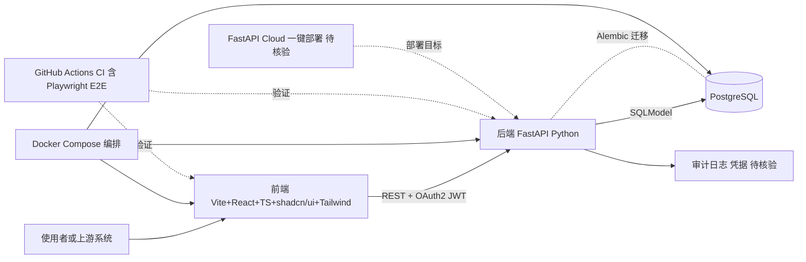

# full-stack-fastapi-template

## 一句话定位
FastAPI 官方出品全栈 Web 应用模板——FastAPI (Python) + React + SQLModel + PostgreSQL + Vite + Tailwind CSS + shadcn/ui + FastAPI Cloud + Docker Compose，开箱即用的生产级 Starter。

## 它解决的问题
新项目搭建全栈应用需要繁琐选型与配置：前后端脚手架、数据库 ORM、认证、CI、容器化、部署。fastapi/full-stack-fastapi-template 把官方推荐栈全部预装好，让开发者 clone 后即可开发，无需做大量 setup。

## 为什么值得关注（2026-08-16）
被 daily/2026-08-16.md 选为今日全栈模板重点。其优势在于：
- **官方维护**（fastapi 组织内），长期可持续性最强
- 集成了 **FastAPI Cloud** 新部署平台（FastAPI 团队的 BaaS）
- 含 Playwright E2E 测试、GitHub Actions CI、Pytest、OAuth2 等全套工程实践

## 热度来源判断
热度来源是 **"FastAPI 官方身份 × 集成度最完整 × 全栈主流栈覆盖"**。44,990 stars 6 年曲线稳定，8,943 forks 反映它已是大量新项目的起点。FastAPI 在 2024-2026 持续超越 Flask / Django Star 增速，官方模板自然水涨船高。

## 关键技术亮点
1. **前后端分离:** 后端 FastAPI（Python）、前端 Vite+React+TS
2. **ORM: SQLModel:** FastAPI 作者 tiangolo 编写，与 Pydantic 深度集成
3. **shadcn/ui:** 现代 Radix + Tailwind 组件库
4. **部署:** 支持传统部署 + FastAPI Cloud 一键部署
5. **完整 CI/CD:** Playwright E2E + GitHub Actions + Alembic 迁移

## 架构师速览

| 决策问题 | 研究判断 | 证据边界 |
|---|---|---|
| 系统边界 | 这是一个全栈 starter，后端 FastAPI+Python、前端 Vite+React+TS、数据 PostgreSQL+SQLModel、容器化 Docker Compose，含 GitHub Actions 与 Playwright E2E | 边界以档案明示组件为准；具体中间件、反代、可观测组件未在档案中列出 |
| 主路径 | 前端 (Vite+React+TS+shadcn/ui+Tailwind) 通过 REST/OAuth2-JWT 调用 FastAPI，FastAPI 经 SQLModel 访问 PostgreSQL，Alembic 管理迁移，Docker Compose 编排部署 | 主路径中的具体路由、网关、CI 工作流文件未在档案中给出 |
| 关键权衡 | 一体化便利（官方栈开箱即用） vs 替换成本（SQLModel 替 SQLAlchemy、React 替 Next.js 均需重写）；FastAPI Cloud 一键部署 vs 厂商绑定 | 权衡判断基于档案的"stack 偏耦合"与"FastAPI Cloud 是新平台"两条风险陈述 |
| 最小 PoC | clone 模板 → docker compose up 拉起 Postgres+后端+前端 → 用 OAuth2-JWT 走通登录与一条 CRUD → 跑通 Playwright E2E 与 Alembic 迁移 | 档案未给出最小可运行子集所需的具体 compose 服务名与启动命令，须源码核验 |

## 架构启发
"官方团队亲自出模板"是开源项目成功要素——fastapi 自己出完整 starter 远比让社区维护 star 数最高的 fork 更有持续性。这种模式值得所有框架学习：作者亲自下场维护，避免孵化期 fork 跑偏。

## 架构图（MMD）

> 证据边界：此图只采用本档案已有可核验描述；“待核验”节点不应视为项目实现事实。

## 定位判断
**工具型 / 全栈 starter 标杆（Python + React 路线）。** 与 gin-vue-admin、react-boilerplate 等同类模板并列，但其官方组织身份最具可信度。

## 风险 / 局限 / 泡沫点
- **非 "AI 时代优先":** 模板未集成 LLM / Agent / RAG 模块——落后于实际主流需求
- **stack 偏耦合:** 切换到 SQLAlchemy 2.x 替代 SQLModel、Next.js 替代 React 均需重写
- **FastAPI Cloud 是新平台:** 绑定自家云服务有商业意图，部分企业用户可能谨慎
- **更新节奏依赖:** tiangolo 个人维护，重大重构存在延期可能

## 与同类项目的关系
- **vs gin-vue-admin:** gin-vue-admin 是 Go + Vue 路线；这是 Python + React 路线
- **vs Next.js Boilerplates:** Next.js 模板走 React 全栈；本模板保留 FastAPI 后端
- **vs Redwood:** Redwood 是 JAMStack + GraphQL 模板；本模板走 REST
- **vs Reflex:** Reflex 是 Python 全栈（不分离）；本模板分离前后端

## 是否值得持续跟踪
**强烈推荐作为 Python 全栈入门脚手架。** 对 LLM/Agent 应用项目，建议在此基础上自行添加 RAG / Agent layer。

## 后续观察点
- 是否增加 AI/Agent 模块（CopilotKit、OpenAI Function Calling 模板等）
- FastAPI Cloud 商业化进展
- 是否迁移到 Pydantic V2 全配置 + SQLAlchemy 2.0
- 与 Next.js + Vercel AI SDK 等"AI 原生模板"的竞争演化

---
> 数据来源: GitHub API (2026-08-21) | Stars: 44,990 | Forks: 8,943 | License: MIT | 语言: TypeScript | 创建: 2019-02-23
