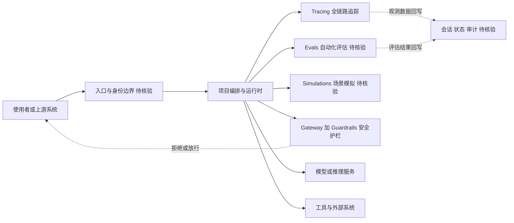

# Future-AGI

## 一句话定位
开源端到端 LLM/AI Agent 可观测性平台：Tracing + Evals + Simulations + Datasets + Gateway + Guardrails。

## 它解决的问题
当 LLM 和 AI Agent 从原型走向生产时，团队面临可观测性黑盒问题：不知道 Agent 在做什么、做得怎么样、哪里出了问题。Future-AGI 提供全链路可观测性。

## 为什么值得关注（2026-04-29）
Agent 从「个人工具」走向「团队基础设施」，可观测性是刚需。Future-AGI 是目前 GitHub 上少数提供 Tracing + Evals + Simulations 三位一体的开源方案。Apache 2.0 许可，可自托管。

## 热度来源判断
增长来自 Agent 可观测性赛道的自然需求，不是泡沫。但 701 stars 说明仍处于早期采用阶段。

## 关键技术亮点亮点
1. **全链路 Tracing**：从用户请求到 LLM 调用到工具执行的完整链路追踪
2. **自动化 Evals**：LLM 输出的质量评估，支持自定义指标
3. **Simulations**：模拟用户场景，测试 Agent 行为
4. **Gateway + Guardrails**：API 网关 + 安全护栏，防止 Agent 产生有害输出

## 架构师速览

| 决策问题 | 研究判断 | 证据边界 |
|---|---|---|
| 系统边界 | 定位为 LLM/Agent 可观测性开源全栈平台，承担 Tracing + Evals + Simulations + Datasets + Gateway + Guardrails 六类职责的编排层 | 仅基于档案中标签与定位描述，模块边界与对内/对外接口未由源码/文档证实，具体形态"待核验" |
| 主路径 | 数据流为请求进入 → 编排/运行时分发 → 模型与工具调用 → Tracing/Evals 评估 → Guardrails 输出控制 → 会话/审计回写 | 路径方向来自档案摘要，主路径上每个节点的协议、持久化与控制点实现细节"待核验" |
| 关键权衡 | 在"全栈覆盖"与"单模块深度"之间取舍：六类能力并行铺开 vs. 任一专业工具（Langfuse/Promptfoo/Portkey）的纵深；自托管 Apache 2.0 vs. 团队规模与迭代稳定性风险 | 权衡结论由档案"风险/局限"段直接给出；stars 增长、issue 数等指标不构成生产可用性证据 |
| 最小 PoC | 在单渠道、最小工具权限、可审计日志条件下验证一条 Tracing→Evals→Guardrails 闭环；验收项含安全、成本、SLO 与退出路径，并以 stars≥2K 作为是否深入评估的触发条件 | PoC 范围与触发阈值由档案"采用建议"与"是否值得持续跟踪"段明示；具体指标阈值与产品能力成熟度"待核验" |

## 架构启发
- Agent 可观测性需要 Tracing（知道发生了什么）+ Evals（知道做得好不好）+ Guardrails（防止出错）三位一体
- Self-hostable 是企业场景的刚需，LLM 数据不应离开企业网络
- Apache 2.0 许可说明团队认真做开源，不是为了引流

## 架构图（MMD）

> 证据边界：此图只采用本档案已有可核验描述；“待核验”节点不应视为项目实现事实。

## 定位判断
在 Agent 可观测性生态中定位为「开源全栈方案」。对标 Langfuse（Tracing）、Promptfoo（Evals）、Portkey（Gateway）。差异化在于三位一体。

## 风险 / 局限 / 泡沫点
1. 701 stars 太少，与 Langfuse（10K+）差距大
2. 40 个 open issues 说明仍在快速迭代中，API 可能不稳定
3. 「全栈方案」往往意味着每个模块都不够深，可能被专业工具逐个超越
4. 团队背景和资金状况不明确

## 与同类项目的关系
- **Langfuse**：LLM Tracing 领导者，10K+ stars，更成熟
- **Promptfoo**：专注 LLM Evals，更专业
- **Portkey**：AI Gateway，更聚焦网关层
- **CodeBurn**：Token 消耗可观测，更轻量，无侵入

## 是否值得持续跟踪
是。作为 Agent 可观测性的全栈方案代表，如果 stars 突破 2K 值得深入评估。

## 最近动态
- 2026-05-05: 从观察型升级为平台候选。822 stars，12 天持续增长。功能覆盖 Tracing + Evals + Simulations + Gateway + Guardrails 全栈。Apache 2.0 协议对企业友好。在 Agent 可观测性赛道中与 LangSmith（闭源）、Phoenix（偏 ML）形成差异化。

## 后续观察点
1. 是否有企业用户公开使用案例
2. Evals 和 Simulations 模块是否真正可用（非 toy implementation）
3. 与 Langfuse 的功能对比是否有实质差异化

---
*首次记录：2026-04-29*
