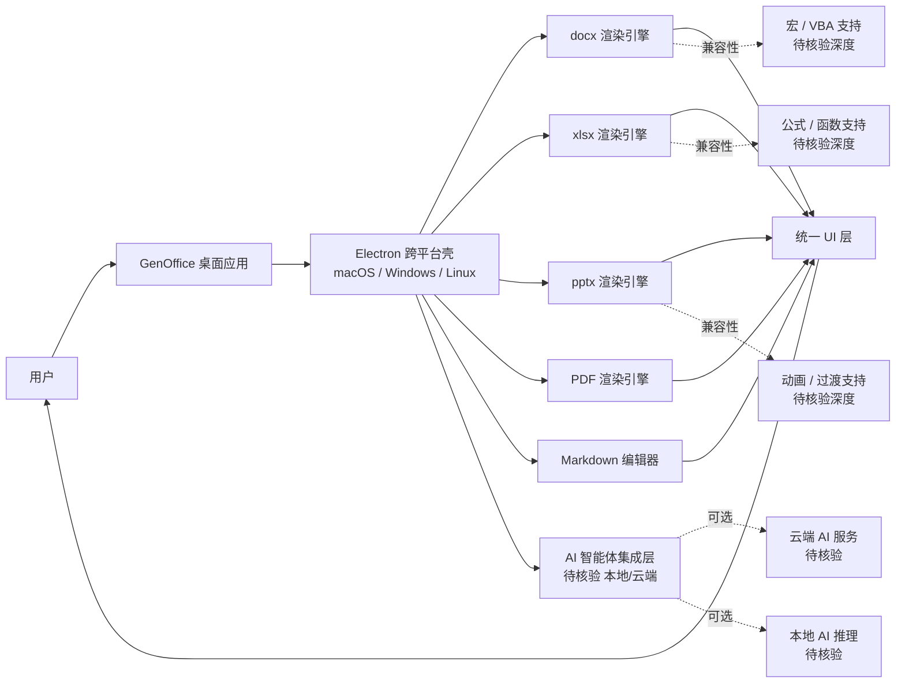

# genspark-ai/genoffice

## 一句话定位
Genspark 官方开源的 AI Office 套件——跨 macOS / Windows / Linux 的 Word（.docx）/ Excel（.xlsx）/ PowerPoint（.pptx）/ PDF / Markdown 一体化 AI 桌面办公栈，内置 AI 智能体，Apache-2.0 许可。

## 它解决的问题
桌面办公软件市场长期由 Microsoft Office / Google Workspace / WPS 垄断，开源替代品（LibreOffice / OnlyOffice / Calligra）已存在 20+ 年但市场份额始终有限，根本原因是：(1) **格式兼容性深度不足**——复杂公式 / 宏 / PPT 动画等；(2) **缺乏 AI-Native 体验**——传统开源 Office 是"无 AI 的 90 年代 Office"；(3) **跨平台体验不一致**——macOS / Windows / Linux 桌面体验差异大。genspark-ai/genoffice 解决的是 **"AI-Native 开源 Office"** 问题——把 Word / Excel / PPT / PDF / Markdown 一体化编辑 + 内置 AI 智能体作为差异化卖点。这是 LibreOffice / OnlyOffice 之后的"AI-First 开源 Office"首批尝试。

## 为什么值得关注（2026-08-31）
- **Stars:** 4,006（截至 2026-08-31），**31 天起步**
- **Forks:** 641（fork/star=16%，远超个人开发者项目 5-8% 水平，反映有团队 / 二次开发者参与）
- **Watchers/Subscribers:** 23
- **License:** Apache-2.0（友好商用许可）
- **语言:** TypeScript（基于 Electron）
- **活跃度:** created 2026-07-31，pushed 2026-08-30，31 天持续高活跃
- **规模:** 23 MB（中型 Electron 应用）
- **Open Issues:** 29（合理范围内）
- **官方主页:** https://genoffice.ai/
- **Topics 完整覆盖:** 20 个明确标签——`ai` / `cross-platform` / `docx` / `electron` / `excel` / `linux` / `macos` / `markdown-editor` / `office` / `office-suite` / `pdf` / `pdf-editor` / `powerpoint` / `pptx` / `presentation` / `spreadsheet` / `windows` / `word` / `word-processor` / `xlsx`

## 热度来源判断
genoffice 的热度是 **"AI-First 开源 Office 刚需 × Genspark 品牌背书 × Apache-2.0 商用友好 × 跨平台一致性 × 31 天稳定增长"** 的组合。4,006⭐ / 641 forks / 31 天说明：(1) 真实需求——AI 时代需要 AI-Native 桌面 Office；(2) 品牌借力——Genspark（AI 搜索独角兽，估值数亿美元）官方背书；(3) 商用友好——Apache-2.0 对企业采用关键；(4) 跨平台一致——macOS/Windows/Linux 三端覆盖对个人 / 企业均有吸引力。热度**真实但生产可用性需验证**——4,006⭐ 是中等规模热度，反映"关注者"+"早期试用者"，而非"生产采用者"。电子表格公式 / PPT 动画 / 宏支持的兼容性深度需独立测试。

## 关键技术亮点
1. **AI-Native 体验**：内置 AI 智能体（描述："with built-in AI agents"），区别于传统开源 Office 的"无 AI"体验
2. **五格式一体化**：Word（.docx）/ Excel（.xlsx）/ PowerPoint（.pptx）/ PDF / Markdown——五种主流办公格式在同一应用内编辑
3. **跨平台一致**：macOS / Windows / Linux 三端统一的桌面体验（基于 Electron）
4. **Apache-2.0 许可**：商用友好，企业可自由采用 / 修改 / 集成
5. **Genspark 品牌背书**：作为 AI 搜索独角兽的官方开源项目，有持续投入资源的能力
6. **20 个明确 Topics**：完整覆盖 docx / xlsx / pptx / pdf / markdown / office-suite 等所有办公场景

## 架构师速览

| 决策问题 | 研究判断 | 证据边界 |
|---|---|---|
| 系统边界 | Electron 跨平台壳 + 格式渲染引擎（docx / xlsx / pptx / pdf / markdown）+ AI 智能体集成层（待核验具体实现）+ 后端服务（待核验是否依赖云端） | 五格式 + AI 智能体 + Electron 是 Topics 与 description 明示；具体渲染引擎（基于哪个开源库，如 SheetJS / PDF.js / mammoth.js 等）、AI 智能体是否本地推理或云端调用需源码核验 |
| 主路径 | 用户打开文档 → 格式探测 → 渲染引擎解析 → UI 渲染（支持编辑）→ 用户编辑 → AI 智能体辅助（生成 / 重写 / 翻译）→ 导出对应格式 | 五格式 + AI 辅助是 description 明示；具体 AI 能力清单（生成 / 重写 / 翻译 / 公式解释 / PPT 生成）需 README 独立核验 |
| 关键权衡 | 跨平台一致性 vs 原生体验深度 vs 格式兼容性（公式 / 宏 / 动画）vs AI 智能体的本地 vs 云端 vs Electron 体积开销 vs 商业可持续性 | 23 MB 来自 API；格式兼容性深度（特别是电子表格公式 / PPT 动画 / 宏）是开源 Office 的传统弱项；商业可持续性依赖 Genspark 持续投入 |
| 最小 PoC | 安装 genoffice → 打开 1 个 100 页含复杂公式的 xlsx → 验证公式计算正确 → 打开 1 个含宏的 docx → 验证宏支持 / 兼容性 → 验证 AI 智能体的具体能力（生成 / 重写 / 翻译）→ 跨平台一致体验 | 五格式兼容是 Topics 明示；公式 / 宏 / PPT 动画的具体兼容深度、AI 智能体的能力清单与是否需要联网需 README 独立核验 |

## 架构启发
genoffice 的核心启发是 **"AI 时代需要 AI-Native 桌面 Office，传统开源 Office 已是上一代产品"**。LibreOffice / OnlyOffice / Calligra 等开源 Office 已有 20+ 年历史，但始终未挑战 Microsoft Office 主导地位，根本原因是"格式兼容性 + AI 能力"双短板。genoffice 的切入点是"AI-First + 跨平台一致性 + Apache-2.0 商用友好"——这是 LibreOffice（MPL 2.0）/ OnlyOffice（AGPL）未明确押注的方向。**更深层的启发是"AI 独角兽下场做开源 Office"的战略信号**——Genspark（AI 搜索独角兽）下场做 genoffice 是"AI 公司向桌面办公市场扩展"的尝试，类似 Notion / Figma 等 SaaS 公司向桌面端扩展。**对比：** 微软把 Copilot 集成进 Microsoft 365（闭源付费）vs Genspark 把 AI 集成进 genoffice（开源免费）——是两条不同的"AI + Office"战略路径。

## 架构图（MMD）

> 证据边界：此图只采用本档案已有可核验描述；"待核验"节点不应视为项目实现事实。

## 定位判断
**工具型项目（AI-Native 跨平台开源 Office 套件）。** genoffice 不仅是 LibreOffice 的竞品，更是"AI-First 开源 Office"的首批尝试——类比 Brave 是"AI-First 浏览器"，genoffice 是"AI-First Office"。4,006⭐ / 641 forks / 23 MB 显示其工具价值，但"AI-First Office 平台"取决于几个关键问题：(1) 格式兼容性深度（特别是公式 / 宏 / 动画）；(2) AI 智能体的能力清单与是否需要联网；(3) Genspark 团队的持续投入承诺；(4) 与 Microsoft Office / LibreOffice / OnlyOffice 的差异化路径。目前定位是"AI-First 跨平台开源 Office 套件"，向 AI 桌面办公平台演进是合理路径。

## 风险/局限/泡沫点
- **格式兼容性深度未验证**：电子表格公式 / PPT 动画 / 宏支持的兼容性是开源 Office 的传统弱项，生产可用性需独立测试
- **AI 智能体的具体能力未公开**：是否本地推理或云端调用、能力清单（生成 / 重写 / 翻译 / 公式解释 / PPT 生成）需 README 独立核验
- **Genspark 持续投入承诺**：作为 AI 搜索独角兽的官方开源项目，长期投入承诺未明确
- **4,006⭐ 中等规模热度**：反映"关注者"+"早期试用者"，而非"生产采用者"
- **23 MB Electron 体积**：对终端用户是真实安装摩擦
- **企业 Office 迁移成本极高**：商业 Office 用户迁移到开源 Office 的隐性成本（培训 / 兼容性测试 / 协作流程）需评估
- **AI 服务合规与数据隐私**：若 AI 智能体调用云端服务，企业敏感文档的数据隐私合规需评估

## 与同类项目的关系
- **vs Microsoft 365 + Copilot：** 闭源付费 + AI 集成；genoffice 是开源免费 + AI 集成
- **vs LibreOffice / OnlyOffice / Calligra：** 传统开源 Office（无 AI）；genoffice 是 AI-First 开源 Office
- **vs Google Workspace + Gemini：** SaaS 化办公套件 + AI；genoffice 是桌面应用 + 开源
- **vs WPS Office：** 国内办公套件（含 AI 但闭源）；genoffice 是开源 + 国际化
- **vs Notion / Figma 桌面端：** SaaS 向桌面扩展；genoffice 是 AI 公司向桌面办公扩展

## 是否值得持续跟踪
**值得跟踪（AI-First 跨平台开源 Office 套件）。** genoffice 代表"AI-Native 开源 Office"作为新赛道首次出现，无论其本身成败，这一方向是行业趋势。建议关注：格式兼容性深度（特别是公式 / 宏 / 动画）、AI 智能体的能力清单与本地 / 云端架构、Genspark 团队持续投入承诺、是否有企业用户生产采用、与 Microsoft 365 / LibreOffice / OnlyOffice 的差异化路径。对个人 / 企业用户，genoffice 是当前"AI-First 开源 Office"的最直接尝试（若兼容性达生产标准）。对桌面办公市场观察者，它是"AI + 开源 + 跨平台"三维交叉的标杆样本。

## 后续观察点
- 格式兼容性深度（特别是电子表格公式 / PPT 动画 / 宏）的独立测试结果
- AI 智能体的能力清单（生成 / 重写 / 翻译 / 公式解释 / PPT 生成）与本地 / 云端架构
- Genspark 团队的持续投入承诺（提交频率 / 社区响应速度）
- 是否有企业用户生产采用案例
- 与 Microsoft 365 / LibreOffice / OnlyOffice 的差异化路径与竞争格局
- Apache-2.0 许可下的二次开发与生态（插件 / 主题 / 模板）
- 跨平台一致性体验（特别是 macOS 原生感）

---
> 数据来源: GitHub API (2026-08-31) | Stars: 4,006 | Forks: 641 | License: Apache-2.0 | 语言: TypeScript | 创建: 2026-07-31 | Pushed: 2026-08-30