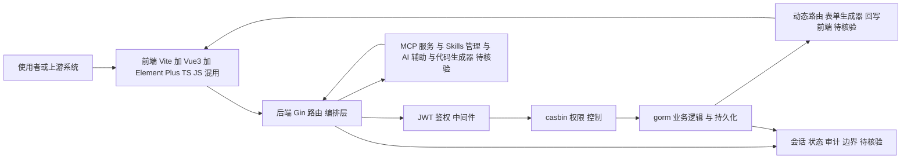

# gin-vue-admin

## 一句话定位
中国社区最活跃的 Vite+Vue3+Gin 全栈后台开发脚手架——2026 版内置 MCP 辅助服务、Skills 管理、AI 辅助模块、企业级业务 AI+开发解决方案，支持 TS/JS 混用。

## 它解决的问题
中小团队快速搭建后台管理系统的痛点：鉴权、权限、动态路由、表单/列表/上传/下载/代码生成 等基础能力每个项目都重写。gin-vue-admin 提供开箱即用的脚手架，集成 JWT、casbin、gorm、Element Plus、AI 辅助生成，让个人/2-3 人团队也能搭出生产级后台。

## 为什么值得关注（2026-08-14）
被 daily/2026-08-14.md 选为今日 AI 周边工具重点。2026 版顺势加入 MCP、Skills、Vibe Coding 等 AI 主题，把传统后台模板升级为"AI 友好版企业开发平台"——这是国内脚手架赛道中较早明确响应 AI 趋势的动作。

## 热度来源判断
热度来源是 **"中文后台脚手架刚需 × 6 年持续运营 × 2026 加 AI 叙事"**。24,953 stars 在 6 年的周期内属于稳定成长曲线，与同类 ruoyi-vue-pro（基于 Spring Boot）形成稳定的 Go/JS vs Java 双寡头格局。

## 关键技术亮点
1. **前后端分离:** Go (Gin) + Vue3 + Vite，前后端清晰解耦
2. **AI 集成:** 内置 MCP 服务、Skills 管理模块、Vibe Coding 适配
3. **企业级组件库:** JWT 鉴权、casbin 权限、动态路由、表单生成器、代码生成器
4. **TS/JS 混用:** 允许渐进迁移 TS，团队上手门槛低
5. **完善文档 + 演示站:** 官方 demo 在线可查，社区文档完整

## 架构师速览

| 决策问题 | 研究判断 | 证据边界 |
|---|---|---|
| 系统边界 | gin-vue-admin 是 Vite+Vue3 前端 + Gin/Go 后端分离的后台脚手架，自带 JWT 鉴权、casbin 权限、gorm 持久化、Element Plus UI 与 MCP/Skills/AI 辅助模块；输入是 Web 端使用者或上游系统，输出是后台 CRUD/权限/AI 辅助能力 | 来自档案"关键技术亮点"与 tags（gin, gorm, jwt, casbin, vue3, mcp, skills）；具体鉴权/权限协议与 MCP 工具清单未在档案展开，**待核验** |
| 主路径 | 请求 → 前端入口（Vite+Vue3+Element Plus）→ 后端 Gin 路由 → JWT/casbin 中间件 → gorm 业务逻辑 → 可选 MCP/Skills AI 辅助与代码生成器 → 持久化与动态路由回写 | "主路径"由档案"前后端分离"+"企业级组件库"推导；中间件顺序、动态路由生成规则、代码生成器产出形态**待核验** |
| 关键权衡 | TS/JS 混用降低迁移成本但牺牲类型一致；6 年成熟生态与 Element Plus 强绑定，UI 切换成本高；AI 叙事（MCP/Skills/Vibe Coding）扩展能力但与仓库"License 不明"、AI 模块原生可用性未验证并存，是扩展性与合规/可维护性的核心权衡 | 取自档案"TS/JS 混用""版本耦合""AI 集成深度有限""License 不明"；License 商用可行性、AI 模块实操效果均**待核验** |
| 最小 PoC | 用官方 demo（demo.gin-vue-admin.com）跑通登录→角色→casbin 权限→一张 CRUD 表，关闭/不启用 MCP/Skills 模块以隔离 AI 风险，验证后再评估 AI 集成与 Vue 4/Vite 7 适配 | demo 链接取自档案 frontmatter；MCP/Skills 是否可禁用、依赖外部模型服务与否、生产部署形态**待核验** |

## 架构启发
"以脚手架作为 AI 场景入口"的探索值得关注——把传统 CRUD 模板升级为 MCP/Skills 友好的协作平台，验证"AI 不是替代代码而是替代工作流"。

## 架构图（MMD）

> 证据边界：此图只采用本档案已有可核验描述；“待核验”节点不应视为项目实现事实。

## 定位判断
**工具型 / 中文后台脚手架龙头之一。** 与 ruoyi-vue-pro 并列中文后台脚手架 Top 2，但加了 AI 概念后开始向"AI 友好脚手架"演进。**局限**：license 为 NOASSERTION（自述 MIT 但仓库根目录无 LICENSE 文件），企业用户需要核实可商用性。

## 风险 / 局限 / 泡沫点
- **License 不明:** 仓库根目录未提供 LICENSE 文件，NOASSERTION 标签 = 法律未明确，企业商用有风险，**需向作者确认** 或在 fork 时增加 LICENSE
- **AI 集成深度有限:** 内置 MCP/Skills 模块的"AI 辅助"是否真的原生可用需运行验证
- **版本耦合:** 通常与 Element Plus 强绑定，UI 层切换成本高
- **生态竞争:** RuoYi-Go、go-admin 等同类项目在分食其份额

## 与同类项目的关系
- **vs ruoyi-vue-pro:** 基于 Spring Boot/TypeScript，更偏企业级；gin-vue-admin 基于 Go/JS，更轻量
- **vs go-admin:** Go 单体版 admin，gin-vue-admin 前后端分离
- **vs vue-vben-admin:** 仅前端模板，gin-vue-admin 包含完整后端
- **vs fastapi/full-stack-fastapi-template:** Python + React 路线，与 Go + Vue 路线平行竞争

## 是否值得持续跟踪
**值得参考但不建议核心项目使用其作为唯一栈。** 对 Go + Vue 后台开发仍是国内首选，对 AI 集成路线有兴趣者可关注 MCP/Skills 模块的实操效果。License 不明是落地障碍，建议复制时单独核验。

## 后续观察点
- LICENSE 文件是否补充（决定商用可行性）
- MCP/Skills 模块的实际依赖与可用性
- 是否适配 Vue 4 / Vite 7 等新版基础设施
- 与 RuoYi/Go-Admin 的市场份额变化

---
> 数据来源: GitHub API (2026-08-21) | Stars: 24,953 | Forks: 7,110 | License: NOASSERTION (仓库根目录未提供 LICENSE 文件，**待核实** ) | 语言: Go | 创建: 2019-09-01
