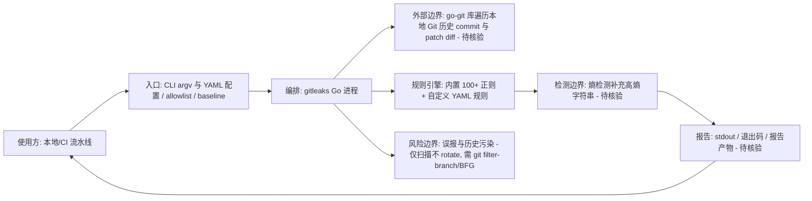

# gitleaks/gitleaks

## 一句话定位
用 Go 编写的 Git 仓库密钥泄露检测工具，可扫描 Git 历史中的 API Key、密码、证书等敏感凭据，是 DevSecOps 流水线的标配组件。

## 它解决的问题
开发者经常不小心将 AWS Key、数据库密码、私钥等敏感信息提交到 Git 仓库。即使后续 commit 中删除，密钥仍残留在 Git 历史中。一旦仓库公开或被攻击者克隆，这些凭据就成为入侵入口。Gitleaks 通过扫描完整 Git 历史（所有 commit 的 diff），使用正则规则和熵检测自动发现泄露的密钥，支持本地扫描和 CI/CD 集成两种模式。

## 为什么值得关注
- **Stars:** 28,518（截至 2026-08-07），密钥扫描领域绝对第一
- **Forks:** 2,171，社区活跃贡献规则
- **License:** MIT
- **活跃度:** pushed_at 2026-07-29，高频维护
- **Watchers:** 171
- **生态地位:** GitLab、GitHub Enterprise、多家 CI 平台的默认推荐工具
- **Topics 命中热点:** devsecops / dlp / secret / security-tools / ci-cd

## 热度来源判断
Gitleaks 的热度是**真实安全刚需 + DevSecOps 文化普及**双重驱动。随着云原生普及和供应链安全事件频发（如 Codecov 供应链攻击），密钥扫描从"可选项"变成"必选项"。Gitleaks 因其 Go 单二进制部署、速度快、规则丰富，成为 GitHub/GitLab CI 的默认选择。热度持续走高，非泡沫。

## 关键技术亮点亮点
1. **Go 单二进制:** 编译为单一可执行文件，无运行时依赖，CI 集成极简
2. **正则规则引擎:** 内置 100+ 规则覆盖 AWS、GCP、Stripe、GitHub Token 等主流密钥格式
3. **熵检测（Entropy Detection）:** 对高熵字符串（可能为随机生成的密钥）进行补充检测，覆盖未知格式
4. **Git 历史扫描:** 不仅扫描当前文件，还能回溯所有 commit 的 patch diff
5. **自定义规则:** 支持 YAML 配置自定义规则和 allowlist，适应私有密钥格式
6. **基线扫描:** 支持 baseline 功能，只报告新增的泄露，避免历史遗留噪音

## 架构师速览

| 决策问题 | 研究判断 | 证据边界 |
|---|---|---|
| 系统边界 | CLI/库形态的密钥扫描器：使用方/CI → gitleaks 进程 → go-git 遍历的本地 Git 历史 → 正则+熵规则输出 | 档案未披露是否含守护进程、server 模式或中心化管控入口；"外部系统"按 Unix 工具管道描述 |
| 主路径 | 加载 YAML 规则与 allowlist → 调用 go-git 遍历 commit 并取 patch diff → 正则匹配 + 熵检测 + baseline 过滤 → stdout/退出码/报告产出，供 CI 判定 | 协议、报告 schema、CI 集成适配器实现均未在档案中给出，需源码核验 |
| 关键权衡 | 速度/可移植性（Go 单二进制）与检测深度（仅静态匹配、不主动验证）的取舍；通用正则覆盖广 vs 语义理解弱（已知格式 vs 熵补充） | 缺少在 Monorepo/超大仓库下的性能数据；AI 降低误报仅为待观察方向 |
| 最小 PoC | 在 CI 流水线加一条 gitleaks detect --baseline --redact --exit-code N，对历史建基线后再用同一 YAML 规则集+allowlist 验证新增 commit 行为与误报率 | 是否支持 server mode、远端 Git 协议、增量扫描策略未在档案中证实 |

## 架构启发
Gitleaks 的架构是经典的 **"规则引擎 + Git 底层操作"** 组合。它直接调用 `go-git` 库遍历 commit 树，无需依赖外部 git 命令。启发是：**安全扫描工具要"快、轻、可集成"**——单二进制 + 标准输入输出 + 退出码约定，使它像 Unix 工具一样可无缝嵌入任何 CI/CD 流水线。这种"管道友好"设计是它击败 Python 竞品（如 TruffleHog 的某些版本）的关键。

## 架构图（MMD）

> 证据边界：此图只采用本档案已有可核验描述；“待核验”节点不应视为项目实现事实。

## 定位判断
**基础设施级工具。** Gitleaks 已成为 DevSecOps 的事实标准之一，与 Dependabot、Snyk 并列。它不是"创新项目"，而是"必须部署的基础设施"。任何使用 Git 的团队都应在 CI 中集成密钥扫描。

## 风险/局限/泡沫点
- **误报率:** 正则匹配无法理解语义，对变量名、文档示例容易误报
- **格式依赖:** 只能检测已知格式的密钥，新型密钥（无固定前缀）需要熵检测补充
- **不加密:** 只扫描不修复，泄露后仍需手动 rotate
- **历史污染:** 即使扫描发现，Git 历史中的密钥需要 rewrite（git filter-branch / BFG），操作复杂
- **AI 密钥挑战:** LLM 时代的 API Key 格式更多样，规则更新需持续跟进

## 与同类项目的关系
- **vs TruffleHog:** TruffleHog 也是主流选择，支持"验证密钥是否有效"（主动调用 API）；Gitleaks 更轻快但只做静态扫描
- **vs GitGuardian:** 商业 SaaS 产品，检测能力更强但要付费；Gitleaks 是开源首选
- **vs GitHub Secret Scanning:** GitHub 原生功能，但仅限公开仓库（私有仓库需付费）；Gitleaks 补齐私有仓库需求
- **vs detect-secrets (Yelp):** Python 实现，规则体系类似，性能不如 Go

## 是否值得持续跟踪
**值得跟踪。** 作为 DevSecOps 基础设施，Gitleaks 的演进直接反映安全工程实践趋势。建议关注 AI 辅助规则生成（利用 LLM 理解代码语义减少误报）方向。

## 后续观察点
- 是否集成 AI 降低误报率（Topics 中已有 "ai-powered"、"llm" 标签）
- 对 Monorepo 和大仓库的性能优化
- 是否推出企业版（OpenCore 商业化）

---
> 数据来源: GitHub API (2026-08-07) | Stars: 28,518 | Forks: 2,171 | License: MIT
