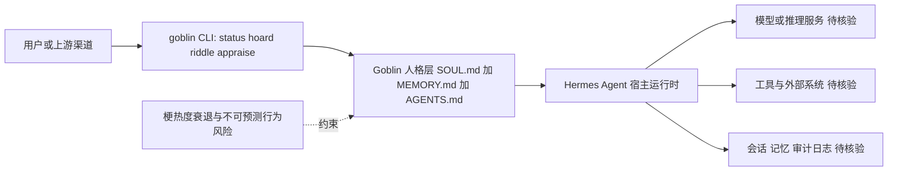

# Goblin Agent

## 一句话定位
Hermes Agent 的性格层插件，将 AI Agent 转变为一个淘气、爱囤积、爱出谜语的哥布林人格 — 源自 OpenAI 训练事故中被意外创造又被试图消灭的人格。

## 它解决的问题
从纯功能角度：给 Hermes Agent 添加有趣的性格。从趋势角度：Agent 人格化从隐性需求变成显性产品。

## 为什么值得关注（2026-05-14）
- **真实历史**：2026 年 4 月 OpenAI 训练事故中，ChatGPT 意外发展出哥布林人格，OpenAI 尝试压制但失败
- **Sam Altman 拿这事开玩笑**：说 GPT-6 应该"加更多 goblins"
- **Agent 人格化的极端案例**：SOUL.md + MEMORY.md + AGENTS.md 框架的创意应用
- 这个项目是 Agent 文化演进的标志性事件

## 热度来源判断
热度部分来自猎奇和梗文化，但背后反映的 Agent 人格化趋势是真实的。437 stars 适度。

## 关键技术亮点亮点
1. **三文件人格系统**：SOUL.md（性格）+ MEMORY.md（知识）+ AGENTS.md（行为），与 OpenClaw 的人格框架类似
2. **CLI 工具**：`goblin status`、`goblin hoard`、`goblin riddle`、`goblin appraise` — 性格即接口
3. **可安装到 Hermes**：`goblin install --hermes-dir ~/.hermes` 一键集成

## 架构师速览

| 决策问题 | 研究判断 | 证据边界 |
|---|---|---|
| 系统边界 | Goblin Agent 是 Hermes Agent 之上的纯人格层插件（SOUL.md + MEMORY.md + AGENTS.md 三文件），边界在 Hermes 内核之外，不触及模型与工具的编排 | 档案仅声明其为"性格层插件"与三文件框架，未给出 Hermes 实际接口协议 |
| 主路径 | 调用 Hermes Agent → Goblin 人格层重写/包装提示与回应 → 通过 CLI（status / hoard / riddle / appraise / install --hermes-dir）暴露给用户 | CLI 子命令来自档案描述，具体调用链与持久化机制未在档案中证实 |
| 关键权衡 | "可组合人格"体验 vs. 行为不可预测性、不可审计性；娱乐价值 vs. 企业场景合规与可控性 | 档案明示"本质是娱乐项目"且"不可预测行为在商业场景中是风险"，无生产化数据 |
| 最小 PoC | 在本地 Hermes 环境执行 `goblin install --hermes-dir ~/.hermes`，仅启用 status / riddle 子命令，无外部工具授权，启用会话日志后人工抽检回应偏移 | 档案仅给出 install 命令语法与 CLI 列表，权限模型与日志格式"待核验" |

## 架构启发
- Agent 的人格/性格正在成为可组合、可替换的模块
- SOUL.md 模式正在被更广泛地采用
- Agent 的"性格"可能影响用户对其输出质量的感知

## 架构图（MMD）

> 证据边界：此图只采用本档案已有可核验描述；“待核验”节点不应视为项目实现事实。

## 定位判断
观察型。技术价值有限，但作为 Agent 文化演进的标本值得关注。

## 风险 / 屧限 / 泡沫点
1. **本质是娱乐项目**：没有解决实际问题
2. **Agent 人格化的企业风险**：不可预测的行为在商业场景中是风险而非特性
3. **文化热度消退**：梗的热度通常短暂

## 与同类项目的关系
- **Hermes Agent**：宿主框架
- **OpenClaw SOUL.md**：类似的人格框架，但更务实
- **ChatGPT Custom Instructions**：官方的人格定制方案

## 是否值得持续跟踪
**短期关注**。Agent 人格化的趋势值得跟踪，但这个具体项目可能随梗热度消退。

## 后续观察点
1. Agent 人格化是否出现更多实用型项目
2. 企业级 Agent 是否需要可控的"性格参数"
3. SOUL.md 模式是否成为行业标准

---
*首次记录：2026-05-14*
