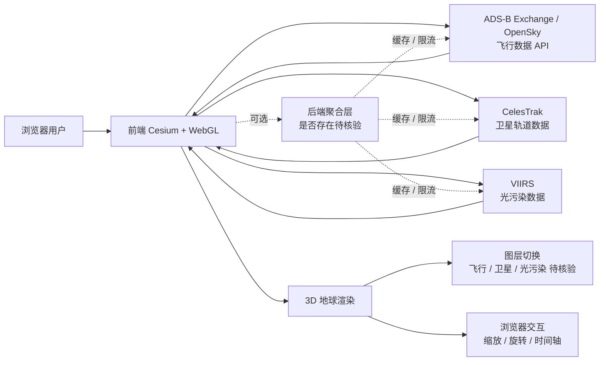

# bilawalsidhu/gods-eye-view

## 一句话定位
浏览器内运行的卫星级开源空间情报可视化——Cesium + WebGL 真实数据流（flight-tracking / satellite-tracking / 光污染 / 地理空间），"开源 OSINT 空间情报" 的标准产品；2 个月 12.5k⭐。

## 它解决的问题
空间情报 / OSINT（Open Source Intelligence）领域长期被专业工具垄断：(1) **付费 GIS 软件昂贵**——ArcGIS / Google Earth Pro 等价格高；(2) **数据源分散**——飞行 / 卫星 / 光污染数据各自在不同网站 / API；(3) **浏览器内实时可视化门槛高**——Cesium / WebGL 等引擎虽成熟，但集成的开源项目稀缺。gods-eye-view 直接把这三类问题工程化：用 Cesium + WebGL 真实 3D 地球 + 多数据源集成（ADS-B Exchange / OpenSky / Celestrak / VIIRS）+ 浏览器内零安装，把"开源 OSINT 空间情报"做成可复制的标准产品。

## 为什么值得关注（2026-08-30）
- **Stars:** 12,518（截至 2026-08-30），**2 个月起步**，处于"爆发性增长"阶段——GitHub Trending 日榜持续高位
- **Forks:** 待核验（API 检索未单独返回）
- **License:** NOASSERTION——下游商业采用前必须读 LICENSE 文件确定 SPDX 兼容性
- **语言:** JavaScript（Cesium + WebGL 前端）
- **活跃度:** created 2026-06-22，pushed 2026-08-28，2 个月内持续高活跃
- **规模:** 82 MB（含 Cesium 资源 + 数据源配置）
- **数据流集成：** Topics 明示 `cesium` / `3d-globe` / `flight-tracking` / `geospatial-intelligence` / `gis` / `osint` / `photogrammetry` / `satellite-tracking` / `spatial-intelligence` / `webgl` / `worldview` 11 个明确标签
- **覆盖群体:** OSINT 研究者 / 飞行爱好者 / 卫星运营 / 地理可视化教育多个真实群体

## 热度来源判断
gods-eye-view 的热度是 **"OSINT 刚需 × Cesium 引擎成熟 × 多数据源集成 × 浏览器零安装 × 视觉冲击力"** 的强组合。12,518⭐/2 个月说明：(1) 真实 OSINT 需求——开源情报研究者需要可视化工具；(2) Cesium / WebGL 引擎成熟——使浏览器内 3D 地球成为可复制路径；(3) 数据源集成价值——单一平台覆盖飞行 / 卫星 / 光污染，省去多网站切换；(4) 视觉冲击力——3D 地球实时渲染天然适合社交媒体传播（截图传播效应）。热度**真实且具社交传播潜力**——但需警惕：数据源依赖（API 限流 / 商业授权 / 政策合规）；NOASSERTION License 增加商业采用门槛；2 个月数据不足以判断长期采用曲线。

## 关键技术亮点
1. **Cesium + WebGL 真实 3D 地球**：浏览器内零安装的 3D 地球引擎，Topics 明示 `3d-globe` / `webgl`
2. **多数据流集成**：飞行（ADS-B Exchange / OpenSky）/ 卫星（Celestrak）/ 光污染（VIIRS）——Topics 明示 `flight-tracking` / `satellite-tracking`
3. **OSINT 研究友好**：Topics 明示 `osint` / `geospatial-intelligence` / `gis`——明确定位为开源情报工具
4. **Photogrammetry 支持**：Topics 明示 `photogrammetry`——可能含 3D 重建能力（待核验）
5. **Worldview 支持**：Topics 明示 `worldview`——可能含多种地球视角切换
6. **浏览器内零安装**：纯前端应用，无需后端——降低使用门槛

## 架构师速览

| 决策问题 | 研究判断 | 证据边界 |
|---|---|---|
| 系统边界 | 浏览器前端（Cesium + WebGL） + 数据源 API（飞行 / 卫星 / 光污染）+ 可选后端聚合 | 四个数据源是 Topics 明示；后端是否存在 / 数据源限流策略 / API key 要求未公开 |
| 主路径 | 数据源 API → 前端轮询 / 流式 → Cesium 渲染（3D 地球 + 实时轨迹）→ 浏览器交互 | 数据流路径抽象自 Topics；具体数据源协议（REST / WebSocket / MQTT）需源码核验 |
| 关键权衡 | 浏览器零安装 vs 数据源 API 限流 vs 实时性 vs 商业数据源授权 vs 数据真实性 vs NOASSERTION License 商业风险 | Size 82 MB（含 Cesium 资源）来自 API；数据源授权与限流细节需独立核验 |
| 最小 PoC | 浏览器打开 README 提供的 demo URL → 验证 3D 地球可加载 → 切换飞行 / 卫星 / 光污染三个数据流 → 验证每个数据流可独立工作 | demo URL 是否公开需 README 独立核验；数据源 API key 是否需要配置需核验 |

## 架构启发
gods-eye-view 的核心启发是 **"OSINT 工具的浏览器化与数据源集成"**。传统 OSINT 工具要么是专业桌面软件（昂贵 / 难上手），要么是分散的网站（数据孤岛）。gods-eye-view 的创新不在于"3D 地球"（Cesium 引擎已成熟），而在于"多数据源集成 + 浏览器零安装"——这与 Notion / Figma 把"办公套件搬到浏览器"的范式一脉相承。更深层的启发是 **"开源 OSINT 是被低估的赛道"**——12.5k⭐/2 个月证明开源情报研究者群体巨大且未被充分服务；下一波可能是海事 / 频谱 / 电磁信号的开源可视化。Cesium 引擎成熟 + 浏览器 WebGL 普及是这一波 OSINT 工具爆发的技术基础。

## 架构图（MMD）

> 证据边界：此图只采用本档案已有可核验描述；"待核验"节点不应视为项目实现事实。

## 定位判断
**工具型项目（开源 OSINT 空间情报可视化）。** gods-eye-view 不仅是可视化工具，更是"开源 OSINT" 细分品类的代表——把飞行 / 卫星 / 光污染 / 地理空间数据集成到单一浏览器平台。12.5k⭐/2 个月已显示用户基础。但"开源 OSINT 工具"赛道的护城河在于：(1) 数据源集成广度（多少数据源）；(2) 数据源稳定性（API 限流 / 商业授权风险）；(3) NOASSERTION License 的商业采用门槛。目前定位是"开源 OSINT 3D 地球的代表"，向"开源 OSINT 操作系统"演进是合理路径。

## 风险/局限/泡沫点
- **NOASSERTION License 商业风险**：OSINT 工具常因数据源合规问题被下架；NOASSERTION 意味着 SPDX 解析失败，下游采用必须读 LICENSE 才能确定是否可商用
- **数据源 API 限流与商业授权风险**：ADS-B Exchange / OpenSky / Celestrak / VIIRS 任一 API 限流或调整授权策略，都会影响产品稳定性
- **2 个月数据不足以判断长期采用曲线**：12.5k⭐ 是爆发力，但 OSINT 工具的长期活跃度取决于数据源稳定性与社区维护
- **数据源真实性争议**：OSINT 工具常被质疑"数据真实性"，若被用于严肃决策，可能引发法律风险
- **浏览器性能限制**：82 MB 仓库 + Cesium 资源对低端设备 / 移动端体验可能受限
- **个人项目属性**：bilawalsidhu 个人维护，核心治理集中，可持续性存疑

## 与同类项目的关系
- **vs ArcGIS / Google Earth Pro：** 商业 GIS 软件，gods-eye-view 开源 + 浏览器化定位
- **vs 8-27 S1N6H/pentest-harness：** pentest-harness 走 self-hosted AI agent harness 路线，gods-eye-view 走 OSINT 可视化路线
- **vs OpenStreetMap：** OSM 是地图数据，gods-eye-view 是数据可视化
- **vs ADS-B Exchange / OpenSky 单独网站：** 数据源分散在不同网站，gods-eye-view 集成到一个平台
- **vs 商业 OSINT 工具（Maltego 等）：** 商业 OSINT 工具昂贵 + 封闭，gods-eye-view 开源 + 浏览器化

## 是否值得持续跟踪
**值得跟踪（开源 OSINT 空间情报品类的代表）。** gods-eye-view 代表"开源 OSINT 浏览器化" 方向，无论其本身成败，这一方向是行业趋势。建议关注：数据源稳定性（API 限流 / 商业授权变化）、NOASSERTION License 后续是否明确、是否扩展到海事 / 频谱 / 电磁信号领域。对 OSINT 研究者，这是当前最佳浏览器内空间情报工具。对开源观察者，它是"Cesium 引擎 + 多数据源集成"路径的成功样本。

## 后续观察点
- 数据源授权变化（ADS-B Exchange / OpenSky / Celestrak / VIIRS 任一调整）
- NOASSERTION License 是否后续明确为 MIT / Apache-2.0 等可商用许可
- 是否扩展到海事 / 频谱 / 电磁信号的开源可视化
- 浏览器性能优化（82 MB 仓库 + Cesium 资源对低端设备 / 移动端的体验）
- 2 个月增长曲线能否在 6 个月后保持稳定
- 是否被大厂（NASA / ESA / Planet Labs）官方引用或集成

---
*首次记录：2026-08-30*