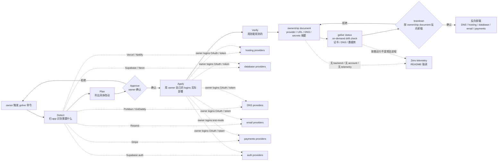

# mikehasa/golive-skill

## 一句话定位
Agent Skill 把 agent 产物上线——Vercel / Netlify / Supabase / Neon / Porkbun / GoDaddy / Resend / Stripe 六路 provider + detect → plan → approve → apply → verify 五步 + teardown 卸载 + drift check + Zero telemetry 的 MIT 开源严肃工程化工具。

## 它解决的问题
2025-2026 年 coding agent（Codex / Claude Code / Cursor / Gemini CLI / OpenCode / Copilot / Pi / Goose）爆发，agent 写完 app 的能力已是分钟级，但「上线到真实用户」仍是人工（多 provider 账号管理 + 不知道具体改什么 + 不知道实际可用不可用 + 证书过期 / DNS 漂移无人查 + 下架时不知从哪拆 + 上线 telemetry 不放心 + 不想再注册 GoLive / Backend SaaS + 想要 ownership 文档交接）。golive-skill 直击——它提供 **Detect → Plan → Approve → Apply → Verify 五步** + **六路 disposable live test**（hosting Vercel / Netlify + database Supabase / Neon + DNS Porkbun / GoDaddy + transactional email Resend + test-mode payments Stripe + Supabase auth）+ **ownership document** + **on-demand drift check**（`golive status` 按需查证书 / DNS / 数据库）+ **teardown 卸载** + **Zero telemetry**（README 强调「No GoLive account, hosted backend or product telemetry」）。解决的是 **「Agent Skill 把 agent 产物上线 + 六路 provider + detect → plan → approve → apply → verify + teardown + drift check + Zero telemetry + ownership document」** 的「最后一公里」严肃工程化问题。

## 为什么值得关注
- **Stars:** 845（截至 2026-09-25），2 天突破 845，增速极快
- **Forks:** 60，社区贡献较活跃
- **License:** MIT（完全开源商用）
- **语言:** TypeScript
- **活跃度:** created 2026-09-23，pushed_at 2026-09-24，持续高活跃
- **规模:** 1.7MB，含 providers references + scripts + docs
- **Topics:** agent-skill, agent-skills, ai-agents, claude-code, cloudflare, codex, database, deployment, developer-tools, devops, dns, godaddy, hosting, infrastructure, neon, netlify, porkbun, skills, supabase, vercel
- **六路 provider:** hosting Vercel / Netlify + database Supabase / Neon + DNS Porkbun / GoDaddy + email Resend + test-mode payments Stripe + Supabase auth
- **Codex / Claude Code 已测** —— 其他 client 未测

## 热度来源判断
mikehasa/golive-skill 的热度是 **「Agent Skill 把 agent 产物上线刚需 × 六路 provider × detect → plan → approve → apply → verify 五步 × ownership document × drift check × teardown × Zero telemetry × Codex / Claude Code 已测」** 的强劲组合。Coding Agent 是 2026 年最热赛道，但「上线到真实用户」的最后一公里仍是人工——多 provider 账号管理 + 不知道具体改什么 + 不知道实际可用不可用 + 证书过期无人查 + 下架时不知从哪拆 + telemetry 不放心 + 不想再注册 GoLive / Backend SaaS + 想要 ownership 文档交接。golive-skill 直击痛点——一个 **Agent Skill** + **Detect → Plan → Approve → Apply → Verify 五步**（每步都有 owner 确认环节）+ **六路 disposable live test** + **ownership document** + **on-demand drift check** + **teardown** + **Zero telemetry**。热度**真实且具平台候选潜力**——但需警惕：Agent Skill 在 Codex / Claude Code 之外 client（Cursor / Gemini CLI / OpenCode / Copilot / Pi / Goose）的兼容性；六路 provider（Vercel / Netlify / Supabase / Neon / Porkbun / GoDaddy / Resend / Stripe）的稳定集成；detect → plan → approve → apply → verify 在多 app 结构的实用性；ownership document 在多 owner 团队的可用度；drift check 在多 provider 的覆盖；teardown 在 ownership document 反向卸载的安全性；Roadmap（the full go-live checklist）的实际推进。

## 关键技术亮点
1. **Detect → Plan → Approve → Apply → Verify 五步** —— 每步都有 owner 确认环节，agent 不会自动连账号或部署
2. **六路 disposable live test** —— hosting Vercel / Netlify + database Supabase / Neon + DNS Porkbun / GoDaddy + transactional email Resend + test-mode payments Stripe + Supabase auth
3. **Ownership document** —— 记录 owner 创建了什么（provider / URL / DNS / secrets 摘要），方便交接或下架
4. **On-demand drift check** —— `golive status` 重新检测 owner 拥有的部署有没有变化（证书过期 / DNS 漂移 / 数据库连接失败），按需运行不是常驻进程
5. **Teardown** —— `teardown` 命令卸载（按 ownership document 反向操作）
6. **Zero telemetry** —— README 强调「No GoLive account, hosted backend or product telemetry」
7. **一行安装** —— `npx skills add https://github.com/mikehasa/golive-skill --skill golive --global`，agent picker 选 agent
8. **Codex / Claude Code 已测** —— 其他 client 未测
9. **0.1.0-alpha.3** —— alpha scope 诚实表态
10. **Install from npm** —— `npm install golive-skill` 也可（README 说明）
11. **MIT 1716 KB** —— TypeScript 中等项目，含 providers references + scripts + docs

## 架构师速览

| 决策问题 | 研究判断 | 证据边界 |
|---|---|---|
| 系统边界 | Node.js 20+ CLI + Agent Skill（Codex / Claude Code 加载）+ providers references（Vercel / Netlify / Supabase / Neon / Porkbun / GoDaddy / Resend / Stripe）+ ownership document 生成器 + drift check 探测器；零 backend / 零 account / 零 telemetry；通过 owner 自己的 logins 实际部署 | 仅基于 README 公开摘录 + GitHub Search API 元数据；具体 providers references 格式、drift check 探测细节、ownership document JSON schema、teardown 反向操作具体步骤未在档案中给出 |
| 主路径 | owner 触发 golive 命令 → Detect（扫 app 识别需要什么：hosting / database / auth / domain / email / payments）→ Plan（列出具体改动：provider / cost / DNS / secrets / 验证步骤）→ Approve（owner 确认每步）→ Apply（用 owner 自己的 logins 实际部署）→ Verify（观测能观测的：DNS 解析 / TLS 证书 / 部署 URL 200 / 数据库连通 / 邮件发送）→ ownership document 记录 → 按需 drift check → 按需 teardown | 主路径为 README 语义抽象；Detect 扫描识别规则、Plan 改动 JSON schema、Verify 探测命令集、drift check 探测器实现细节均待核验 |
| 关键权衡 | 自动 vs 人工（每步 Approve 强制 owner 确认）vs 自动 vs 部分自动（teardown 按 ownership document 反向操作）vs 提供自动化 vs 引导人工 vs 验证可观测 vs 未完成 work 清晰 vs 六路 provider 稳定集成 vs Detect / Plan / Approve / Apply / Verify 五步实用性 vs ownership document 多 owner 团队可用度 vs drift check 多 provider 覆盖 | 档案明示「Automate the parts providers expose. Guide you through the parts that need a human. Verify what can be observed, and make unfinished work clear.」+ 六路 provider + ownership document + drift check + teardown + Zero telemetry 七点权衡；具体 providers references 稳定集成度、Detect 扫描准确率、Verify 探测深度、teardown 反向操作安全性均待核验 |
| 最小 PoC | `npx skills add https://github.com/mikehasa/golive-skill --skill golive --global --agent codex --yes` 装到 Codex → 选一个简单 app（Vite + React + 无 backend）→ Detect 识别需要 hosting → Plan 列出 Vercel 部署改动 → Approve 确认 → Apply（owner 提供 Vercel token）→ Verify 部署 URL 200 → ownership document 生成 → drift check 模拟证书过期 → teardown 反向卸载 | PoC 范围、退出路径由档案「先核心 provider + 简单 app + 五步完整 + drift check + teardown」建议推导；具体 providers references 稳定集成度、ownership document JSON schema、teardown 反向操作步骤均待核验 |

## 架构启发
mikehasa/golive-skill 的核心启发是 **「Detect → Plan → Approve → Apply → Verify 五步 + 每步 owner 确认」是 coding agent 上线严肃工程化的关键模式**。当前所有 coding agent 写完 app 后，「上线到真实用户」仍是 100% 人工——provider 账号管理 + 不知道具体改什么 + 不知道实际可用不可用 + 证书过期无人查 + 下架时不知从哪拆 + telemetry 不放心 + 不想再注册 GoLive / Backend SaaS + 想要 ownership 文档交接。golive-skill 尝试做 **「agent 严肃工程化上线」**——agent 扫 app 识别需要什么 + 列出具体改动 + owner 确认 + 用 owner 自己的 logins 实际部署 + 观测能观测的 + 记录 ownership 文档 + 按需 drift check + 按需 teardown。更深层的启发是：**「Zero telemetry + 不用 GoLive account / hosted backend」是严肃工程化个人开发者作品的核心信任边界**——README 强调「No GoLive account, hosted backend or product telemetry」是「工具不接管 owner 账号」的明确表态；agent 用 owner 自己的 logins 实际部署，ownership document 让交接 / 下架 / 责任可追溯。再深一层：**「六路 disposable live test 是 alpha scope 诚实表态」是 alpha 阶段严肃工程化**——README 明示 0.1.0-alpha.3，六路 disposable live test 已覆盖 + ownership document + drift check 实现 + 测试覆盖，更广的 roadmap 是方向而非承诺。

## 架构图（MMD）

> 证据边界：此图只采用本档案已有可核验描述；"待核验"节点不应视为项目实现事实。

## 定位判断
**工具型 + 平台候选型项目（Agent Skill 上线工程化）。** mikehasa/golive-skill 不仅是 CLI，更是 **Agent Skill 严肃工程化上线** 的标志——它提供 Detect → Plan → Approve → Apply → Verify 五步 + 六路 disposable live test + ownership document + drift check + teardown + Zero telemetry，让 coding agent 用户一键把 app 产物上线。845⭐ / fork 60 / 0.1.0-alpha.3 / Codex & Claude Code 已测显示严肃工程化雏形。但「平台化」取决于一个关键问题：跨 client（Cursor / Gemini CLI / OpenCode / Copilot / Pi / Goose）的兼容性 vs 跨 provider（Cloudflare / AWS / Render / Railway / Vercel KV / Cloudflare R2 / SendGrid / Mailgun / Postmark 等）的稳定集成。目前定位是「Agent Skill 把 agent 产物上线严肃工程化」的标志性样本，向平台演进是合理路径。

## 风险/局限/泡沫点
- **跨 client 兼容性:** 仅 Codex / Claude Code 已测；Cursor / Gemini CLI / OpenCode / Copilot / Pi / Goose 未测
- **六路 provider 边界:** 仅 Vercel / Netlify / Supabase / Neon / Porkbun / GoDaddy / Resend / Stripe 八 provider 已覆盖；Cloudflare / AWS / Render / Railway / Vercel KV / Cloudflare R2 / SendGrid / Mailgun / Postmark 等未覆盖
- **Detect 扫描准确率:** Detect 在多 app 结构（前端 / 后端 / 全栈 / monorepo）的扫描准确率需要长期验证
- **Plan 改动 schema:** Plan 列出改动的 JSON schema 与 provider 配置的映射完整性
- **Verify 探测深度:** Verify 仅观测「DNS 解析 / TLS 证书 / 部署 URL 200 / 数据库连通 / 邮件发送」等基础项；端到端业务流程 / SLA / 监控不在
- **drift check provider 覆盖:** drift check 仅基础项；证书过期 / DNS 漂移 / 数据库连接失败，其他 provider 内部状态变化未覆盖
- **teardown 安全性:** teardown 按 ownership document 反向卸载，操作不可逆，需要 strong confirmation
- **Roadmap 边界:** README 强调「更广的 roadmap 是方向而非承诺」——alpha scope 边界明确
- **个人项目属性:** mikehasa 个人维护，社区治理 / 长期维护可持续性存疑

## 与同类项目的关系
- **vs unreallabsai/unreal-agent:** unreal-agent 是 async-first Go harness 八组件；golive-skill 是 Agent Skill 上线严肃工程化
- **vs fstandhartinger/chat-seek-vscode:** chat-seek 是跨 CLI 聊天本地检索；golive-skill 是跨 provider 上线工程化
- **vs wshobson/agents:** wshobson 是 Agent Skills 跨平台；golive-skill 是 Agent Skill 上线工程化，互补
- **vs lhlGitHub/threejs-architecture-effects:** threejs-architecture-effects 是 Agent Skill Three.js 古建程序化；golive-skill 是 Agent Skill 上线工程化，互补
- **vs 各类 CI/CD 工具（GitHub Actions / Vercel CLI / Netlify CLI）:** 那些是手工或脚本化；golive-skill 是 agent 驱动 + Detect → Plan → Approve → Apply → Verify + ownership document
- **vs Pulumi / Terraform / SST:** 那些是 IaC；golive-skill 是 agent 上线严肃工程化 + ownership document + drift check + teardown

## 是否值得持续跟踪
**值得跟踪（Agent Skill 把 agent 产物上线严肃工程化）。** mikehasa/golive-skill 代表了「coding agent 上线最后一公里严肃工程化」的方向，无论其本身成败，这一方向是行业趋势。建议关注：跨 client（Cursor / Gemini CLI / OpenCode / Copilot / Pi / Goose）的兼容性；六路 provider 之外的扩展（Cloudflare / AWS / Render / Railway / Vercel KV / Cloudflare R2 / SendGrid / Mailgun / Postmark）；Detect / Plan / Approve / Apply / Verify 在多 app 结构的实用性；Verify 探测深度的扩展（端到端业务流程 / SLA / 监控）；drift check provider 覆盖的扩展；Roadmap 的实际推进。对 coding agent 用户，可一键把 app 产物上线；对 Agent Skill 严肃工程化，是「Detect → Plan → Approve → Apply → Verify + teardown + drift check + Zero telemetry + ownership document」的具体路径；对组织 / 企业，是 MIT 开源 + Zero telemetry + ownership document 严肃工程化参考。

## 后续观察点
- 跨 client（Cursor / Gemini CLI / OpenCode / Copilot / Pi / Goose）的兼容性扩展
- 六路 provider 之外的扩展（Cloudflare / AWS / Render / Railway / Vercel KV / Cloudflare R2 / SendGrid / Mailgun / Postmark）
- Detect / Plan / Approve / Apply / Verify 在多 app 结构（前端 / 后端 / 全栈 / monorepo）的实用性
- Verify 探测深度扩展（端到端业务流程 / SLA / 监控 / 日志 / 链路追踪）
- drift check provider 覆盖扩展（证书过期 / DNS 漂移 / 数据库连接失败之外）
- teardown 安全性强化（多 owner 确认 / 操作审计 / 回滚窗口）
- Roadmap 的实际推进（0.1.0-alpha.3 → 0.2.0 / 0.5.0 / 1.0）
- ownership document 在多 owner 团队的可用度（团队 / 组织 / 跨团队交接）
- Zero telemetry 在 README 的明确表态与实际代码一致性
- 与现有 CI/CD 工具（GitHub Actions / Vercel CLI / Netlify CLI / Pulumi / Terraform / SST）的集成或互补

---
> 数据来源: GitHub API (2026-09-25) | Stars: 845 | Forks: 60 | License: MIT | 语言: TypeScript | 创建: 2026-09-23 | pushed_at: 2026-09-24 | Topics: agent-skill, agent-skills, ai-agents, claude-code, cloudflare, codex, database, deployment, developer-tools, devops, dns, godaddy, hosting, infrastructure, neon, netlify, porkbun, skills, supabase, vercel