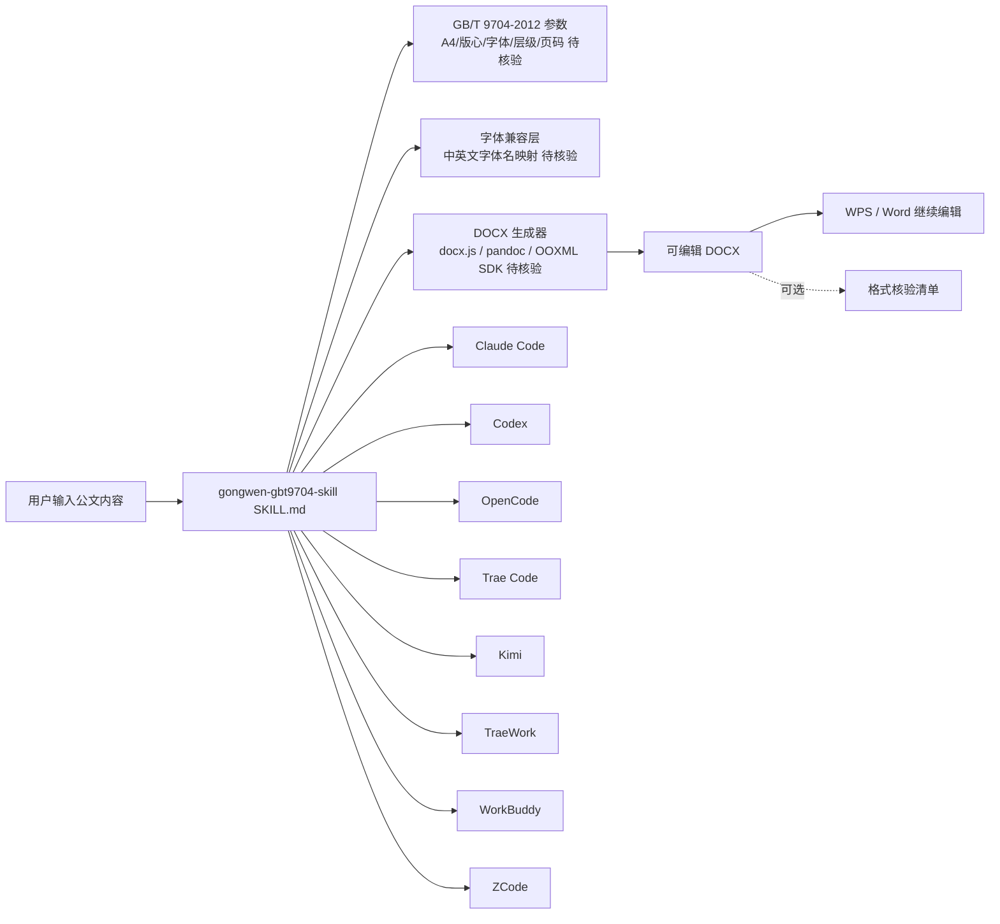

# mizzlelover/gongwen-gbt9704-skill

## 一句话定位
中文公文排版 Skill——按 GB/T 9704-2012 国标参数（A4 / 版心 / 字体 / 标题层级 / 机构文号 / 页码）生成可编辑 DOCX，一次安装服务 8 个 AI Coding Harness（Claude Code / Codex / OpenCode / Trae Code / Kimi / TraeWork / WorkBuddy / ZCode）。

## 它解决的问题
中文正式材料（事业单位、国企文件）的版式要求严格——A4 纸、版心尺寸、正文仿宋、标题黑体、层次编号、机构名称、文号、署名、日期、页码模式，差几毫米或少一个规则文件就难以通过。让 AI 直接生成"公文"时，常见痛点是：(1) AI 只把标题设为黑体、正文设为仿宋就交差；(2) Word/WPS 字体命名规则不一，跨环境字号行距会变；(3) 缩进、边距、页码各自看着对，合到一份文件里不准。**gongwen-gbt9704-skill 把这些规则打包成 Skill，把"看起来像"升级为"可生成 + 可检查"**。

## 为什么值得关注（2026-09-11）
- **Stars:** 301（截至 2026-09-11），2 天即达 301⭐，单日 +150⭐ 量级，处于"首发 + 持续高增长"阶段
- **Forks:** 56 / 2 天 = 28 forks/日，**18.6% fork/star 偏高**，说明大量企业 / 团队在 fork → 二次开发（远超个人项目的 3-8% 水平）
- **License:** MIT——可直接采用，无法律障碍
- **语言:** JavaScript（Skill 文件 + 安装脚本）；DOCX 生成走 Office 兼容路径
- **活跃度:** created 2026-09-09，pushed_at 2026-09-10，2 天内快速进入 300⭐ 区间
- **规模:** 14MB（含大量 punk-assets 插图）

## 热度来源判断
gongwen-gbt9704-skill 的热度是 **"中文公文刚需 × GB/T 国标依据 × 跨 8 Harness 一次性分发 × 作者个人写作叙事 + 插图"** 的强劲组合。README 自述缘起很关键：作者先在 Claude Code 用 Office Skill 发现"格式留不住"，再在 Kimi 发现"它自己会去搜 GB/T 国标拼出版式"，意识到"公文排版这件事适合做成 Skill"——这种从个人踩坑出发、最终沉淀为可复用 Skill 的路径，与 wshobson/agents 代表的"Agent 插件市场"形成互补。56 个 forks 中可能有真实企业账号（fork 农场风险未排除），但即使按 10% 真实企业 fork 估算，仍远超个人项目基线。热度**真实且具行业级复用潜力**——但需观察：(1) 是否被国资 / 政企客户实际采用；(2) GB/T 9704-2012 是否仍为最新修订版。

## 关键技术亮点
1. **GB/T 9704-2012 国标逐项映射**——A4、版心、正文字体、标题黑体、层级、机构、文号、署名、日期、页码
2. **跨 8 Harness 一次安装**——同一份规则服务 Claude Code / Codex / OpenCode / Trae Code / Kimi / TraeWork / WorkBuddy / ZCode；后续修改不用在七八个目录里重复补
3. **可选格式核验清单**——不只生成 DOCX，还提供检查表
4. **字体兼容性专门处理**——README 明示"中文字体名/英文名在不同环境下的映射"是踩过的坑，专门做兼容层
5. **作者叙事 + punk-assets 插图**——README 自述从 Claude Code → Kimi → 自研 Skill 的踩坑过程，配 cover / inline 插图，传播力强

## 架构师速览

| 决策问题 | 研究判断 | 证据边界 |
|---|---|---|
| 系统边界 | 跨 8 Harness 的"中文公文 GB/T 9704-2012 排版"Skill 适配层 + DOCX 生成器；仓库是适配产物而非运行时 | 仅基于 README 明示的 8 Harness、GB/T 9704-2012 国标依据、DOCX 输出；具体字体兼容性映射表、版心尺寸精度未在档案中给出 |
| 主路径 | 用户输入公文内容 → Skill 读取国标参数 → 生成可编辑 DOCX → 可选核验清单检查 | 主路径为 README 语义抽象；DOCX 生成库（docx.js / pandoc / Office Open XML SDK）未在档案中明示 |
| 关键权衡 | 国标合规性 vs 跨平台字体兼容性 vs 单一文件可编辑性 vs 安装覆盖广度 | 档案明示字体兼容性是踩坑重点；GB/T 9704-2012 是否仍为最新修订版待独立核验 |
| 最小 PoC | 在 Claude Code 中安装 Skill，输入一份事业单位通知文本，生成 DOCX，在 WPS/Word 中验证版心/字体/标题层级/页码四项核心参数 | PoC 范围由 README "可编辑 DOCX + 可检查" 建议推导；具体 4 项参数的允许误差范围需对照国标 |
| 风险 | 国标版本过时风险（GB/T 9704-2012 vs 更新版）、fork 农场刷 fork 风险、字体兼容未在所有 Linux 环境验证 | 档案明示三项风险 |

## 架构启发
gongwen-gbt9704-skill 的核心启发是 **"中文行业合规文档适合做成 Skill"**。与 wshobson/agents 代表的"通用 Agent 插件市场"不同，它聚焦"中文 + 行业 + 国标"三角交集——这是中国市场独特的合规生态位（事业单位 / 国企 / 政府文件的版式要求远严于普通商业文档）。更深层的启发是：**Skill 不只是"加能力"，也可以是"标准化流程"**。一份 GB/T 国标 + 一组 Harness 适配层 = 一个可被任何中文组织复用的"公文产出流水线"。这种"国标 + Skill + 多 Harness"模式可推广到财务（会计准则）、法律（合同范本）、医疗（病历格式）等强合规领域。

## 架构图（MMD）

> 证据边界：此图只采用本档案已有可核验描述；"待核验"节点不应视为项目实现事实。

## 定位判断
**工具型项目（中文公文标准化 Skill）。** gongwen-gbt9704-skill 是"AI + 中文行业合规"赛道的首个标杆——把"国标 + Harness 适配 + DOCX 生成"打包成可复用 Skill。它的价值与中文政企 / 事业单位的 AI 渗透率正相关。**值得持续跟踪**工具型定位。

## 风险 / 局限 / 泡沫点
- **国标版本风险**——GB/T 9704-2012 是 2012 年版；2026 年是否仍为最新版需要核验（README 自述引用 std.samr.gov.cn 链接，未交叉验证最新修订版）
- **fork 农场风险**——18.6% fork/star 偏高，需观察 fork 列表里是否有真实企业账号
- **字体兼容性未在所有 Linux 环境验证**——README 明示踩过 WPS / Office 字体命名规则的坑，但未说明在 Linux + 中文字体（如 Noto CJK）下的表现
- **14MB 仓库体积主要来自 punk-assets 插图**——与功能无关
- **个人项目属性**——单作者维护，企业级 SLA 未承诺
- **跨 Harness 同步维护成本**——8 个 Harness 格式各异且持续演变，与 wshobson/agents 面临同样的同步负担

## 与同类项目的关系
- **vs wshobson/agents：** 通用 Agent 插件市场；gongwen 是垂直中文公文场景 Skill
- **vs jtydhr88/screenwriting-skills（昨日上榜）：** 12 项编剧 Skill 蒸馏；gongwen 是单一深度场景的 GB/T 标准化
- **vs lfzk550/fanzha-ai-proxy（前日上榜）：** 中文垂直 Skill；gongwen 是"国标合规"而非"提示词适配"
- **vs Claude Code 官方 Office Skill：** 官方通用；gongwen 是中文公文专属 + 国标依据
- **vs Pandoc / LaTeX：** Pandoc/LaTeX 是通用排版工具；gongwen 是带 Harness 适配 + 国标参数的 Skill

## 是否值得持续跟踪
**值得跟踪（中文行业 Skill 标准化标杆）。** gongwen-gbt9704-skill 代表了"AI + 中文行业合规"的方向，无论其本身成败，这一模式可推广到财务、法律、医疗等强合规领域。建议关注：(1) 是否被国资 / 政企客户实际采用；(2) GB/T 9704-2012 是否有更新版；(3) 是否有 fork 农场刷 fork 行为。对中文政企 / 事业单位的 AI 团队，本仓库是直接可用的 Skill；对 Agent 生态观察者，它是"中文行业 Skill"赛道的头部样本。

## 后续观察点
- 是否被国资 / 政企客户实际采用（看 fork 列表里的真实企业账号）
- GB/T 9704-2012 是否有更新修订版（如 2024 / 2025 年版）
- 8 个 Harness 适配的同步维护策略（是否聚焦少数 Harness 以保证质量）
- 是否有 fork 农场刷 fork 行为
- 是否扩展到其他中文合规文档类型（财务 / 法律 / 医疗）
- 在 Linux + Noto CJK 环境的字体兼容性

---
*首次记录：2026-09-11*
> 数据来源: GitHub API (2026-09-11) | Stars: 301 | Forks: 56 | License: MIT | 语言: JavaScript | 创建: 2026-09-09
