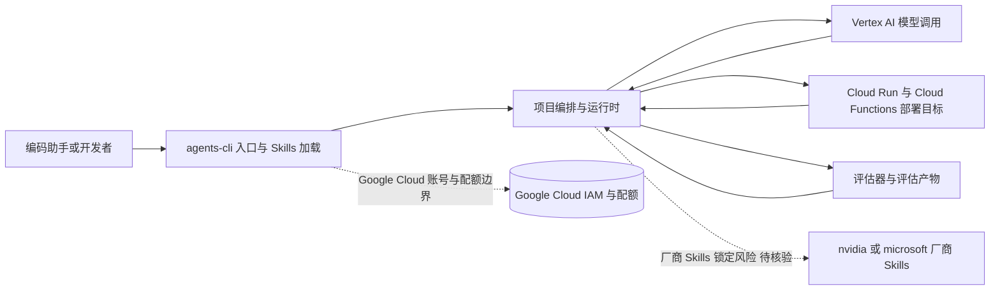

# Google Agents CLI

## 一句话定位
Google 官方 CLI 工具——帮助编码助手在 Google Cloud 上创建、评估和部署 AI Agent，附带的 Skills 让任何编程助手都能成为 Google Cloud Agent 专家。

## 它解决的问题
Agent 在 Google Cloud 上的部署、评估和运维缺乏标准化工具。开发者需要了解 Google Cloud 的复杂服务体系才能有效部署 Agent。

## 为什么值得关注（2026-07-02）
日增 586 stars。Google 加入 Agent CLI 竞争，与 Anthropic（Claude Code）、OpenAI（Codex CLI）形成三足鼎立。更重要的是——Google 选择发布 Skills 而非纯 CLI，说明 Skills 标准的吸引力。

## 热度来源判断
1. Google 官方项目——云生态开发者天然关注
2. 与 Agent Skills 规范兼容——降低了采用门槛
3. Google Cloud AI 部署的真实痛点

## 关键技术亮点亮点
1. **Skills 架构**——不只是 CLI，而是让任何编码助手变成 Google Cloud 专家
2. **创建→评估→部署**全链路覆盖
3. **Google Cloud 原生集成**——Vertex AI、Cloud Run、Cloud Functions 等

## 架构师速览

| 决策问题 | 研究判断 | 证据边界 |
|---|---|---|
| 系统边界 | 该项目是 Google Cloud 上的 Agent 编排/部署 CLI（Python），入口对接编码助手与开发者，运行时通过 Skills 调用 Vertex AI、Cloud Run、Cloud Functions 等 Google Cloud 服务 | 仅基于档案语言（Python）、标签（google-cloud, agent-cli, deployment, evaluation, skills）与"创建→评估→部署"表述；具体协议、Skills 加载机制未在档案中证实 |
| 主路径 | 编码助手/开发者 → agents-cli 入口与 Skills 加载 → 项目编排与运行时 → Vertex AI 等模型 + Cloud Run/Cloud Functions 等工具调用 → 评估结果与部署产物回写 | "创建→评估→部署"全链路覆盖为档案原文，但评估器、状态持久化与日志通道未给出实现细节 |
| 关键权衡 | 选择发布厂商 Skills（而非独立 Agent 平台）以加速生态分发，但代价是加深 Google Cloud 锁定、削弱跨云可移植性，并带来与 nvidia/skills、microsoft/skills 同质化的差异化风险 | 档案明确点出"Google Cloud 锁定"与"与 nvidia/skills、microsoft/skills 差异化不足"；其余权衡为基于该事实的延伸观察 |
| 最小 PoC | 在单一 Google Cloud 项目内启用 agents-cli，限定一个 Skills（如 Cloud Run 部署）+ 一个最小 Agent 入口，以"创建→评估→部署"闭环为验收点，并预设配额、成本与回滚退出路径 | 档案建议"先在单一渠道、最小工具权限和可审计日志下验证"；具体 Skills 清单、配额名称、SLO 指标需以源码/Google Cloud 文档核验 |

## 架构启发
Google 选择 Skills 格式而非独立 Agent 平台，说明 Skills 标准正在获得跨厂商共识。这也暗示了一种新的商业模式——云厂商通过 Skills 分发而非自建 Agent 平台。

## 架构图（MMD）

> 证据边界：此图只采用本档案已有可核验描述；“待核验”节点不应视为项目实现事实。

## 定位判断
工具型。Google Cloud 生态专用，跨云价值有限。

## 风险 / 局限 / 泡沫点
1. **Google Cloud 锁定**——与 AWS/Azure 生态不兼容
2. **依赖 Google Cloud 账号和配额**
3. **功能范围待验证**——实际部署能力是否比 Terraform/Pulumi 更好
4. **与 nvidia/skills、microsoft/skills 的差异化不足**——都是厂商 Skills 仓库

## 与同类项目的关系
- **nvidia/skills** — 同为厂商 Skills，但 NVIDIA 聚焦 GPU/AI 推理
- **microsoft/skills** — 同为厂商 Skills，Microsoft 聚焦 Azure/SDK
- **vercel-labs/skills** — 聚焦前端部署，通用性更强
- **agentskills/agentskills** — 这些厂商 Skills 共同遵循的规范

## 是否值得持续跟踪
观察型。Google Cloud 用户值得关注，但跨云场景价值有限。关注 Skills 格式是否被更广泛采纳。

## 后续观察点
1. Google Cloud Agent 部署的标准化程度
2. 是否开放非 Google Cloud 的部署能力
3. 社区贡献的 Skills 增长
4. 与 AWS agent-toolkit-for-aws 的对比

---
*首次记录：2026-07-02*
