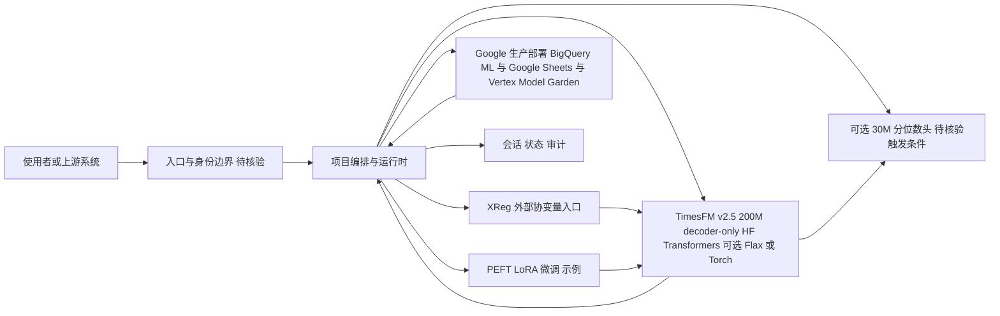

# Google TimesFM

## 一句话定位

Google Research 开发的时间序列基础模型（decoder-only），200M 参数、16K context、已在 BigQuery ML / Google Sheets / Vertex Model Garden 生产部署。

## 它解决的问题

传统时间序列预测（ARIMA、Prophet 等）需要为每个场景单独训练模型，泛化能力差。Foundation Model 范式（一个预训练模型适配多种时间序列）大大降低了预测门槛。TimesFM 是 Google 的方案——decoder-only 架构，类似 LLM 但面向数值序列。

## 为什么值得关注（2026-06-20）

日增 1,516 stars 达到 24,043。v2.5 发布（200M 参数从 500M 降下来，16K context 从 2048 提上去），且 Google 已经在三个产品线生产部署——这证明模型已经过了工程验证。ICML 2024 论文 + HuggingFace 模型 + LoRA 微调示例 + Flax/Torch 双后端 + AGENTS.md/SKILL.md 支持。

## 热度来源判断

**Google 品牌 + 生产部署 + 论文背书。** 这三点叠加使 TimesFM 成为时间序列基础模型的事实标杆。日增 1,516 反映的是企业和研究者对"超越 LLM 的基础模型"的兴趣。

## 关键技术亮点亮点

1. **Decoder-only 架构：** 与 GPT 类似的自回归架构，但面向时间序列。这意味着 LLM 的 scaling law 可能也适用于时间序列。

2. **v2.5 关键改进：** 参数从 500M→200M（更轻），context 从 2048→16K（更长），新增连续分位数预测（optional 30M quantile head），去掉频率指示器。

3. **Google 生产部署：** BigQuery ML（企业级 SQL）、Google Sheets（日常表格）、Vertex Model Garden（Docker 化端点）。三线部署证明工程成熟。

4. **协变量支持：** 通过 XReg 支持外部协变量，不再是纯单变量预测。

5. **LoRA 微调：** HuggingFace Transformers + PEFT 的 LoRA 微调示例。

## 架构师速览

| 决策问题 | 研究判断 | 证据边界 |
|---|---|---|
| 系统边界 | TimesFM v2.5（200M 参数，16K context，decoder-only 时间序列基础模型）的接入面由 BigQuery ML、Google Sheets、Vertex Model Garden 三条 Google 产品线以及 HuggingFace 模型权重 + LoRA（PEFT）微调示例构成；外部协变量通过 XReg 接入。 | 来源仅为档案正文，未列具体 API、SDK、endpoint URL；Vertex 的 Docker 镜像、BigQuery UDF 名称均待核验。 |
| 主路径 | 数值序列输入 → TimesFM 推理（HuggingFace Transformers，可选 Flax/Torch 后端）→ 可选 continuous quantile head（30M）→ 输出点预测/分位数 → 写入 Google Sheets 或 BigQuery 表 / Vertex 端点响应。微调路径：基础权重 + PEFT LoRA → 微调后适配自有序列。 | 推理时序、tokenizer 细节、context-16K 分桶策略、quantile head 触发条件均需源码确认。 |
| 关键权衡 | 参数效率（200M）相对竞品 Chronos（710M）/Moirai（311M）的取舍，换取更长 context（16K vs 5K/1K）；同时承担 Google 闭源生产版本与开源版本的能力差距风险（README 明示非官方支持产品）。 | 推理延迟、显存占用、QPS、quantile head 训练成本均未在档案中量化。 |
| 最小 PoC | 取 HuggingFace 上的 TimesFM 2.5 权重，固定单条渠道（如 BigQuery ML 或本地 Python），以单变量序列走端到端推理，接入 LoRA 微调示例验证协变量（XReg）与 16K context；不引入 Vertex 或 Sheets。 | LoRA 微调脚本路径、所需最低硬件、数据 schema 要求需查仓库 examples/ 目录核验。 |

## 架构启发

TimesFM 证明了"基础模型"范式可以从文本扩展到数值序列。这对架构师的启发是：
- "预训练 + 微调" 不只是 LLM 的专利
- 时间序列预测的"模型即服务"正在成为现实
- 企业可以跳过训练步骤，直接用 foundation model 做预测

## 架构图（MMD）

> 证据边界：此图只采用本档案已有可核验描述；“待核验”节点不应视为项目实现事实。

## 定位判断

**时间序列基础模型的生产标杆。** 不再是研究项目——是 Google 生产线上的工具。在企业场景中可直接替代部分传统预测管道。

## 风险 / 局限 / 泡沫点

1. **不是 Google 官方支持产品：** README 明确说明"open version is not an officially supported Google product"。
2. **场景限制：** 基础模型不可能覆盖所有时间序列场景（如极端稀疏数据、高频交易）。
3. **竞争激烈：** Lag-Llama、Chronos（Amazon）、Moirai（Salesforce）等也在争夺这个赛道。
4. **部署复杂度：** 虽然 HuggingFace 模型可用，但企业级部署仍需要 MLOps 投入。

## 与同类项目的关系

| 项目 | 团队 | 参数 | Context | 生产部署 |
|------|------|------|---------|----------|
| TimesFM 2.5 | Google | 200M | 16K | BigQuery/Sheets/Vertex |
| Chronos | Amazon | 710M | 5K | ❌ |
| Moirai | Salesforce | 311M | 1K | ❌ |
| Lag-Llama | ServiceNow | 8M | ❌ | ❌ |

TimesFM 在参数效率（200M vs 710M）、context 长度（16K vs 5K）和生产部署上全面领先。

## 是否值得持续跟踪

**是。** 作为 Google 生产线部署的基础模型，TimesFM 值得持续跟踪。特别是关注其与企业数据平台的集成进展。

## 后续观察点

1. BigQuery ML 中的使用数据（预测调用量）
2. 社区微调模型的性能对比
3. 是否有多模态时间序列计划（如时间序列 + 文本）
4. 竞品（Chronos/Moirai）的迭代节奏
5. 企业落地案例

---
*首次记录：2026-06-20*
