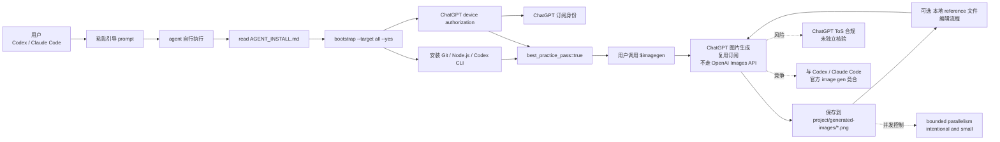

# GENEXIS-AI/gpt-image-skill

## 一句话定位
**让 Codex / Claude Code 通过用户的 ChatGPT 订阅生成与编辑 GPT 图片** ——不走 OpenAI Images API、不消耗独立计费，README 自述 "Generate and edit GPT images from Codex, Claude Code, or another compatible local agent through the user's **ChatGPT subscription**"。**agent skill 订阅制**的代表样本。

## 它解决的问题
开发者使用 Codex / Claude Code 生成图片面临三类痛点：(1) **OpenAI Images API 独立计费**——生成图片需要单独付费 token；(2) **ChatGPT 订阅无法直接被 agent 调用**——ChatGPT 网页订阅包含 image generation 但 agent 调用路径缺失；(3) **手动安装 agent skill 流程繁琐**——多数 agent skill 缺乏完整的安装 contract。GENEXIS-AI/gpt-image-skill 直击这三点：**复用 ChatGPT 订阅 + 内置 `$imagegen` 命令 + 完整的 agent skill 自描述安装 contract**。

## 为什么值得关注（2026-08-27）
- **1 天 55⭐ + 6 forks**：反映"用订阅替代 API key"的产品创新被开发者认可
- **不走 OpenAI Images API**：README 强调 "This repository does not call the OpenAI Images API and does not create a separately billed Images API request"
- **多 harness 兼容**：通过 agent skill 同时支持 Codex / Claude Code / 其他 compatible local agent
- **完整的安装 contract**：粘贴一段引导 prompt → agent 自行 read AGENT_INSTALL.md → bootstrap --target all --yes → 直到 best_practice_pass=true——**agent-driven installation 的工程化样本**
- **内置 `$imagegen` 命令**：并行批处理、本地 reference 文件接入、结果自动保存到 `<project>/generated-images/*.png`
- **2.1 MB size**：含 build 资产（验证过的 skill 产物）
- **OpenAI 官方文档佐证**：README 引用 OpenAI "image generations use included limits 3–5× faster on average than similar non-image turns"

## 热度来源判断
热度来自 **"订阅复用价值 × agent skill 安装体验 × 多 harness 兼容"** 的组合：(1) ChatGPT Plus / Pro 订阅已包含 image generation，但缺乏 agent 调用路径；(2) 多数 agent skill 安装流程繁琐，用户体验差；(3) Codex + Claude Code 双 harness 适配扩大潜在用户群。**主要风险：** ChatGPT 订阅条款对第三方 agent 调用的合规性（OpenAI 是否会限制这种用法）未在 README 中核验；与 Codex / Claude Code 官方 image generation 功能的竞合（若官方推出类似功能，第三方 skill 可能被替代）；无 license 阻碍商用。

## 关键技术亮点
1. **ChatGPT 订阅复用**：通过 ChatGPT 订阅身份生成图片，不消耗独立计费
2. **多 harness 兼容**：Codex + Claude Code + 其他 compatible local agent
3. **Agent skill 自描述安装 contract**：粘贴引导 prompt → agent 自行完成 Git clone / Node.js 安装 / Codex CLI 安装 / device authorization 登录 / readiness 验证
4. **`$imagegen` 内置命令**：直接 prompt 或委托多概念 prompt + 本地 image 输入 + 单生成或 bounded并行 batch
5. **本地 reference 文件接入**：真实参考文件直接进入生成请求
6. **结果保存到 `<project>/generated-images/*.png`**：生成结果自动归档到项目目录
7. **Bounded parallelism**：并行批处理有上限（"intentional and small"），避免超过 ChatGPT 订阅配额

## 架构师速览

| 决策问题 | 研究判断 | 证据边界 |
|---|---|---|
| 系统边界 | 一个 agent skill（JavaScript）+ ChatGPT 订阅身份认证层 + 内置 `$imagegen` 命令；不直接调用 OpenAI Images API | 仅基于 README 的 "This repository does not call the OpenAI Images API" 与内置命令描述；具体 ChatGPT 订阅认证协议（OAuth / device authorization）、与 ChatGPT 网页端的认证复用机制、图片生成的具体路径（API 复用 vs 协议逆向）均未在档案中明示 |
| 主路径 | 用户粘贴引导 prompt → agent 自行 read AGENT_INSTALL.md → bootstrap --target all --yes → ChatGPT device authorization 登录 → ready → 用户调用 `$imagegen` 提示词 → 生成结果保存到 `<project>/generated-images/*.png` | 主路径来自 README "Install by pasting one prompt into an agent" 与 "Text workflow" 段落；ChatGPT device authorization 的 token 持久化路径、`$imagegen` 的并发控制、结果归档的失败回退未明示 |
| 关键权衡 | ChatGPT 订阅复用价值 vs OpenAI ToS 合规边界 vs 与官方 image generation 功能的竞合 vs 安装 contract 的稳定性 | 档案明示 "until 10.10.2026"（暗示营销期）与 "intentional and small" 并发控制；ChatGPT ToS 合规、官方功能竞合、安装 contract 跨平台（macOS/Linux/Windows）的稳定性均待核验 |
| 最小 PoC | 在 Codex 或 Claude Code 安装 skill → 用 device authorization 登录 ChatGPT 订阅 → 调用 `$imagegen` 简单提示词生成 1 张图 → 验证结果保存路径 → 验证不消耗独立计费 | PoC 范围由"先单 harness、单张图、可验证不消耗独立计费"原则推导；具体订阅 token 持久化路径、ChatGPT 配额监控、退出路径待核验 |

## 架构启发
GENEXIS-AI/gpt-image-skill 的核心启发是 **"用现有订阅替代独立 API key"** ——降低用户使用门槛的核心策略。**与同类项目的启发：** 和 8-26 的 GENEXIS-AI/gpt-image-skill 自身（持续跟踪）共同证明 **"agent skill 订阅制" 是 skill 作者的最佳分发路径**。**更深层的启发是：** "agent skill 自描述安装 contract" 是 agent-driven installation 的工程化样本——通过粘贴一段引导 prompt，让 agent 自己完成 Git clone / Node.js 安装 / Codex CLI 安装 / device authorization 登录 / readiness 验证，**把安装流程从"用户操作"转化为"agent 自治"**。这对所有复杂 skill（需要 CLI / 认证 / 配置）的分发都是可借鉴的范式。

## 架构图（MMD）

> 证据边界：此图只采用本档案已有可核验描述；"待核验"节点不应视为项目实现事实。

## 定位判断
**工具型项目（image-generation agent skill）。** GENEXIS-AI/gpt-image-skill 不做图片生成（由 ChatGPT 提供），只做"agent skill 形态的图片生成封装"——这是工具型定位。**核心竞争壁垒：** "ChatGPT 订阅复用"的产品创新 + "agent skill 自描述安装 contract"的工程化范式 + Codex + Claude Code 双 harness 适配。**主要风险：** ChatGPT ToS 合规边界未独立核验；与官方 image generation 功能的竞合；1 天新项目维护持续性。若持续维护 + ToS 合规，**12 月内有可能成为"agent skill 订阅制"的标杆样本**。

## 风险 / 局限 / 泡沫点
- **ChatGPT ToS 合规**：第三方 agent 调用 ChatGPT 订阅生成图片的合规性未独立核验
- **官方功能竞合**：Codex / Claude Code 若推出官方 image generation 功能，第三方 skill 可能被替代
- **无 license**：阻碍企业 fork 与商用
- **1 天新项目**：维护持续性待观察
- **订阅 token 持久化**：device authorization 的 token 持久化路径与刷新策略未在 README 中明示
- **配额监控**：ChatGPT 订阅的图片生成配额监控与超额处理未明示
- **跨平台稳定性**：安装 contract 在 macOS / Linux / Windows 的稳定性需进一步核验

## 与同类项目的关系
- **vs OpenAI Images API**：gpt-image-skill 走 ChatGPT 订阅而非 OpenAI API key
- **vs 各类 image generation skill**：多数 skill 调用 API key（独立计费），gpt-image-skill 复用订阅
- **vs Codex / Claude Code 官方 image generation**：若官方推出类似功能，第三方 skill 可能被替代
- **vs 8-26 的 GENEXIS-AI/gpt-image-skill**：今日记录为正式入库；前一日观察项目
- **vs 其他 agent skill 自描述安装 contract**：gpt-image-skill 是 "agent-driven installation" 的工程化样本，可被其他复杂 skill 借鉴

## 是否值得持续跟踪
**值得跟踪（agent skill 订阅制的代表样本）。** GENEXIS-AI/gpt-image-skill 1 天 55⭐ + 6 forks 体现产品创新被开发者认可，**核心价值是"ChatGPT 订阅复用" + "agent skill 自描述安装 contract"的工程化范式**。**对 skill 作者：** 这是"用现有订阅替代独立 API key"的范例，12 月内评估自家 skill 是否能复用 ChatGPT / Claude / Cursor 等现有订阅。**对产品设计者：** "agent-driven installation" 的范式值得学习。建议关注：(1) ChatGPT ToS 是否对第三方 agent 调用表态；(2) Codex / Claude Code 是否推出官方 image generation；(3) 是否补上 license。

## 后续观察点
- ChatGPT ToS 对第三方 agent 调用的合规边界
- Codex / Claude Code 是否推出官方 image generation 功能（竞合风险）
- 是否补上 OSI license（决定企业采用）
- 订阅 token 持久化路径（device authorization refresh 策略）
- 安装 contract 的跨平台稳定性（macOS / Linux / Windows）
- 并发控制上限（intentional and small 的具体值）

---
> 数据来源: GitHub API (2026-08-27) | Stars: 55 | Forks: 6 | License: 未声明 | 语言: JavaScript | 创建: 2026-08-26 | 数据截至 2026-08-27 19:30 UTC