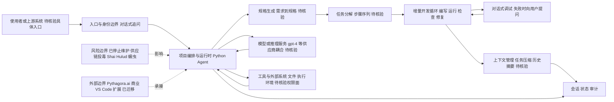

# Pythagora-io/gpt-pilot

## 一句话定位
早期"真正 AI 开发者"概念的开创性项目——不止补全代码，而是端到端构建完整应用，但**目前已停止维护**并曾遭受供应链投毒攻击。

## 它解决的问题
传统 AI 编程工具（如早期 Copilot）只做代码补全或生成片段。GPT Pilot 试图解决更深层的问题：让 AI 像真正的开发者一样工作——理解需求、规划架构、编写完整功能、调试、请求代码审查。它是最早探索"AI 作为全栈开发者"范式的开源项目之一，启发了后续大量 AI 编程 Agent 项目。

## 为什么值得关注
- **历史地位**：33,714 stars，Y Combinator 孵化项目，是"AI 开发者"概念的早期标杆
- **安全警示价值**：该项目在 2025-08 至 2026-06 期间遭遇供应链蠕虫攻击（Shai-Hulud 蠕虫），是开源供应链安全的教科书级案例
- **技术遗产**：其 Agent 架构（规格驱动 → 任务分解 → 增量开发 → 自我调试）被后续项目广泛借鉴

## 热度来源判断
Stars 数来自 2023-2024 年 AI 编程浪潮的红利期。项目已明确声明"This repo is not being maintained anymore"，官方产品已迁移至 [Pythagora.ai](https://www.pythagora.ai/) 商业化 VS Code 扩展。当前热度属于历史惯性，非活跃增长。

## 关键技术亮点亮点
- **规格驱动开发**：从用户描述生成开发规格，再分解为可执行任务步骤
- **增量式 Agent 循环**：每个任务步骤包含"编写 → 运行 → 检查 → 修复"的自我闭环
- **对话式调试**：遇到问题时主动向用户提问，而非盲目重试
- **上下文管理**：通过任务压缩和历史摘要管理长项目的上下文窗口

## 架构师速览

| 决策问题 | 研究判断 | 证据边界 |
|---|---|---|
| 系统边界 | 项目是一个编排 Agent，串联用户入口、外部 LLM、工具/系统与会话状态四类边界；Python 实现，但具体接口、部署形态、模型供应商适配层未在档案中给出 | 边界划分基于档案描述的"开发者模拟"职责；具体协议、持久化与运行容器须读源码核验 |
| 主路径 | 规格生成 → 任务分解 → 增量开发循环（写码→运行→检查→修复）→ 对话式调试 → 上下文压缩/历史摘要 | 主路径来自档案"关键技术亮点"；每步内部实现、提示词结构、上下文窗口策略未披露 |
| 关键权衡 | 在"早期 AI 全栈开发者"理念与工程可控性之间的失衡：增量自调试与对话式追问提高了覆盖面，却以牺牲可观测性、安全审计和供应商解耦为代价，并最终在供应链攻击中暴露代价 | 权衡判断基于档案的安全事件描述与维护状态；未量化失败率、成本、SLO |
| 最小 PoC | 不要再做新功能 PoC；如必须复用，建议限定在只读沙箱、可审计日志、最小工具权限、固定模型版本下复现规格→任务→循环三步骤，验收项必须包含供应链完整性核验与凭据隔离 | PoC 设计基于档案"采用建议"与"风险"段；具体环境、依赖锁定策略、退出路径未在档案中给出 |

## 架构启发
GPT Pilot 的核心启发在于"开发者模拟"架构：将人类开发者的工作流程（规划→编码→测试→调试→评审）映射为 AI Agent 的步骤序列。这种"角色模拟"范式比纯代码生成更具系统性和可控性。其失败教训同样重要——开源项目缺乏安全审计时的供应链风险。

## 架构图（MMD）

> 证据边界：此图只采用本档案已有可核验描述；“待核验”节点不应视为项目实现事实。

## 定位判断
**已归档的历史参考项目**。作为概念验证和技术遗产有价值，但不适合新项目采用。官方维护已转移到商业产品 Pythagora.ai。

## 风险 / 局限 / 泡沫点
- **已停止维护**：不再接收功能更新或安全补丁
- **供应链安全事件**：恶意代码在仓库中潜伏近 10 个月，窃取云密钥、GitHub Token、SSH 密钥
- **竞争淘汰**：已被 Cursor、Claude Code、Codex 等新一代工具全面超越
- **泡沫风险**：33k stars 中大部分是历史积累，当前社区已不活跃

## 与同类项目的关系
- **继承者**：Pythagora.ai（商业化产品）、Cursor、GitHub Copilot Workspace
- **同期竞品**：Aider、Sweep.dev、Devika（均已不同程度衰退）
- **影响**：其 Agent 架构理念影响了 OpenHands、SWE-agent 等学术项目

## 是否值得持续跟踪
**不值得**。项目已停止维护。唯一值得跟踪的是其安全事件的后续影响分析和开源供应链安全的行业反思。

## 后续观察点
- 供应链攻击事件是否引发更广泛的开源安全审计标准变化
- Pythagora.ai 商业产品的市场表现
- 受影响用户的凭据泄露后续追踪

---
> 数据来源: GitHub API (2026-08-07) | Stars: 33,714 | Forks: 3,477 | 语言: Python | 首次发现: 2026-06-17
