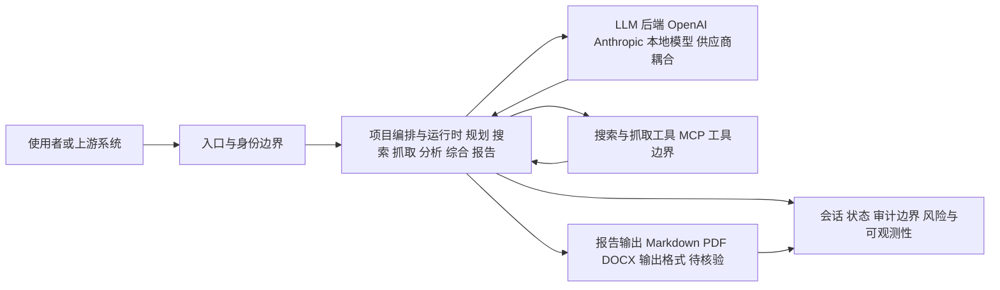

# assafelovic/gpt-researcher

## 一句话定位
自主研究 Agent——对任意主题执行深度研究，自动规划→搜索→分析→综合→生成报告，支持多 LLM 后端和 MCP 集成。

## 它解决的问题
人工研究耗时巨大——信息搜集、阅读筛选、交叉验证、归纳总结。即使是简单的研究问题也可能需要数小时浏览数十个网页。GPT Researcher 将研究流程 Agent 化：给定研究主题，Agent 自主规划研究策略、执行多轮搜索、提取关键信息、检测信息冲突、综合多方来源，最终生成结构化研究报告。它将"研究"这一知识工作者核心任务自动化。

## 为什么值得关注
- **28,873 stars:** AI 研究 Agent 赛道的标杆项目
- **先驱性:** 创建于 2023 年 5 月，是最早的 AI 研究 Agent 之一
- **MCP 支持:** 已集成 MCP 生态，可与 Claude Code 等工具协作
- **多 LLM 后端:** 不绑定单一模型，支持 OpenAI/Anthropic/本地模型
- **Apache 2.0:** 利于商业使用和二次开发

## 热度来源判断
热度来自"深度研究"（Deep Research）在 2025-2026 年成为 AI 的杀手级应用。OpenAI Deep Research、Perplexity Pro 的成功验证了市场需求。GPT Researcher 作为开源替代方案获得了大量关注——开发者和研究人员需要可控、可定制、无使用限制的研究 Agent。MCP 集成使其在 2026 年获得了新的增长动力。

## 关键技术亮点亮点
- 多阶段研究流程：规划→搜索→抓取→分析→综合→报告生成
- 自适应搜索策略：根据初始结果动态调整后续搜索方向
- 信息冲突检测：识别来源间的矛盾信息并标注
- 多来源综合：不是简单拼接，而是基于证据权重的信息融合
- 可定制报告格式：支持 Markdown/PDF/DOCX 输出
- MCP 服务端：可将研究能力暴露为 MCP 工具供其他 Agent 调用

## 架构师速览

| 决策问题 | 研究判断 | 证据边界 |
|---|---|---|
| 系统边界 | 定位为深度研究 Agent 框架，承担入口渠道、LLM 后端、检索/抓取工具与多源数据之间的编排与综合层 | 档案明示多 LLM 后端、规划→搜索→抓取→分析→综合→报告流水线、MCP 工具暴露；具体协议、部署形态、状态持久化未在档案中给出 |
| 主路径 | 研究主题进入后由项目运行时编排，按规划→搜索→抓取→分析→综合→报告生成的多阶段流水线推进，并把结果回写到会话/状态/审计边界 | 主路径与阶段名称来源于档案"关键技术亮点"；抓取实现、搜索引擎适配、报告模板等细节档案未证实，标注待核验 |
| 关键权衡 | 在"多轮自适应搜索 + 多源综合"换取研究深度的同时，需承担更高 API 成本、幻觉与归因风险以及与闭源 Deep Research 的质量差距 | 权衡基于档案"风险/局限"中的成本、幻觉、时效性与竞争白热化条目；未量化性能基准 |
| 最小 PoC | 以单一研究主题、最小可用 LLM 后端与受限工具权限跑通规划→搜索→抓取→报告生成，并启用 Markdown 输出与会话/审计日志用于验收 | PoC 范围来自档案可定制报告格式、MCP 服务端定位与"采用建议"；具体配置项、依赖、运行命令需以源码/官方文档核验 |

## 架构启发
GPT Researcher 的核心启发是"研究即编排"。对架构师的启发是：**复杂知识任务可以通过分解为搜索-分析-综合的流水线来实现自动化**，而非寄望于单一 LLM 调用完成。这种"规划-执行-反思"的 Agent 架构模式比单次 Prompt 更可靠。

## 架构图（MMD）

> 证据边界：此图只采用本档案已有可核验描述；“待核验”节点不应视为项目实现事实。

## 定位判断
**平台候选（中等）。** 已具备 Agent 框架的成熟度和生态集成能力（MCP），但面临 OpenAI/Perplexity 等闭源方案的强力竞争。开源 + 可定制是其核心差异化。定位为"开源版 Deep Research"。

## 风险/局限/泡沫点
- **质量上限:** 开源研究 Agent 的质量取决于底层 LLM 能力，与 OpenAI Deep Research 有代差
- **幻觉风险:** 研究报告可能包含 LLM 幻觉或不准确的归因
- **成本:** 多轮搜索 + 长上下文分析意味着可观的 API 成本
- **时效性:** 搜索结果的质量受搜索引擎 API 和时间窗口限制
- **竞争白热化:** OpenAI、Perplexity、Google 都在深度研究领域投入巨资

## 与同类项目的关系
- 与 **OpenAI Deep Research** 是开源 vs 闭源的直接对标
- 与 **Perplexity** 在 AI 研究维度竞争——Perplexity 做产品，GPT Researcher 做框架
- 与 **ScrapeGraphAI** 互补——ScrapeGraphAI 做数据采集，GPT Researcher 做研究分析
- 与 **LangChain** 在 Agent 框架维度是上下层关系
- 通过 MCP 与 **Claude Code**、**n8n** 等工具形成生态连接

## 是否值得持续跟踪
**推荐跟踪。** 作为 AI 研究 Agent 的开源标杆，其架构设计和 MCP 集成对 Agent 开发有参考价值。建议关注其与闭源方案的质量差距变化。

## 后续观察点
- 研究质量与 OpenAI Deep Research 的差距是否缩小
- MCP 生态集成的深度和广度
- 企业研究场景的采用情况（市场调研、竞争分析、技术调研）
- 多模态研究能力（图片、视频、数据图表分析）
- 商业化路径（SaaS 版本、企业版）

---
> 数据来源: GitHub API (assafelovic/gpt-researcher) | 星标: 28,873 | 语言: Python | 许可证: Apache-2.0
