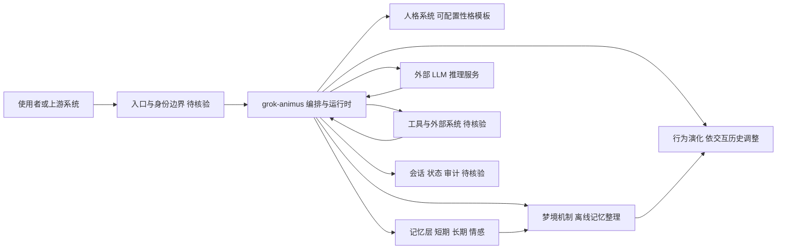

# grok-animus

## 一句话定位
持久化 AI 伴侣引擎——为任意 LLM 构建具有人格、记忆、梦境和演化能力的"活的"AI 伴侣。

## 它解决的问题
当前 AI Agent 大多是无状态的工具执行器——每次对话从零开始。grok-animus 试图解决：
- LLM 没有持久记忆，无法形成长期关系
- AI 缺乏一致性人格，每次交互风格不同
- 没有"成长"机制，AI 无法随时间演化行为模式

目标用户：想构建个性化 AI 伴侣/角色的开发者和研究者。

## 为什么值得关注（2026-05-18）
AI Agent 正从"任务执行器"分化出"持久化伴侣"方向。grok-animus 提出的"人格 + 记忆 + 梦境 + 演化"四层架构，是当前少有的系统性 AI 伴侣框架。虽然工程成熟度较低，但概念上代表了 Agent 架构的一个重要分支：有状态 Agent。

## 热度来源判断
- AI 伴侣概念本身自带话题性
- "梦境"和"演化"等概念引发社区讨论
- 低门槛（Python + 任意 LLM）降低了试用成本
- 泡沫风险较高：概念 > 实际工程验证

## 关键技术亮点亮点
1. **人格系统**：可配置的性格模板，确保 AI 输出风格一致
2. **持久记忆**：不只是 RAG，而是结构化的记忆管理（短期/长期/情感记忆）
3. **梦境机制**：在"离线"状态下对记忆进行重组和压缩，模拟人类睡眠整理记忆的过程
4. **行为演化**：AI 的决策模式随交互历史和反馈发生变化

## 架构师速览

| 决策问题 | 研究判断 | 证据边界 |
|---|---|---|
| 系统边界 | Python 编写的 AI 伴侣引擎，定位为任意 LLM 之上的"人格 + 记忆 + 梦境 + 演化"编排层，属研究/工具型，尚未具备生产文档与基准 | 基于分类"工具型"、语言、tags（AI Companion、记忆、人格、LLM、持久化、演化）及档案明文，未触及源码 |
| 主路径 | 用户请求 → 人格/记忆/编排层 → LLM 推理 + 工具调用 → 短期/长期/情感记忆回写；"梦境"作为离线记忆整理与演化分支 | 档案原文仅描述四层架构概念，未给出协议、持久化后端或部署形态 |
| 关键权衡 | LLM-agnostic 带来的灵活性 vs. 人格一致性、记忆膨胀、隐私与供应商耦合；概念新颖性与工程可测性落差大 | 档案已点名"LLM-agnostic 代价"、"记忆膨胀"、"隐私风险"与"概念泡沫"，未给出定量数据 |
| 最小 PoC | 单渠道接入、最小工具权限、可审计日志下验证人格一致性与短期记忆回写；将"梦境/演化"作为可关闭特性，验证后再扩展接入面 | 档案采用建议条款已给出该路径，PoC 细节（向量库、调度、模型选型）需源码核验 |

## 架构启发
grok-animus 的四层架构（人格/记忆/梦境/演化）对通用 Agent 设计有启发：
- Agent 不应只是无状态的函数调用链
- 长期记忆管理需要超越 RAG 的范式
- "离线处理"（梦境）是一个有价值的设计模式——Agent 在不工作时整理记忆、优化行为

## 架构图（MMD）

> 证据边界：此图只采用本档案已有可核验描述；“待核验”节点不应视为项目实现事实。

## 定位判断
目前定位为**研究型/工具型**项目。距离生产可用还有明显差距：
- 缺乏文档和示例
- 没有可复现的 benchmark
- "梦境"和"演化"机制缺乏定量评估

在生态中属于 AI 伴侣赛道的早期探索者，与 Character.AI 等商业产品方向一致但更偏技术框架。

## 风险 / 局限 / 泡沫点
1. **概念泡沫**："梦境"和"演化"是迷人的比喻，但缺乏严格的工程定义和可测量性
2. **LLM-agnostic 的代价**：支持任意 LLM 意味着对模型能力做了最小假设，人格一致性依赖 prompt engineering 而非模型微调
3. **记忆膨胀**：长期运行后记忆管理成本如何控制？缺乏明确的记忆淘汰策略
4. **隐私风险**：持久化 AI 伴侣意味着大量个人数据存储，项目未见隐私保护设计

## 与同类项目的关系
| 维度 | grok-animus | trustclaw | Mem0 |
|------|------------|-----------|------|
| 核心定位 | AI 伴侣引擎 | 自托管个人 Agent | 记忆层 |
| 记忆管理 | 人格+记忆+梦境 | 向量记忆 | 结构化记忆 API |
| 人格系统 | ✅ 内置 | ❌ | ❌ |
| 自托管 | ✅ | ✅ | 部分 |
| 成熟度 | 低 | 中 | 高 |

## 是否值得持续跟踪
**有条件跟踪**。概念方向有价值，但需要验证：
1. 是否有真实用户在长期使用
2. 记忆和演化机制是否有可测量的效果
3. 是否会形成可复用的"伴侣"基础设施

## 后续观察点
1. 是否出现长期使用的用户案例和反馈
2. 记忆管理机制是否会引入分层淘汰策略
3. 是否会与 RAG/向量数据库做深度集成
4. 是否有商业化计划或社区增长

---
*首次记录：2026-05-18*
