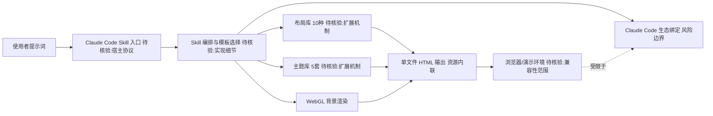

# Guizang PPT Skill

## 一句话定位
Claude Code Skill，一键将提示词转化为杂志风 HTML 幻灯片——10 种布局、5 套主题、WebGL 背景、单文件输出。

## 它解决的问题
面向使用 Claude Code 的开发者和内容创作者，解决"快速生成高质量演示文稿"的痛点。传统 PPT 制作耗时且模板化，而 Agent 生成的内容需要结构化展示。

## 为什么值得关注（2026-05-06）
Claude Code Skill 生态正在爆发，Guizang PPT Skill 是其中增速最快的设计类 Skill 之一（2 周 5K stars）。它代表了 Agent Skill 从"辅助编码"向"内容生产"扩展的趋势。

## 热度来源判断
- **真实需求**：PPT 制作是高频需求，Agent Skill 的"一键生成"体验有真实价值
- **技术差异化**：WebGL 背景和杂志风布局比传统 PPT 模板有视觉优势
- **生态借力**：Claude Code Skill 生态爆发带动关联项目

## 关键技术亮点亮点
1. **10 种布局 + 5 套主题**：预制布局覆盖常见演示场景
2. **WebGL hero 背景**：用 WebGL 渲染动态背景，视觉效果出众
3. **单文件 HTML 输出**：所有资源内联，零依赖分发

## 架构师速览

| 决策问题 | 研究判断 | 证据边界 |
|---|---|---|
| 系统边界 | Guizang PPT Skill 是 Claude Code 生态内的 Skill 插件，入口为提示词，输出为单文件 HTML 幻灯片（内联资源、WebGL 背景），仅依赖 Claude Code 宿主 | HTML 单文件输出与 WebGL 背景来自档案；运行宿主边界、模型供应商、权限模型未在档案中确认（待核验） |
| 主路径 | 提示词 → Claude Code Skill 调用 → 模板/主题/布局选择 → WebGL 背景渲染 → 单文件 HTML 输出 | 10 种布局、5 套主题、WebGL 背景、单文件输出均来自档案；编排与渲染管线细节未披露（待核验） |
| 关键权衡 | 单文件零依赖分发 vs 传统 PPTX 办公场景接受度；WebGL 视觉差异化 vs 受众设备兼容性与可访问性；模板化快速生成 vs 10 种布局的创造力上限 | 档案已点明"HTML vs PPTX"风险与"模板天花板"风险；兼容性与可访问性数据档案未提供（待核验） |
| 最小 PoC | 固定 1 套主题 + 1 种布局，单文件 HTML，关闭外部资源，离线打开验证渲染、WebGL 背景与排版；评估在非 Claude Code 环境中的可移植性 | 热度与评分（2 周 5K stars）不作为生产可用性证据；Claude Code 宿主外的运行方式档案未给出（待核验） |

## 架构启发
- Agent Skill 封装为"输入提示词 → 输出成品"的黑盒模式
- 单文件输出设计适合 Agent 生成的无状态特性
- 布局模板化 + 渲染引擎分离的架构

## 架构图（MMD）

> 证据边界：此图只采用本档案已有可核验描述；“待核验”节点不应视为项目实现事实。

## 定位判断
Claude Code Skill 生态中的"内容生成"类工具。不是平台，但有潜力成为 PPT Skill 的标杆实现。

## 风险 / 屏限 / 泡沫点
1. **Claude Code 绑定**：完全依赖 Claude Code 生态，可移植性差
2. **模板天花板**：10 种布局可能很快遇到创造力瓶颈
3. **HTML vs PPTX**：HTML 输出在传统办公场景中接受度有限

## 与同类项目的关系
- **PPT Master**（11.6K）：直接竞品，但走原生 PPTX 路线
- **Open Slide**（1.3K）：为 Agent 构建的幻灯片框架，更通用
- **Open Design**（27.3K）：更大的设计平台，PPT 只是其中一部分

## 是否值得持续跟踪
是。作为 Agent Skill 生态的代表项目，值得跟踪其模板扩展和格式支持进展。

## 后续观察点
1. 是否增加 PPTX 导出支持
2. 布局模板的更新频率和社区贡献情况
3. 是否出现企业级使用案例

---
*首次记录：2026-05-06*
