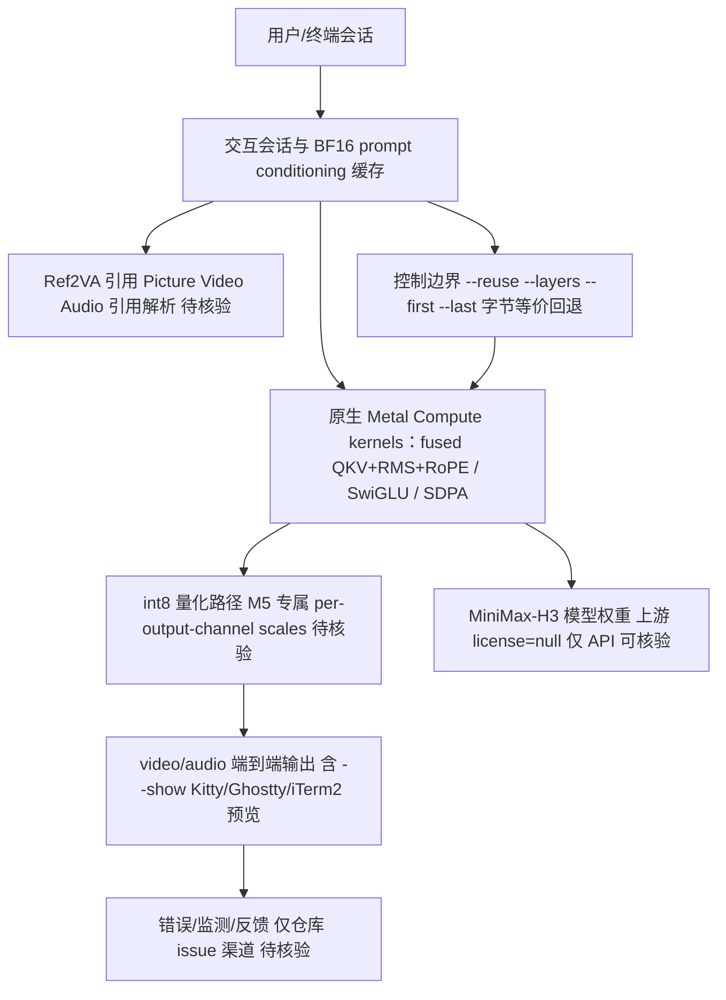

# antirez/h3.c

## 一句话定位
Redis 创始人 Salvatore Sanfilippo（antirez）亲自编写的 MiniMax-H3 原生 Metal 推理引擎——专为 Apple Silicon 优化，用 C + Metal Compute 实现端到端 prompt→video/audio 生成，是 H3 生态从"ComfyUI 插件层"延伸到"原生推理层"的标志。

## 它解决的问题
MiniMax-H3 视频生成模型虽然质量高，但推理成本极高（需要云端 GPU 或大型推理服务）。对于拥有 Apple Silicon Mac（M3/M5）的用户，无法在本地端到端运行 H3。现有方案（ComfyUI 插件、SGLang/PyTorch）依赖 Python + 通用 ML 框架，性能远未榨干 Apple Silicon 的 Metal GPU 能力。h3.c 解决的是：**在 Mac 上用原生 C/Metal 以最高效的方式跑 H3，把推理成本降到本地消费级硬件可承受的范围。**

## 为什么值得关注（2026-08-11）
- **作者信誉极高：** antirez = Salvatore Sanfilippo = Redis 创始人（GitHub: 30,742 followers，109 个公开仓库，API 可核验）。他以系统级 C 编程和极致性能优化闻名。他选择为 H3 写原生推理引擎，本身就是"H3 推理成本是真问题"的最强信号。
- **技术深度：** README 显示该项目不是简单封装，而是从零实现的 Metal 推理引擎——含 fused MLP kernel、int8 量化、QKV 融合、SDPA 优化等深度工程。
- **生态位置：** H3 衍生生态此前主要是 ComfyUI 插件（Spectrum/Director/Turbo，Python），h3.c 是第一个原生 C/Metal 推理引擎，填补了"原生推理层"空白。

## 热度来源判断
**判断：真实需求驱动，但极早期。** 129⭐ / 7 fork / 1 subscriber 的数据说明项目刚起步（创建于 08-09），热度主要来自 antirez 的个人影响力（30.7k followers 中极小比例已关注）。这不是泡沫——antirez 的项目历史（Redis、disque、litelog）证明他只做有真实工程价值的系统项目。但当前 star 数仍很低，尚未进入大规模采用阶段。

## 关键技术亮点亮点
1. **原生 Metal Compute：** 不依赖 PyTorch/MLX/MPS，直接用 Metal Compute Shaders 实现 H3 transformer 的所有计算。针对 M5 Max 的 Metal 4 TensorOps 硬件专门优化。
2. **int8 量化（M5 专属）：** 动态量化激活值，per-output-channel weight scales，FC2 输入每 1,024 通道一个 scale。README 称 BF16→int8 将 50-layer 19-transition 渲染从 36.30s 降到 25.80s（M5 Max，作者自述，未独立复现）。
3. **深度 kernel 融合：** QKV 投影 + Q/K RMS 归一化 + RoPE 融合为单一 kernel；gated AdaLN 融合量化；MLP 的 fc1→SwiGLU→fc2 融合为单个缓存图。每个融合都声称 byte-identical（可回退到非融合版本验证）。
4. **首尾帧 + Ref2VA 引用：** 支持 first-frame/last-frame 条件生成（视觉 VAE 编码 + Qwen3-VL vision tower）、Ref2VA 图像/视频/音频引用（有序 `<Picture N>` / `<Video N>` 呈现）。
5. **交互式会话：** 无 `-p` 参数时启动 Iris-style 交互会话，保持 BF16 prompt conditioning 在内存中，重复 prompt 只需换 seed，避免重新编码。

## 架构师速览

| 决策问题 | 研究判断 | 证据边界 |
|---|---|---|
| 系统边界 | 单 macOS 客户端边界：用户/Iris 交互会话 → C 项目核心 → Metal Compute 运行时 → MiniMax-H3 模型权重；不含服务端、不含 NVIDIA/AMD 后端 | 档案明示"绑定 Apple Silicon，仅 macOS（Metal）"，未给出 Linux/Windows 路径 |
| 主路径 | 用户输入(prompt/ref) → 交互会话维持 BF16 conditioning → 原生 Metal kernel 推理（fused QKV+RoPE、SwiGLU 融合、int8 量化、SDPA）→ video/audio 输出；可走 `--reuse`/`--layers`/`--show` 等控制分支 | 路径来自 README 自述，kernel 级性能数字属作者自测，未独立复现 |
| 关键权衡 | Metal 原生极致性能（fused kernels、int8、M5 TensorOps） vs 平台覆盖收窄与单作者维护风险；byte-identical 可回退保证数值正确性换取工程复杂度 | 仅 README 与档案可证；上游 H3 license=null 已在档案中标注 |
| 最小 PoC | 在 M3/M5 Mac 上以 BF16 默认路径跑一段 prompt→video 端到端，核对与 README 数值偏差，并验证首尾帧/Ref2VA/`--reuse`/`--layers`/`--show` 控制边界 | 缺独立基准；M5 Max 是 2026 新硬件，复现样本量待核验 |

## 架构启发
h3.c 的核心启发是**"模型落地的最后一公里是推理引擎工程，而非模型本身"**。H3 模型已开源（HuggingFace checkpoint），但让它在消费级硬件上高效运行需要大量 Metal kernel 级优化——这正是 antirez 擅长的领域。更深层的是：**当一个模型的推理成本高到值得顶级系统工程师投入时，说明该模型有真实落地需求**。h3.c 的存在本身验证了 H3 的实用价值，比 star 数更有说服力。另一个启发是 Apple Silicon 作为本地推理平台的潜力——M5 Max 的 128GB 统一内存 + Metal 4 TensorOps 让端到端视频生成（峰值 25.9 GiB）成为可能。

## 架构图（MMD）

> 证据边界：此图只采用本档案已有可核验描述；“待核验”节点不应视为项目实现事实。

## 定位判断
**观察型（极早期，高潜力）。** h3.c 目前是 antirez 的个人项目，129⭐ 说明社区刚开始关注。但考虑到作者信誉和技术深度，若持续迭代，它有潜力成为 H3 在 Apple 生态的**首选推理引擎**——类似于他之前写的 litelog（Redis 替代品）最终可能独立成生态。定位是"H3 原生推理层的零号项目"。

## 风险 / 局限 / 泡沫点
- **极早期：** 129⭐ / 1 subscriber，尚无社区验证，README 的所有性能数据均为作者自述（未独立复现）。
- **绑定 Apple Silicon：** 仅 macOS（Metal），不覆盖 NVIDIA/AMD GPU 用户。M5 Max 是 2026 新硬件，覆盖面有限。
- **上游 license 风险：** h3.c 自身用 MIT，但 MiniMax-H3 官方仓库 license=null（API 可核验），模型权重和推理的合法性依赖上游条款。
- **单作者项目：** 虽然是 antirez，但核心维护仍集中在一个人。antirez 同时维护多个项目（litelog 等），精力分散风险存在。
- **质量未验证：** README 的 SSIM 对照（4-step=0.556 vs 29-step reference）是自测，无第三方复现。

## 与同类项目的关系
- **vs MiniMax-AI/MiniMax-H3 官方仓库：** 官方提供 Python/SGLang 推理；h3.c 是第三方原生 Metal 实现，性能可能更高但覆盖面更窄。
- **vs ComfyUI-MiniMax-H3 插件（Spectrum/Director/Turbo）：** 那些是工作流编排层（在 ComfyUI 内调度推理）；h3.c 是推理引擎层（直接跑模型），互补而非竞争。
- **vs MLX（Apple 官方 ML 框架）：** h3.c 不用 MLX，直接写 Metal kernel。README 多次提到与 MLX oracle 的数值对照，说明定位是"比 MLX 更极致优化"。
- **vs FareedKhan-dev/kimi-k3-in-c（C99 本地推理）：** k3-in-c 是语言模型推理；h3.c 是视频生成推理。两者共享"用 C 从零写推理引擎"的哲学，但模型类型不同。

## 是否值得持续跟踪
**值得跟踪（高信誉背书的原生推理层项目）。** antirez 的参与使 h3.c 成为观察"H3 生态成熟度"的关键指标。若它持续迭代并达到生产可用，将验证"本地视频生成"在 Apple 生态的可行性。建议关注：迭代频率（antirez 的投入程度）、性能基准的第三方复现、是否被 ComfyUI 生态集成为后端。

## 后续观察点
- star/fork 增速是否加速（从 129 起步，antirez 影响力扩散需要时间）
- 是否有第三方独立复现 README 的性能数据（尤其 int8 量化的 36.3→25.8s 改进）
- 上游 MiniMax-H3 license 是否明确（影响 h3.c 的合法性边界）
- 是否支持更多 Apple 芯片型号（当前聚焦 M3 Max / M5 Max）
- antirez 是否同时维护 litelog 和 h3.c（精力分配信号）

---
> 数据来源: GitHub API (2026-08-11) | Stars: 129 | Forks: 7 | Subscribers: 1 | License: MIT | 语言: C | 创建: 2026-08-09 | 作者: antirez (Salvatore Sanfilippo, Redis creator, 30,742 followers)

## 最近动态（2026-08-12）

- **三日破千 +1,072（+831%），score 86→92。** 129 → 1,201，fork 7→57（+50），subscribers 1→10（+9），open issues 13。这是 h3.c 从"极早期"跃迁到"千星项目"的关键转折。
- **市场二次确认"推理成本是瓶颈"。** 昨日判断"antirez 的参与是最高信誉级别背书"，今日 +831% 证明开发者社区高度认同——三日破千的速度远超一般原生推理引擎项目。
- **README 能力深度进一步可核验：** prompt→video/audio 端到端、首尾帧（`!first`/`!last`）、Ref2VA 引用（`!ref-image`→`<Picture N>`）、core-reuse（`--reuse` 外推跳过 transitions）、跳层（`--layers` 运行部分 transformer blocks）、终端内预览（`--show` 支持 Kitty/Ghostty/iTerm2）。vertical-slice 增量构建方法学（每步可独立验证）值得借鉴。
- **H3 生态共振：** 官方仓库 +1,030（4,164→5,194）、h3.c +1,072、衍生生态搜索 379→448，三者共振确认 H3 是本周最强生态级信号。
- **风险（不变）：** M5 Max 性能为作者自述未独立复现；仅 macOS（Metal）；上游 H3 license=null（API 可核验）。

## 最近动态（2026-08-13）

- **爆发期结束 +377（+31.4%），从 +831% 断崖式回落。** 1,201 → 1,578，fork 57→86（+29），subscribers 10→15（+5），open issues 13→18。增速序列 +831%→+31.4%，爆发期明确结束。
- **长尾扩散期开始：** fork 和 subscribers 仍在增长（57→86、10→15），说明深度开发者仍在进入，只是"围观者红利"已释放。衍生生态搜索 448→505（+57），仍在扩张但增量收窄。
- **MiniMax-H3 官方同步减速：** +234（5,194→5,428，+4.5%），增速序列 +55%→+24.7%→+4.5%。三者（h3.c + 官方 + 衍生生态）共振减速确认爆发期结束。
- **核心判断不变：** "推理成本是瓶颈"不受减速影响——h3.c 的存在本身就是证据。减速是注意力饱和的自然结果。
