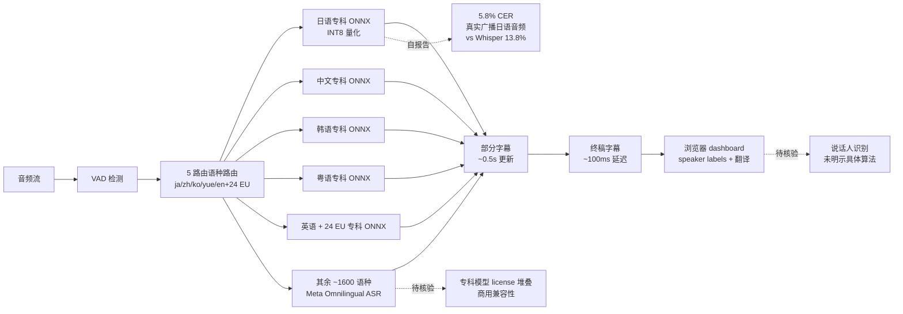

# oboroge0/hayamimi

## 一句话定位
**CPU-only 实时多语种 ASR** ——早耳 (hayamimi) 用 sherpa-onnx + INT8 量化的 ONNX 模型，在 6 核桌面 CPU 上 10-50× realtime，5 路由语言目录（ja/zh/ko/yue/en+24 EU + ~1600 回退 Omnilingual），部分字幕 + ~100ms 终稿延迟，<2GB RAM。

## 它解决的问题
2026 年实时 ASR 仍面临三类痛点：(1) **GPU/云端依赖**——主流实时 ASR（Whisper-large-v3 / Deepgram / AssemblyAI）需要云端 API 或本地 GPU，部署成本高；(2) **单一模型精度天花板**——Whisper-large-v3-turbo 在日语真实广播音频上仅 13.8% CER，难以满足专业场景；(3) **事后转写体验**——传统 ASR 必须等用户说完才输出，无法做"边说边显"的实时字幕。hayamimi 直击这三点：**CPU-only + 5 路由专科模型 + 部分字幕 + ~100ms 终稿延迟**。

## 为什么值得关注（2026-08-28）
- **3 天 282⭐ + 15 forks**：CPU-only ASR 是本地优先运动的代表性应用
- **README 自述 5.8% CER**：在真实广播日语音频上 CER 不到 Whisper-large-v3-turbo（13.8% CER）的一半
- **10-50× realtime on 6-core desktop CPU**：CPU-only 不是低性能，是"用专科模型换取的更优精度+延迟"
- **5 路由语言目录**：ja/zh/ko/yue/en+24 EU 各自路由到 best-in-class 专科模型；其余 ~1600 语言回退到 Meta Omnilingual ASR
- **部分字幕 + ~100ms 终稿延迟**：README 自述"a finalized line typically lands ~100ms after you stop talking"——字幕工具从"事后"变"边说边显"
- **<2GB RAM**：轻量部署
- **MIT 许可**：商用友好（README badge）

## 热度来源判断
热度来自 **"CPU-only ASR 刚需 × 5 路由专科模型 × 部分字幕体验 × <2GB RAM 轻量"** 的组合：(1) 字幕 / 会议记录 / 跨语种同传 / 听障辅助 / 播客制作等场景对实时 ASR 的强需求；(2) 云 ASR 服务的延迟 + 隐私 + 成本三痛点；(3) 部分字幕 + ~100ms 终稿延迟是"边说边显"的真实体验突破。**主要风险：** 5.8% CER 是项目方自报告（仅限日语真实广播音频），**未独立核验**；与云 ASR 的功能差距（说话人识别 / 自定义词汇 / 多语种混合）未在 README 中明示；5 路由专科模型的 license 堆叠（涉及 Whisper / Meta Omnilingual / 各专科模型）。

## 关键技术亮点
1. **5 路由语言目录**：根据语言路由到专科模型，避免 Whisper "一刀切"的精度天花板
2. **sherpa-onnx + INT8 量化**：所有模型以 INT8 ONNX 形式运行，无 PyTorch / CUDA 依赖
3. **部分字幕**：in-progress draft text 每 ~0.5s 更新，用户还在说话时即显示部分结果
4. **~100ms 终稿延迟**：用户停止说话后约 100ms 即出现最终行
5. **CPU-only + <2GB RAM**：可在 6 核桌面 CPU 上 10-50× realtime，无需 GPU
6. **浏览器 dashboard + speaker labels + on-the-fly translation**：完整 Web UI
7. **MIT 许可**：商用友好

## 架构师速览

| 决策问题 | 研究判断 | 证据边界 |
|---|---|---|
| 系统边界 | Python 客户端 + sherpa-onnx 推理引擎 + 5 路由 ONNX 模型集 + 浏览器 dashboard；不含训练 pipeline | 仅基于 README 的"sherpa-onnx + INT8 + 5 routes + browser dashboard"；具体客户端架构（CLI / lib / server）、浏览器 dashboard 栈（WebSocket？WebRTC？）、说话人识别的实现路径未在档案中量化 |
| 主路径 | 音频流 → VAD 检测 → 按语种路由到专科 ONNX 模型 → 部分字幕 (~0.5s 更新) → 终稿字幕 (~100ms 后) → 浏览器 dashboard 实时显示 + speaker labels + 翻译 | 主路径来自 README 的 "5-route language catalog · partial subtitles · fast finals"；具体 VAD 实现、说话人识别算法、翻译模型是否本地还是云端均未在档案中明示 |
| 关键权衡 | 多语种覆盖 vs 单语种精度 vs 推理延迟 vs CPU-only 部署 vs 专科模型 license 堆叠 vs 内存占用 | 档案明示 5.8% CER / 10-50× realtime / <2GB RAM；专科模型 license 兼容性、说话人识别准确度、翻译质量、与 Deepgram / AssemblyAI 的功能覆盖差距均待核验 |
| 最小 PoC | 下载 sherpa-onnx 权重 → 在 6 核桌面 CPU 跑日语真实广播音频 → 验证 5.8% CER / 10× realtime → 对比 Whisper-large-v3-turbo 的 13.8% CER | PoC 范围由"先单语种（ja）、可对照"原则推导；具体语种路由准确性、部分字幕延迟实测、说话人识别效果待核验 |

## 架构启发
hayamimi 的核心启发是 **"本地优先 × ASR 实时推理"是 2026 年的关键技术拐点** ——把"实时 ASR"从云服务专属能力下沉到 6 核桌面 CPU。**这意味着"本地优先"已从 runtime 扩展到 ML 推理层** ——和 8-25 的 nuphus（Rust + Tauri v2 + 本地优先）形成同期合流，本地优先已是 2026 下半年的明显趋势。**更深层的启发是：** "5 路由专科模型" 比"通用大模型"在精度 / 延迟 / 资源占用上都更优——这与"agent 时代的 small specialist models"判断一致（8-26 的 heimdall 用 CPU embedding、8-27 的 cdaf 用 local 模型选项）。**对开发者：** 评估自家产品是否能用"专科模型组合"替代"通用大模型 API"，在精度 / 延迟 / 成本 / 隐私上可能都有收益。

## 架构图（MMD）

> 证据边界：此图只采用本档案已有可核验描述；"待核验"节点不应视为项目实现事实。

## 定位判断
**工具型项目（edge ASR）。** hayamimi 不做云 ASR 服务，不做 ASR 训练框架，只做"CPU-only 实时多语种 ASR 客户端 + 浏览器 dashboard"——这是工具型定位。**核心竞争壁垒：** sherpa-onnx + INT8 + 5 路由专科模型 + <2GB RAM + MIT 许可。**主要风险：** 自报告 5.8% CER 未独立核验；与云 ASR 的功能差距（说话人识别 / 自定义词汇 / 多语种混合）未明示；5 路由专科模型 license 兼容性未明示。若持续维护 + 精度被独立核验，**12 月内有潜力成为"本地优先 ASR"的开源标杆**。

## 风险 / 局限 / 泡沫点
- **自报告 CER 未独立核验**：5.8% CER 仅限日语真实广播音频，**其他语种精度未在 README 中明示**
- **专科模型 license 兼容性**：5 路由专科模型（ja/zh/ko/yue/en+24 EU）涉及 Whisper / Meta Omnilingual / 各专科模型的 license 堆叠，商用前需逐项核验
- **与云 ASR 的功能差距**：说话人识别准确度、自定义词汇、多语种混合、音频质量恢复等功能未在 README 中明示
- **NOASSERTION GitHub license**：与 README badge 的 MIT 不一致，需以 LICENSE 文件实际内容为准
- **CPU 资源门槛**：10-50× realtime 需 6 核桌面 CPU，低端设备可能无法满足
- **部分字幕的体验**：~0.5s 部分字幕更新可能仍有"字幕跳动"问题

## 与同类项目的关系
- **vs Whisper-large-v3（OpenAI）**：通用 ASR，单模型精度天花板 13.8% CER（ja），hayamimi 专科模型 5.8% CER
- **vs Whisper API / Deepgram / AssemblyAI**：云 ASR 服务，hayamimi 是本地替代品
- **vs sherpa-onnx 生态（k2-fsa/sherpa-onnx）**：hayamimi 是 sherpa-onnx 的产品化应用
- **vs Meta Omnilingual ASR**：hayamimi 的"其余 ~1600 语种"回退到 Omnilingual
- **vs 8-25 nuphus（本地优先 runtime）**：同期合流的"本地优先"应用案例

## 是否值得持续跟踪
**值得跟踪（本地优先 ASR 的代表性产品）。** hayamimi 3 天 282⭐ 体现"本地优先 ASR"的市场需求，**5.8% CER / 10-50× realtime / <2GB RAM 三指标组合是显著加分项**。**对独立开发者：** 12 月内可把直播字幕 / 会议记录 / 跨语种同传 / 听障辅助 / 播客制作等场景下沉到本地。**对企业 IT：** 评估"本地 ASR"是否能替代部分 Whisper API / Deepgram 采购，**特别在金融 / 政府 / 医疗等强合规场景**。建议关注：(1) 自报告 CER 是否被独立核验；(2) 5 路由专科模型 license 兼容性；(3) 是否会被云 ASR 服务反向冲击（功能差距能否追上）。

## 后续观察点
- 自报告 5.8% CER 是否被独立核验（其他语种精度）
- 5 路由专科模型 license 兼容性（商用前需逐项核验）
- 与 Deepgram / AssemblyAI 的功能差距（说话人识别 / 自定义词汇 / 多语种混合）
- 部分字幕的体验优化（~0.5s 字幕跳动问题）
- 是否会被云 ASR 服务反向冲击
- 在低端设备（4 核 / 2GB RAM）的可用性

---
> 数据来源: GitHub API (2026-08-28) | Stars: 282 | Forks: 15 | License: MIT (README badge) | 语言: Python | 创建: 2026-08-25 | 数据截至 2026-08-28 06:00 UTC