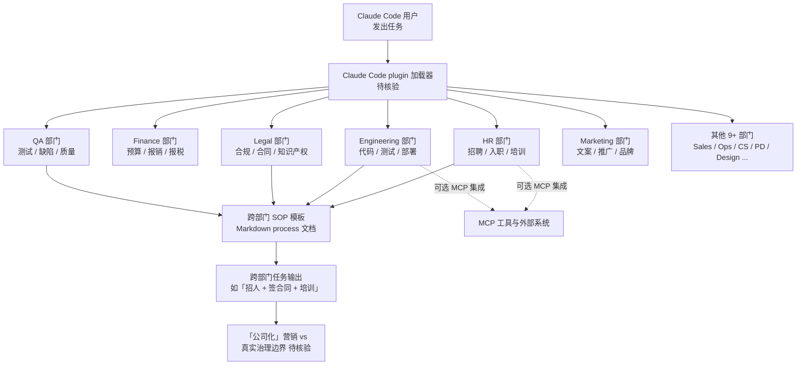

# cbrock84/headcount

## 一句话定位
Claude Code 的「公司化 agent 组织」——按"15+ 部门（HR / Finance / Engineering / Legal / QA / Marketing / Sales ...）"组织 125+ 个独立可装的 skills，让 Claude Code 像"一家公司"一样调用各部门完成复杂任务。

## 它解决的问题
Claude Code 的 skills / sub-agents / plugins 在 2026 下半年爆发（wshobson/agents、refactoring-ui-skill、scroll-craft 等），但开发者面临两个真实痛点：(1) **skills 数量膨胀后难以管理**——100+ skills 装在一个仓库里，按"功能"分类（设计 / 写作 / 测试）效率高但没有"职责边界"；(2) **复杂任务需要多 skills 协作**——单 skill 是"垂直能力"，但"招人 / 写代码 / 签合同 / 报税"这种跨部门任务需要"组织级编排"。headcount 把这两个痛点用"公司化组织"模型包装：每个部门是独立可装的 skill 集合，部门之间有"协作流"（markdown 中的"process / SOP"描述），让 Claude Code 像"调用公司各部门"一样完成复杂任务。

## 为什么值得关注
- **Stars:** 1,105（截至 2026-09-03），6 天即破 1k⭐，**首日即达 1056⭐**——意味着发布即爆
- **Forks:** 171，**15.5% fork/star 显著高于"被围观但不动手"的纯 markdown 类项目（通常 1-3%）**——社区在按"部门"真实安装
- **Watchers/Subscribers:** 待核验
- **Open Issues:** 待核验
- **License:** MIT
- **语言:** Markdown（10.9MB），核心交付物是结构化 Claude Code skills 集合
- **活跃度:** created 2026-08-28，pushed 2026-09-02，6 天内高活跃
- **规模:** 10.9MB，含 15+ 部门 / 125+ skills，每个独立可装
- **Topics:** `agent-marketplace` `claude-code` `claude-code-plugin` `claude-plugin` `claude-skills` `mcp`——精准命中 agent-marketplace 赛道

## 热度来源判断
headcount 的热度是 **"agent skills 数量膨胀后的管理刚需 × 公司化心智模型 × 单人极简工程"** 的组合。Claude Code skills 数量在 2026 下半年从 0 膨胀到 100+（wshobson/agents 38k⭐、Claude Skills 官方库、散落仓库），开发者面临"管理学"问题——按"公司部门"组织是普通开发者最熟悉的心智模型（HR / Finance / Engineering ...）。**首日 1056⭐ 是 GitHub 上罕见的"发布即爆"信号**——意味着发布时已有明确受众（Claude Code 用户）。15.5% fork/star 显著高于纯 markdown 仓库的常规水平，说明社区在按"团队需要"实际安装各部门 skill，是真实的"组织化采用"信号。热度**真实且具范式价值**——但需警惕：「公司化组织」是营销话术还是真实治理（部门职责、协作流、升级路径）需 README 核验。

## 关键技术亮点
1. **公司化心智模型**——按"HR / Finance / Engineering / Legal / QA / Marketing / Sales / Operations / Customer Success / Product / Design / Data / Security / Research / Executive" 等部门组织 skills，开发者可直接复用熟悉的组织结构
2. **独立可装**——每个部门 skill 是独立的 Claude Code plugin，可单独安装而不必全量引入；降低单次安装的认知负担
3. **跨部门 SOP 模板**——markdown 中内置"process / SOP"描述，定义部门间的协作流（"Engineering → QA → Release"）
4. **15+ 部门 / 125+ skills 的规模**——已覆盖企业基础职能，比单 skill 仓库的"垂直能力"更进一步
5. **MIT 许可 + Markdown 驱动**——低门槛贡献，适合 Claude Code 社区快速迭代
6. **MCP 集成**——topics 明示 `mcp`，可与外部工具协议集成

## 架构师速览

| 决策问题 | 研究判断 | 证据边界 |
|---|---|---|
| 系统边界 | Claude Code skills 仓库（Markdown 驱动）+ 部门分类目录树 + 跨部门 SOP 模板 + 可选 MCP 集成 | 四要素是 topics 与 description 明示；具体 15+ 部门的边界、SOP 模板的"可执行性"需 README 核验 |
| 主路径 | Claude Code 启动 → 加载各部门 skills → 根据任务类型调用对应部门 → 跨部门任务按 SOP 串联 → 输出结果 | 主路径为 description 抽象；具体 Claude Code 加载机制（plugin vs subagent vs slash command）需 README 核验 |
| 关键权衡 | 「公司化组织」心智模型易理解 vs 与 Claude Code 自带 sub-agents / Task tool 的功能重叠；「15+ 部门」覆盖广 vs 单部门 skill 深度不足；「独立可装」灵活 vs 跨部门协作流断裂风险 | 10.9MB 来自 API；MIT License 商业可用；具体 skill 质量、跨部门协作可执行性需 README 核验 |
| 最小 PoC | 安装 headcount 全部 skills → 启动 Claude Code → 执行 1 个跨部门任务（如"招人 + 签合同 + 培训"）→ 验证是否按 SOP 自动串联各部门 → 对比无 headcount 时 Claude Code 单独 skill 的完成质量 | 安装命令需 README 独立核验；具体 SOP 可执行性、跨部门调用协议需文档指引 |

## 架构图（MMD）

> 证据边界：此图只采用本档案已有可核验描述；"待核验"节点不应视为项目实现事实。

## 架构启发

`cbrock84/headcount` 的核心启发是 **"agent skills 应该按组织结构组织，正如企业按部门组织员工"**。当前 agent skills 生态（wshobson/agents、Claude Skills 官方库、Skills CLI）大多按"功能"分类（设计 / 写作 / 测试），但开发者面临"100+ skills 难以管理"的真实痛点。headcount 把"公司部门"心智模型引入 skills 组织——HR / Finance / Engineering / Legal / QA 等部门是开发者最熟悉的组织结构，每个部门独立可装降低单次安装的认知负担。更深层的启发是：**"组织级编排"是 agent harness 的下一形态**——单 skill 是"垂直能力"，多 skills 协作是"组织能力"，复杂任务需要"组织级编排"。15.5% fork/star 显著高于纯 markdown 仓库（通常 1-3%）说明社区对"组织化"心智模型的真实需求。但"公司化组织"也是营销话术风险——若部门边界模糊、SOP 不可执行，只是"技能分类的另一种说法"。

## 定位判断
**平台候选 / 范式探索型项目（agent 组织范式）。** headcount 不只是 skill 集合，更试图定义"agent 组织范式"——agent 从"垂直能力"演化为"组织级编排"。如果成功，它会成为 Claude Code 生态的"agent 组织标准模板"；如果失败，它只是"过度设计的 skill 仓库"。首日 1056⭐ + 15.5% fork/star 已显示社区对"组织化"心智模型的真实需求。能否持续，取决于：(a) 部门边界是否清晰（避免"什么都装"的仓库膨胀）；(b) 跨部门 SOP 是否可执行（避免"营销话术"）；(c) 与 Claude Code 自身 sub-agents / Task tool 的差异化。

## 风险/局限/泡沫点
- **与 Claude Code 自带功能重叠**——Claude Code 已有 sub-agents / Task tool / slash command，headcount 是"包装层"还是"新能力"需评估
- **「公司化组织」是营销话术风险**——若部门边界模糊、SOP 不可执行，只是"技能分类的另一种说法"
- **15+ 部门覆盖广但深度可疑**——100+ skills 平均每部门 8 个，每个 skill 的质量与深度需 README 核验
- **首日即爆但后续增速不明**——1056⭐ → 1105⭐（6 天 +49⭐）已显示进入稳态，"二次增长点"待观察
- **个人项目属性**——cbrock84 个人维护，171 forks 但核心治理仍集中，可持续性存疑
- **生态碎片化风险**——若每个 Claude Code 用户各搞一套"公司化部门"，会形成生态碎片化

## 与同类项目的关系
- **vs wshobson/agents（38k⭐）：** wshobson 是"跨平台 Coding Agent 技能市场"，headcount 是"Claude Code 单平台组织化"——headcount 更垂直但覆盖平台窄
- **vs anthropics/skills：** Anthropic 官方 Skills 仓库是"通用技能集"，headcount 是"组织化技能集"——headcount 提供组织心智模型
- **vs ApodexAI/FrontierAgent（1,389⭐）：** FrontierAgent 是"agent framework + native TUI + ReAct / Agent Team 模式"，headcount 是"skills 集合 + 部门分类"——一个偏 runtime、一个偏 skills
- **vs Claude Code sub-agents：** Claude Code 自带 sub-agents 是"通用能力"，headcount 是"组织化模板"——headcount 提供部门边界 + SOP
- **vs awesome-claude-code 列表：** awesome 是资源索引，headcount 是可直接安装的 plugin 集合

## 是否值得持续跟踪
**值得跟踪（agent 组织范式）。** headcount 代表了 agent skills 从"垂直能力"演化为"组织级编排"的范式探索，无论其本身成败，这一方向是行业趋势。建议关注：(a) 部门边界是否清晰；(b) 跨部门 SOP 是否可执行；(c) 与 Claude Code 自身 sub-agents 的差异化。对 Claude Code 用户，这个仓库是快速获得"组织化 skills 集"的实用来源，值得直接试用；对 agent 生态观察者，它是"agent 组织范式"的头部样本。

## 后续观察点
- 部门数量是否继续扩张（15+ → 20+ / 30+）或收敛（聚焦 8-10 个核心部门）
- 跨部门 SOP 模板是否被社区采用（看 forks 中的 SOP 修改）
- 与 Claude Code 自带 sub-agents / Task tool 的关系（互补 vs 替代）
- 是否出现"公司化部门库" SaaS 或 marketplace
- 是否有企业采用此模式作为 agent 技能统一来源

---
> 数据来源: GitHub API (2026-09-03) | Stars: 1,105 | Forks: 171 | License: MIT | 语言: Markdown | 创建: 2026-08-28