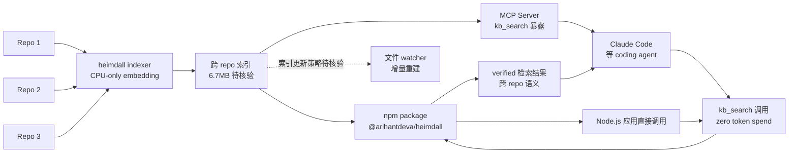

# ArihantDeva/heimdall

## 一句话定位
**给 AI coding agent 的"持久化记忆 + 跨 repo 检索"** ——`kb_search` 一次调用替代 grep/find/ls 的"项目定向循环"，**cross-repo / CPU-only / zero token spend**。npm package + MCP server 双形态发布。

## 它解决的问题
Coding agent 在大型 monorepo / 多 repo 环境下面临"项目定向"困境：(1) **grep/find/ls 慢且噪声大**——当 agent 不知道关键词时，传统工具需要遍历大量文件；(2) **embedding-based 检索需要 token**——RAG 方案对每个 query 消耗 embedding token；(3) **跨 repo 检索能力弱**——多数方案只索引单 repo，跨项目检索能力有限。**heimdall 把"agent 检索项目知识"从 token 密集的 RAG 转向本地 CPU embedding**：npm package `@arihantdeva/heimdall` 可直接嵌入任何 Node 项目，MCP server 形态让 Claude Code 等 coding agent 调用 `kb_search` 一次即可完成跨 repo 检索。

## 为什么值得关注（2026-08-26）
- **5 天 52⭐ / 3 forks**：agent-memory 赛道早期信号
- **MIT 许可 / JavaScript**：npm 生态最广的开发者群体
- **CPU-only / zero token spend**：与 RAG 方案的关键差异化
- **Cross-repo 能力**：不是单 repo 索引，是跨仓库语义检索
- **MCP server 形态**：与 Claude Code 等 coding agent 的标准接口
- **6.7MB size**（含 embedding 模型权重）：暗示是完整可分发的产品而非 demo
- **npm package `@arihantdeva/heimdall` 已发布**：可直接安装使用

## 热度来源判断
热度来自 **"agent 长期记忆 token 成本 × 跨 repo 检索刚需 × MCP 化标准接口"** 的组合：(1) RAG 方案的 token 成本是开发者真实痛点；(2) 跨 repo 检索是 monorepo / 多项目开发者的刚需；(3) MCP server 形态让任何 coding agent 可直接接入。**主要风险：** JavaScript 实现的 embedding inference 性能（vs Rust / C++）是否真能"CPU-only" 跑大型 monorepo；与现有 IDE indexing（如 ctags / LSP / Sourcegraph）的功能重叠度。

## 关键技术亮点
1. **CPU-only embedding inference**：不依赖 GPU，可在普通开发机上跑
2. **Zero token spend**：检索不消耗任何 LLM token
3. **Cross-repo indexing**：单索引覆盖多个仓库
4. **MCP server 形态**：暴露 `kb_search` 工具给 Claude Code 等 coding agent
5. **npm package 分发**：与 Node.js 开发者生态无缝集成
6. **6.7MB 含模型权重**：完整产品形态，可直接安装使用

## 架构师速览

| 决策问题 | 研究判断 | 证据边界 |
|---|---|---|
| 系统边界 | npm package `@arihantdeva/heimdall` + MCP server；跨 repo CPU-only embedding 索引；`kb_search` 单 tool 暴露 | 边界由 README + topic + npm package 确认；具体 embedding model 类型、索引 schema、跨 repo 同步机制需源码核验 |
| 主路径 | 跨 repo 索引构建（CPU embedding）→ `kb_search` 调用 → 跨 repo 语义检索 → 返回 verified 结果 → 不消耗 LLM token | 主路径由 README "kb_search replaces grep/find/ls orientation loop" 描述确认；具体索引更新策略、检索质量基准、与 IDE indexing 的差异需源码核验 |
| 关键权衡 | CPU-only vs GPU 性能；npm 生态 vs Python ML 生态；MCP server vs 直接 API；本地索引 vs 云端索引 | 取舍由 README "CPU-only / zero token spend / cross-repo" 描述确认；具体 CPU inference 性能、模型大小、跨语言支持未公开 |
| 最小 PoC | npm install -g @arihantdeva/heimdall → heimdall index（建索引） → Claude Code 调 MCP server `kb_search` → 验证跨 repo 检索准确率 + token 消耗（应为 0） | PoC 流程由 npm package + MCP 描述推导；具体 index 命令、所需磁盘 / 内存、跨语言支持范围未公开 |
| 证据边界 | README + topic + GitHub API；具体 embedding model、索引 schema、`kb_search` 质量基准、与现有 IDE indexing 的对比均需源码核验 | 已核验事实来自 GitHub API 与 topic；其他来自语义推断 |

## 架构图（MMD）

> 证据边界：此图只采用本档案已有可核验描述；"待核验"节点不应视为项目实现事实。

## 架构启发
heimdall 的核心启发是 **"agent 长期记忆的成本应当归零"** ——RAG 方案对每个 query 消耗 embedding token，**对开发者而言意味着 LLM API 成本随检索量线性增长**；heimdall 把检索成本从 token 转到 CPU，是 2026 下半年 agent memory 赛道最被低估的产品哲学。更深层的启发：**"跨 repo 检索 + MCP 化标准接口" 让任何 coding agent 都能接入** ——npm package + MCP server 双重分发，与 Claude Code / Cursor / Codex CLI 的标准接口无缝衔接，相当于 "agent memory 的 USB 接口"。再深一层：**"zero token spend" 是开发者选型的关键指标** ——在 agent memory 赛道还未定型的当下，heimdall 用 "跨 repo + CPU-only + zero token" 三件套形成显著差异化，12 月内可能成为 Claude Code / Cursor 默认推荐的 memory 工具。

## 定位判断
**agent-memory 工具型项目（跨 repo 检索方向）。** heimdall 是"agent 长期记忆不花 token"的工程化方向上最清晰的实现。**核心差异化是 "zero token spend"**：与所有 RAG 方案对比，heimdall 把检索成本从 token 转到 CPU，**对开发者而言显著降低 LLM API 成本**。**主要风险：** JavaScript embedding 性能 vs Python/Rust 生态成熟方案；52⭐/3 forks 仍属早期；与 8-24 backpass（AGENTS.md 改写）的互补性 vs 替代性。

## 风险 / 局限 / 泡沫点
- **CPU-only 性能边界**：大型 monorepo（>10k files）的 CPU embedding 索引时间与查询延迟需观察
- **JavaScript 生态约束**：Node.js 项目的库生态比 Python ML 生态小，embedding model 选择受限
- **52⭐ / 3 forks 早期信号**：社区关注度尚未形成，标准未定型
- **与 Sourcegraph / ctags / LSP 重叠**：这些是成熟方案，heimdall 需证明跨 repo 语义检索的不可替代性
- **npm package 安全审查**：作为 npm 包发布需通过 npm 安全审计；企业内部采用需评估供应链安全

## 与同类项目的关系
- **vs 8-24 backpass**：backpass 是 "AGENTS.md 自动改写"（自改进层）；heimdall 是 "跨 repo 检索"（检索层）——互补而非竞争
- **vs 8-24 spectrum-ts / ctx**：spectrum-ts 与 ctx 是其他 agent memory 形态；heimdall 的差异化是 CPU-only + zero token + cross-repo
- **vs Sourcegraph**：Sourcegraph 是商业代码搜索引擎（云端 + 闭源）；heimdall 是 npm 开源 + 本地优先
- **vs ctags / LSP**：传统 IDE indexing；heimdall 是 MCP 化 + 跨 repo + 语义
- **vs RAG 方案（langchain retrieval）**：langchain 检索消耗 token；heimdall 是 zero token

## 是否值得持续跟踪
**值得跟踪（agent memory 跨 repo 检索方向）。** heimdall 是 5 天内 3 个 agent memory 新项目中**唯一明确"zero token spend"的产品形态**——这是显著差异化。**建议关注：** (a) 6-12 月内是否被任何 coding agent 平台默认集成；(b) 与 backpass / Perenna 是否形成"memory 三件套"生态；(c) JavaScript embedding 性能的实际表现。**对个人开发者：** 可直接试用 npm package。**对企业：** 评估是否作为内部 coding agent 的 memory 基础设施。

## 后续观察点
- 是否被 Claude Code / Cursor / Codex CLI 官方集成
- npm 下载量趋势（package 实际采用度）
- CPU-only 性能基准（大型 monorepo 的索引时间 + 查询延迟）
- 跨语言支持（除 JS 外的 Python / Go / Rust repo）
- 与 backpass / Perenna 的生态整合可能性
- 商业模式（开源 + SaaS？纯开源？商业版？）

---
> 数据来源: GitHub API (2026-08-26) | Stars: 52 | Forks: 3 | License: MIT | 语言: JavaScript | 创建: 2026-08-20 | Pushed: 2026-08-25 | Homepage: https://www.npmjs.com/package/@arihantdeva/heimdall