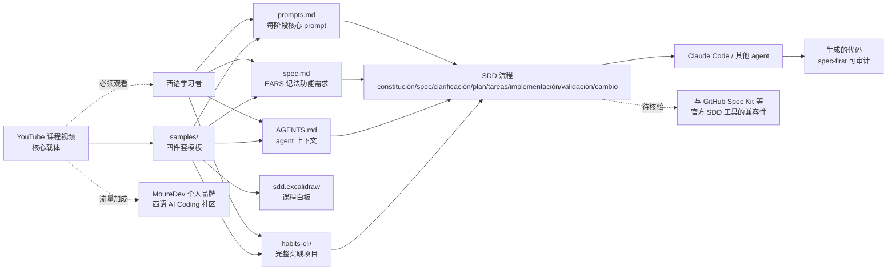

# mouredev/hello-sdd

## 一句话定位
**MoureDev（Brave 西班牙语技术教育者）的《Spec-Driven Development (SDD)》完整课程仓库**——含 AGENTS.md / spec.md (RF en notación EARS) / prompts.md / sdd.excalidraw 模板 + habits-cli 完整实践项目，西语 README。

## 它解决的问题
2026 年下半年 AI Coding 已能生成大量代码，但面临两类方法论痛点：(1) **"vibe coding"的局限性**——通过"凭感觉写 prompt"得到的代码通常不专业 / 不可审计 / 不可复现；(2) **spec-first 流程缺少系统教学**——Anthropic / OpenAI 官方有 prompt 工程指南，但"基于规范开发软件"的完整方法论（如 SDD）系统化教学稀缺。hello-sdd 直击这两点：**完整 SDD 课程（视频 + 模板 + 实践项目）让西语学习者系统掌握 spec-first AI Coding**。

## 为什么值得关注（2026-08-28）
- **1 天 223⭐ + 28 forks**：MoureDev 个人品牌流量 + SDD 方法论市场需求双重作用
- **完整四件套模板**：AGENTS.md（agent 上下文）/ spec.md（EARS 记法的功能需求）/ prompts.md（每阶段核心 prompt）/ sdd.excalidraw（课程白板）
- **完整实践项目**：habits-cli 是一个用 SDD 完整流程构建的命令行项目
- **EARS（Easy Approach to Requirements Syntax）记法**：标准的需求语法 spec.md 模板
- **课程配套视频**：README 明示 "Es indispensable ver el curso para entender el contenido del repositorio"——仓库价值高度依赖视频
- **Apache-2.0 许可**：商用友好

## 热度来源判断
热度来自 **"MoureDev 个人品牌流量 × SDD 方法论市场需求 × 完整课程结构"** 的组合：(1) MoureDev 是 Brave 西班牙语技术教育者，长期 YouTube/博客，西语 AI Coding 社区有显著流量基础；(2) spec-first AI Coding 是 2026 年下半年的方法论热点（Anthropic 的 "spec first" / GitHub Spec Kit 等）；(3) "完整课程 + 模板 + 实践项目" 的三件套结构对学习者极有吸引力。**主要风险：** 西语限制了非西语用户采用；SDD 作为通用方法论的"普适性"（不同行业 / 团队规模 / 项目类型下的有效性）需独立评估；MoureDev 个人品牌流量加成明显，独立评估 SDD 方法论的"独立价值"与"流量加成"需拆开看。

## 关键技术亮点
1. **AGENTS.md 模板**：agent 上下文标准文件（项目描述、命令、风格、规则、强制验证），CLAUDE.md 可 `@AGENTS.md` 简化
2. **spec.md 模板**：context + users + stories + 功能需求（RF-x 编号，EARS 记法）+ 边界 + 范围外 + 完成标准 + 开放问题
3. **prompts.md 模板**：每阶段核心 prompt 表格（constitución / spec / clarificación / plan / tareas / implementación / validación / cambio）
4. **sdd.excalidraw**：课程白板（含流程图、概念图）
5. **habits-cli 实践项目**：完整 SDD 流程的 habits 跟踪 CLI
6. **Apache-2.0 许可**：商用友好

## 架构师速览

| 决策问题 | 研究判断 | 证据边界 |
|---|---|---|
| 系统边界 | 课程仓库（视频链接 + 模板四件套 + 实践项目），不提供 SDD 工具 / 框架 / SDK | 仅基于 README 的"samples/ + habits-cli/" 结构；具体 spec.md 模板的 EARS 完整字段、habits-cli 的代码质量、配套视频的内容深度均待核验 |
| 主路径 | 学习者观看视频 → 理解 SDD 流程 → 复制 templates/ 模板到项目 → 用 prompts.md 引导 agent 按阶段开发 → habits-cli 作为完整示例 | 主路径来自 README 的 "Es indispensable ver el curso para entender..."；具体 SDD 流程的阶段划分（constitución / spec / clarificación / plan / tareas / implementación / validación / cambio）的真实有效性需视频与实践项目验证 |
| 关键权衡 | 方法论完整度 vs 学习门槛 vs 西语限制 vs 个人品牌依赖 vs 通用性 | 档案明示四件套模板 + 实践项目 + EARS 记法；具体 SDD 在不同项目类型（前端/后端/数据/嵌入式）的适用性、与 GitHub Spec Kit 等官方 SDD 工具的兼容性均待核验 |
| 最小 PoC | 观看视频 → 复制 spec.md 模板到一个新项目 → 按 prompts.md 流程跑一遍完整 SDD → 对比"vibe coding"流程的输出质量与审计性 | PoC 范围由"先单项目、可对照"原则推导；具体 SDD 流程的实际收益、agent 配合度、spec 维护成本待核验 |

## 架构启发
hello-sdd 的核心启发是 **"AI Coding 方法论课程化"的代表样本**——延续 8-25..8-27 的"AI Coding 项目复盘"判断，但今日是"系统教学"。**这意味着"AI Coding 工程化"已从"个人技巧"进入"团队普及"阶段**——个人教育者（MoureDev）+ 大厂（GitHub Spec Kit）正在同步推动 spec-first 流程标准化。**更深层的启发是：** MoureDev 的"完整课程 + 模板 + 实践项目"三件套结构可被复制——任何 AI Coding 教育者都可以按此模式建立自己的方法论课程。**对 AI Coding 教育者：** "完整课程 + 模板 + 实践项目 + 视频"是最低门槛的高质量课程结构。**对团队负责人：** 评估是否引入 SDD 等 spec-first 流程培训团队成员。

## 架构图（MMD）

> 证据边界：此图只采用本档案已有可核验描述；"待核验"节点不应视为项目实现事实。

## 定位判断
**观察型项目（AI Coding methodology course）。** hello-sdd 不做 AI Coding 工具，不做 SDD 框架，只做"SDD 方法论课程"——这是观察型定位。**核心竞争壁垒：** MoureDev 个人品牌流量 + 完整四件套模板 + 完整实践项目 + 配套视频。**主要风险：** 西语限制了非西语用户采用；SDD 作为通用方法论的"普适性"需独立评估；MoureDev 个人品牌流量加成明显；课程价值高度依赖视频配合。

## 风险 / 局限 / 泡沫点
- **西语限制**：非西语用户难以直接采用，需等翻译版本
- **方法论普适性**：SDD 在不同项目类型（前端/后端/数据/嵌入式）的有效性需独立评估
- **个人品牌依赖**：MoureDev 个人品牌流量加成明显，独立评估 SDD 方法论的"独立价值"需考虑其社区效应
- **课程价值高度依赖视频**：README 明示"Es indispensable ver el curso"——仓库本身价值有限
- **与官方 SDD 工具的兼容性**：与 GitHub Spec Kit 等官方 SDD 工具的关系未明示
- **维护持续性**：MoureDev 是否会持续更新课程内容待观察

## 与同类项目的关系
- **vs GitHub Spec Kit**：官方 SDD 工具，hello-sdd 是 MoureDev 个人教育版本
- **vs Anthropic 官方 prompt 工程指南**：Anthropic 是通用 prompt 指南，hello-sdd 是 spec-first 完整流程
- **vs 8-25 itshen/source-reading-methodology**：同样是方法论 + AI Coding，itshen 侧重源代码阅读，hello-sdd 侧重 SDD 流程
- **vs 8-27 CHENG-LIANG1/real-company-interview-ai-coding-projects**：同样是 AI Coding 项目沉淀，CHENG-LIANG1 侧重面试题库，hello-sdd 侧重完整流程
- **vs other AI Coding 课程**：MoureDev 是西语 AI Coding 头部教育者，hello-sdd 是其方法论课程的代码化版本

## 是否值得持续跟踪
**值得跟踪（AI Coding 方法论课程化的代表样本）。** hello-sdd 1 天 223⭐ 体现"spec-first AI Coding"的市场需求，**完整四件套模板 + 实践项目 + 配套视频三件套是显著加分项**。**对西语 AI Coding 学习者：** 这是直接可用的 SDD 完整课程。**对非西语学习者：** 可作为"AI Coding 方法论课程结构"的参考样本，等待翻译版本。**对 AI Coding 教育者：** 这是"完整课程 + 模板 + 实践项目 + 视频"四件套结构的范本，可被复制。建议关注：(1) SDD 方法论的"普适性"是否被独立评估；(2) 是否会有英语 / 中文翻译版本；(3) MoureDev 是否会持续更新。

## 后续观察点
- SDD 方法论的"普适性"在不同项目类型的有效性
- 是否会有英语 / 中文翻译版本
- MoureDev 是否会持续更新课程内容
- 与 GitHub Spec Kit 等官方 SDD 工具的兼容性
- 西语 AI Coding 社区的持续增长

---
> 数据来源: GitHub API (2026-08-28) | Stars: 223 | Forks: 28 | License: Apache-2.0 | 语言: Python | 创建: 2026-08-27 | 数据截至 2026-08-28 06:00 UTC