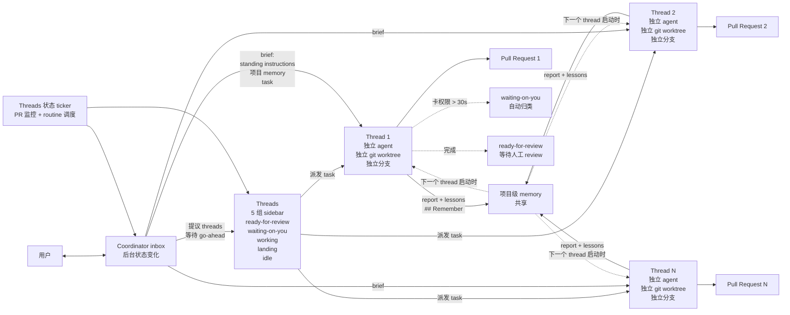

# eliasstravik/herdr-projects

## 一句话定位
Herdr 0.9.1+ 的多 agent 项目编排插件 —— 一个协调器对话（coordinator conversation）持续与用户对话，N 个 worker 线程并行跑在自己 git worktree + 分支，共享同一份指令 + 项目级 memory，侧栏按 5 组聚合（ready-for-review / waiting-on-you / working / landing / idle）。

## 它解决的问题
2026 Q3 Coding Agent 的痛点从「单 agent 监管」（昨日 thruwire/foreman）演进到「多 agent 编排 + 用户注意力管理」：当一个项目需要 5 个 agent 并行跑（重构 A + 写测试 + 修 bug + 升级 dep + 写文档）时，用户必须给每个 agent 单独简报 + 跟 5 个 PR 状态 + 同步 5 个上下文。Herdr Projects 把「协调器对话 + worker 线程 + 项目级 memory + 5 组 sidebar」做成一个 Herdr 插件 —— 协调器永远可对话不亲自干活，所有 worker 共享指令与 memory，sidebar 按用户「需要做什么」聚合线程状态。

## 为什么值得关注（2026-09-19）
- **Stars:** 140（截至 2026-09-19），1 天 140⭐，早期严肃信号
- **Forks:** 4，fork/star 2.9%（与昨日 dsh-computer-use_codex-style 0% / agent-skills 0% / hexis 1.4% 接近）
- **License:** MIT
- **语言:** Rust
- **活跃度:** created 2026-09-18，pushed_at 2026-09-18，持续高活跃
- **规模:** 151 KB（可独立部署的最小多 agent 项目编排内核）
- **Topics:** herdr, herdr-plugin（仅 2 个公开 topic）
- **支持:** macOS + Linux + Herdr 0.9.1+

## 热度来源判断
Herdr Projects 的热度是 **「多 agent 协作刚需 × 用户注意力管理 × Herdr 平台扩展点 × 自托管 + 适配现有 agent CLI」** 的组合。当前 Coding Agent 主流是单 agent 长会话（如 Claude Code / Codex CLI / Cursor），但 2026 Q3 趋势明确指向「多 agent 协作」（昨日 thruwire/foreman Jev supervisor + 今日 herdr-projects 多 worker 线程）。Herdr Projects 的独特切入点是「Herdr 平台之上的插件」—— 不重写 agent 本身而是「Herdr 之上的项目编排层」，适配用户已经在用的 agent CLI。README 9 项对比表强调 8 项 ✅ + 仅「Runs with no machine of yours switched on」❌（vs cloud projects products）—— 把「自托管 + 适配现有 CLI + 不绑 SaaS」打成竞争差异化。140⭐ / 1 天 + 5 组 sidebar 工程化 + lessons memory 流回 + 自托管无 hosted service 反映「严肃多 agent 编排插件」早期信号。热度**真实且具架构层价值** —— 但需警惕：Herdr 平台本身是 1 人项目还是公司维护 + coordinator / worker 协议是否被其他工具采纳 + 项目级 memory 在跨线程复用的实证效果是长期可用性的关键。

## 关键技术亮点
1. **coordinator + worker threads 架构** —— coordinator 永远对话用户，worker threads 跑具体任务，两者通过 brief / report / `## Remember` lessons / sidebar groups 解耦
2. **coordinator 永不亲自干活** —— 只做路由 + 用户沟通，确保用户随时可得到对话回应
3. **每个 task 独立 git worktree + 分支** —— 多 worker 隔离 + 不污染主分支 + PR 自然产生
4. **共享指令 + 项目级 memory** —— 一个 worker 学到的教训（lessons under `## Remember`）流回 memory 下一个 worker 直接用
5. **5 组 sidebar 聚合** —— ready-for-review / waiting-on-you / working / landing / idle 把「用户需要做什么」聚合在一处
6. **waiting-on-you 自动归类** —— 卡权限提示 > 30 秒自动从 working 移到 waiting-on-you，避免用户漏看权限请求
7. **threads 状态 ticker** —— 后台跟 PR + 例行 routine（如 nightly test）每个变化落到 coordinator inbox
8. **支持无仓库场景** —— 无仓库时单文件夹也能跑
9. **自托管 + 无 hosted service** —— 数据不外传 + 无 SaaS 锁定
10. **适配现有 agent CLI** —— Herdr Projects 是「Herdr 之上的插件」不重写 agent 本身
11. **不需预装 Node.js** —— install / wallpaper 脚本直接跑
12. **MIT License** —— 明确许可

## 架构师速览

| 决策问题 | 研究判断 | 证据边界 |
|---|---|---|
| 系统边界 | Herdr 平台之上的多 agent 项目编排插件；协调器对话 + N 个 worker 线程 + 共享指令 + 项目级 memory + 5 组 sidebar；每个 task 独立 git worktree + 分支；自托管 macOS / Linux；无 hosted service；不需预装 Node.js | 来自 README 关于「coordinator conversation / parallel worker threads / shared memory / overview of what needs you」「ready-for-review / waiting-on-you / working / landing / idle」「lessons under `## Remember` flow back into memory」「self-hosted macOS + Linux」「No extra software fee」的明示；具体 coordinator / worker 通信协议、memory 持久化格式、5 组 sidebar 状态机在仓库源码未展开 |
| 主路径 | 用户对 coordinator 提需求 → coordinator 提议线程等待用户 go-ahead → 每个 thread 收到 brief（standing instructions + 项目 memory + task）→ thread 跑独立 agent 在独立 git worktree + 分支 → 完成后通过 brief / report 回 coordinator → coordinator 按 5 组 sidebar 分类 → 卡权限 > 30 秒自动 waiting-on-you → lessons under `## Remember` 流回 memory 给下一个 thread → background ticker 跟 PR + routine | 主路径来自 README 关于「coordinator proposes threads and waits for your go-ahead」「each thread starts from a brief with your standing instructions, the project's memory and its task」「Lessons a thread reports under `## Remember` flow back into memory for the next one」「a thread that waits on a permission prompt for more than 30 seconds moves to Waiting on you」「a background ticker follows pull requests, runs your scheduled routines」的描述；具体 brief schema、memory 存储格式、PR 监控机制、routine 调度在仓库源码未展开 |
| 关键权衡 | 多 worker 并行 vs 单 agent 长会话（并发 vs 上下文深度）/ coordinator 路由 vs 直接指挥 worker（用户注意力 vs 控制粒度）/ 项目级 memory 共享 vs 每个 thread 独立 memory（上下文复用 vs 上下文隔离）/ 自托管 vs cloud projects products（隐私 vs 零运维）/ 适配现有 agent CLI vs 自研 agent（生态广度 vs 协议统一）/ 5 组 sidebar 聚合 vs 全列表（用户注意力 vs 信息完整） | 权衡 6 因素均从 README + 9 项对比表推导；具体 coordinator / worker 通信协议细节、memory 流回的实证效果、Herdr 平台本身活跃度在仓库源码 + Herdr 官方文档未展开 |
| 最小 PoC | macOS / Linux + Herdr 0.9.1+ 已安装 + `git clone https://github.com/eliasstravik/herdr-projects.git` + 启动 Herdr + 安装插件 + 创建项目 + 对 coordinator 说「refactor module X + write tests for Y + fix bug Z」 → 观察 coordinator 提议 3 个 thread → 等待用户 go-ahead → 3 个 worker 各自跑独立 worktree + 分支 → sidebar 聚合 5 组状态 → thread 完成 lessons 流回 memory → 下一个 thread 用 memory | PoC 由「coordinator / worker / sidebar / memory / Herdr 平台」推导；具体 brief schema、memory 存储格式、5 组 sidebar 状态机、Herdr 插件安装流程在 Herdr 官方文档 + 仓库源码待核验 |

## 架构图（MMD）

> 证据边界：此图只采用本档案已有可核验描述；"待核验"节点不应视为项目实现事实。

## 架构启发
Herdr Projects 的核心启发是 **「多 agent 协作的瓶颈不在 agent 能力而在用户注意力」**。当 5 个 agent 并行跑时，用户不可能同时跟 5 个对话 + 跟 5 个 PR 状态。Herdr Projects 用「一个协调器对话 + 5 组 sidebar 聚合 + 项目级 memory 共享」是「用户注意力 + worker 执行 + 跨线程上下文」三层解耦的工程化形式。**协调器永不亲自干活** 是关键架构选择 —— 协调器永远有空对话用户 + 路由任务，避免「协调器也被任务占满」的瓶颈。**项目级 memory 共享** 是「agent 上下文复用」的工程化形式 —— 一个 worker 学到的教训直接流回 memory 给下一个 worker，避免每个 worker 从零开始学。更深层的启发是：**多 agent 协作的「共享状态」应该是项目级 memory 而不是 thread 级 memory** —— thread 死了 memory 还在，跨线程复用天然支持。**对企业**：CISO / 平台工程团队可在自托管 + 适配现有 agent CLI 前提下做多 agent 协作；**对个人开发者**：可在不绑 SaaS 前提下并行跑多个 worker；**对 Herdr 生态**：Projects 插件是 Herdr 平台从「单 agent 对话」升级到「多 agent 项目」的关键扩展。

## 定位判断
**基础设施候选型项目（多 agent 协作编排插件）。** Herdr Projects 不是又一个 multi-agent 框架（那是 LangGraph / AutoGen / CrewAI），而是 **「Herdr 平台之上的项目编排插件」** —— 把「coordinator / worker / memory / sidebar」四件套做成 Herdr 0.9.1+ 的扩展。140⭐ / 4 forks / 5 组 sidebar 工程化 + lessons memory 流回 + 自托管 macOS / Linux 反映「严肃多 agent 编排插件」早期信号。**真正决定长期价值的是「Herdr 平台本身的活跃度 + coordinator / worker 协议是否被其他工具采纳 + 项目级 memory 在跨线程复用的实证效果」** —— Herdr 平台本身活跃度（1 人 vs 公司维护）+ 协议开源化（vs Herdr 专有）+ memory 流回是否真的让下一个 worker 更聪明是关键。**对企业平台工程团队**，Herdr Projects 是「不绑 SaaS + 适配现有 agent CLI + 自托管多 agent 协作」的具体路径；**对学术**，coordinator / worker / memory / sidebar 四件套是「多 agent 协作注意力管理」的具体实证。

## 风险 / 局限 / 泡沫点
- **Herdr 平台单一厂商风险** —— Herdr 平台本身的活跃度 + 维护持续性 + 协议稳定性是 Herdr Projects 长期可用的关键
- **coordinator / worker 协议封闭** —— 协议是否开源化（vs Herdr 专有）+ 是否被其他工具采纳决定生态广度
- **项目级 memory 实证效果待验** —— lessons 流回是否真的让下一个 worker 更聪明 + memory 容量上限 + memory 噪声控制是关键
- **多 worker git worktree 资源消耗** —— 每个 worker 独立 worktree + 独立 agent 进程对机器资源（CPU / 内存 / 磁盘）要求较高
- **5 组 sidebar 信息完整性** —— 聚合 vs 全列表的权衡 + 用户错过重要 thread 的风险
- **waiting-on-you > 30 秒阈值固定** —— 不同项目不同 agent 响应速度不同，固定 30 秒可能误判
- **个人项目属性** —— eliasstravik 个人维护，4 forks 但核心治理仍集中，可持续性存疑
- **Herdr 0.9.1+ 版本要求** —— 早期版本兼容性未明

## 与同类项目的关系
- **vs thruwire/foreman（昨日）：** foreman 是「Jev supervisor + Codex worker」监管层抽象，herdr-projects 是「coordinator + worker threads + 项目级 memory」用户决策侧编排抽象；两者共同点「人不被打断」—— foreman 是 worker 不被 supervisor 打断，herdr-projects 是 worker 不被协调器打断
- **vs LangGraph / AutoGen / CrewAI：** 那些是 multi-agent 框架（编程抽象），herdr-projects 是 Herdr 平台扩展插件（部署抽象）；herdr-projects 不替代 agent 实现
- **vs cloud projects products（如 GitHub Projects + Copilot）：** 那些是 SaaS 云服务，herdr-projects 是自托管；herdr-projects 强调「No extra software fee + Runs on your own machines + Works with the agent CLI you already use」
- **vs 单 agent 长会话（Claude Code / Codex CLI）：** 单 agent 是「一个对话长跑」，herdr-projects 是「一个协调器 + 多个并行 worker」；herdr-projects 适合「一个大任务分多个 worker 并行」场景
- **vs Herdr 平台本身：** Herdr 是「多 pane agent 对话环境」，Herdr Projects 是「Herdr 之上的项目编排插件」

## 是否值得持续跟踪
**值得跟踪（多 agent 协作编排层）。** Herdr Projects 代表了 Coding Agent 从「单 agent 长会话」演进到「多 agent 编排」的诉求，无论其本身成败，这一方向是行业趋势。建议关注：Herdr 平台本身的活跃度（决定 Herdr Projects 可用性）+ coordinator / worker 协议是否开源化（决定生态广度）+ 项目级 memory 在跨线程复用的实证效果（决定核心价值）。**对 Coding Agent 用户**，Herdr Projects 是「不绑 SaaS + 适配现有 agent CLI + 自托管多 agent 协作」的实用工具，值得直接试用（前提是 Herdr 0.9.1+ 已装）。**对 AI Coding 生态观察者**，Herdr Projects 是「多 agent 编排」赛道的早期样本。

## 后续观察点
- Herdr 平台本身的活跃度 + 维护持续性 + 协议稳定性
- coordinator / worker 协议是否开源化（vs Herdr 专有）+ 是否被其他工具采纳
- 项目级 memory 在跨线程复用的实证效果（lessons 流回是否真的让下一个 worker 更聪明）
- 5 组 sidebar 聚合的 user experience 反馈（聚合 vs 全列表的权衡）
- waiting-on-you > 30 秒阈值是否可配置（不同项目不同 agent 响应速度不同）
- 多 worker git worktree 资源消耗优化（CPU / 内存 / 磁盘）
- Herdr Projects 是否演化为独立平台（从 Herdr 插件升级为独立项目编排工具）

---
> 数据来源: GitHub API (2026-09-19) | Stars: 140 | Forks: 4 | License: MIT | 语言: Rust | 创建: 2026-09-18 | 规模: 151 KB
