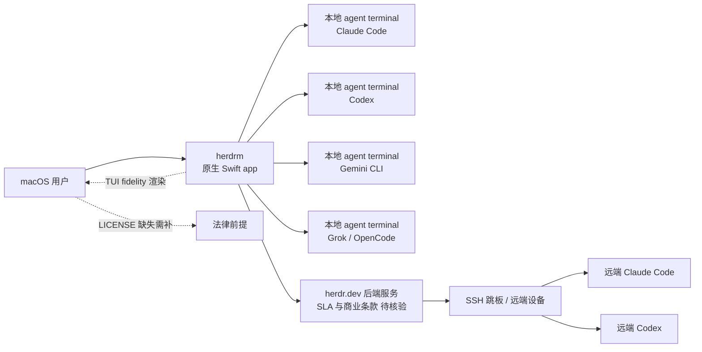

# missuo/herdrm

## 一句话定位
[herdr](https://herdr.dev) 运行时的桌面客户端——一个原生 macOS 应用，把 Claude Code / Codex / Gemini / Grok / OpenCode 等**所有 coding agent 的 terminal 聚合到同一个窗口**，并通过 SSH 跳板让你跳到任何远端机器的 agent。

## 它解决的问题
开发者在 2026 年同时使用多个 coding agent 已经成常态：Claude Code / Codex / Gemini CLI / Grok / OpenCode 各有优势，但**没有一个统一的桌面入口**来观察和管理它们。常见工作流要么开多个 Terminal.app 标签页（噪音大、状态分散），要么装一个 Electron wrapper（启动慢、CPU 高、剪贴板路径长）。herdrm 直击这一痛点：**用原生 macOS app 提供"所有 agent terminal + SSH 跳板"的统一入口**——启动快、占用低、支持跨设备漫游。这与 8-23 cumora/OpenBot 在"agent 作为团队成员"层面是同代产品，但聚焦"开发者桌面"而非"团队通信"。

## 为什么值得关注（2026-08-24）
- **5 天 610⭐**（GitHub API 可核验）：在 Mac developer 工具赛道算高增速
- **真实 macOS app 而非 wrapper**：仓库含 `Packages/`、`AppIcon.icon/`、`Makefile`、`CHANGELOG.md` 12KB、`CLAUDE.md` 3KB——是 SwiftPM 结构的真 app
- **早期阶段（early-stage badge 显式声明）**：明确告知产品尚未成熟，但工程化模板完整
- **多 agent 协同 + SSH 漫游**：把"本机 agent hub + 远端 SSH 跳板"作为一个统一概念

## 热度来源判断
herdrm 的热度来自**真实多 agent 工作流痛点 + macOS 原生体验稀缺**的组合：(1) 开发者同时使用多个 coding agent 已成常态；(2) macOS 原生、启动快、集成系统通知的应用，在 macOS 14+ 时代存在清晰差异化；(3) herdr.dev 的后端服务让桌面与远端机器形成"agent hub + SSH"的网络——这是一个有产品哲学的形态。三点叠加在 5 天内拿到 610⭐。但要注意：**早期阶段 + 无 LICENSE 是两个信号**——前者说明功能集不全，后者说明商业采用需要法律确认。

## 关键技术亮点
1. **SwiftPM 结构的真 macOS app**：`Packages/`、`AppIcon.icon/`、`Makefile`——不是 Electron wrapper，而是系统原生应用
2. **多 agent 跨平台统一**：同一窗口聚合 Claude Code / Codex / Gemini / Grok / OpenCode
3. **SSH 跳板 + 设备切换**：通过 herdr.dev 后端服务跨设备访问远程 agent 终端
4. **TUI fidelity**：以原始终端保真度渲染 agent CLI（TUI capability preservation）
5. **完整工程化模板**：CHANGELOG.md 12KB、CLAUDE.md 3KB、prettier 等
6. **Architecture 一节显式存在**：README 内明列架构说明，便于 review

## 架构师速览

| 决策问题 | 研究判断 | 证据边界 |
|---|---|---|
| 系统边界 | 本地 macOS app（herdrm）+ herdr.dev 后端服务（运行 agent terminal 的远端环境）；本机 app 通过 herdr.dev 与远端 SSH 跳板交互 | 边界由 README "Native macOS console for herdr" + "across your Mac and every SSH box you own" 描述确认；herdr.dev 是公司主页而非自托管描述，具体 SLA / 商业计划未在档案中给出 |
| 主路径 | 用户启动 herdrm → 选择本地或远端 agent → 拉起对应 agent terminal (Claude Code / Codex / Gemini / Grok / OpenCode) → 与 herdr.dev 后端 / SSH 跳板交换会话状态 → agent 反馈通过 TUI fidelity 呈现 | 主路径由 README "see Claude Code, Codex, Gemini, Grok and OpenCode" + "jump into any one of them at full-TUI fidelity" 描述确认；远端协议、加密 / 鉴权策略需源码核验 |
| 关键权衡 | 多 agent 抽象统一 vs 每个 agent CLI 各有独特的 TUI 特性（统一抽象可能损失部分体验）；本机原生 vs 跨平台（macOS-only 限制了 Windows / Linux 用户）；依赖 herdr.dev 后端 vs 完全本地自托管（依赖外部服务带来 SLA 风险） | 取舍由 README "macOS 14+" + 后端依赖描述确认；具体协议、远端鉴权、是否可自托管未在档案中明示 |
| 最小 PoC | 在 macOS 14+ 上安装 herdrm → 启动并连接本地 Claude Code session → 验证 TUI 保真 → 再尝试从 iPad / 其它 Mac 通过 SSH 跳板访问同一 session | PoC 流程由 README "Device switcher" 与架构图描述推导；具体 herdr.dev 注册 / API-key 获取流程未在档案中明示 |
| 证据边界 | 仓库公开 metadata + README + CHANGELOG.md + CLAUDE.md；后端服务 SLA、远端协议、跨设备同步实现均为推断 / 待核验项；**仓库无 LICENSE 文件**——商业使用法律前提需作者补充 | 仅核验已核验事实，其他来自语义推断 |

## 架构图（MMD）

> 证据边界：此图只采用本档案已有可核验描述；"待核验"节点不应视为项目实现事实。

## 架构启发
herdrm 的核心启发是 **"agent runtime 的桌面化是真需求"**。2026 年 agent 不再只是 IDE 内的对话框——它已经是开发者工作流中的"工具 / 同事 / 服务" 复合体，而**桌面应用层一直没有合适形态**。herdrm 用"macOS 原生 app + herdr.dev 后端 + SSH 跳板"三层组合示范了一种**轻量级、高保真、强漫游**的解决方案。这与 8-23 cumora 的"团队聊天内 agent"、OpenBot 的"每 agent 一台独立计算机"形成 **"agent 桌面的三种范式对照"**——三者同时存在表明 agent runtime 形态远未收敛。

## 定位判断
**macOS 桌面 agent hub 候选。** 在 "agent × macOS app" 这条赛道，herdrm 是当前 GitHub 上关注度最高的项目（5 天 610⭐，topics 含 macos、claude-code、codex、gemini、grok）。它与 cumora / OpenBot 同代但定位不同——聚焦"开发者个人桌面"而非"团队 / 企业 agent"。**对企业 IT**：这是一个观察"开发者是否会自发选择 macOS 原生 agent hub"的关键样本；**对个人开发者**：值得尝试，但需确认许可证。

## 风险 / 局限 / 泡沫点
- **无 LICENSE 文件**：仓库目前未包含 LICENSE 文件，这意味着默认版权为作者所有——**任何下游 fork / 二次分发都将无明确法律依据**。企业内部正式采用前必须先向作者求证许可证。
- **依赖 herdr.dev 后端服务**：架构含 herdr.dev 后端，服务 SLA / 计费 / 数据驻留策略未公开——一旦服务变更或商业化，产品可用性直接受影响
- **早期阶段**：早期阶段 badge 显式声明，feature set 与稳定性均未到达生产级
- **macOS 14+ 限制**：不支持 Windows / Linux，与业界大量工程现实不符
- **单点维护**：missuo 个人维护，无显式 governance / 多人 code ownership
- **TUI fidelity 是双刃剑**：保留高保真 TUI 特性是优势，但与"统一抽象"哲学冲突——产品决策上需要权衡

## 与同类项目的关系
- **vs cumora / OpenBot（8-23）**：cumora 是"团队聊天 + BYOA"，OpenBot 是"每 agent 一台独立计算机 + AG-UI 治理"——herdrm 是"开发者个人桌面 hub"。三者对比体现 agent runtime 形态分化
- **vs Terminal.app / iTerm2**：传统终端是 agent 中性工具；herdrm 是"agent aware" 的终端，对多 agent 场景深度优化
- **vs Cursor / Claude Desktop App**：商业产品，与开源 herdrm 的目标用户不同
- **vs OpenCode / Codex CLI**（编码 agent 本身）：herdrm 是这些 agent 的"统一桌面控制台"，不是替代
- **vs penguin-harness / happyclaw（8-24 同期）**：三个项目都尝试做"multi-agent runtime 桌面化"，但生态位不同

## 是否值得持续跟踪
**值得中高频跟踪（macOS agent hub 形态学示范）。** 对 macOS 开发者：试用价值高——若多 agent 工作流已成日常，herdrm 可能显著降低 terminal 噪音；对企业 IT 决策者：观察"开发者自发选择 macOS native agent console"的曲线，是判断 agent 桌面形态如何被市场采纳的关键样本；对产品经理：**herdrm + cumora + OpenBot 是 agent runtime "三种桌面范式"的同期对照**，值得作为行业分析案例。

## 后续观察点
- 是否补全 LICENSE 文件（**关键**）
- herdr.dev 后端服务的 SLA / 计费 / 数据驻留策略公开化
- 是否扩展到 Windows / Linux
- 是否出现"system-level agent hub"（系统级而非应用级）的真实需求信号
- 与 penguin-harness / happyclaw 的生态位冲突或融合

---
> 数据来源: GitHub API (2026-08-24) | Stars: 610 | Forks: 37 | License: 未声明 / 仓库无 LICENSE 文件 | 语言: Swift | 创建: 2026-08-19
