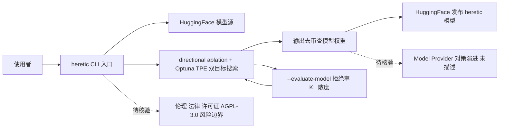

# Heretic — 全自动语言模型审查移除

## 一句话定位

全自动移除语言模型安全审查（safety alignment）的工具，结合方向消融（directional ablation / abliteration）和 Optuna 驱动的 TPE 参数优化器，无需人工理解 transformer 内部即可使用。

## 它解决的问题

部分用户希望移除 LLM 的安全对齐限制，获得无审查的模型输出。传统 abliteration 需要专家手动调参，Heretic 通过自动优化参数（同时最小化拒绝率和 KL 散度）实现全自动化。社区已用 Heretic 在 HuggingFace 上发布了 4000+ 去审查模型。

## 为什么值得关注

- **27,176 stars / 2,940 forks**，AGPL-3.0 许可证，社区已生成 4000+ 模型（HuggingFace `other=heretic`）
- 技术上展示了 LLM 对齐的脆弱性 — 无需后训练即可移除安全限制
- Trendshift #1 Repository of the Day，有 Discord、Matrix、Codeberg 镜像
- 发布为 pip 包 `heretic-llm`，使用门槛低：`pip install -U heretic-llm && heretic Qwen/Qwen3-4B-Instruct-2507`

## 热度来源判断

- **27K stars 来自争议性话题 + 真实需求双重驱动。** 对 AI 审查不满的用户群体是核心受众
- LocalLLaMA 社区广泛讨论和评测，用户反馈正面
- 4000+ HuggingFace 模型说明实际使用量可观，不纯是看热闹

## 关键技术亮点亮点

1. **方向消融（abliteration）+ TPE 自动优化**：Optuna 驱动，自动搜索最优消融参数
2. **双目标优化**：同时最小化拒绝率（refusals）和 KL 散度（保持原模型能力）
3. **广泛模型支持**：dense 模型、多模态模型、多种 MoE 架构、Qwen3.5 等混合架构
4. **内置评估功能**：`heretic --evaluate-model` 可复现拒绝率和 KL 散度指标
5. 完全无监督运行，生成质量可媲美人工专家调参的 abliteration

## 架构师速览

| 决策问题 | 研究判断 | 证据边界 |
|---|---|---|
| 系统边界 | Heretic 本身是离线模型权重改造工具（directional ablation + Optuna TPE），依赖 HuggingFace 作为模型源和发布渠道，无服务侧运行时 | 档案未描述其作为在线服务的部署形态、未描述 API/SDK 接口边界 |
| 主路径 | 输入 HF 模型 → 内置 abliteration 流程 + Optuna 双目标搜索 → 输出去审查权重，可选 `--evaluate-model` 复测 refusals/KL | 路径止于权重输出，未描述配套推理栈或应用层守卫 |
| 关键权衡 | 拒绝率（refusals）与 KL 散度（保真度）的双目标 Pareto，由 Optuna 自动权衡，无人工干预 | 档案未披露具体搜索空间、损失函数细节、采样策略实现 |
| 最小 PoC | `pip install -U heretic-llm` 后对单一开源指令模型（如 Qwen3-4B-Instruct）执行一次完整消融并跑 `--evaluate-model` 校验两指标 | 档案未提供硬件需求、显存下限、端到端耗时与失败回退路径 |

## 架构启发

从安全研究角度，Heretic 证明了当前 LLM 对齐技术的脆弱性 — 方向消融可以无损移除安全限制。对 Agent 安全设计有警示意义：prompt-based safety 不够，对齐需要在更深层面（如 constitutional AI）实现。这也说明 model-layer safety 可被工程化移除，应用层确定性拦截（如 AGT）更可靠。

## 架构图（MMD）

> 证据边界：此图只采用本档案已有可核验描述；“待核验”节点不应视为项目实现事实。

## 定位判断

**学习型。** 主要价值是技术演示和安全研究。社区使用量大但非生产基础设施。

## 风险 / 局限 / 泡沫点

1. **伦理和法律风险极高** — 可能被用于生成有害内容
2. **各大 Model Provider 会持续修补** — abliteration 技术可能在未来模型中失效
3. **AGPL-3.0 许可证**限制了商业集成
4. **不适合企业环境** — 去除安全对齐与负责任 AI 政策冲突
5. 27K stars 中有争议性话题驱动的泡沫成分，但 4000+ 模型说明实际使用量大

## 与同类项目的关系

- **mlabonne / huihui-ai 的手动 abliteration 模型**：Heretic 是这些手动方法的自动化版
- **OBLITERATUS**（本仓库收录）：同为 abliteration 工具，定位类似
- **各 Model Provider 的 safety alignment**：Heretic 的"对手"

## 是否值得持续跟踪

**不建议持续跟踪。** 但作为安全态势感知可以偶尔关注 — abliteration 技术的演进反映了对齐技术的脆弱程度。

## 后续观察点

1. Model Provider 对 abliteration 的对策演进
2. 法律监管对去审查工具的态度
3. abliteration 在未来模型架构（如纯 SSM）上的适用性
4. HuggingFace 上 heretic 模型数量的增长趋势
