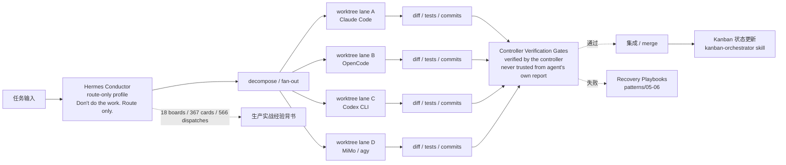

# forcewake/hermes-conductor

## 一句话定位
**"One Hermes conductor. Many coding CLIs. Zero trust in self-reports."**——在 Hermes Agent 之上做"只路由"profile 的 controller，把 Claude Code / OpenCode / Codex CLI / MiMo / agy 等外部 coding agent 作为被编排的 worker，每个 worker 跑在自己的 worktree lane 内；**所有 dispatch 产生的 diff / tests / commits 由 controller 验证，而非 agent 自报告**——把 18 个生产 boards、367 张 cards、566 次 agent dispatches 的实战经验提炼为可复用的 orchestration 模式。

## 它解决的问题
2026 年多 agent 协作普遍有 3 个痛点：(1) **agent 自报告不可信**——agent 说"已完成"≠任务真的完成，需要外部 verifier；(2) **worktree 隔离缺失**——多个 agent 同时改一个 repo 容易互相覆盖，需要 worktree lanes；(3) **production pattern 稀缺**——大部分 agent orchestration 教程停留在 demo 级别，缺乏经过生产验证的模式。hermes-conductor 把 Hermes Agent 自身定位为"只路由、不做活"的 controller，让外部 coding agent 在 worktree lane 内执行，**所有 dispatch 产物（diff / tests / commits）由 controller 验证后再合并**——README 原话："diff/tests/commits — verified by the controller, never trusted from the agent's own report"。

## 为什么值得关注（2026-08-25）
- **2 天 55⭐**（GitHub API 可核验）：agent-orchestration 赛道短期增速突出
- **仓库结构完整**：README（11.8KB）+ LICENSE + assets（demo video / SVG / asciicast）+ examples + patterns（7 种 production-tested pattern）+ skills（kanban-orchestrator / kanban-worker）——不是 demo 级文档
- **7 种 production-tested pattern**：`patterns/01-controller-managed-external-worktree-lanes.md` 至 `patterns/07-prototype-furnace-daily-digest.md`，覆盖 controller-managed-external-worktree-lanes / workspace-isolation / single-repo-mcp-swarm / sequential-epic-finalization / sequential-recovery / production-swarm-recovery / prototype-furnace-daily-digest
- **实战经验背书**：README 自述"Distilled from 18 production boards, 367 cards, 566 agent dispatches — and every incident that tried to ruin them"
- **topics 覆盖全生态**：agent-orchestration / claude-code / codex-cli / hermes-agent / kanban / multi-agent / nousresearch / opencode / worktrees——明确与 Hermes Agent 同生态
- **Zero trust in self-reports**：把"agent 自报告不可信"作为默认假设，与 8-24 的"可审计现场"趋势一致
- **demo 资源丰富**：assets 含 `cc-lane-demo.mp4` / `conductor-demo-narrated.svg` / `demo-claude-code.cast` / `demo.cast` 等多模态演示

## 热度来源判断
hermes-conductor 的热度来自 **"agent-as-coworker 落地难 × production pattern 稀缺 × Hermes 生态官方化"** 的组合：(1) 8-22 / 8-23 / 8-24 趋势显示 agent-as-coworker 已被广泛讨论，但"如何真在生产环境跑起来"仍是空白；(2) 大部分开源 orchestration 教程停留在 demo 级，缺乏 production-tested pattern；(3) Hermes Agent 生态正在快速扩张（hermes-agent 自身已达 235k+ stars），hermes-conductor 自定位为"配合官方生态的最佳实践"。**主要风险：** Star 较低（55⭐）表明社区关注度尚未形成；仓库以 docs 为主（缺可直接 install 的 CLI / library）；patterns 需结合 Hermes Agent 本身使用——独立价值待评估。

## 关键技术亮点
1. **"Zero trust in self-reports" 作为核心设计原则**：agent dispatch 产物（diff / tests / commits）由 controller 验证而非 agent 自报告
2. **Worktree lanes 隔离**：每个 worker agent 跑在自己的 worktree 内，避免互相覆盖
3. **7 种 production-tested pattern**：从 worktree lanes 到 recovery playbooks，覆盖多 agent 协作的常见场景
4. **Hermes Agent 自身作为 controller**：自定位"route-only profile"——"Don't do the work. Route only."——明确分工
5. **支持多 harness**：Claude Code / OpenCode / Codex CLI / MiMo / agy 等外部 coding agent 作为 worker
6. **Kanban 工作流**：配套 skills 含 `kanban-orchestrator` / `kanban-worker`，与 kanban 生态对齐
7. **完整 demo 资源**：asciicast / SVG / MP4 三种格式演示，便于不同场景使用
8. **README 11.8KB + 实战数据**：18 boards / 367 cards / 566 dispatches——明确标注生产经验背书

## 架构师速览

| 决策问题 | 研究判断 | 证据边界 |
|---|---|---|
| 系统边界 | Hermes Agent 作为 controller（route-only profile）；外部 coding agent（Claude Code / OpenCode / Codex CLI / MiMo / agy）作为 worker；每个 worker 跑在自己的 worktree lane 内 | 边界由 README "route-only profile" + "worktree lane A/B/C/D" 描述确认；controller 实现是否在独立仓库 / 是否要求 Hermes Agent 特定版本 / worker 与 controller 通信协议均需源码核验 |
| 主路径 | controller 接收任务 → 分解 + fan-out → dispatch 到各 worktree lane 的 worker → worker 执行 → diff/tests/commits 回到 controller → controller 验证 → 集成 / 失败 → recovery playbook | 主路径由 README "decompose / fan-out / verify / integrate" 描述确认；具体 controller 实现（如有）、verification gates 的具体规则、recovery 触发条件需源码核验 |
| 关键权衡 | controller 自治 vs 外部 verifier（README 强调"verified by the controller, never trusted from the agent's own report"——controller 自己 verify，是否足够独立？）；worktree 隔离 vs 性能开销（每个 worker 独立 worktree 成本）；production pattern 通用性 vs 特定场景适配 | 取舍由 README "verified by the controller" 描述确认；具体 verification 规则、worktree 管理机制均需源码核验 |
| 最小 PoC | 在本地 fork 一个测试 repo → 启动 Hermes Agent 作为 controller → install hermes-conductor 的 kanban-orchestrator skill → 派发一个"修改 README"任务给 Claude Code worker → 观察 worktree 创建 → 修改 → diff → controller 验证 → merge 流程 | PoC 流程由 README + 7 patterns 描述推导；具体 install 步骤 / controller 启动命令 / verification 输出格式需 README 进一步核验 |
| 证据边界 | README + 7 patterns + assets demos；具体 controller 实现（如有）、Hermes Agent 版本依赖、recovery playbook SLA 均未在档案中明示 | 已核验事实来自 README 与 API；其他来自语义推断 |

## 架构图（MMD）

> 证据边界：此图只采用本档案已有可核验描述；"待核验"节点不应视为项目实现事实。

## 架构启发
hermes-conductor 的核心启发是 **"agent-as-coworker 的可信度必须靠外部验证而非 agent 自报告"**——这是 8-24 "可审计现场" / 8-23 "agent governance"趋势的工程化版本。把 "Zero trust in self-reports" 作为默认假设，意味着 agent 完成任务的判定标准从"agent 说完成"转向"controller 验证通过"。更深层的启发：**"controller 自身 verify"是否足够独立**——理想的多 agent 治理需要第三方 verifier（如 hermes-conductor 自身也需要被另一个 verifier 验证），这是"agent 治理的无限递归"问题。再深一层：**Hermes Agent 生态正在形成**——hermes-conductor + Hermes Agent + 各 worker harness 共同构成"Hermes 生态"，类似 Linux 内核 + 各类发行版的关系。

## 定位判断
**工具型（agent orchestration 模式库）。** hermes-conductor 在"多 agent 协作"赛道提供 production-tested pattern，2 天 55⭐ + 4 forks 显示早期关注度。**主要竞争威胁：** Triad（Wu030616/Triad）从结构化分工角度切入多 agent 治理；OpenBot / cumora / herdrm 等提供不同层次的 runtime 形态——hermes-conductor 的差异化是"production-tested 模式 + Hermes 生态绑定"。**值得 6-12 月观察**，特别是关注 Hermes Agent 生态扩张速度与 patterns 实际采纳率。

## 风险 / 局限 /泡沫点
- **仓库以 docs 为主**：缺可直接 install 的 CLI / library，patterns 需要用户自己实现——独立价值依赖 Hermes Agent 生态
- **controller verify 是否足够独立**：README 强调"verified by the controller"——但 controller 自身没有第三方 verifier，存在"controller 被攻破 = 整个系统被攻破"的单点风险
- **18 boards / 367 cards / 566 dispatches 数据未公开核验渠道**：README 自述实战数据，但具体的"production 案例"未在 README 内嵌链接——属于自报数据
- **Hermes Agent 版本依赖**：是否要求特定版本？升级兼容性？README 未明示
- **patterns 通用性 vs 特定场景**：7 种 pattern 覆盖常见场景，但跨场景适配仍需用户自行调整
- **Star 较低（55⭐）**：社区关注度尚未形成，是否被广泛采纳待观察

## 与同类项目的关系
- **vs Wu030616/Triad（PBA 方法论）**：Triad 从结构化分工（Planner-Builder-Auditor 席位分离）切入，hermes-conductor 从工程化（worktree lanes + verification gates）切入——两个不同方向
- **vs OpenBot / cumora / herdrm**：这些提供不同形态的 runtime（独立计算机 / 聊天层 / 桌面客户端），hermes-conductor 是 orchestration 模式层
- **vs backpass**：backpass 切的是 AGENTS.md 自动改写（memory 元层），hermes-conductor 切的是 worker agent 编排（runtime 元层）
- **vs Anthropic Skills / wshobson/agents**：这些是 skill 分发中心，hermes-conductor 是 orchestration 模式库——互补
- **vs MCP 生态**：MCP 是 agent 与 tool 的协议，hermes-conductor 是 agent 与 agent 的 orchestration 模式——互补

## 是否值得持续跟踪
**值得高频跟踪（多 agent orchestration 模式库）。** 对所有用 Claude Code / Codex / OpenCode 的团队：**建议花 1-2 小时读 7 种 pattern，识别与自身工作流的契合点**；对做 agent 平台的产品经理：**这是判断"Hermes 生态"是否会成为 agent orchestration 事实标准的早期信号**；对关注 agent 治理的团队：**与 Triad 对照阅读，理解"工程化"与"结构化"两种路径**。

## 后续观察点
- controller 实现是否独立仓库发布（目前 patterns 是文档，需用户自己实现 controller）
- Hermes Agent 版本依赖与升级兼容性
- "verified by the controller" 的具体规则与第三方 verifier 引入可能性
- 18 boards / 367 cards / 566 dispatches 的生产案例公开化
- 与 Triad / 其他多 agent 治理项目的协同 / 竞争
- Hermes 生态扩张速度（hermes-agent 自身 stars 增长、第三方 controller 出现）

---
> 数据来源: GitHub API (2026-08-25) | Stars: 55 | Forks: 4 | 语言: Markdown/Docs | 创建: 2026-08-23
