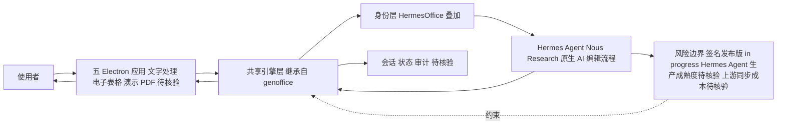

# criptogus/HermesOffice — genoffice fork + Hermes Agent 集成

## 一句话定位
genspark-ai/genoffice 的薄 fork（Apache-2.0），引擎和应用代码跟随上游，叠加 Hermes Agent（Nous Research）作为原生 AI 的 AI-native 办公套件（macOS + Windows）。

## 它解决的问题
目标用户是想用 genoffice 但希望 AI 后端可替换的用户。痛点：genoffice 的 AI 功能强绑定 Genspark 服务（无账号则 AI 不可用）。HermesOffice 通过薄 fork 保留 genoffice 引擎层，叠加 Hermes Agent（Nous Research）作为原生 AI，提供不依赖 Genspark 的 AI-native 办公体验。

## 为什么值得关注（2026-08-06）

这验证了 genoffice 的**架构可 fork 性**——genoffice 的"五个 Electron 应用共享一个引擎层"设计允许第三方替换 AI 后端。HermesOffice 是 genoffice fork 生态的**首个有意义的变体**（327⭐ / 41 fork）。关键信号：(a) genoffice 的架构不是封闭的，允许社区扩展；(b) Hermes Agent（Nous Research）作为 AI 后端有社区需求（327⭐ 说明有人想要非 Genspark 的 AI 后端）。这与 08-05 观察到的 genoffice"强绑定 Genspark 服务"风险形成对冲——fork 生态正在降低这个绑定。

## 热度来源判断
- **真实需求信号**：41 fork 说明有用户在尝试部署/定制。"不依赖 Genspark 的 AI-native 办公"是明确差异化。
- **话题性成分**：Hermes Agent（Nous Research）有一定话题性（本运行环境即 Hermes）。genoffice 热度（1,755⭐）也可能溢出到 fork。

## 关键技术亮点亮点

1. **薄 fork 架构**：引擎和应用代码跟随 genoffice 上游（thin fork），只叠加身份层和 Hermes Agent 集成。这意味着可以持续同步上游改进，维护成本低。
2. **Hermes Agent 原生 AI**：把 Hermes Agent（Nous Research）作为原生 AI 编辑流程（first-class flow），而非附加 chat。与 genoffice 的 Genspark AI 对位。
3. **五应用共享引擎层**：文字处理、电子表格、演示、PDF——五个 Electron 应用共享一个引擎层（继承自 genoffice 架构）。
4. **Signed releases in progress**：README 提到签名发布版正在进行中（目前用 genoffice upstream releases 或本地构建）。

## 架构师速览

| 决策问题 | 研究判断 | 证据边界 |
|---|---|---|
| 系统边界 | HermesOffice 是 genspark-ai/genoffice 的薄 fork（Apache-2.0），引擎层与应用代码跟随上游，自身仅叠加身份层并以 Nous Research 的 Hermes Agent 替换 Genspark AI 后端，运行于 Electron（macOS + Windows）。 | 基于仓库元数据与档案"薄 fork 架构"描述；身份层的具体实现细节、Hermes Agent 集成接口未在档案中给出。 |
| 主路径 | 用户 → Electron 五应用（文字处理/电子表格/演示/PDF 等）→ 共享引擎层（继承自 genoffice）→ Hermes Agent（Nous Research）作为原生 AI 编辑流程 → 回写状态。 | 档案明确"五应用共享引擎层"与"Hermes Agent 作为原生 AI 编辑流程"；具体协议、数据流与持久化形态待核验。 |
| 关键权衡 | 薄 fork 带来低维护成本与上游同步速度优势，但代价是产品力受限于 genoffice 上游、签名发布版尚未完成导致部署体验不完整、且 Hermes Agent 作为 AI 后端的生产成熟度未被独立验证。 | 证据来自档案"风险/局限"小节与"Signed releases in progress"表述；同步成本与 breaking change 影响缺乏量化数据。 |
| 最小 PoC | 在 macOS 或 Windows 上以本地构建或 upstream releases 形式运行单一 Electron 应用（建议先选文字处理或 PDF），通过 Hermes Agent 完成一次 AI 编辑流程以验证 AI 后端可替换性与引擎层可用性，再扩展接入面。 | 档案支持"本地构建或 upstream releases"与五应用形态；具体安装步骤、性能基准、安全/审计配置需以源码核验。 |

## 架构启发
HermesOffice 验证了一个重要架构判断：**当 AI-native 应用的 AI 后端是可替换的接口（而非硬编码）时，fork 生态会自然形成**。genoffice 的引擎层/AI 层分离设计使得 HermesOffice 可以只替换 AI 层（Genspark → Hermes）而保留引擎层。对架构师的启发：AI-native 应用应把 AI 后端设计为可替换接口，而非硬绑定单一服务商——这既降低供应商锁定风险，又允许社区扩展。

## 架构图（MMD）

> 证据边界：此图只采用本档案已有可核验描述；“待核验”节点不应视为项目实现事实。

## 定位判断
属于 **L5 应用层**，是 genoffice fork 生态的变体。本身不是独立项目（引擎跟随上游），价值在于验证 genoffice 架构的可 fork 性和 Hermes Agent 的社区需求。

## 风险 / 局限 / 泡沫点

1. **薄 fork 非独立项目**：引擎和应用代码跟随 genoffice 上游，自身只加身份层 + Hermes 集成。产品力取决于 genoffice 上游，独立价值有限。
2. **Signed releases 未完成**：README 提到签名发布版 in progress，目前需用 upstream releases 或本地构建——部署体验不完整。
3. **Hermes Agent 成熟度**：Hermes Agent（Nous Research）作为 AI 后端的生产成熟度未独立验证。
4. **维护可持续性**：薄 fork 需持续同步上游，如果 genoffice 上游有 breaking change，HermesOffice 的同步成本取决于 fork 深度。

## 与同类项目的关系
- **vs genoffice（1,755⭐）**：HermesOffice 是 genoffice 的薄 fork，AI 后端从 Genspark 换成 Hermes Agent。引擎层相同，AI 层不同。
- **vs Microsoft Office/Google Docs**：HermesOffice 是 AI-native（AI 编辑为一等公民），传统办公套件是 AI 附加。

## 是否值得持续跟踪
**是，作为"genoffice fork 生态"的首个变体跟踪。** 重点观察 fork 生态是否扩展（更多 AI 后端变体出现），以及 Hermes Agent 作为办公 AI 后端的实际效果。

## 后续观察点
1. **fork 生态扩展**：genoffice 是否出现更多 AI 后端变体（如 Claude/OpenAI/Gemini 后端的 fork）。
2. **Signed releases 完成度**：签名发布版是否完成，部署体验是否改善。
3. **上游同步**：genoffice 上游 breaking change 时 HermesOffice 的同步速度。

---
*首次记录：2026-08-06* · *数据来源: GitHub API + 仓库 README*

## 最近动态（2026-08-07）

- **第二日 +61（+18%），fork 41→47（+6）**：327 → 388。增速维持，说明 genoffice fork 生态有持续关注度。
- **验证 genoffice 架构可 fork 性**：HermesOffice 作为 genoffice 首个有意义的 fork 变体，其存在本身验证了 genoffice 引擎层/AI 层分离设计允许第三方替换 AI 后端。这是 genoffice 降低供应商锁定风险的关键证据。
- **判断**：score 维持 80。薄 fork（引擎跟随上游），价值在于验证架构而非独立产品力。pushed_at 08-06（活跃维护）。open_issues 22。
