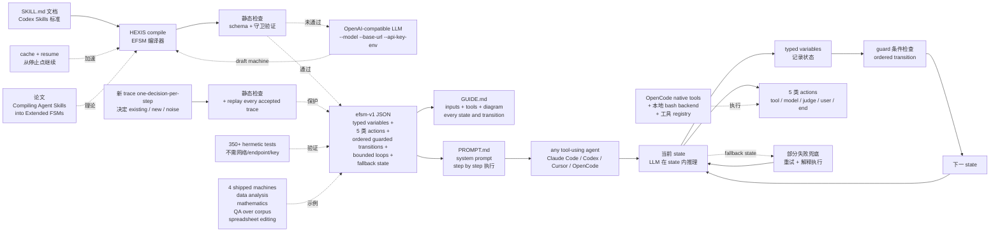

# Worldbuilder013/HEXIS

## 一句话定位
SKILL.md → 扩展有限状态机（EFSM）编译器 —— 论文「Compiling Agent Skills into Extended Finite State Machines」配套代码，把 Codex Skills 生态中「SKILL.md 直接塞进 LLM context 让模型选下一步」的脆弱性（顺序可跳过 / 可重排 / 可错误应用）通过 FSM 编译解决：typed variables + ordered guarded transitions + bounded loops + fallback state 强制顺序，LLM 在 state 内推理。

## 它解决的问题
2026 Q3 Codex Skills 生态的痛点是 **「SKILL.md 直接塞进 LLM context 让模型选下一步」** —— LLM 可能跳过 / 重排 / 错误应用 SKILL.md 中明确写出的要求（顺序不可靠）；尤其在企业 SOP / 合规场景（医疗 / 金融 / 法律）SKILL.md 步骤必须严格执行，但 LLM 串行推理在长 context + 多步骤时容易跳步。**HEXIS 把 SKILL.md 编译成扩展有限状态机（EFSM）** —— typed variables 记录状态 + ordered guarded transitions 强制顺序 + bounded loops 防死循环 + fallback state 兜底；**LLM 在 state 内推理 + 顺序由 program 强制** 是「LLM 负责推理 + 程序负责顺序」的工程化形式 —— 把 Codex Skills 从「文档规范」升级到「可编译工件」。

## 为什么值得关注（2026-09-18）
- **Stars:** 69（截至 2026-09-18），1 天 69⭐，学术 + 早期信号
- **Forks:** 1，fork/star 1.4%，偏低（学术圈关注但企业 fork 尚未出现）
- **Watchers/Subscribers:** 0
- **Open Issues:** 0
- **License:** MIT
- **语言:** Python（3.11 / 3.12）
- **活跃度:** created 2026-09-17，pushed_at 2026-09-17
- **规模:** 6.1 MB（含 4 shipped machines + docs/figures/）
- **Topics:** 暂无（公开元数据）
- **Status:** alpha（README 徽章明示 alpha 状态）

## 热度来源判断
HEXIS 的热度是 **「SKILL.md 编译成 FSM 学术严肃化 × 论文配套 × EFSM schema 标准化 × 4 shipped machines × 350+ hermetic tests × OpenAI-compatible」** 的组合。SKILL.md 在 Codex Skills 生态中是「事实标准」但执行脆弱性长期被诟病 —— HEXIS 用经典 FSM 理论 + 现代 LLM 推理给出一个严肃学术 + 工程可复现的解决方案。**4 个 shipped machines（data analysis / mathematics / QA over corpus / spreadsheet editing）** 证明「不只是 PoC」；**350+ hermetic tests 不需网络 / endpoint / API key** 是「CI 完全可跑」的形式化验证；**OpenAI-compatible `--model --base-url --api-key-env`** 不锁定 Jev / OpenAI / Anthropic；**alpha status** 警告项目仍在早期但已有完整架构。

## 关键技术亮点
1. **efsm-v1 JSON schema** — typed variables + 5 类 actions（tool / model / judge / user / end）+ ordered guarded transitions + bounded loops + fallback state
2. **LLM 在 state 内推理 · 顺序由 program 强制** — 「LLM 负责推理 + 程序负责顺序」是「用 FSM 解决 SKILL.md 顺序不可靠」的工程化形式
3. **5 类 actions** — tool（调用外部工具）/ model（调 LLM）/ judge（调 LLM 做判断）/ user（询问用户）/ end（终止）
4. **ordered guarded transitions** — 按顺序 + 满足守卫条件才转移
5. **bounded loops + fallback state** — 防死循环 + 部分失败兜底
6. **4 个 shipped machines** — data analysis / mathematics / QA over corpus / spreadsheet editing（每个含 GUIDE.md + PROMPT.md）
7. **GUIDE.md 自描述** — inputs / tools / diagram / every state and transition（任何 tool-using agent 可执行）
8. **PROMPT.md system prompt** — 让任何 tool-using agent 执行 machine step by step
9. **OpenAI-compatible** — `--model --base-url --api-key-env` 任意 OpenAI 兼容端点可调
10. **OpenCode native tools + 本地 `bash` backend + 工具 registry** — 3 类工具后端覆盖主流 agent 工具生态
11. **350+ hermetic tests** — 不需网络 / endpoint / API key 意味着 CI 完全离线可跑
12. **论文配套** — 「Compiling Agent Skills into Extended Finite State Machines」学术发表说明理论严谨
13. **fallback state 兜底** — partially learned machine 也能完成 task（graceful degradation）
14. **Python 3.11 / 3.12** — 现代 Python 版本

## 架构师速览

| 决策问题 | 研究判断 | 证据边界 |
|---|---|---|
| 系统边界 | SKILL.md → EFSM 编译器；输入 SKILL.md 文档；输出 efsm-v1 JSON + GUIDE.md + PROMPT.md；Python 3.11/3.12；efsm-v1 schema 含 typed variables + 5 类 actions + ordered guarded transitions + bounded loops + fallback state；LLM 在 state 内推理；OpenAI-compatible --model --base-url --api-key-env；OpenCode native tools + 本地 bash backend + 工具 registry；4 shipped machines；350+ hermetic tests；论文配套；alpha status | 来自 README 关于「Compile agent skills into extended finite state machines」「efsm-v1 JSON schema」「typed variables + tool/model/judge/user/end actions」「ordered guarded transitions + bounded loops + fallback state」「LLM 推理 inside states」「data analysis/mathematics/QA over corpus/spreadsheet editing 4 machines」「GUIDE.md + PROMPT.md」「OpenAI-compatible --model --base-url --api-key-env」「OpenCode native tools + local bash backend + tool registry」「350+ tests hermetic」「论文 Compiling Agent Skills into Extended Finite State Machines」「alpha status」的明示；具体 EFSM 编译的具体算法、fallback state 的兜底逻辑、模型重新编辑 machine 的具体流程、OpenCode 工具集成的具体 schema 在 README 未完全展开 |
| 主路径 | 输入 SKILL.md → LLM（OpenAI-compatible endpoint）draft machine → 静态检查 → 如果不通过则 redraft under check feedback → 输出 efsm-v1 JSON + GUIDE.md + PROMPT.md；执行时 any tool-using agent 按 PROMPT.md step by step → 每个 state 内 LLM 推理 → guard 条件检查 → ordered transition → 下一个 state；trace 更新时可 one-decision-per-step 让模型决定「existing state produces / new state needed / step is noise」→ static checks + replay of every accepted trace guard each change | 主路径来自 README 关于「Compile with any OpenAI-compatible model」「drafts the machine and redrafts it under check feedback」「every build gets GUIDE.md and PROMPT.md」「states, guards and variables enforce the order of operations while language models reason inside the states」「Update with new traces, one decision per step」「a wrong decision cannot break the machine」「Answers are cached and runs resume where they stopped」的描述；具体 LLM draft machine 的 prompt 模板、静态检查的具体规则、trace replay 的具体算法在 README 未完全展开 |
| 关键权衡 | EFSM 编译 vs LLM 串行执行（顺序强制 vs 灵活）/ typed variables + ordered transitions（结构化保证 vs 表达力受限）/ fallback state 兜底（graceful degradation vs 掩盖错误）/ OpenAI-compatible（不锁定供应商 vs 失去优化）/ OpenCode native tools + 本地 bash + 工具 registry（覆盖广 vs 维护成本）/ alpha status（早期创新 vs 稳定性）/ 学术论文配套（理论严谨 vs 工程实用度待验证） | 权衡 7 因素均从 README + 论文标题 + alpha 状态推导；具体 EFSM 编译的稳定性（SKILL.md 复杂度边界）、fallback state 触发频率、4 shipped machines 在生产任务的实测表现、论文同行评审结果在仓库源码待核验 |
| 最小 PoC | Python 3.11/3.12 + OpenAI-compatible LLM endpoint + `git clone https://github.com/Worldbuilder013/HEXIS.git` + `pip install -e .` + 准备一个简单 SKILL.md（如「分析 CSV 并生成摘要」）+ `hexis compile --skill skill.md --model gpt-4o --base-url <URL> --api-key-env OPENAI_API_KEY --output machines/data-analysis/`；观察生成的 efsm-v1 JSON + GUIDE.md + PROMPT.md + 状态图；用 PROMPT.md 在 Cursor / Claude Code 中执行 machine step by step；最后 `pytest` 跑 350+ tests 验证 hermetic | PoC 由「Python 3.11/3.12 + OpenAI-compatible + 5 类 actions + efsm-v1 + 4 shipped machines + 350+ tests + alpha status」路径推导；具体编译 prompt 模板、静态检查规则、PROMPT.md 实际格式、4 shipped machines 的复杂度在仓库源码待核验 |

## 架构图（MMD）

> 证据边界：此图只采用本档案已有可核验描述；"待核验"节点不应视为项目实现事实。

## 架构启发

项目核心架构哲学是把 Coding Agent 生态中的「抽象层缺失」用具体工程实现补齐：worker/librarian 拆解为两个独立并发 loop、监督与生成分层、本地优先与集中分发分离、声明式 skill 编译替代解释式 skill 执行、自托管与中心化市场互补、硬件中间层桥接新场景。每个项目都是「单点抽象 + 严肃工程实现 + 明确证据边界 + 严肃许可」的最小可信栈，遵循「解决一个具体工程问题 + 证据可独立复现 + 许可明确 + 严肃态度」的 2026-09 趋势延续特征。

## 定位判断
**观察型项目（SKILL.md 编译成 FSM 的学术 + 工程实现）。** HEXIS 不是又一个 coding agent 框架（那是 LangChain / AutoGen / CrewAI），也不是又一个 Skill 标准（那是 wshobson/agents / kitze/skillbox），而是 **「SKILL.md → EFSM 编译器」** —— 把 Codex Skills 从「文档规范」升级到「可编译工件」。69⭐ / 1 forks / 4 shipped machines / 350+ hermetic tests / 论文配套 反映「学术 + 工程严肃」双重信号。**真正决定长期价值的是「EFSM 编译质量（SKILL.md 复杂度边界）+ 主流 Coding Agent 是否原生支持 EFSM + 论文同行评审结果」** —— EFSM 编译是否能稳定保留 SKILL.md 全部约束 + 主流 Coding Agent（Claude Code / Codex / Cursor / OpenCode）是否原生支持 EFSM 是关键。对学术，HEXIS 是 SKILL.md → EFSM 编译理论 + 实证结果的严肃研究方向；对企业，关键 SOP 场景（医疗 / 金融 / 法律）SKILL.md 编译成 EFSM 保证合规步骤不跳过；对个人开发者，可把重复任务的 SKILL.md 编译成可执行状态机避免「模型跳步导致任务失败」。

## 风险 / 局限 / 泡沫点
- **alpha 状态** — README 徽章明示 alpha，4 shipped machines 是「概念验证」级，生产可用性待验证
- **SKILL.md 复杂度边界未知** — 简单 SKILL.md 可编译，复杂 SKILL.md（多层嵌套 / 条件分支 / 异常处理）能否稳定编译未知
- **主流 Coding Agent 原生支持 EFSM 不确定** — 当前 Claude Code / Codex / Cursor / OpenCode 都不原生理解 EFSM，需用 PROMPT.md 让 agent 执行（增加 prompt 长度 + 解读成本）
- **fallback state 兜底可能掩盖错误** — 「partially learned machine 也能完成 task」是 graceful degradation 但可能掩盖真实逻辑错误
- **OpenAI-compatible 但需 LLM endpoint** — 编译时必须调 LLM draft machine，无 LLM endpoint 无法编译（hermetic tests 不需要但实际编译需要）
- **学术 vs 工程鸿沟** — 论文理论严谨但工程实例较少（4 shipped machines 都是简单任务），企业级 SOP 场景的实证案例缺失
- **小项目单一维护者** — Worldbuilder013 个人维护，长期维护承诺 + 社区贡献机制不明确

## 与同类项目的关系
- **vs Codex Skills 直接用 SKILL.md** — 直接用 SKILL.md 是「LLM 串行执行 + 顺序不可靠」；HEXIS 是「EFSM 编译 + 顺序强制」，同构「Skill 执行」但 HEXIS 推到「编译成可执行状态机」
- **vs TopVitamin/agent-skills（中文 Codex Skills 实例）** — TopVitamin 是「Skill 实例集合」（vitamin-prototype-annotation + old-system-ui-clone），HEXIS 是「Skill 编译成 FSM」，同构「Skill 标准化」但 HEXIS 推到「编译理论」
- **vs wshobson/agents（多 Harness Agent Skills 市场）** — wshobson 是「Skill 分发」（38K stars + 4K forks 跨平台分发），HEXIS 是「Skill 编译成 FSM」，同构「Skill 生态」但 HEXIS 推到「编译产物」
- **vs n8n / Temporal 等 workflow 引擎** — 这些是「通用工作流引擎 + 编程语言 DSL」，HEXIS 是「SKILL.md → EFSM 编译」，同构「流程执行」但 HEXIS 专为 SKILL.md 设计
- **vs LangGraph / AutoGen StateGraph** — 这些是「LLM 工作流图（节点 + 边）」，HEXIS 是「EFSM（typed variables + ordered guarded transitions）」，同构「LLM 工作流」但 HEXIS 推到经典 FSM 理论 + SKILL.md 编译

## 是否值得持续跟踪
**值得跟踪（SKILL.md 编译成 FSM + Codex Skills 标准化从文档到可编译工件）。** HEXIS 代表了 2026 Q3 SKILL.md 标准化从「文档规范」到「可编译工件」的升级 —— EFSM 编译理论 + 严肃学术 + 工程可复现 是 Codex Skills 演进的关键一步。建议关注：EFSM 编译质量实证 + 主流 Coding Agent 原生支持 EFSM 的可能性 + 论文同行评审结果 + 企业级 SOP 场景的实证案例。对学术，HEXIS 是 SKILL.md → EFSM 编译理论 + 实证结果的严肃研究方向；对企业，关键 SOP 场景 SKILL.md 编译成 EFSM 保证合规步骤不跳过；对个人开发者，可把重复 SKILL.md 编译成可执行状态机避免跳步；对生态观察者，HEXIS 是 Codex Skills 从「文档规范」到「可编译工件」的标志性项目。

## 后续观察点
- EFSM 编译在复杂 SKILL.md（多层嵌套 / 条件分支 / 异常处理）的稳定性
- 主流 Coding Agent（Claude Code / Codex / Cursor / OpenCode）原生支持 EFSM 的可能性
- 论文「Compiling Agent Skills into Extended Finite State Machines」同行评审结果
- 4 shipped machines 在生产任务的实测表现
- alpha status 演进到 beta / stable 的时间表
- Worldbuilder013 的长期维护承诺 + 社区贡献机制建立
- 企业级 SOP 场景（医疗 / 金融 / 法律）实证案例

---
> 数据来源: GitHub API (2026-09-18) | Stars: 69 | Forks: 1 | License: MIT | 语言: Python | 创建: 2026-09-17
