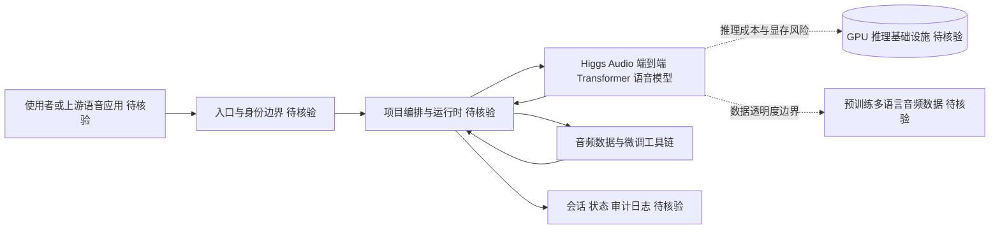

# boson-ai/higgs-audio

## 一句话定位
Boson AI 推出的文本-音频基础模型，支持语音理解和生成，瞄准端到端语音交互能力。

## 它解决的问题
当前语音 AI 系统通常采用「ASR → LLM → TTS」三段式拼接架构，存在信息丢失、延迟叠加、情感无法传递等结构性缺陷。Higgs Audio 面向需要构建自然语音对话系统的开发者，提供了原生语音到语音（speech-to-speech）的端到端能力，能直接理解和生成带有情感的语音，无需中间文本转换。

## 为什么值得关注
- **Stars:** 8,314 stars，在音频基础模型赛道中属于快速上升期项目
- **端到端范式:** 代表了语音 AI 从管道式走向端到端的重要技术趋势
- **Boson AI 背景:** 团队来自知名 AI 研究，技术实力有保障
- **Apache-2.0 许可:** 开放商业使用，企业采用门槛低

## 热度来源判断
热度来自语音基础模型赛道在 2025 年的爆发——GPT-4o 的实时语音对话展示了端到端语音交互的潜力，引发社区对类似开源方案的需求。Higgs Audio 在这个窗口期获得了关注。8,314 stars 对于一个新的音频基础模型来说热度合理，尚未出现明显泡沫。关键看后续模型质量和社区留存。

## 关键技术亮点亮点
1. **端到端语音建模:** 统一的模型架构同时处理语音理解和生成，避免了 ASR-TTS 管道的级联误差
2. **语音情感保持:** 能在语音对话中保持说话人的情感、语调和风格，而非单调的机器声
3. **大规模预训练:** 基于海量多语言音频数据训练，覆盖多种语言和口音
4. **Apache-2.0 开源:** 完整模型权重和推理代码开放，支持商业使用和二次开发
5. **可扩展的 Transformer 架构:** 基于现代 Transformer 设计，易于在已有 GPU 基础设施上推理和微调

## 架构师速览

| 决策问题 | 研究判断 | 证据边界 |
|---|---|---|
| 系统边界 | 端到端语音基础模型项目，向上为应用/上游调用方提供统一语音理解与生成能力，向下依赖 GPU 推理基础设施；Apache-2.0 直接商业可用 | 档案明确为"语音理解和生成"基础模型、Apache-2.0；具体服务端口、SDK 形态、部署形态未在档案中给出 |
| 主路径 | 语音输入 → 统一 Transformer 端到端模型 → 语音输出（含情感、语调）；通过 Transformer 推理和微调承载主链路 | 档案描述"端到端语音建模""可扩展的 Transformer 架构"；推理调用协议、上下文管理、批处理路径未记载 |
| 关键权衡 | 端到端统一建模带来的情感与延迟收益 vs. 推理硬件/显存成本与社区工具链不成熟；训练数据不透明 | 档案明确"推理成本高""生态工具链不完善""训练数据不透明"；具体显存占用、RTF 指标未给出 |
| 最小 PoC | 在单卡 GPU 节点加载开放权重跑通语音到语音推理样例，验证情感与口音覆盖，再评估延迟与显存是否满足实时对话场景 | 档案明确支持"推理和微调"；硬件最低门槛、实时性 SLA、推理框架依赖未在档案中说明 |

## 架构启发
Higgs Audio 的设计验证了一个关键洞察：当语音模型足够大时，端到端训练可以隐式学习到 ASR 和 TTS 的能力，而不需要显式的管道分离。这种「大模型吃一切」的范式与 LLM 发展趋势一致。代价是训练成本极高，且对推理硬件有较高要求。

## 架构图（MMD）

> 证据边界：此图只采用本档案已有可核验描述；“待核验”节点不应视为项目实现事实。

## 定位判断
属于语音基础模型生态的挑战者。与专精型方案（Whisper 做 ASR、Piper 做 TTS）形成竞争，Higgs Audio 的差异化在于端到端能力。在生态位置上，它更接近「语音版 LLM」的定位。

## 风险 / 局限 / 泡沫点
1. **推理成本高:** 端到端模型通常比管道式方案更大，GPU 显存需求和推理延迟可能影响实时场景部署
2. **生态工具链不完善:** 相比 Whisper 庞大的社区工具链，Higgs Audio 的预处理、后处理、部署工具链仍处早期
3. **与商业方案差距:** 与 GPT-4o voice 等顶级商业方案在实时性和自然度上可能仍有显著差距
4. **训练数据不透明:** 预训练数据的具体构成和质量评估标准未完全公开

## 与同类项目的关系
- **OpenAI Whisper:** 专注 ASR 的单点方案，Higgs Audio 追求更全面的端到端能力
- **microsoft/VibeVoice:** 微软的语音模型，偏 TTS 方向；Higgs Audio 更强调语音理解和生成的统一
- **Kyutai Moshi:** 另一个开源实时语音对话模型，定位相似，是直接竞品
- **Google AudioGemini:** 闭源方案，Higgs Audio 是开源阵营的对应探索

## 是否值得持续跟踪
**值得跟踪。** 端到端语音 AI 是确定性技术趋势，Higgs Audio 作为开源方案在该方向具有重要参考价值。尤其需要关注其在实时语音对话场景中的实际表现。

## 后续观察点
- 关注 Higgs Audio 是否推出针对实时场景的低延迟推理优化方案
- 观察是否有基于 Higgs Audio 构建的语音对话产品发布
- 跟踪 Boson AI 是否持续更新模型权重并发布更强大的版本

---
> 数据来源: GitHub API (gh cli) | 更新: 2026-08-07 | Stars: 8,314 | Language: Python | License: Apache-2.0 | Forks: 643
