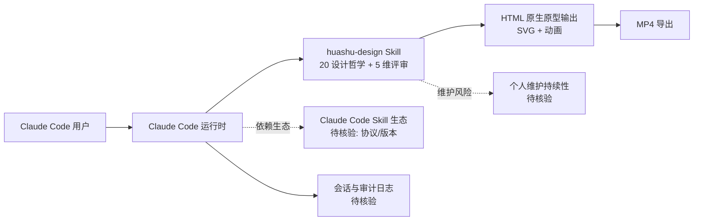

# huashu-design

## 一句话定位
HTML 原生的 Claude Code 设计 Skill，支持高保真原型、幻灯片、动画，内置 20 个设计哲学和 5 维评审体系。

## 它解决的问题
让 Claude Code 用户无需设计经验就能产出专业级 UI 原型。解决了"Agent 能写代码但做不好设计"的问题。

## 为什么值得关注（2026-04-23）
4 天 4.4k stars，中文社区出品。代表了 Claude Code Skill 生态从"通用工具"向"专业设计能力"的细分深化。

## 热度来源判断
- **真实需求**：Claude Code 用户确实需要设计能力
- **社区效应**：中文 Claude Code 社区快速传播
- **泡沫成分**：约 20%，本质是 prompt 模板 + HTML 结构化输出
- **差异化**：20 个设计哲学 + 5 维评审是真正的增值内容

## 关键技术亮点亮点
1. **HTML 原生设计输出**：Agent 输出即高保真 HTML，无需额外渲染
2. **20 个设计哲学内置**：将设计原则编码进 Skill
3. **5 维评审体系**：系统化评估设计质量
4. **MP4 导出**：支持动画导出为视频
5. **Agent-agnostic**：不绑定特定 Agent 实现

## 架构师速览

| 决策问题 | 研究判断 | 证据边界 |
|---|---|---|
| 系统边界 | huashu-design 是 Claude Code 之上的 Skill 形态设计生产力工具，入口为 Claude Code 调用方，输出为 HTML 原生原型/SVG/动画/MP4，对外不依赖特定模型供应商或后端服务 | 边界基于"工具型"分类、HTML 语言、Agent-agnostic 描述；具体入口协议、Skill 加载机制未在档案中说明 |
| 主路径 | Claude Code 用户发起请求 → 加载 huashu-design Skill（20 设计哲学 + 5 维评审）→ Claude Code 编排生成 HTML/CSS/SVG 原型 → 可选 MP4 动画导出 | 路径依赖"HTML 原生设计输出""MP4 导出"等明文特性；Skill 在 Claude Code 内部的注入与执行机制档案未叙述 |
| 关键权衡 | 设计专业度（builtin 哲学/评审体系） vs 通用 Agent 框架的耦合深度；产出高保真度 vs 模板化导致的同质化风险 | 权衡来自"差异化=20 哲学+5 维评审"与"同质化竞争激烈""约 20% 泡沫"两条档案判断的对照 |
| 最小 PoC | 在受控的 Claude Code 会话中加载该 Skill，限定单一设计场景（如一张幻灯片或一个组件），验证 HTML 输出保真度、评审体系一致性、动画/MP4 导出可用性，并审查 prompt 模板与依赖文件 | PoC 范围受限于档案未公开 Skill 清单、依赖项、权限边界，需以源码核验 |

## 架构启发
- 将"设计能力"编码为 Skill 而非代码，是 Agent 能力扩展的轻量模式
- HTML/CSS/SVG 作为 Agent 输出格式正在成为事实标准

## 架构图（MMD）

> 证据边界：此图只采用本档案已有可核验描述；“待核验”节点不应视为项目实现事实。

## 定位判断
**工具型。** 是 Claude Code Skill 生态中的专业设计工具。不构成平台或基础设施。

## 风险 / 局限 / 泡沫点
1. **高度依赖 Claude Code 生态**：生态变化直接影响项目价值
2. **同质化竞争激烈**：设计类 Skill 本周集中爆发
3. **长期维护不确定**：个人项目，维护持续性待观察

## 与同类项目的关系
- **open-codesign**：平台化路线，多模型 BYOK → huashu-design 更专注 Skill 质量
- **diagram-design**：偏图表 → huashu-design 偏 UI 原型
- **Kami**：偏内容呈现 → huashu-design 偏交互原型

## 是否值得持续跟踪
**短期跟踪。** 关注 Skill 生态设计工具的竞争格局变化。

## 后续观察点
1. 是否从 Skill 演进为独立工具/平台
2. 设计哲学和评审体系是否被社区广泛引用

### 评分

| 维度 | 分数 | 理由 |
|------|------|------|
| 热度质量 | 7 | 真实需求 + 中文社区效应 |
| 技术创新度 | 5 | 本质是 prompt + 模板 |
| 工程成熟度 | 6 | 可用但工程复杂度有限 |
| 架构启发价值 | 6 | Skill 化设计能力的模式值得借鉴 |
| 企业落地潜力 | 5 | 可作为内部设计辅助工具 |
| 中期趋势概率 | 6 | 设计 Skill 是趋势但项目本身未必 |
| 平台化潜力 | 3 | Skill 不构成平台 |
| 基础设施潜力 | 2 | 不具备基础设施属性 |

- **总分**：40/80
- **归类**：工具型
- **建议持续跟踪**：短期

---
*首次记录：2026-04-23*
