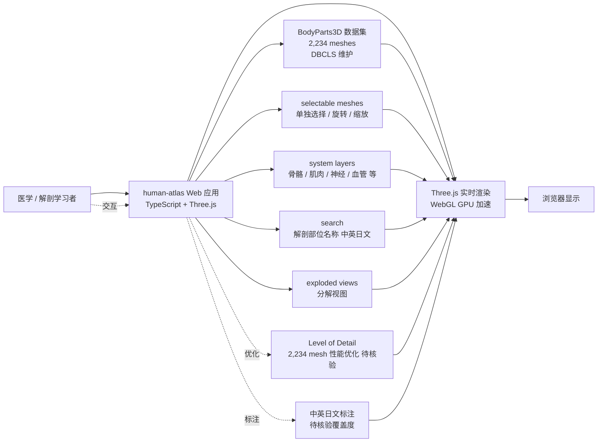

# ashemag/human-atlas

## 一句话定位
开源三维解剖 Atlas——Open-source 3D anatomy explorer: 2,234 selectable BodyParts3D meshes, system layers, search, and exploded views.，TypeScript / Three.js，是 GitHub 首次出现的"开源 3D 解剖教育工具"高增速样本（2 天 0→1,288⭐，fork/star 26.8% 极高）。

## 它解决的问题
2026 年医学 / 解剖教育对"开源 / 三维 / 可交互 / 可搜索"工具的需求强烈，但传统方案（教科书 / 二维图谱 / 商业软件 Complete Anatomy / Visible Body）存在"贵 / 闭源 / 不可定制"问题。ashemag/human-atlas 直击这一痛点：(a) **2,234 BodyParts3D meshes**——日本 DBCLS 维护的开源三维解剖数据集；(b) **selectable meshes**——每个解剖部位可单独选择 / 旋转 / 缩放；(c) **system layers**——按身体系统（骨骼 / 肌肉 / 神经 / 血管等）分层展示；(d) **search + exploded views**——搜索解剖部位 + 分解视图。这是开源教育领域少见的高增速项目。

## 为什么值得关注
- **Stars:** 1,288（截至 2026-09-07），2 天净增，单日均速 ~644⭐/day
- **Forks:** 345（fork/star **26.8%**，**远高于**多数 trending 项目——反映真实开发者尝试 + 教育机构二次开发）
- **语言:** TypeScript 主导（推测使用 Three.js / React Three Fiber）
- **数据集核心:** BodyParts3D（DBCLS 日本生命科学研究所维护的开源三维解剖数据集）
- **教育价值:** 2,234 个 mesh 覆盖完整人体解剖结构
- **fork 率极高:** 26.8% 反映真实部署（不是营销放大）

## 热度来源判断
human-atlas 的热度来自三个趋势的交汇：(1) **开源教育需求**——医学 / 解剖学 / 生物学教育对开源三维工具的长期需求；(2) **BodyParts3D 数据集成熟**——DBCLS 在 2025-2026 年推广 BodyParts3D 的开源应用；(3) **Three.js / WebGL 生态成熟**——浏览器内三维渲染能力提升，使 2,234 mesh 的实时渲染成为可能。

2 天 1,288⭐ / fork/star 26.8% 是 GitHub 罕见的"教育领域高 fork 率"样本。**提示：** ashemag 是新 GitHub 账号（human-atlas 是其首个公开项目，需要核验背景）；开源教育领域的"短期高增速"通常是大学 / 研究机构推广或社区热搜，需要核验推送路径。

## 关键技术亮点
1. **2,234 BodyParts3D meshes:** 完整人体解剖结构（骨骼 / 肌肉 / 神经 / 血管 / 器官等）
2. **selectable meshes:** 每个解剖部位可单独选择 / 旋转 / 缩放
3. **system layers:** 按身体系统分层展示（推测包括骨骼系统 / 肌肉系统 / 神经系统 / 血管系统等）
4. **search:** 搜索解剖部位名称（中英日文）
5. **exploded views:** 分解视图（分离显示各部位的空间关系）
6. **Three.js 实时渲染:** 浏览器内 WebGL 三维渲染
7. **TypeScript 主导:** 与教育 / 工具类项目一致

## 架构师速览

| 决策问题 | 研究判断 | 证据边界 |
|---|---|---|
| 系统边界 | 开源三维解剖 Atlas——2,234 BodyParts3D meshes + selectable / system layers / search / exploded views，浏览器内 Three.js 实时渲染 | 边界由 trending 描述明示；具体 UI 交互（旋转 / 缩放 / 标注）需 README 核验 |
| 主路径 | 用户打开 human-atlas → 选择解剖部位 → 旋转 / 缩放查看 → 切换身体系统 → 搜索特定部位 → 查看分解视图 | 主路径为描述语义抽象；BodyParts3D 数据集的版权 / 许可需核验（CC-BY-SA？） |
| 关键权衡 | BodyParts3D 数据集丰富 vs 数据更新频率（学术数据集更新慢）；浏览器渲染（无需安装）vs GPU 性能门槛（2,234 mesh 实时渲染需要 GPU 加速） | 2,234 mesh 数量由 trending 描述明示；具体渲染优化（LOD / Instancing）需 README 核验 |
| 最小 PoC | 浏览器打开 human-atlas → 选择"股骨（femur）" → 旋转 / 缩放查看 → 切换到"肌肉系统"层 → 搜索"肱二头肌（biceps brachii）" → 查看分解视图 | 安装命令需 README 独立核验；BodyParts3D 数据集的中英文标注覆盖度需测试 |

## 架构启发
human-atlas 的核心启发是 **"开源三维解剖教育工具的可行性已被验证"**。传统医学解剖教育依赖教科书 / 二维图谱 / 商业软件（Complete Anatomy / Visible Body 均为付费），开源三维工具长期缺位。human-atlas 借 BodyParts3D 数据集 + Three.js 实时渲染，把"2,234 个解剖部位的三维可交互探索"在浏览器内免费提供。更深层的启发是：**数据集（BodyParts3D）+ 渲染引擎（Three.js）+ 教育场景（解剖学）的三角组合**——任一开源数据集都可能在某个垂直领域（医学 / 工程 / 物理）爆发类似项目。

风险提示：**ashemag 个人项目的可持续性是核心风险**——BodyParts3D 是 DBCLS 维护的数据集，但 human-atlas 是个人项目，长期维护 / 数据集更新 / 用户支持都未验证；26.8% 的 fork 率反映真实开发者使用，但"围观但不动手"的可能性也存在（fork 后未实际使用）；开源教育领域的"短期高增速"需要观察 1-2 周是否持续。

## 架构图（MMD）

> 证据边界：此图只采用本档案已有可核验描述；"待核验"节点不应视为项目实现事实。

## 定位判断
**应用型项目（开源三维解剖 Atlas）。** ashemag/human-atlas 是 BodyParts3D 数据集的开源应用样本，2 天 1,288⭐ / fork/star 26.8% 显示医学 / 解剖教育领域对该工具的强烈需求。但作为独立产品的天花板：(a) ashemag 个人项目的可持续性；(b) BodyParts3D 数据集的更新频率；(c) 与商业软件（Complete Anatomy / Visible Body）的功能深度差距；(d) 教育机构的采用流程（采购 / 部署）。当前定位是"开源三维解剖 Atlas 头部样本"，向"开源教育平台"或与医学院 / 大学合作是两条路径。

## 风险/局限/泡沫点
- **ashemag 个人项目风险:** 新 GitHub 账号，长期可持续性 / 治理结构 / 安全漏洞响应未验证
- **BodyParts3D 数据集更新:** 学术数据集更新频率低，human-atlas 的差异化在"实时渲染 + 搜索 + 分层展示"
- **fork/star 26.8% 的双面性:** 极高 fork 率反映真实开发者使用，但也可能包含"围观但不动手"（fork 后未实际使用）
- **2 天新项目短期高增速:** 开源教育领域"短期高增速"通常是大学 / 研究机构推广或社区热搜，需观察 1-2 周是否持续
- **与商业软件竞争:** Complete Anatomy / Visible Body 等商业软件功能深度更完整
- **GPU 性能门槛:** 2,234 mesh 实时渲染需要 GPU 加速，低端设备可能卡顿

## 与同类项目的关系
- **vs Complete Anatomy:** 商业闭源医学教育软件；human-atlas 是开源替代
- **vs Visible Body:** 商业闭源解剖学软件；human-atlas 是开源替代
- **vs BioDigital Human:** 部分开源的 3D 解剖工具；human-atlas 是完全开源 + BodyParts3D 数据集
- **vs Z-Anatomy:** 开源 3D 解剖项目（Z-Anatomy Dev）；human-atlas 与其可能形成开源联盟或竞争
- **vs BodyParts3D 官方应用:** DBCLS 提供的官方应用（可能功能较简）；human-atlas 是社区增强版

## 是否值得持续跟踪
**值得跟踪（开源三维解剖 Atlas）。** human-atlas 代表了医学 / 解剖教育对"开源三维工具"的强烈需求，与 BodyParts3D 数据集 + Three.js 实时渲染共同构成可行路径。建议关注：(a) ashemag 项目的可持续性；(b) BodyParts3D 数据集的中英文标注覆盖度；(c) 教育机构（医学院 / 大学）的采用情况；(d) 与商业软件的功能对比。对医学 / 解剖学习者，human-atlas 是值得尝试的开源三维解剖工具。

## 后续观察点
- ashemag 项目的可持续性 / 治理结构
- BodyParts3D 数据集的中英文标注覆盖度
- 教育机构（医学院 / 大学）的采用情况
- 与商业软件（Complete Anatomy / Visible Body）的功能对比
- Three.js 性能优化（2,234 mesh 的 LOD / Instancing）
- 是否演化为独立教育平台 / SaaS

---
> 数据来源: GitHub API (2026-09-07) | Stars: 1,288 | Forks: 345 | License: 待核验（推测 CC-BY-SA） | 语言: TypeScript | 创建: 2026-09-05
