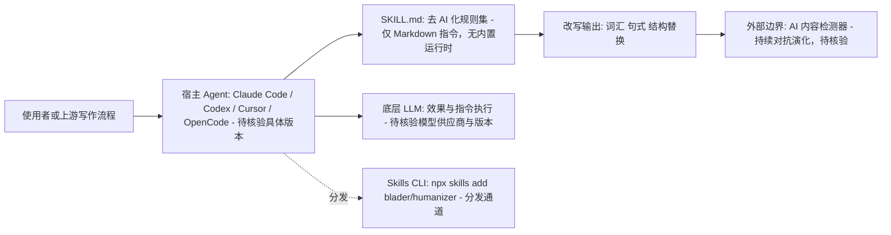

# blader/humanizer

## 一句话定位
一个可移植的 Agent Skill——纯 Markdown 编写，可在任何支持 skill 式指令的 Agent 框架中运行，功能是去除文本中的 AI 生成痕迹，使其读起来更自然、更像人类写作。

## 它解决的问题
AI 生成文本的"AI 味"问题：LLM 生成的文本有大量可识别的模式（过度使用"delve"、"tapestry"、连续的排比结构、机械的过渡词等）。这些模式不仅影响可读性，还会被 AI 检测器标记。Humanizer 作为一个 Agent Skill，让 AI 写作工具在生成后自动"去 AI 味"，无需额外 API 调用。

## 为什么值得关注
- **34,120 stars**，Agent Skill 生态中 star 数最高的项目之一
- **纯 Markdown Skill**：不依赖任何特定框架，是"Agent Skill"这一新范式的最佳范例
- **跨平台兼容**：Claude Code、Codex、Cursor、OpenCode 等主流 Agent 工具均可使用
- **Skills CLI 分发**：`npx skills add blader/humanizer --global` 一行命令安装

## 热度来源判断
热度来自两个趋势的交汇：(1) AI 内容生成普及后"去 AI 味"成为刚需；(2) Agent Skill 作为新兴分发模式正在爆发。作为"Skill 时代"的明星项目，它同时踩中了内容创作和开发者工具两个市场。

## 关键技术亮点亮点
- **Skill 即文档**：整个运行时就是一个 SKILL.md 文件，定义了详细的去 AI 化规则和改写策略
- **规则系统**：系统性地列出了 AI 写作的高频模式（词汇、句式、结构），并提供改写指导
- **跨框架可移植**：不依赖 Python/Node 运行时，任何能读取 Markdown 指令的 Agent 都能用
- **Claude Code 插件集成**：可作为 Claude Code 的正式插件安装

## 架构师速览

| 决策问题 | 研究判断 | 证据边界 |
|---|---|---|
| 系统边界 | Humanizer 实质是一个纯 Markdown 指令文档（SKILL.md），充当入口编排层；不内置模型、API 或工具调用，将"去 AI 化"语义下发给宿主 Agent（Claude Code / Codex / Cursor / OpenCode）。 | 档案明确为"纯 Markdown Skill"且分发方式为 `npx skills add`；未给出运行时二进制、网络端点或自有 SDK。 |
| 主路径 | 用户文本 → 宿主 Agent 读取 SKILL.md → 按规则重写词汇/句式/结构 → 返回更像人类写作的输出；无独立后端或持久化层。 | 仅由"Skill 即文档"与"改写策略"描述推导；具体规则覆盖面、改写算法、提示词细节未在档案中列出。 |
| 关键权衡 | 跨框架可移植性 vs 效果可控性：完全依赖宿主 LLM 执行 Markdown 指令，没有模型、提示词版本控制或回归测试机制，效果因模型而异。 | 档案已点名"效果依赖模型"与"AI 检测军备竞赛"；缺少评测基准、规则版本号与对抗检测胜率数据。 |
| 最小 PoC | 在 Claude Code 或 Cursor 中以本地 skill 形式挂载 SKILL.md，喂入 5 段含"delve/tapestry"等档案列举的高频 AI 词样本人工对照改写前后；无须部署、无须外部服务。 | 安装方式来自档案明文命令；样本应限于档案中已点名的词与句式类别，避免引入未证实的检测器或 API 假设。 |

## 架构启发
Humanizer 证明了一个重要的架构趋势：**Agent Skill 可能比 Agent Framework 更重要**。传统思路是构建复杂的框架来控制 AI 行为，而 Skill 模式将专业知识编码为可分发的指令文档，让任何 Agent 都能即插即用。这是一种从"代码控制"到"知识注入"的范式转移。

## 架构图（MMD）

> 证据边界：此图只采用本档案已有可核验描述；“待核验”节点不应视为项目实现事实。

## 定位判断
**内容创作工具型 Skill**，也是 Agent Skill 分发模式的标杆项目。其价值不仅在于功能本身，更在于它验证了"Skill 作为可分发的 Agent 能力单元"这一新模式。

## 风险 / 局限 / 泡沫点
- **效果依赖模型**：Skill 的质量最终取决于底层 LLM 对指令的执行能力
- **AI 检测军备竞赛**：检测器也在进化，"去 AI 味"是一个动态对抗过程
- **star 泡沫**：作为轻量级 Markdown 文件获得 34k stars，"收藏不使用"比例可能极高
- **可复制性**：核心内容是公开的 Markdown，容易被 fork 和替代

## 与同类项目的关系
- **生态上游**：Skills CLI（npx skills）分发平台
- **同类竞品**：各类"AI 文本人性化"在线服务和 API（如 Undetectable.ai）
- **关联 Skill**：与 Claude Code 的 plugin marketplace 生态深度绑定

## 是否值得持续跟踪
**值得跟踪 Agent Skill 生态的发展趋势**。Humanizer 本身作为单个 Skill 的技术深度有限，但它代表的"Skill 分发模式"是 Agent 工具链演进的重要方向。

## 后续观察点
- Agent Skill 分发模式是否会成为行业标准（类似 npm 之于 Node）
- Skills CLI 平台的生态规模增长
- 是否会出现"Skill 质量评估"和"Skill 市场"的基础设施

---
> 数据来源: GitHub API (2026-08-07) | Stars: 34,120 | Forks: 3,068 | 语言: Python | License: MIT | 首次发现: 2026-06-17
