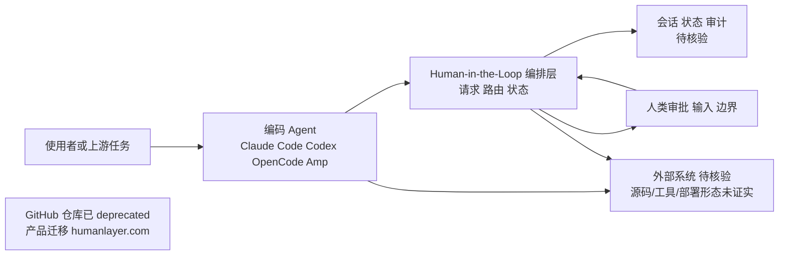

# humanlayer/humanlayer

## 一句话定位
让 AI 编程 Agent 在复杂代码库中更高效地解决难题的工具——核心是"人机协作层"（Human-in-the-Loop），让 Agent 在关键决策点请求人类输入，而非完全自主地"搞砸"。

## 它解决的问题
AI 编程 Agent 的"信任边界"问题：完全自主的 Agent 容易在不理解上下文时做出破坏性操作（如删除重要代码、引入 breaking change）。HumanLayer 提供了一层"人机协作"基础设施，让 Agent 在需要时暂停、请求人类审批或输入，在自主性和安全性之间取得平衡。

## 为什么值得关注
- **11,199 stars**，Human-in-the-Loop Agent 工具中的领先项目
- **多 Agent 支持**：明确标注支持 Claude Code、Codex、OpenCode、Amp 等主流编码 Agent
- **解决真实痛点**：AI 编程从"Demo"到"生产"的最大障碍就是可控性
- **⚠️ 注意**：GitHub 仓库已标记为 deprecated，产品已迁移至 humanlayer.com

## 热度来源判断
热度来自 AI 编程 Agent 从"全自动"到"可控自主"的范式转变。早期 Agent（如 AutoGPT）追求完全自主但频频失败，市场逐渐认识到 Human-in-the-Loop 的必要性。HumanLayer 是这一转变中的代表项目。

## 关键技术亮点亮点
- **Human-in-the-Loop 基础设施**：为 Agent 提供标准化的"请求人类输入"接口
- **多 Agent 适配**：支持 Claude Code、Codex、OpenCode、Amp 等不同 Agent 框架
- **审批工作流**：关键操作前的审批门控
- **上下文路由**：根据任务复杂度自动决定是否需要人类介入

## 架构师速览

| 决策问题 | 研究判断 | 证据边界 |
|---|---|---|
| 系统边界 | HumanLayer 定位于"入口渠道 / 编码 Agent / 人类审批"之间的 HITL 编排层；档案明确支持 Claude Code、Codex、OpenCode、Amp 等多 Agent 适配 | 组件边界与适配 Agent 列表来自档案；部署形态、传输协议、持久化方案未在档案中证实 |
| 主路径 | Agent 在关键决策点发起请求 → 编排层路由至人类 → 人类审批/输入回写 → Agent 继续执行；侧挂会话、审计与可观测 | 审批工作流、上下文路由在"关键技术亮点"中明确；具体实现机制（如 channel、channel 分发）须以源码核验 |
| 关键权衡 | 受控自主 vs 完全自主：引入人类门控换可控性，代价是延迟与流程摩擦；GitHub 仓库已 deprecated，理念可能落入 Agent 框架原生集成 | "仓库废弃/产品迁移"在档案"风险/局限"明确；原生集成的演进属观察点，非已证事实 |
| 最小 PoC | 在 Claude Code 单渠道接入，启用关键操作前的审批门控并记录审计日志，再评估是否扩到 Codex/OpenCode/Amp | 渠道与审批语义由档案支持；具体 SDK/CLI 调用面、权限模型未在档案中给出，需源码核验 |

## 架构启发
HumanLayer 的核心启发是"Agent 不需要完全自主才有价值"——在关键决策点引入人类判断，比追求 100% 自主更实际、更安全。这种"受控自主"模式可能是 AI 编程 Agent 走向生产的必经之路。

## 架构图（MMD）

> 证据边界：此图只采用本档案已有可核验描述；“待核验”节点不应视为项目实现事实。

## 定位判断
**已商业化的工具型项目**。开源仓库已标记 deprecated，核心产品迁移到 humanlayer.com。其理念价值大于代码价值。

## 风险 / 局限 / 泡沫点
- **⚠️ 仓库已废弃**：GitHub README 明确说"the code here is pretty much all deprecated"
- **产品迁移**：已转型为 humanlayer.com 商业产品
- **理念可复制**：Human-in-the-Loop 的概念容易被 Agent 框架原生集成
- **竞争**：Claude Code 本身已有权限审批机制，可能减少对外部工具的需求

## 与同类项目的关系
- **竞品/集成对象**：Claude Code（内置审批）、Cursor（人在环路审查）、GitHub Copilot Workspace
- **概念先驱**：AutoGPT 的失败教训推动了 Human-in-the-Loop 的发展
- **关联**：与 12-factor agents 等理念一致

## 是否值得持续跟踪
**跟踪理念，不跟踪仓库**。HumanLayer 的 Human-in-the-Loop 理念值得关注，但开源仓库已废弃，应关注 humanlayer.com 商业产品的进展。

## 后续观察点
- Human-in-the-Loop 是否会被主流 Agent 框架原生集成（减少独立工具的需求）
- humanlayer.com 商业产品的市场表现
- "受控自主"是否会成为 Agent 生产部署的标准模式

---
> 数据来源: GitHub API (2026-08-07) | Stars: 11,199 | Forks: 929 | 语言: TypeScript | License: 自定义 | ⚠️ 仓库已标记 deprecated | 首次发现: 2026-06-17
