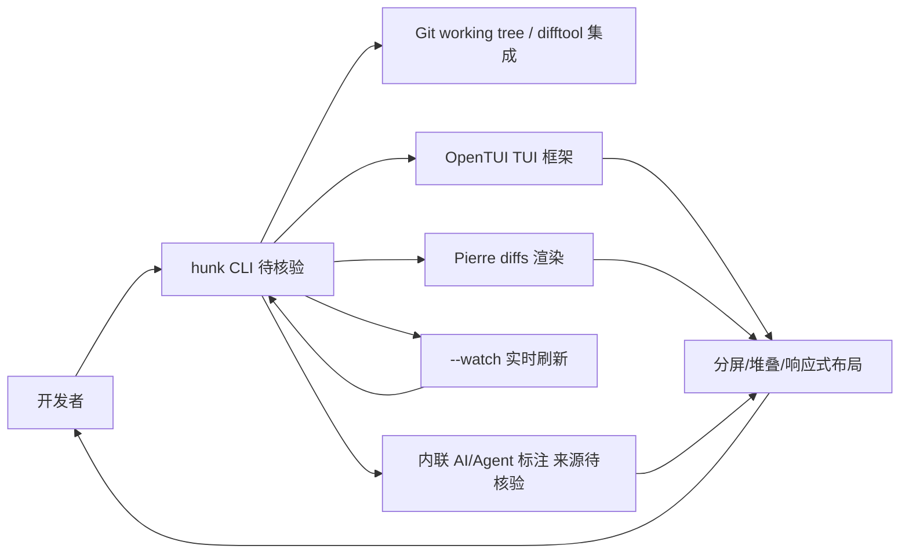

# modem-dev/hunk

## 一句话定位
专为 AI Agent 编码场景设计的终端 Diff 查看器——review-first 理念，多文件审查流、内联 AI/Agent 标注、分屏/堆叠布局，让开发者高效审查 Agent 生成的代码变更。

## 它解决的问题
AI Agent 编码的审查痛点：当 Claude Code、Codex、Cursor 等 Agent 自主生成大量代码变更时，传统的 `git diff` 输出混乱且难以审查。开发者需要一个专为"Agent 变更集"优化的审查工具——支持多文件导航、内联标注、watch 模式实时跟踪 Agent 的持续变更。

## 为什么值得关注
- **8,146 stars**，AI 编码工作流工具中增长快的项目
- **填补空白**：第一个专为 Agent 编码场景设计的 Diff 查看器
- **TUI 设计精良**：基于 OpenTUI 构建，支持分屏、堆叠、响应式自动布局
- **Watch 模式**：实时监控 Git 变更，自动刷新审查视图，适合 Agent 持续编码场景
- **多平台**：npm、Homebrew、Nix 三种安装方式

## 热度来源判断
热度直接来自 AI Agent 编码工具（Claude Code、Codex CLI）的爆发式增长。当越来越多开发者使用 Agent 编写代码时，"如何审查 Agent 的产出"成为一个新的刚需场景。Hunk 精准切入了这个"Agent 编码后的审查环节"。

## 关键技术亮点亮点
- **Review-First 设计**：界面设计以代码审查为核心，而非通用 Diff 查看
- **多文件审查流**：侧边栏导航 + 主视图的布局，高效处理大量文件变更
- **内联 AI 标注**：在 Diff 旁边显示 AI/Agent 的注释和说明
- **Watch 模式**：`--watch` 自动重载文件和 Git 变更，实时跟踪 Agent 工作
- **Git difftool 集成**：可作为 Git 的默认 difftool 使用
- **键盘 + 鼠标**：完整的键盘快捷键和鼠标交互支持

## 架构师速览

| 决策问题 | 研究判断 | 证据边界 |
|---|---|---|
| 系统边界 | 终端侧 Diff/审查 CLI，以 Git working tree 为输入面，调用 Git 与 OpenTUI、Pierre diffs 等本地组件；不接入模型供应商或外部 SaaS | 档案明示 Git difftool 集成、OpenTUI 与 Pierre diffs 依赖；未提及模型/网络调用，需源码核验 |
| 主路径 | Git 变更集 → OpenTUI 渲染 → 多文件分屏/堆叠视图 → 键盘/鼠标与可选 `--watch` 触发刷新 → 内联 AI/Agent 标注并排显示 | 流程基于档案"多文件审查流、watch 模式、内联 AI 标注"特性拼出；标注来源协议未在档案中给出 |
| 关键权衡 | 场景聚焦（仅 Agent 代码审查）换取体验纵深，但与 IDE 内置 Source Control 的功能重叠带来替代风险；watch 模式的可靠性与 104 个 open issues 形成维护压力 | 取舍与维护压力均为档案原文；实际稳定性、权限模型、并发安全无档案证据 |
| 最小 PoC | 在非主仓库跑 `hunk` 接入 Git difftool，对一次 Agent 生成的多文件变更做分屏审查，启用 `--watch` 验证实时刷新与渲染正确性；验收包括键鼠交互、布局自适应、无外部网络请求 | 启动方式、watch 行为来自档案；具体 CLI 语法、配置项与二进制分发须以仓库 README/源码核验 |

## 架构启发
Hunk 代表了"AI 编码工作流工具链"的新方向：传统开发工具（Diff 查看器、Code Review 工具）正在被重新设计以适应 Agent 编码的新范式。关键变化是从"偶尔审查大变更"到"持续审查 Agent 的增量变更"，这要求工具支持 watch 模式和实时反馈。

## 架构图（MMD）

> 证据边界：此图只采用本档案已有可核验描述；“待核验”节点不应视为项目实现事实。

## 定位判断
**AI 编码工作流工具型**，定位为 Agent 编码场景的标配审查工具。不是平台，而是工作流中"审查环节"的专门工具。

## 风险 / 局限 / 泡沫点
- **场景窄**：仅适用于 AI Agent 编码的 Diff 审查，非通用 Diff 工具
- **竞品替代**：IDE 插件（如 VSCode 的 Source Control）在不断改进，可能压缩 Hunk 的空间
- **依赖生态**：价值高度依赖 AI Agent 编码工具的持续增长
- **104 open issues**：快速增长中的维护压力

## 与同类项目的关系
- **上游场景**：Claude Code、Codex CLI、Cursor、OpenCode 等 Agent 编码工具
- **竞品**：lazygit（通用 Git TUI）、tig（Git TUI）、Delta（Diff 美化）
- **底层依赖**：OpenTUI（终端 UI 框架）、Pierre diffs（Diff 渲染）

## 是否值得持续跟踪
**值得跟踪**。作为 AI 编码工作流工具链的早期项目，其"Review-First for Agent Changes"的定位精准。如果 AI Agent 编码持续增长，这类工具将成为标配。

## 后续观察点
- 是否会扩展到完整的 Code Review 工作流（如 PR 审批、评论）
- IDE 集成深度（是否会有 VSCode 插件版本）
- Watch 模式在长时间 Agent 运行中的可靠性

---
> 数据来源: GitHub API (2026-08-07) | Stars: 8,146 | Forks: 237 | 语言: TypeScript | License: MIT | 首次发现: 2026-06-17
