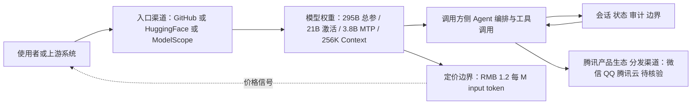

# Hy3 Preview

## 一句话定位

腾讯混元团队在重建训练基础设施后的首个模型——295B MoE（21B 活跃参数），主打复杂推理、编码和 Agent 任务。

## 它解决的问题

1. **推理成本 vs 能力**：MoE 架构用 295B 总参数撑起能力天花板，但只激活 21B 参数控制推理成本
2. **Agent 任务能力**：专门针对 Agent 场景优化，不只是文本生成，而是工具调用、任务规划
3. **超长上下文**：256K Context，适合处理大型代码库和长文档

面向的用户是需要在私有环境中部署高性能 LLM 的企业，尤其是已有腾讯云基础设施的团队。

## 为什么值得关注（2026-04-28）

- 前期由前 OpenAI 研究员姚顺雨主导
- 90 天完成训练基础设施从拆毁到重建到模型交付——工程执行力的证明
- Forbes 专门报道，腾讯将 Hy3 定位为"base-model play"
- 同时发布在 GitHub、HuggingFace、ModelScope，覆盖全球开发者生态
- 定价 RMB 1.2/M input token，成本竞争力强

## 热度来源判断

- **技术信号**：295B MoE + 21B 活跃参数的参数效率设计
- **人才信号**：前 OpenAI 研究员主导，吸引关注
- **生态信号**：腾讯产品生态（微信、QQ、腾讯云）是天然分发渠道
- **当前热度偏低**：GitHub 仅 262 stars，社区验证尚在早期

## 关键技术亮点亮点

1. **MoE 稀疏激活**：295B 参数只激活 21B，推理成本接近小模型但能力接近大模型
2. **基础设施重建**：2026 年 2 月拆毁旧的预训练和 RL 基础设施，从零重建，90 天交付
3. **MTP（Multi-Token Prediction）层**：3.8B MTP 层参数，提升生成效率和连贯性
4. **Agent 优化**：在 Agent 任务上做了专门优化，不只是通用 LLM
5. **256K Context**：超长上下文支持，适合代码理解和长文档处理

## 架构师速览

| 决策问题 | 研究判断 | 证据边界 |
|---|---|---|
| 系统边界 | Hy3 Preview 是一个 295B/21B 激活 MoE LLM（Python 项目，标签 llm/moe/tencent/open-source-model/agent），通过 GitHub、HuggingFace、ModelScope 三仓分发；系统边界止于模型权重与调用入口，下游需自建编排/工具/会话层。 | 仓库元数据与一句话定位，未公开推理服务器、SDK 或 API 网关实现。 |
| 主路径 | 主路径为：使用者 → 入口渠道（GitHub/HF/ModelScope） → 模型权重（295B 总参 / 21B 激活 / 3.8B MTP 层 / 256K 上下文） → 调用方侧工具与 Agent 编排。 | 仅由 README 架构启发推断，无任何推理协议、部署形态或工具调用接口的档案证据。 |
| 关键权衡 | 总参数 295B 撑能力 vs 仅 21B 激活控成本；256K 长上下文利好代码/长文档 vs 增加显存与延迟；MoE 已是 2026 事实标准，但 Preview 阶段能力未验证、社区 262 stars 偏早。 | 权衡结论来自参数结构与定位判断；推理显存、token/s、定价 RMB 1.2/M 之外的真实成本与延迟未在档案中给出。 |
| 最小 PoC | 建议最小 PoC 限定在单渠道（任选 HF 或 ModelScope）、单卡/A100 范围推理、最小工具白名单、可审计日志、设定 GA 触发与退出路径；现阶段不宜生产接入。 | 基于 Preview 状态、社区热度偏低、档案明确建议"等到正式 GA 后再做 PoC 评估"。 |

## 架构启发

Hy3 Preview 的核心架构决策是 **重建基础设施 + MoE + Agent 优化**：

- **重建的意义**：腾讯拆毁旧基础设施重建，说明他们认为之前的技术债已不可持续。90 天从拆到建到交付，体现的是工程组织能力，不只是模型能力
- **MoE 的选择**：在 2026 年，MoE 已成为大模型的事实标准架构。21B 活跃参数意味着单张 A100 可推理
- **Trade-off**：Preview 阶段，能力尚未完全验证；但腾讯生态内的快速迭代能力是优势

## 架构图（MMD）

> 证据边界：此图只采用本档案已有可核验描述；“待核验”节点不应视为项目实现事实。

## 定位判断

**国产 MoE 大模型第二梯队领跑者**。与 Kimi K2.6 相比，Hy3 更侧重通用能力和腾讯生态集成，而非极致的 Agentic Coding。两者互补而非直接竞争。

## 风险 / 局限 / 泡沫点

1. **Preview 阶段**：目前只是 Preview，非正式 GA，能力和稳定性尚未完全验证
2. **社区接受度低**：262 stars 说明开源社区尚未形成共识
3. **腾讯生态绑定**：优势（分发渠道）也是风险（感知上偏"内部工具"）
4. **与 Kimi K2.6 对比压力大**：后者 SWE-Bench Pro 58.6% 的成绩是硬指标

## 与同类项目的关系

- **vs Kimi K2.6**：K2.6 在 Agentic Coding 上更强（SWE-Bench Pro 58.6%），Hy3 在通用能力上可能更均衡
- **vs DeepSeek-V4**：DeepSeek 在推理和数学上更强，但在 Agent 任务上可能不如 Hy3
- **vs Qwen 3**：阿里 Qwen 系列在中文场景更强，但 Hy3 的 MoE 架构更高效

## 是否值得持续跟踪

**是。** 腾讯混元团队的投入力度大，姚顺雨的加入是重要信号。建议等到正式 GA 后再做 PoC 评估。

## 后续观察点

1. 正式 GA 版本的 benchmark 成绩（尤其是 Agent 相关 benchmark）
2. 腾讯产品生态内的集成速度（微信、QQ、腾讯云）
3. 社区 fine-tune 和部署方案的出现速度

---
*首次记录：2026-04-28*
