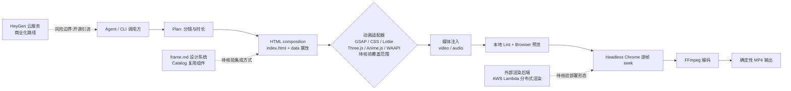

# HyperFrames

## 一句话定位
用 HTML + CSS 写视频，Agent 友好的确定性 MP4 渲染框架。Headless Chrome 逐帧捕获 + FFmpeg 编码，同一输入永远产生同一输出。

## 它解决的问题
传统视频制作工具（After Effects/Premiere）不可编程、不可自动化。Remotion 用 React 组件做视频但需要 bundler 和 React 知识。Agent 要做视频，需要一个它已经熟悉的格式——HTML。

## 为什么值得关注（2026-06-07）
25K stars + 257/天的增速说明"Agent 也能做视频"的需求是真实的。HeyGen（知名 AI 视频公司）出品，已在生产环境使用。关键差异点：**无 build step，index.html 直接预览**，Agent 可以零摩擦生成视频。

## 热度来源判断
- **HeyGen 品牌**：生产环境验证，tldraw/TanStack 等团队已采用
- **Agent 生态红利**：`npx skills add heygen-com/hyperframes` 一行安装
- **真实用例驱动**：产品发布视频、PR walkthrough、数据可视化、社交媒体视频
- 25K stars 说明不只是开发者好奇

## 关键技术亮点亮点
1. **HTML 原生**：composition 就是带 data 属性的 HTML 文件，无 React 依赖
2. **确定性渲染**：Headless Chrome 逐帧 seek + FFmpeg 编码 = same input → same output
3. **多动画适配器**：GSAP、CSS animations、Lottie、Three.js、Anime.js、WAAPI
4. **Agent Skill 集成**：教 Agent 视频制作的完整流程（plan → write HTML → wire animation → lint → preview → render）
5. **AWS Lambda 分布式渲染**：可部署分布式 render stack
6. **frame.md 设计系统**：将 web design tokens 转换为视频适用的规格

## 架构师速览

| 决策问题 | 研究判断 | 证据边界 |
|---|---|---|
| 系统边界 | 由 Agent/CLI 入口、HTML composition 文件、Headless Chrome 逐帧渲染器与 FFmpeg 编码器组成的离线渲染流水线，输出确定性 MP4 | 组件名称、功能与关系见档案"关键技术亮点"；具体进程/线程模型、IPC 与产物落盘路径待核验 |
| 主路径 | Agent 描述需求 → 编写 HTML+CSS composition → 通过 GSAP/CSS/Lottie/Three.js/Anime.js/WAAPI 等适配器挂载可 seek 动画 → 注入视频/音频媒体 → 本地预览 → Headless Chrome seek + FFmpeg 编码 → MP4 | 流程引自档案架构图与亮点列表；各适配器的实际接入面、API 兼容性细节待核验 |
| 关键权衡 | "无 build step、Agent 用 HTML 即可生成视频"的低门槛 vs Headless Chrome 高 CPU/内存开销、视觉上限低于 AE/Premiere，且方向受 HeyGen 商业利益牵引 | 矛盾点来自档案"风险/局限"与"vs Remotion"对比；具体性能基准、Lambda 渲染 SLA、HeyGen 商业化路径未在档案中给出 |
| 最小 PoC | 单页 index.html（带 data 属性）→ 本地 CLI 预览 → 用 Headless Chrome + FFmpeg 渲染一段短视频验证"同输入同输出"确定性，再评估向 AWS Lambda 渲染栈扩展的收益 | 档案描述了渲染管线与 `npx skills add` 接入方式；Lambda 部署参数、并发、配额、社区 Catalog 复用方式待核验 |

## 架构启发
HyperFrames 的核心赌注：**Agent 写 HTML 比写 React 容易得多**。这个赌注如果成立，意味着所有 Agent 友好的工具都应该向"最简输入格式"靠拢。

## 架构图（MMD）

> 证据边界：此图只采用本档案已有可核验描述；“待核验”节点不应视为项目实现事实。

## 定位判断
**工具型 → 平台候选** — 当前是工具（CLI），但 frame.md 设计系统 + Catalog 复用组件 + AWS Lambda 渲染 + Playground 社区，正在向平台演化。

## 风险 / 局限 / 泡沫点
1. **视频质量上限**：HTML 动画能做到的视觉效果远不如 After Effects/专业视频工具
2. **Headless Chrome 资源消耗**：逐帧捕获对 CPU/内存要求高，长视频渲染慢
3. **HeyGen 商业利益冲突**：HyperFrames 是 HeyGen 的开源战略，长期方向可能偏向引流到 HeyGen 云服务
4. **Remotion 生态壁垒**：Remotion 已有成熟的 Lambda 渲染、Studio 编辑器、丰富社区

## 与同类项目的关系
- **vs Remotion**：HTML 原生 vs React 组件；无 build vs 需要 bundler；Apache 2.0 vs Source-available
- **vs FFmpeg 直接使用**：HyperFrames 在 FFmpeg 之上增加了 HTML composition 层
- **vs AI 视频生成模型（Sora 等）**：确定性 HTML 渲染 vs 概率性 AI 生成，不同维度

## 是否值得持续跟踪
**是。** Agent 友好的视频生成是一个全新品类，HTML 原生路线降低了 Agent 做视频的门槛。

## 后续观察点
1. frame.md 设计系统是否会成为 Agent 视频生成的标准
2. 社区 Catalog 组件的增长速度
3. AWS Lambda 分布式渲染的实际性能表现
4. 与 HeyGen 云服务的定位分化（开源社区版 vs 商业版）

---
*首次记录：2026-06-07*
