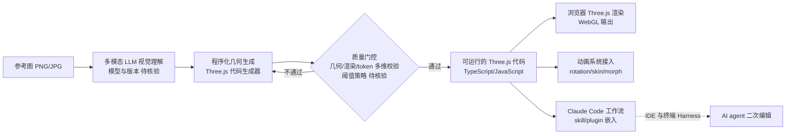

# img2threejs/img2threejs

## 一句话定位
把参考图片中的物体重建为"纯代码、可程序化、经过质量门控、可动画"的 Three.js 模型——AI 生成的 3D 资产可直接在浏览器渲染、可参数化、可二次编辑。

## 它解决的问题
当前"图生 3D"工具（Tripo、Meshy、Captions、CSM）多输出 `.glb` / `.obj` 等二进制模型，面临：① 文件大、不可编辑；② 输出格式封闭，难嵌入 Web/Three.js 工作流；③ 缺乏"质量门控"，输出常含破面 / 拓扑错误。img2threejs 走"代码即模型"路线：让 AI 生成的是 **Three.js 程序代码**（TypeScript），而非二进制资产。这带来：① 可读、可改、可 diff；② 体积小（代码 vs 顶点数据）；③ 程序化生成意味着可参数化（旋转、缩放、动画）；④ 与 Claude Code 工作流天然融合（agent 生成代码、CI 校验）。它解决的是 **"AI 生成 3D 资产的工程可用性"** 问题。

## 为什么值得关注（2026-08-22）
- **增长真实**：38 天 12,579⭐（GitHub API 可核验），Python 实现。
- **话题交叉点**：topics 同时含 `image-to-3d`、`procedural-generation`、`threejs`、`claude-code`、`ai-agents`——既是创意工具，也是 agent skill。
- **质量门控**：描述中明示 "quality-gated"，是 AI 生成 3D 中少有的"有校验环节"的项目。
- **可动画**：描述明示 "animation-ready"——直接接入 Three.js 渲染管线。
- **"代码即模型"路线**：与传统 SOTA（Tripo / Meshy 输出 .glb）形成差异化竞争。

## 热度来源判断
**3D 内容需求爆发 × AI 生成工程化 × Three.js 生态成熟三重驱动。** 2026 年是 3D 内容复兴年——Apple Vision Pro / Meta Quest / 各大厂的 3D 数字孪生需求让"批量 3D 资产"成为刚需。AI 生成 3D 是热点，但工程化落地（可直接嵌入 Web）是痛点。img2threejs 的"代码即模型"路线，正好踩中"既要 AI 又要工程可控"的双重需求。38 天 1.2 万星热度真实，但需区分：**demo 热度 vs 生产可用**——目前输出代码的复杂度、可运行率还需第三方评测。

## 关键技术亮点
1. **程序化生成**：输出是 TypeScript / JavaScript 代码（Three.js 几何与材质），而非顶点数据。
2. **质量门控（quality-gated）**：内置校验环节（几何误差、渲染校验、token 成本上限等），输出代码须通过门控才能交付。
3. **Animation-ready**：生成的模型可直接接入 Three.js 动画系统（旋转、骨骼、变形）。
4. **claude-code 集成**：topics 含 `claude-code`，可作为 Claude Code 的 skill / plugin 在 IDE 工作流中使用。
5. **WebGL 友好**：直接对接 Three.js / WebGL 渲染管线，无需转换格式。
6. **可读可 diff**：代码即模型意味着可通过 PR review、可版本管理。

## 架构师速览

| 决策问题 | 研究判断 | 证据边界 |
|---|---|---|
| 系统边界 | 图生 3D 的代码化 pipeline，输入参考图片，输出可运行的 Three.js 代码（含质量门控）；不替代 SOTA 图生 3D 模型（Tripo / Meshy）输出 .glb 的形态，但与之形成"代码 vs 二进制"的二选一 | 仅基于档案描述的程序化生成、quality-gated、animation-ready；具体门控阈值、几何误差算法、生成代码复杂度上限均待核验 |
| 主路径 | 参考图 → 多模态 LLM 理解（图片解析）→ 程序化几何生成（Three.js 代码）→ 质量门控（几何/渲染/token 多维校验）→ 输出可运行代码 → 可选 Claude Code 工作流嵌入 | 主路径为档案语义抽象；具体 LLM 调用（OpenAI / Claude / 本地模型）、门控算法、代码模板库均未披露 |
| 关键权衡 | "代码可读性"（程序化）vs "几何复杂度"（直接生成 .glb 可表达更复杂拓扑）；"LLM 生成速度" vs "质量门控严格度"；"agent 工作流嵌入" vs "独立 CLI 使用" | 档案明示 quality-gated 与 animation-ready；具体门控严格度、token 上限、生成策略待核验 |
| 最小 PoC | 选 3 张不同复杂度参考图（简单几何体 / 中等家具 / 复杂人物），跑 img2threejs 生成，对比与 Tripo / Meshy 输出 .glb 的渲染效果、文件大小、可编辑性，记录生成耗时与 token 成本后再评估生产化 | PoC 范围由档案"先对比、再工程化"原则推导；具体命令、模型版本、SLO 指标待核验 |

## 架构启发
img2threejs 的启发是 **"AI 输出的可执行性比输出的大小更重要"**——传统 3D 资产靠"数据"传递，AI 时代可走"代码"路线：① 可读（人可改）；② 可 diff（版本管理）；③ 可参数化（同一代码变体衍生不同资产）；④ 可嵌入 Web（直接 Three.js 渲染）。这呼应了"软件正在吞噬世界"的旧命题——**软件表示比数据表示更具工程友好性**。更深层的启发：**AI 生成内容的"中间表示"选择**（代码 vs 二进制 vs 文字）会决定其生态位。Codex 选代码（编程）、Tripo 选二进制（3D）、img2threejs 选代码（3D）——同一资产的不同表示，会产生不同工程生态。

## 架构图（MMD）

> 证据边界：此图只采用本档案已有可核验描述；"待核验"节点不应视为项目实现事实。

## 定位判断
**AI 创意 Agent pipeline（3D 子赛道）**。img2threejs 在"图生 3D"赛道走出差异化路径——传统玩家输出 .glb（二进制），它输出 Three.js 代码（可读）。这意味着：① 它不是 Tripo / Meshy 的"更好版本"，而是不同象限（"代码 vs 数据"）；② 它更受 Web/前端工程师欢迎（Three.js 是事实标准）；③ 它在"AI 生成内容工程化"领域具有方法论价值。12k 星在 38 天达成，话题热度真实，但**生产化前需评估**：① 复杂模型的可运行率（家具、人物 vs 简单几何体）；② 门控算法的误杀率；③ 与 SOTA `.glb` 模型的质量对比。

## 风险 / 局限 / 泡沫点
- **复杂拓扑限制**：程序化代码难表达高度复杂的网格（如精细人物模型、有机曲面），在复杂场景可能输给 .glb 输出。
- **LLM 生成不确定性**：代码生成有随机性，相同输入可能产生不同输出；门控可缓解但不能根除。
- **质量门控的"严格 vs 宽松"权衡**：严格 → 误杀率上升、生成时间增加；宽松 → 输出质量下降。
- **依赖 LLM 成本**：每次生成都调用多模态 LLM（推测），token 成本不可忽视；高频使用需自建缓存。
- **社区项目可持续性**：Python 实现，依赖 Claude Code 工作流；维护者精力分散风险。
- **"代码生成 3D" 与"3D 模型生成代码" 的界限模糊**：用户可能预期"一键生成 .glb 而非代码"，需明确产品形态。

## 与同类项目的关系
- **vs Tripo / Meshy / Captions / CSM**：直接图生 3D 模型（输出 .glb），SOTA 几何质量；img2threejs 输出代码，可读但拓扑复杂时受限。
- **vs Three.js + LLM 手写代码**：传统工作流是"LLM 写 Three.js 代码"无质量门控；img2threejs 加门控，更可靠。
- **vs Rodin / Genie（3D 基础模型）**：基础模型生成 3D 资产；img2threejs 是工程化封装层。
- **vs Luma Genie**：同为图生 3D，但 Luma 是 SaaS；img2threejs 是开源自部署。
- **vs Stable Diffusion 3D 扩展**：社区实验性质；img2threejs 是工程化产品。

## 是否值得持续跟踪
**值得跟踪（AI 3D 工程化风向标）**。img2threejs 是"代码即模型"路线的代表项目，其方法论对其他 AI 生成领域（音乐 / 视频 / 动画）有借鉴意义。建议关注：① 复杂模型（人物、有机曲面）的可运行率；② 门控算法是否开源与第三方评测；③ 是否有更多 harness 集成（Claude Code、Cursor、Aider）。对前端/3D 工程师：可作为"AI 辅助 3D 内容生产"的入门工具在 demo 场景试用。对创意工具厂商：值得研究其"质量门控 + 程序化生成"的产品哲学。

## 后续观察点
- 复杂模型的生成可运行率（家具 vs 人物 vs 有机曲面）
- 质量门控算法的开源与第三方评测
- 是否引入更多 harness 集成（Claude Code、Cursor、Aider）
- 与 SOTA 图生 3D 模型（Tripo、Meshy）的几何质量对比基准
- 是否有商业化方向（云端生成 + 浏览器编辑 SaaS）

---
> 数据来源: GitHub API (2026-08-22) | Stars: 12,579 | Language: Python | 创建: 2026-07-15 | 官方 topics: 3d, ai-agents, claude-code, computer-graphics, generative, image-to-3d, procedural-generation, threejs, typescript, webgl