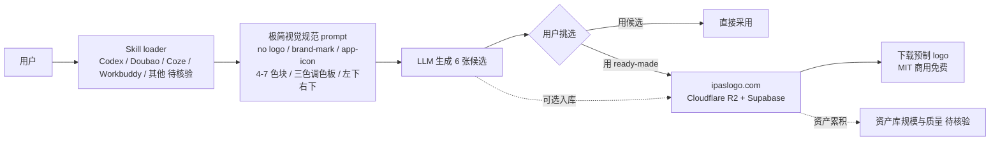

# s1dashu/ip-as-logo-skill

## 一句话定位
一个"小而专"的 Agent Skill，专门生成简洁、圆润、IP 化的公司吉祥物 logo——4-7 大色块、3 色调色板、左下/右下大轮廓、实色背景；遵循开放 Agent Skills 格式（兼容 Codex / Doubao / Coze / Workbuddy），并配套 Cloudflare R2 + Supabase 站点 ipaslogo.com 提供"零 LLM 即可下载"的预制 logo 库。

## 它解决的问题
AI 生成 logo 普遍面临两个痛点：① **质量不稳定**——同样 prompt 跑十次出十种风格，难以批量生产统一视觉；② **复用成本高**——每次都要消耗 token 调用 LLM，团队预算快速被烧掉。s1dashu/ip-as-logo-skill 用两招分别解决：① **极简视觉规范约束**（"no logo / brand-mark / app-icon use" in prompt + 4-7 形状 + 三色调色板 + 左下/右下大轮廓），把生成物强行收敛到"商业可用风格"；② **重资产产物库**——所有"通过验证"的生成物入库 ipaslogo.com（Cloudflare R2 + Supabase），用户可直接下载，无需再次调用 LLM。这是"单点 Skill × 重资产库"商业模型的标本。

## 为什么值得关注（2026-08-23）
- **5 天 3,767⭐**（GitHub API 可核验）：本日观察到的增速最高的"单点 Agent Skill"
- **开放 Agent Skills 格式：** 不绑定单一厂商，理论上兼容 Codex / Doubao / Coze / Workbuddy
- **配套网站 ipaslogo.com：** Cloudflare R2 + Supabase 提供"零 LLM 即用型"logo 库，是 Agent Skills 生态中"内容资产化"的早期样本
- **MIT 商用免费：** README 明示所有 logo 完全商用免费

## 热度来源判断
**"Skill 微型化 × 即用型资产库 × 多平台兼容"三重驱动。** 8-22 趋势简报已识别"agent skill 微型化"分化；8-23 ip-as-logo-skill 把 skill 升级为"内容资产分发"，承接了"logo 设计 = 高频低门槛需求"的市场。**3.7k⭐的增速含品牌效应**——个人开发者 s1dashu 在国内开发者社区有一定知名度，README 末尾列出"如果你没有 Codex / Doubao / Coze / Workbuddy，可以直接下载 ready-made logos"是精心设计的转化漏斗。下游采用需关注：① "ready-made logos" 的实际规模与质量；② 即用型资产是否真能覆盖 80% 用户需求；③ skill 规范约束的"开放 Agent Skills 格式"在各厂商的实际兼容性。

## 关键技术亮点
1. **极简视觉规范：** 4-7 大色块 / 三色调色板 / 左下/右下大轮廓 / 实色背景 / 厚实圆润无锐角
2. **prompt 反向工程：** 在 prompt 中明文禁止 "logo / brand-mark / app-icon / icon-asset" 等关键词，避免 LLM 输出 icon-style 而非 mascot-style
3. **开放 Agent Skills 格式：** 不绑定 Claude Code / Codex 单一厂商；理论上 Claude Code / Codex / Doubao / Coze / Workbuddy 都能加载
4. **Cloudflare R2 + Supabase 资产库：** 即用型 logo 通过网站分发，零 LLM 成本
5. **6 图默认输出：** 默认输出 6 张候选（3 左下 + 3 右下），便于用户挑选
6. **MIT 商用免费：** 降低企业采用门槛

## 架构师速览

| 决策问题 | 研究判断 | 证据边界 |
|---|---|---|
| 系统边界 | ip-as-logo-skill 是内容生成 Skill，承载"AI 生成 + 即用型资产库"两层；上层是 prompt 规范约束 LLM 输出，下层是 Cloudflare R2 + Supabase 资产分发 | 仅基于档案描述的极简视觉规范、Cloudflare R2 + Supabase 资产库；各厂商 Agent Skills 格式兼容深度、即用型资产库的规模与质量均待实测核验 |
| 主路径 | 用户加载 Skill → LLM 按 prompt 规范生成 6 张候选 → 用户挑选 → 可选下载 ready-made logo（无需 LLM） | 主路径为档案语义抽象；具体 LLM 调用协议、Skill 加载机制、资产库更新频率均待代码核验 |
| 关键权衡 | "Skill 即用型资产库"降低 LLM 成本 vs 资产库规模有限时仍需 LLM 生成；"极简视觉规范约束"vs"用户对复杂/差异化设计的需求"；"多平台兼容"vs"任一平台格式变化都可能破裂" | 均为推断；资产库规模、视觉规范覆盖度、各厂商兼容性矩阵均待核验 |
| 最小 PoC | 在 Claude Code / Codex 中加载 Skill，让其生成 6 张候选 logo，与网站 ready-made 库对比质量，验证 prompt 反向工程（"no logo in prompt"）是否真能让 LLM 输出 mascot 而非 icon | PoC 范围与退出路径由"先对比、再实测"原则推导；具体命令、版本兼容、SLO 指标待核验 |

## 架构启发
ip-as-logo-skill 的核心启发是 **"Agent Skill 的最佳形态是 prompt 规范 + 重资产产物库"**——传统 skill 仓库只解决 prompt（"如何让 LLM 做某事"），但 LLM 输出不可复现、不可批量；ip-as-logo-skill 通过"prompt 约束 + 资产库"让"logo 设计"从一次性 AI 任务变为**可复用资产**。这暴露了 AI 内容生产的本质矛盾：**生成成本远高于复用成本**，长期赢家一定是"内容资产化"的项目。另一启发：**Skill 微型化的"商业可行点"在内容资产而非 prompt 编排**——市面上大多数 Skill 仍在堆砌 prompt，但只有"产物可独立分发"才有商业价值。

## 架构图（MMD）

> 证据边界：此图只采用本档案已有可核验描述；"待核验"节点不应视为项目实现事实。

## 定位判断
**工具型项目（Agent Skill × 内容资产库的早期标本）。** 5 天 3.7k⭐的增速说明"内容资产化"是用户真实需求。短期看，它是单点 logo 工具；中期看，若"重资产产物库"模式扩散到其他高频需求（icon、配色、字体、UI 模板），可能形成 Agent Skills 生态的"长尾资产"赛道。对企业：① 自身产品需要 logo 时可参考其视觉规范；② 若团队高频需要 logo，可评估接入其资产库的可行性。

## 风险 / 局限 / 泡沫点
- **资产库规模有限：** ready-made logo 数量与覆盖度未在档案中给出，若仅几十张则远不能替代设计师
- **"开放 Agent Skills 格式"实际兼容性：** 各厂商（Claude Code / Codex / Doubao / Coze / Workbuddy）的 Skill 加载机制各异，未经实测确认前不应假设全平台可用
- **极简视觉规范的局限：** 强制"4-7 色块 + 三色调色板"对企业级品牌（如金融、法律）可能过于"可爱"，适用场景受限
- **prompt 反向工程的 LLM 漂移风险：** 新一代 LLM 可能对 "no logo in prompt" 不再敏感，需要持续 prompt 维护
- **"5 天 3.7k⭐"的早期品牌流量：** 个人开发者 IP 带来部分 star，长期真实需求强度需 3-6 个月增速再判断
- **即用型资产的法律细节：** MIT 对仓库本身，但生成物的版权归属是否真清晰（特别是 LLM 训练数据来源）需法律核验

## 与同类项目的关系
- **vs 一般 Logo 生成 SaaS（Looka / Brandmark）：** 闭源、按次付费；ip-as-logo-skill 开源 + 资产免费
- **vs Midjourney / DALL·E：** 通用图像生成；ip-as-logo-skill 是"专门为 logo 优化的 skill + 资产库"
- **vs Anthropic Skills 仓库（官方）：** 通用 Skill；ip-as-logo-skill 是单点深度优化
- **vs awesome-claude-code-skills（资源列表）：** 那些是目录；ip-as-logo-skill 是可直接使用的 Skill + 资产库
- **vs 设计模板市场（Figma Community）：** 静态模板；ip-as-logo-skill 是"动态生成 + 资产"双轨

## 是否值得持续跟踪
**值得持续跟踪（Agent Skill × 内容资产库模式的早期标本）。** 5 天 3.7k⭐的增速说明赛道真实且强烈。建议关注：① 资产库规模的扩张速度；② 多平台兼容性的实际落地；③ 是否出现模仿者（其他高频需求如 icon、配色、字体被同样模式化）。对企业：若内部有 logo / icon / UI 模板需求，可评估接入；对独立开发者：这是 Agent Skills 生态中"内容资产化"窗口的明确信号。

## 后续观察点
- 资产库规模与质量（ready-made logo 数量、更新频率、商用案例）
- 多厂商 Agent Skills 格式兼容性矩阵（Codex / Claude Code / Doubao / Coze / Workbuddy 等）
- 视觉规范的扩展性（金融、法律、医疗等专业场景是否需要"非可爱"分支）
- 是否出现其他"单点 Skill × 资产库"模仿者（icon、配色、字体、UI 模板）
- 法律边界清晰度（生成物版权、训练数据来源合规）

---
> 数据来源: GitHub API (2026-08-23) | Stars: 3,767 | License: MIT | 语言: Markdown | 创建: 2026-08-18 | 推送到 main: 2026-08-22
