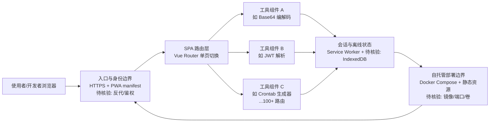

# it-tools

## 一句话定位
开源在线开发者工具集——一个网站聚合 100+ 常用开发者工具（Base64 编解码、JSON 格式化、JWT 解析、Crontab 表达式生成、URL/二维码/正则/时间戳转换等），UI 极简，支持 PWA 离线使用。

## 它解决的问题
开发日常需要频繁使用各类小工具（编解码、格式化、生成器、解析器），但：
- 在线工具站往往嵌广告、追踪脚本、流量劫持
- 单工具 App 太多，安装麻烦
- 找合适工具要 Google

it-tools 一站式提供 100+ 工具，无广告、无追踪，支持自托管。

## 为什么值得关注（2026-08-15）
被 daily/2026-08-15.md 选为今日开发者工具重点。40,301 stars 是同类型站少见的高星——证明"聚合工具"模式被开发者社区深度认可。其 GPL-3.0 协议与"自托管优先"立场与主流 SaaS 工具站形成差异。

## 热度来源判断
热度来源是 **"真实高频刚需 × 自托管无追踪定位"**。5,352 forks 反映社区高度参与（工具集合天然适合贡献）。对比同类项目（devtoys、Omlet），it-tools 在 Web 端体验 + 开源协议 + 长期运营三个维度都更强。

## 关键技术亮点
1. **Vue + TS + Vite + Naive UI:** 现代前端栈，体积小、加载快
2. **PWA + Offline:** 支持离线使用，可作为本地 app 安装
3. **Docker / 自托管:** 官方提供 docker-compose 部署
4. **i18n 支持:** 多语言（英、法、中等），适配全球用户
5. **单页即开:** 单页 route 切换，无刷新体验

## 架构师速览

| 决策问题 | 研究判断 | 证据边界 |
|---|---|---|
| 系统边界 | it-tools 是纯前端聚合站点（Vue + TS + Vite + Naive UI），不含模型供应商或后端 API；边界止于浏览器端 100+ 工具路由与 PWA 离线缓存 | 档案仅明示前端栈与 PWA/Docker 部署；后端服务、构建产物管线、CI/CD 组成未在档案中描述 |
| 主路径 | 用户访问 → SPA 路由切换加载对应工具组件 → 工具在浏览器本地完成编解码/格式化/解析 → 可选通过 Docker 自托管由 Nginx/静态服务对外暴露 | 档案仅说明"单页 route 切换"与"官方提供 docker-compose"；反向代理、CDN、HTTPS 终止点未述 |
| 关键权衡 | GPL-3.0 强 copyleft 与"自托管无追踪"定位：商业 fork 必须开源，但换来免广告/免追踪与企业内网部署自由；广度优先导致单工具深度有限，专业场景仍需专项工具替代 | 档案明示 GPL-3.0 与"广度×贡献活跃度"壁垒；具体工具覆盖深度、企业内 fork 合规案例未给出 |
| 最小 PoC | 单机 `docker-compose up` 拉起官方镜像，浏览器访问验证 Base64/JSON/Crontab 等 3 个常用工具与 PWA 离线安装，重点验收：①无外部追踪请求；②离线可用性；③版本升级回滚路径 | 档案仅声明官方提供 docker-compose 与 PWA 离线；镜像名、端口、数据卷、升级策略等部署细节待核验 |

## 架构启发
"通用工具站的 GitHub-first 模式"已被多个项目验证可行——it-tools 把"在线工具站"从 Web 2.0 时代的流量生意重新拉回到开源社区产品，是值得借鉴的开源运营样本。

## 架构图（MMD）

> 证据边界：此图只采用本档案已有可核验描述；“待核验”节点不应视为项目实现事实。

## 定位判断
**工具型 / 开发者聚合工具站标杆。** 在 Devtoys 等桌面替代品出现后，it-tools 仍稳居 Web 端第一。其生态位不易被替代——聚合工具的真正壁垒是"广度 × 社区贡献活跃度"。

## 风险 / 局限 / 泡沫点
- **GPL-3.0 严格 copyleft:** 商业 fork 必须开源，对企业自家"私有工具集 fork"有限制
- **同质化竞争:** devtoys、omlet 等桌面端瓜分市场份额
- **功能扩展瓶颈:** 工具数量虽多但深度有限，专业用户仍依赖各自专项工具
- **维护成本:** 100+ 工具需长期兼容 Web 平台变化（CSS 引擎/安全策略）

## 与同类项目的关系
- **vs DevToys:** DevToys 是桌面/Win/macOS app；it-tools 是 Web/PWA，跨平台
- **vs omlet:** omlet 走 desktop，it-tools 走 web/PWA
- **vs jsonformatter.org 等 SaaS:** SaaS 跑广告 + 追踪；it-tools 自托管
- **vs uTools 等桌面工具:** uTools 桌面应用 + 插件；it-tools 网页 + 离线

## 是否值得持续跟踪
**值得长期使用，但跟踪价值有限（成熟期工具集）。** 对个人开发者建议直接采用自托管版本作为日常工具。它不太可能成为下一波技术热点，但也不会衰退——属于"长青"型工具集项目。

## 后续观察点
- 是否新增 AI 类工具（如 prompt 模板编辑、模型比较器）
- PWA 离线工具能力是否扩展（IndexedDB 容量、本地 LLM）
- 跨平台桌面端是否会复刻（Electron/Tauri 版）
- 1k+ 贡献者社区的治理结构演化

---
> 数据来源: GitHub API (2026-08-21) | Stars: 40,301 | Forks: 5,352 | License: GPL-3.0 | 语言: Vue | 创建: 2020-04-05
