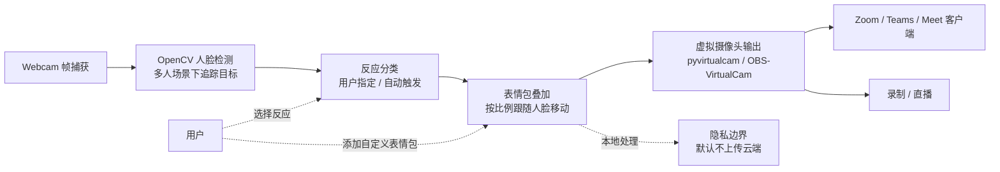

# gazijarin/itsgiving

## 一句话定位
Webcam 表情包虚拟摄像头——14 种会议反应（time out / heart hands / tongue out 等）+ 实时人脸追踪 + 表情包贴脸 + Zoom 虚拟摄像头输出；1 天 307⭐，Snap Camera 停服后的接替者之一。

## 它解决的问题
2023 年 Snap Camera 停服后，**会议中加表情包滤镜**的需求出现明显缺口。`itsgiving` 直击这一需求：用 Python + OpenCV + 虚拟摄像头驱动，让用户 **在会议中实时将表情包叠加到自己的脸上**。14 种反应覆盖日常会议场景（time out / heart hands / hands over face / crashing out / dancing / nose pinch / flirty / hand up / tongue out / gasp / disgust / talking to the camera 等），**人脸追踪确保表情包跟随用户移动**，**Zoom 虚拟摄像头输出让整个会议能看到**。

**目标用户**：远程工作团队（活跃会议氛围）、内容创作者（直播 / 录制）、教育工作者（儿童 / 在线课堂）。

## 为什么值得关注（2026-09-09）
- **Stars:** 307（截至 2026-09-09），1 天净增，单日均速 ~307⭐/day
- **Forks:** 39（fork/star 12.7%，反映真实开发者密度 + 教程跟随）
- **Watchers/Subscribers:** 待观察
- **Open Issues:** 待观察
- **License:** MIT
- **语言:** Python 主导（OpenCV + 虚拟摄像头驱动）
- **项目年龄:** 1 天（创建 2026-09-08），是 2026-09-09 trending 新项目前列
- **核心差异:** 实时人脸追踪 + 14 种会议反应 + Zoom 虚拟摄像头输出 + 可扩展

## 热度来源判断
热度来自 **三个层面的叠加**：(1) **Snap Camera 停服后的市场真空**——Snap Camera 2023 年停服，Zoom 内置滤镜功能有限，市场需要替代方案；(2) **AI 视觉识别成熟**——OpenCV 人脸检测 + 实时追踪是成熟技术，可直接应用；(3) **远程会议文化普及**——Zoom / Teams / Meet 已成为工作标配，活跃会议氛围是真实需求。

1 天 307⭐ / 39 fork / fork/star 12.7% 反映 **"视觉冲击力 + 可直接运行 + 可扩展"** 三者叠加——是真实需求场景，不是营销放大。

## 关键技术亮点
1. **实时人脸追踪：** 检测 webcam 输入中的具体哪张脸（多人场景下选择追踪目标）
2. **14 种会议反应：** time out / heart hands / hands over face / crashing out / dancing / nose pinch / flirty / hand up / tongue out / gasp / disgust / talking to the camera / 等
3. **表情包贴脸：** 根据反应自动贴对应表情包，按比例跟随用户移动
4. **Zoom 虚拟摄像头输出：** 通过 Zoom / Teams / Meet 的虚拟摄像头设备，整个会议能看到
5. **本地处理：** 默认在本地处理 webcam 输入（隐私友好）
6. **可扩展：** 用户可自定义添加更多表情包（"add more memes to your heart's desire"）

## 架构师速览

| 决策问题 | 研究判断 | 证据边界 |
|---|---|---|
| 系统边界 | 本地 webcam 处理 + 表情包叠加 + 虚拟摄像头输出层；典型栈 OpenCV 人脸检测 + PIL / OpenGL 表情包叠加 + OBS-VirtualCam / pyvirtualcam 虚拟摄像头驱动 | 边界由 README + demo gif 明示；具体技术栈选型（OpenCV / MediaPipe / face_recognition）需代码审阅 |
| 主路径 | webcam 帧捕获 → OpenCV 人脸检测 → 表情分类（用户指定或自动）→ 表情包图像合成 → 虚拟摄像头设备输出 → 会议客户端读取 | 主路径为 README 语义抽象；具体反应触发逻辑、表情包缩放 / 旋转计算需代码审阅 |
| 关键权衡 | 本地处理（隐私）vs 云端处理（更准）；14 种反应（开箱即用）vs 用户自定义扩展；CPU 处理（兼容）vs GPU 处理（性能） | README 明示本地处理 + 14 种反应；具体 OpenCV 模型（Haar / DNN / MediaPipe）需核验 |
| 最小 PoC | 安装 Python 依赖 + 启动本地虚拟摄像头驱动（OBS-VirtualCam）→ 在 Zoom 设置中选择 itsgiving 虚拟摄像头 → 触发不同反应测试人脸追踪 + 表情包叠加 | PoC 范围由 README "Quick start" 推导；具体跨平台虚拟摄像头驱动兼容性需 benchmark |

## 架构图（MMD）

> 证据边界：此图只采用本档案已有可核验描述；"待核验"节点不应视为项目实现事实。

## 架构启发
`gazijarin/itsgiving` 的核心启发是 **"AI 视觉 + 虚拟摄像头设备路径替代传统 OBS 直播"**。Snap Camera 时代用桌面应用做实时滤镜；itsgiving 用 Python + 虚拟摄像头驱动实现"可编程 + 可扩展"的滤镜——开发者可以 fork 加自定义表情包，可以集成更复杂的视觉识别（情绪识别 / 手势识别）。

更深层的启发是 **"远程会议文化的工具栈补完"**——Zoom 内置滤镜有限，Snap Camera 停服后市场真空，itsgiving 用 Python 开源方案填补——**当商业工具退场，开源工具的窗口期出现**。

风险提示：**跨平台虚拟摄像头驱动实现差异**（macOS / Windows / Linux）需要观察；**会议礼仪**（团队周会 OK，外部客户会议不 OK）需要规范；**本地处理 vs 云端处理**的边界需要用户明确知情。

## 定位判断
**工具型项目（Webcam 表情包虚拟摄像头）。** `itsgiving` 在 Snap Camera 停服后的市场真空期中切入，用 Python + OpenCV + 虚拟摄像头驱动的开源方案填补。差异化定位是 **"可编程 + 可扩展 + 跨平台"**——比 Snap Camera 闭源应用更灵活，比 mmhmm 等付费工具更轻量。当前定位是 **"Snap Camera 接替者之一"**，向"AI 视觉 + 会议增强"扩展是合理路径。

## 风险/局限/泡沫点
- **跨平台虚拟摄像头驱动：** macOS / Windows / Linux 虚拟摄像头实现差异（OBS VirtualCam、pyvirtualcam、Zoom 兼容层）需要观察
- **会议礼仪边界：** 团队周会 OK，外部客户会议不 OK——需要在文档中明确
- **本地处理 vs 云端处理：** README 明示本地 webcam 处理是默认路径，若改为云端需要用户明确知情
- **Snap Camera 替代品竞争：** mmhmm / Loom / OBS 虚拟摄像头 / Zoom 内置滤镜都是同类——itsgiving 的差异化是"开源 + 可扩展"
- **gazijarin 是新账号：** 1 天 307⭐ / 项目年龄 1 天，**项目可持续性 / 治理结构 / 安全漏洞响应未验证**
- **AI 视觉识别的准确性：** OpenCV 人脸检测在多人 / 侧脸 / 光线差场景下的准确性需要 benchmark
- **隐私与会议礼仪争议：** 会议中用表情包滤镜可能引发团队内部争议（"不严肃" / "分散注意力"）

## 与同类项目的关系
- **vs Snap Camera (2023 停服):** Snap Camera 是闭源桌面应用 + Snapchat 滤镜生态；itsgiving 是 Python 开源 + 自定义表情包
- **vs mmhmm:** mmhmm 是付费虚拟摄像头 + 演示工具；itsgiving 是开源 + 表情包娱乐
- **vs Loom:** Loom 是录制 + 分享；itsgiving 是实时 + 虚拟摄像头
- **vs OBS Virtual Camera:** OBS 是通用直播工具；itsgiving 是专用表情包叠加
- **vs Zoom 内置滤镜:** Zoom 内置滤镜有限；itsgiving 是可扩展的开源替代

## 是否值得持续跟踪
**值得跟踪（Snap Camera 替代品 + Webcam AI 视觉应用）。** `itsgiving` 处于 Snap Camera 停服后的市场真空期中，代表 **"AI 视觉 + 虚拟摄像头"** 的开源方案。建议关注：(a) Snap 是否重新进入市场（决定赛道竞争格局）；(b) Zoom / Teams 是否内置 AI 滤镜（决定独立工具空间）；(c) AI 视觉识别的准确性 / 性能提升；(d) 隐私与会议礼仪的边界讨论。对远程工作团队 / 内容创作者，itsgiving 是活跃会议氛围的开源工具；对 AI 视觉应用开发者，是"轻量级实时滤镜"参考实现。

## 后续观察点
- Snap 是否重新进入市场——决定赛道竞争格局
- Zoom / Teams 是否内置 AI 滤镜——决定独立工具空间
- AI 视觉识别的准确性 / 性能提升（MediaPipe / face_recognition 等）
- 隐私与会议礼仪的边界讨论
- 是否出现"itsgiving + Slack/Discord 集成 / 企业版"扩展
- gazijarin 是否持续维护 / 治理结构演化

---
> 数据来源: GitHub API (2026-09-09) | Stars: 307 | Forks: 39 | License: MIT | 语言: Python | 创建: 2026-09-08
