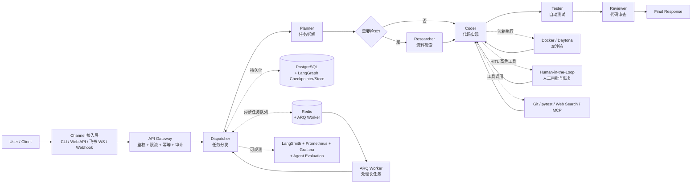

# ivyfan-toowell/IvyClaw

## 一句话定位
中文生产级多智能体软件研发 Agent 工程系统——基于 DeepAgents + LangGraph 五角色编排（Planner / Researcher / Coder / Tester / Reviewer）+ Docker/Daytona 双沙箱 + 多租户治理 + 多渠道接入 + LangSmith 可观测 + HITL 高危工具审批。

## 它解决的问题
2026 年 AI Coding Agent 从「个人 CLI 玩具」（Claude Code / Codex / Cursor）进入「团队 / 企业生产」阶段时遇到四大痛点：1) **多角色协作**——研发任务需要规划 / 检索 / 实现 / 测试 / 审查五个能力，单一 Agent 无法胜任；2) **生产工程能力**——长任务异步化、多租户隔离、审计日志、可观测性是生产系统的标配；3) **安全与隔离**——Agent 生成的代码必须沙箱执行，避免污染生产；4) **多渠道接入**——团队成员通过 CLI / Web / 飞书等不同入口访问 Agent。LangChain 官方提供 DeepAgents + LangGraph 框架，但「基于框架搭建生产级多 Agent 软件研发系统」的完整参考实现稀少。**IvyClaw 是这一定位的清晰尝试**——把 DeepAgents + LangGraph + Docker/Daytona 沙箱 + PostgreSQL 持久化 + Redis/ARQ 异步 + LangSmith 可观测 + 飞书 WebSocket 渠道整合成完整工程系统。解决的是「AI Coding Agent 工程化落地」的全栈参考实现空白。

## 为什么值得关注（2026-09-14）
- **Stars:** 52（截至 2026-09-14），1 天新增 52⭐ / 3 forks / fork/star 5.8%
- **Forks:** 3，社区关注早期阶段
- **License:** **无**（企业合规风险——README / repo 顶部未声明 LICENSE；合规扫描会直接拒绝）
- **语言:** Python（FastAPI + DeepAgents + LangGraph + uv 管理）
- **活跃度:** created 2026-09-13，pushed_at 2026-09-13，提供完整 README + Mermaid 架构图 + docker-compose.prod.yml
- **规模:** 1.8 MB（代码量适中，主要是 README + 配置文件 + 核心代码）
- **Topics:** ai-agents, deepagents, deepagents-langgraph, llm, llm-agent, llm-agents, multi-agent, multi-agent-systems（主题清晰）

## 热度来源判断
IvyClaw 的热度是 **「DeepAgents + LangGraph 官方主推 + 五角色清晰分工 + Docker/Daytona 双沙箱 + 中文 README + Mermaid 架构图 + 多渠道接入 + LangSmith 可观测 + HITL」** 的强组合。**DeepAgents 是 LangChain 在 2026 主推的 Agent 编排栈**（区别于早期 LangChain Agent / LangGraph Agent）；IvyClaw 站在生态最前沿，并把整套栈整合成生产可部署的系统。**中文 README + 飞书 WebSocket 渠道**是中文 AI 工具栈的明确差异化——LangChain 官方示例全是英文，IvyClaw 是少有的「中文 AI Coding 生产系统」。**Mermaid 架构图清晰展示从用户接入到可观测的完整数据流**——这是少有的「架构图公开 + 部署文档齐备」的多 Agent 系统。热度**真实且具工程价值**——不是又一个 LangChain Demo，而是「把 LangChain 官方栈推到生产工程层」的参考实现。但 **3 forks + fork/star 5.8% 反映当前主要是早期关注而非企业 fork**——企业 fork 还需要时间。

## 关键技术亮点
1. **五角色编排**——Planner（任务规划）→ Researcher（资料检索，按需）→ Coder（代码实现）→ Tester（自动测试）→ Reviewer（代码审查）；Mermaid 架构图清晰展示了完整数据流
2. **多模型路由**——根据 Agent 角色和任务复杂度选择不同模型档位（README 列了 Planner / Researcher / Coder / Tester / Reviewer 五档）
3. **真实工具调用**——Git、pytest、Web Search、MCP（Model Context Protocol）
4. **双沙箱执行**——通过 Docker / Daytona（云开发环境服务）隔离运行 Agent 生成的代码；两个沙箱选项
5. **状态持久化**——PostgreSQL + LangGraph Checkpointer / Store 保存任务上下文（LangGraph 原生持久化机制）
6. **异步长任务**——Redis + ARQ Worker 处理耗时 Agent 任务（ARQ 是 Python 异步任务队列）
7. **Human-in-the-Loop（HITL）**——高风险工具调用支持人工审批与恢复执行
8. **多渠道接入**——CLI、Web API、**飞书 WebSocket**（中文 IM 集成）、Webhook 统一接入
9. **多租户治理**——API Key、Tenant、限流、幂等、审计
10. **可观测**——LangSmith（LangChain 官方）、Prometheus、Grafana、自动化测试与 Agent Evaluation
11. **Mermaid 架构图**——README 内嵌完整 Mermaid 流程图，清晰展示从用户接入到可观测的 8 层数据流

## 架构师速览

| 决策问题 | 研究判断 | 证据边界 |
|---|---|---|
| 系统边界 | 中文生产级多智能体软件研发系统；8 层架构：接入层（CLI/Web/飞书/微信）+ 治理层（API Key/Tenant/限流/审计）+ 编排层（DeepAgents + LangGraph 五角色）+ 工具层（Git/pytest/MCP）+ 沙箱层（Docker/Daytona）+ 持久层（PostgreSQL + LangGraph Checkpointer/Store）+ 异步层（Redis + ARQ Worker）+ 可观测层（LangSmith + Prometheus + Grafana） | 来自 README 关于 8 层架构 + Mermaid 架构图 + 五个 Agent 角色 + 双沙箱 + 持久化 + 异步 + HITL 的明示；具体 LangGraph 状态机配置、Daytona 集成方式、LangSmith 埋点细节在 README 中未完全展开 |
| 主路径 | 用户请求 → API Gateway（鉴权 + 限流 + 审计）→ Dispatcher（任务分发）→ Planner（拆解任务）→ Researcher（按需检索）→ Coder（实现代码 + Docker/Daytona 沙箱）→ Tester（自动测试）→ Reviewer（代码审查）→ Final Response；长任务经 Redis + ARQ Worker 异步化 | 主路径来自 README 描述的五角色 + 持久化 + 异步 + 沙箱；具体 Planner 拆解策略、Researcher 触发条件、Coder 失败重试细节待核验 |
| 关键权衡 | 五角色分工（深度拆解 vs 延迟增加 + 上下文传递损失）vs 多模型路由（成本 vs 质量）vs 双沙箱（Docker 自托管 vs Daytona 云沙箱取舍）vs HITL（安全 vs 自动化效率）vs 无 license（开源 vs 企业合规） | 权衡五因素均从 README + 主题词推导；具体模型档位定价、双沙箱性能基准、HITL 触发阈值、license 文件是否存在待核验 |
| 最小 PoC | 单机部署：PostgreSQL + Redis + Docker；启动 API + ARQ Worker；CLI 提交「写一个 FastAPI hello world」任务；观察五角色轨迹（LangSmith）+ 沙箱执行（Docker 日志）+ 异步任务（ARQ dashboard）+ 审计日志（Prometheus/Grafana） | PoC 由「8 层架构 + 五角色 + 双沙箱 + 异步 + HITL」路径推导；具体 docker-compose.prod.yml 配置、IVC_API_KEY 默认值、双沙箱切换命令待核验 |

## 架构启发
IvyClaw 的核心启发是 **「Agent 系统需要与 SaaS 系统一样具备完整工程能力」**——单角色 Agent（仅 Coder 或仅 Researcher）在 Demo 阶段可行，但生产化需要：1) 多角色编排（每角色专注特定能力）；2) 沙箱隔离（避免 Agent 代码污染）；3) 状态持久化（任务可恢复）；4) 异步任务（避免阻塞）；5) 多租户治理（API Key / 限流 / 审计）；6) 可观测（LangSmith / Prometheus）；7) HITL（高危操作审批）。**这是 LangChain Agent 从 Demo 到生产的关键路径**——IvyClaw 把这条路径的所有组件整合成一个可部署系统。**更深层的启发是：中文 AI 工具栈的差异化是「本土渠道接入」+「中文 README」+「生产级稳定性」**——飞书 WebSocket 渠道是欧美 AI 工具栈不会优先考虑的功能。**1.8 MB repo + 3 forks + fork/star 5.8%** 反映这是「早期生产化参考实现」而非「大规模采用」——但 Mermaid 架构图 + docker-compose.prod.yml + 完整 Quick Start 文档让其他开发者可快速理解与改造。

## 架构图（MMD）

> 证据边界：此图只采用本档案已有可核验描述；"待核验"节点不应视为项目实现事实。

## 定位判断
**平台候选型项目（中文 AI Coding Agent 生产工程系统）。** IvyClaw 的核心定位不是「又一个 LangChain Agent Demo」（如 `hwchase17/openai-functions-agent` 等），而是「把 LangChain 官方栈推到生产工程层的中文参考实现」。**它的对手不是 Claude Code / Codex（这些是终端 CLI）**，而是 **「AI Coding Agent 工程化系统」赛道的参考实现**——目前中文 AI 工具栈里几乎空白，LangChain 官方示例又全是英文。**Mermaid 架构图清晰 + docker-compose.prod.yml 完整 + Quick Start 文档齐备**是「参考实现」的核心价值——其他团队可以基于 IvyClaw 快速搭建自己的多 Agent 系统。但 **平台化的关键问题是：是否被团队 / 企业真实采用**——3 forks + 1.8 MB size + 无 license 都还处于「早期参考」阶段，距离「平台化」尚远。

## 风险 / 局限 / 泡沫点
- **无 license（最大风险）**——README / repo 顶部未声明 LICENSE；合规扫描（Snyk / FOSSA / GitHub License API）直接拒绝；企业法务无法通过；建议补 MIT / Apache-2.0 文件
- **DeepAgents + LangGraph 较新**——DeepAgents 是 LangChain 2026 主推但 API 仍在演进；IvyClaw 跟版本升级需持续适配
- **双沙箱复杂度**——Docker（自托管）+ Daytona（云开发环境）两个沙箱选项；维护者需同时支持两套；Daytona 是商业服务，存在供应商绑定
- **五角色分工的延迟成本**——任务从 Planner → Researcher → Coder → Tester → Reviewer 完整链路，token 消耗 + 延迟显著高于单 Agent；README 未提供成本基准
- **HITL 触发条件未明**——哪些工具调用视为「高危」需 HITL？阈值如何配置？README 未给出默认策略
- **1.8 MB repo + 3 forks**——说明主要是 README + 配置文件 + 少量核心代码；完整功能实现深度未验证
- **PostgreSQL / Redis / ARQ 全栈依赖**——单机 PoC 与多租户生产的差距巨大；README 未提供压测数据

## 与同类项目的关系
- **vs LangChain 官方 DeepAgents 示例**：官方示例是 Demo 级别；IvyClaw 是生产工程化参考实现（多租户 + 异步 + 沙箱 + 可观测）
- **vs Claude Code / Codex / Cursor（终端 CLI Agent）**：这些是终端 CLI 工具；IvyClaw 是后端多租户服务系统；关系是「单用户 CLI vs 多租户 SaaS」
- **vs LangGraph Studio / LangSmith（LangChain 官方平台）**：这些是 LangChain 官方商业平台；IvyClaw 是开源替代 + 中文定制
- **vs Xu123-Bob/Baize（昨日中文 Vibe Coding CLI）**：Baize 是 agent loop 层 CLI（Skills + Subagents + Hooks + MCP）；IvyClaw 是生产工程层系统（多租户 + 异步 + 沙箱 + HITL）；两者构成「中文 Coding Agent 双层栈」
- **vs xiaYuTian11/maskit / routeVSCODE / FankChen/tracecrate（09-12/13 中文 AI Coding 工具链）**：这些是单一工具；IvyClaw 是整合这些工具的多 Agent 编排系统

## 是否值得持续跟踪
**强烈推荐跟踪（中文 AI Coding Agent 生产系统首次成型）。** IvyClaw 是「中文 AI Coding Agent 工程化」参考实现的清晰尝试。建议关注：1) license 文件是否补全（最大风险缓解信号）；2) 是否有团队 / 企业 fork 并反馈生产问题（决定能否从「参考实现」走到「实际生产」）；3) DeepAgents / LangGraph 版本升级时的兼容性维护；4) 飞书 WebSocket 渠道是否持续维护（中文差异化关键）。对 LangChain Agent 工程化方向研究者，这个仓库是「从 Demo 到生产」全栈实现的实用起点，值得直接 clone + 跑 docker-compose.prod.yml 评估稳定性。对中文 AI 工具栈观察者，它是「中文 Coding Agent 双层栈」（Baize 协议层 + IvyClaw 工程层）的关键节点。

## 后续观察点
- LICENSE 文件是否补全（建议 MIT 或 Apache-2.0）
- 是否有 PoC 实际部署的反馈（issues / discussions / 二次开发 fork）
- DeepAgents / LangGraph 后续版本兼容（特别是 breaking change 时的迁移路径）
- 双沙箱（Docker / Daytona）的实际性能对比基准
- 五角色分工的 token 成本基准（单任务平均 token 消耗 vs 单 Agent）
- HITL 触发条件与人工审批 UI 形态

---
> 数据来源: GitHub API (2026-09-14) | Stars: 52 | Forks: 3 | License: 无 | 语言: Python | 创建: 2026-09-13 | Repo size: 1.8 MB