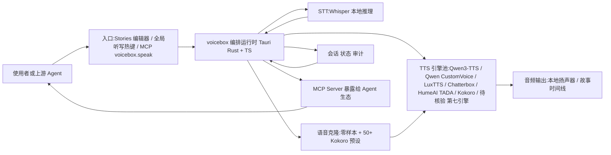

# jamiepine/voicebox

## 一句话定位
开源 AI 语音工作室——ElevenLabs + WisprFlow 的本地优先开源替代，7 TTS 引擎 + 语音克隆 + 全局听写 + MCP Agent 语音输出。

## 它解决的问题
AI 语音工具被两个云服务垄断：ElevenLabs（语音生成）和 WisprFlow（语音输入）。两者按月收费、数据上云、不可定制。开发者需要一个本地运行、隐私可控、支持多引擎的完整语音 I/O 工具。

## 为什么值得关注（2026-06-24）
33K stars 日增 1K+，持续高增长。关键差异化是"完整语音 I/O 栈"——输入（Whisper STT + 全局听写）+ 输出（7 TTS 引擎 + 语音克隆）+ Agent 接口（MCP Server）。并且是 Tauri (Rust) 构建，不是 Electron。

## 热度来源判断
- **ElevenLabs 替代需求真实**：开源 TTS 质量（Qwen3-TTS、Chatterbox）已接近商业水平
- **本地优先趋势**：AI 开发者社区越来越重视隐私和数据主权
- **MCP 生态协同**：Claude Code、Cursor 等 Agent 可以直接调用 voicebox.speak
- **Tauri 技术选型**：Rust + 原生性能 vs Electron 的重量级方案

## 关键技术亮点亮点
1. **7 TTS 引擎可切换**：Qwen3-TTS（0.6B/1.7B）、Qwen CustomVoice（9 预设）、LuxTTS、Chatterbox Multilingual/Turbo、HumeAI TADA、Kokoro
2. **语音克隆**：几秒音频零样本克隆 + 50+ Kokoro 预设声音
3. **23 语言** + 副语言标签（[laugh]、[sigh]、[gasp] via Chatterbox Turbo）
4. **全局听写热键**：push-to-talk + toggle 模式 + macOS auto-paste + Whisper STT
5. **MCP Server**：`voicebox.speak` 一个 tool call 让任何 MCP-aware Agent 说话
6. **Stories 编辑器**：多轨时间线，支持对话/播客/叙事制作
7. **Tauri (Rust)**：原生性能，macOS MLX/Metal、Windows CUDA、Linux、Docker、AMD ROCm

## 架构师速览

| 决策问题 | 研究判断 | 证据边界 |
|---|---|---|
| 系统边界 | 本地优先的语音 I/O 编排层，前端 Tauri 应用对接 7 个 TTS 引擎、Whisper STT 与 MCP Server，向 Agent 生态暴露 `voicebox.speak` 工具；不属于云端语音 SaaS，也不替代 LLM 推理 | 引擎清单、STT 选型、MCP 暴露面来自档案"关键技术亮点"；具体模型版本、网络协议、IPC 细节未在档案中给出 |
| 主路径 | 语音输入走全局热键 → Whisper STT → 文本进入项目运行时；语音输出由 MCP Agent 或 Stories 编辑器触发 → 在 7 个 TTS 引擎中切换 → 本地推理后回写音频；Stories 编辑器作为内容生产侧的旁路 | "全局听写"、"MCP Server `voicebox.speak`"、"Stories 编辑器多轨时间线"均有档案依据；编排与持久化细节待核验 |
| 关键权衡 | 多 TTS 引擎可扩展性与模型资源占用、本地隐私与 Whisper/克隆模型 GPU 需求的矛盾、单人维护与多平台（macOS MLX/Metal、Windows CUDA、Linux、Docker、AMD ROCm）覆盖广度之间的张力 | 取自档案"风险/局限"与"热度来源判断"；具体硬件门槛与平台稳定性数字未给出 |
| 最小 PoC | 在 macOS 上启用 MCP Server 给一个 Agent（如 Claude Code）调用 `voicebox.speak`，跑通 Whisper 全局听写热键与单一 TTS 引擎（如 Kokoro 或 Chatterbox），验证克隆声音与小语种输出；以本地日志/审计作为验收 | 组件存在性可证；性能指标、延迟、克隆样本上限、审计能力均待核验 |

## 架构启发
voicebox 的核心设计是**"语音 I/O 双向闭环"**——ElevenLabs 只做输出，WisprFlow 只做输入，voicebox 做两者并用本地 LLM 桥接。MCP Server 让 Agent 获得语音能力，这意味着 Agent 可以：
- 听用户说话（STT）
- 理解并处理（LLM）
- 用克隆的声音回复（TTS）

这种"语音 I/O 作为 Agent 工具"的模式正在成为标配。

## 架构图（MMD）

> 证据边界：此图只采用本档案已有可核验描述；“待核验”节点不应视为项目实现事实。

## 定位判断
**工具型。** voicebox 是 Agent 语音 I/O 的基础设施。当前定位为开发者/创作者工具，不追求平台化。但 MCP Server 接口使它天然成为 Agent 技术栈的一环。

## 风险 / 局限 / 泡沫点
1. **TTS 质量差距**：开源引擎与 ElevenLabs v3 在自然度和情感表达上仍有差距
2. **本地资源需求**：Qwen3-TTS 1.7B 需要可观 GPU 内存
3. **平台兼容性**：Linux 预构建二进制尚不可用
4. **单人维护风险**：jamiepine 是独立开发者，bus factor 低

## 与同类项目的关系
- **ElevenLabs**：商业 SaaS，质量更高但贵且不本地
- **WisprFlow**：商业语音输入，只做输入端
- **Piper TTS**：更轻量的开源 TTS，但无 Agent 集成
- **OpenClaw**：Agent 框架，voicebox 可作为其 MCP 工具

## 是否值得持续跟踪
**是。** 作为 Agent 语音 I/O 的开源标准候选。特别关注 MCP 接口在 Claude Code/Cursor 生态中的采用率。

## 后续观察点
1. MCP Server 在 Agent 生态的采用率（Claude Code、Cursor 用户是否真的在用）
2. TTS 引擎更新节奏和新模型支持
3. 是否出现企业版或托管版
4. Stories 编辑器是否演化成独立的播客生产工具

---
*首次记录：2026-06-24*
