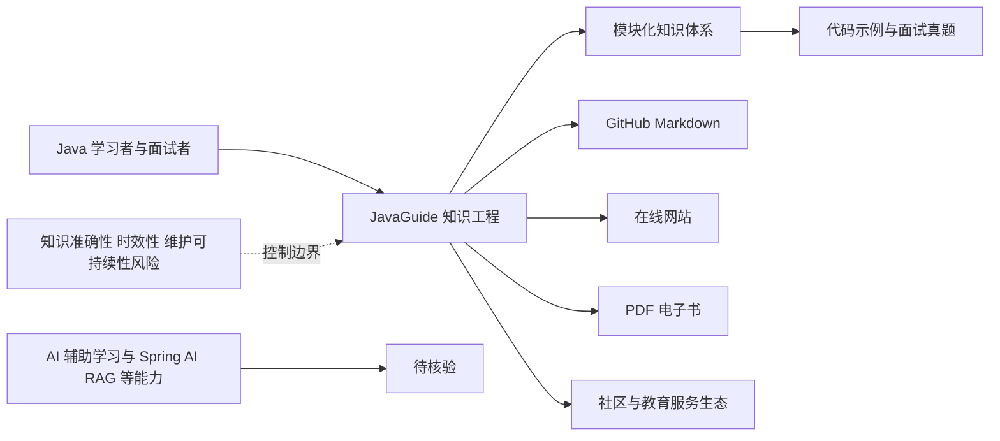

# Snailclimb/JavaGuide

## 一句话定位
中国最流行的 Java 面试与学习指南，覆盖 Java 核心、框架、数据库、系统设计、面试真题等，是 Java 开发者面试准备的"圣经"级资源。

## 它解决的问题
Java 生态极其庞大，知识点分散在语言特性、JVM、并发、Spring 全家桶、数据库、分布式系统等数十个领域，初学者和面试者很难找到一条清晰的学习路径。JavaGuide 将这些知识体系化整理，按照面试重要性和学习难度排序，提供"从基础到高级"的完整知识图谱，解决了"学什么、怎么学、面试考什么"的问题。

## 为什么值得关注
- **Stars:** 157,603 stars，中文编程教程类 Star 数前三
- **覆盖面广:** Java 基础 → JVM → 并发 → Spring → MyBatis → MySQL → Redis → MQ → 分布式 → 微服务 → 系统设计
- **面试导向:** 内容紧贴大厂面试真题，实战性强
- **持续更新:** 2018 年至今持续维护，紧跟技术趋势（如云原生、AI 相关 Java 应用）
- **生态扩展:** 延伸出 JavaGuide 官方知识星球、面试辅导、在线网站

## 热度来源判断
JavaGuide 的热度来自中国 Java 就业市场的庞大基数。Java 是中国企业级开发的主力语言，每年有数十万 Java 开发者求职，面试准备是刚需。JavaGuide 以高质量、免费的面试指南切入，通过口碑在技术社区（掘金、CSDN、知乎）广泛传播。Star 数的增长与 Java 求职季节奏高度吻合（春招 / 秋招前后增长加速），说明热度是真实需求驱动。

## 关键技术亮点亮点
- **知识图谱化:** 内容按模块组织（Java 基础 / 并发 / JVM / 框架 / 数据库 / 系统设计），形成树状知识结构
- **深度与广度平衡:** 既覆盖基础概念（HashMap 原理），也覆盖高频面试题（分布式锁实现、缓存一致性）
- **代码示例:** 核心知识点配有可运行代码，而非纯理论
- **面试场景化:** "面试官问 X，你应该怎么回答"的模式，贴近真实面试
- **多格式输出:** GitHub Markdown + 在线网站（javaguide.cn）+ PDF 电子书

## 架构师速览

| 决策问题 | 研究判断 | 证据边界 |
|---|---|---|
| 系统边界 | JavaGuide 是面向 Java 学习与面试准备的知识资源项目，核心边界是结构化内容及其组织方式；GitHub Markdown、在线网站和 PDF 是已明确的输出渠道，官方知识星球、面试辅导和小程序属于已描述的生态扩展。 | 档案未提供源码、具体内容模型、搜索机制、更新流程、访问控制或付费服务实现，不能据此确认其平台技术架构。 |
| 主路径 | 使用者从 Java 基础、JVM、并发、Spring、数据库和系统设计等模块学习，并结合代码示例与面试真题准备面试；内容通过 GitHub Markdown、在线网站和 PDF 提供。 | 档案没有说明推荐算法、检索流程、内容生成链路、接口协议或部署拓扑；AI 标签所对应的具体实现未获证实。 |
| 关键权衡 | 项目的核心权衡是面试覆盖广度与知识深度、体系化整理与内容同质化、持续更新与维护依赖个人，以及免费知识资源与社区/教育服务生态之间的平衡。 | 档案没有提供内容审查、版本发布、贡献治理、性能、SLO、安全或商业化指标；GitHub stars 和评分不能作为生产可用性证据。 |
| 最小 PoC | PoC 应验证从 Java 基础到系统设计的主题导航、代码示例可运行性、面试题覆盖范围，以及 GitHub Markdown、在线网站和 PDF 三种内容渠道的可用性；如评估生态，再单独验证知识星球、面试辅导或小程序。 | PoC 不应预设模型、工具调用、协议、持久化或部署方案；AI 辅助学习、Spring AI、RAG、向量数据库等均列为待核验项。 |

## 架构启发
JavaGuide 本质是一个"知识工程项目"——将非结构化的技术知识（散落在博客、论坛、书籍中）结构化为可导航、可搜索、可持续更新的知识库。其内容组织方式（模块 → 章节 → 主题 → 面试题）是一种有效的知识管理范式。开源社区的贡献模式（PR 提交知识点纠错 / 补充）也值得学习。

## 架构图（MMD）

> 证据边界：此图只采用本档案已有可核验描述；“待核验”节点不应视为项目实现事实。

## 定位判断
**知识资源型项目。** JavaGuide 不是代码工具或平台，而是知识内容库。其价值在于知识的准确性、体系性和时效性。它的"平台"属性体现在：围绕核心内容延伸出社区（知识星球）、工具（面试刷题小程序）、教育服务（付费课程），形成"内容 + 社区 + 服务"的生态。

## 风险 / 局限 / 泡沫点
- **内容同质化:** 大量 Java 面试内容在中文社区重复，JavaGuide 的差异化在于体系化而非独创
- **深度天花板:** 面试导向的内容以"够用"为目标，对底层原理（如 JVM 源码）覆盖不深
- **维护可持续性:** 高度依赖创始人 Snailclimb 个人，团队化程度不足
- **技术趋势风险:** 如果 Java 在中国就业市场份额下降（被 Go/Rust 蚕食），JavaGuide 的热度会受影响

## 与同类项目的关系
- **vs advanced-java:** hollischuang/advanced-java 更注重高级主题和源码分析，JavaGuide 更注重面试覆盖面
- **vs CS-Notes:** CS-Notes 覆盖更广（含算法、操作系统），JavaGuide 更专注 Java 生态
- **vs 小林 coding:** 小林 coding（xiaolincoding.com）以图解见长，JavaGuide 以全面见长
- **vs LeetCode:** LeetCode 是刷题平台，JavaGuide 是知识体系

## 是否值得持续跟踪
**低优先级。** JavaGuide 已是高度成熟的知识库，内容稳定。值得关注的是：是否新增 AI 时代的 Java 相关内容（如 Spring AI、Java + LLM 集成）、内容形式的升级（视频 / AI 辅助学习）、以及知识付费模式的演进。

## 后续观察点
- 是否引入 AI 辅助学习功能（AI 面试官、个性化学习路径）
- Java 在 AI 时代的新内容（Spring AI、向量数据库、RAG 框架）
- 知识付费 / 社区变现模式的可持续性
- 与 Go / Rust 等新兴语言的面试内容竞争

---
> 数据来源: GitHub API (2026-08-07) | 首次发现: 2026-07-26
