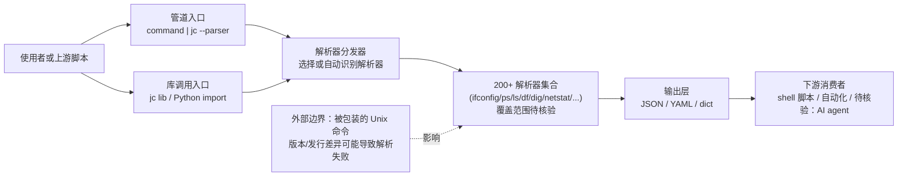

# kellyjonbrazil/jc

## 一句话定位
CLI 工具和 Python 库——将 200+ 种命令行工具输出、文件格式和常见字符串转换为 JSON/YAML/字典，让 Unix 管道进入结构化数据时代。

## 它解决的问题
Unix/Linux 命令输出大多是纯文本格式，难以程序化处理。传统做法是用 awk/grep/sed 解析，脆弱且难维护。jc 将 `ifconfig`、`ps`、`ls`、`df`、`dig`、`netstat` 等常用命令的输出直接转为 JSON，让 shell 脚本和自动化工具可以可靠地消费结构化数据，也为 AI agent 解析命令输出提供了标准接口。

## 为什么值得关注
- **Stars:** 8,662 stars，CLI 工具类经典项目
- **Forks:** 248
- **Python 实现**，同时提供 CLI 和库两种用法
- **覆盖面极广**：200+ 命令和文件格式解析器
- 对 DevOps/SRE 日常工作有立竿见影的效率提升
- 是 AI agent 操作系统的关键基础设施（让 agent 能理解命令输出）

## 热度来源判断
- **DevOps 刚需（高）**：系统管理员和运维工程师每天处理命令输出
- **AI agent 红利（中高）**：agent 需要结构化理解命令输出，jc 提供了桥梁
- **Unix 哲学回归（中）**：结构化管道是对传统文本管道的升级
- **长期积累（高）**：项目运营多年，stars 是稳定增长

## 关键技术亮点亮点
1. **200+ 解析器**：覆盖网络（ifconfig/netstat/dig）、系统（ps/ls/df/mount）、安全（iptables/openssl）、文件格式（csv/xml/yaml/ini）等
2. **统一接口**：`command | jc --parser` 或 `jc lib` 调用，学习成本低
3. **Python 库模式**：可作为 Python 库集成到任何自动化脚本
4. **JSON/YAML 输出**：支持多种输出格式，兼容不同消费者
5. **Magical 管道**：`jc` 能自动识别命令类型选择解析器

## 架构师速览

| 决策问题 | 研究判断 | 证据边界 |
|---|---|---|
| 系统边界 | jc 是"Unix 命令输出 → 结构化数据"的本地转换层，无 LLM、无远端编排；边界为"被包装的 200+ CLI 命令"与"JSON/YAML/字典消费者"之间 | 仅基于档案所述"CLI 工具和 Python 库""200+ 解析器""JSON/YAML/字典输出"；具体解析器清单、命令版本兼容范围未给出 |
| 主路径 | `command \| jc --parser` 或 `jc lib` 调用 → 内部选择/调度对应解析器 → 输出 JSON/YAML/字典；可作为 Python 库被脚本直接 import | 档案明确"command \| jc --parser 或 jc lib 调用""Python 库模式"；"自动识别命令类型选择解析器"为描述，但识别机制细节未证 |
| 关键权衡 | 覆盖面（200+ 命令）vs 各发行版/版本命令输出差异导致的解析脆弱性；精度与稳定性 vs LLM 直解析的灵活度 | 档案显式列出"命令版本兼容""长尾命令覆盖""维护负担""AI 替代风险"四项权衡；具体失败模式、性能基准未给出 |
| 最小 PoC | 在受控节点上对 1–2 个目标命令（如 `ls`、`df`）做 `… \| jc --parser` 输出对比手工解析/JSON Schema 校验，验证 Python 库 import 与管道两种用法 | 档案仅说明两种调用方式与多输出格式；吞吐、内存、依赖、Python 版本范围未在档案中确认 |

## 架构启发
- **CLI 输出结构化**：将非结构化的 Unix 世界带入结构化数据时代
- **解析即接口**：每种命令输出都有对应的 schema，agent 可以按 schema 理解
- **渐进式采用**：不需要改变现有命令，只是在输出端加一层解析

## 架构图（MMD）

> 证据边界：此图只采用本档案已有可核验描述；“待核验”节点不应视为项目实现事实。

## 定位判断
**成熟工具型项目**。是 DevOps 工具链中"默默无闻但不可或缺"的基础设施。不追求成为平台，但解决了真实的日常痛点。

## 风险/局限/泡沫点
- **命令版本兼容**：不同发行版/版本的命令输出格式可能不同，解析器可能失效
- **长尾命令覆盖**：小众或新命令可能没有解析器
- **维护负担**：200+ 解析器的维护工作量巨大
- **AI 替代风险**：LLM 可以直接解析文本输出，部分场景下可替代 jc
- **增长天花板**：工具型项目，用户基数有限

## 与同类项目的关系
- **vs awk/sed/grep**：传统文本处理 vs 结构化解析，jc 更可靠但覆盖面有限
- **vs jq**：jq 处理 JSON，jc 生成 JSON，互补
- **vs struct/logfmt**：结构化日志格式，jc 处理命令输出，定位不同
- **vs LLM 解析**：LLM 更灵活但不稳定，jc 更精确但需预置解析器

## 是否值得持续跟踪
**值得定期关注。** 作为 DevOps 日常工具值得直接采用。技术跟踪方面关注新解析器添加和 AI 集成动向即可。

## 后续观察点
- 是否增加 AI 辅助解析（LLM fallback 处理无解析器的命令）
- 新型云原生命令（kubectl、docker、helm）的解析器覆盖
- 是否成为 agent 框架的标准工具组件
- 维护者可持续性（是否引入更多贡献者）

---
> 数据来源: GitHub API (2026-06-18) | Stars: 8,662 | Forks: 248 | 语言: Python
