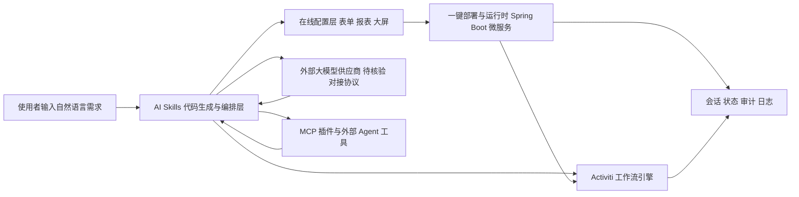

# jeecgboot/JeecgBoot

## 一句话定位
企业级 AI 低代码平台 v2.0——一句话生成整个系统，集成 AI 聊天、知识库、流程编排、MCP 插件，兼容主流大模型，引领"Skills 生成→在线配置→一键部署"新模式。

## 它解决的问题
传统企业软件开发周期长、成本高、定制化困难。低代码平台通过可视化拖拽+代码生成加速开发，但仍有局限。JeecgBoot v2.0 引入 AI 能力，用户用自然语言描述需求（"一句话画流程、设计表单、生成报表、大屏"），AI 自动生成系统骨架，再在线微调配置即可部署。大幅降低企业应用开发门槛。

## 为什么值得关注
- **Stars:** 47,311 stars！低代码平台赛道头部
- **Forks:** 16,137（大量企业 fork 定制）
- **Java 实现**：企业级技术栈，Spring Boot + Vue + Ant Design
- **AI 低代码 v2.0**：不只是代码生成，是 AI 驱动的系统生成
- **MCP 插件支持**：接入 agent 生态
- **流程引擎集成**：Activiti 工作流
- **中文社区**：国内低代码领域标杆

## 热度来源判断
- **企业数字化需求（极高）**：国内大量企业需要快速开发内部系统
- **AI 低代码概念（高）**：用 AI 做低代码是 2026 年热点
- **Java 生态庞大（高）**：国内 Java 开发者基数巨大
- **长期运营（高）**：JeecgBoot 运营多年，口碑稳定
- **一句话生成系统（中高）**：营销概念有传播力

## 关键技术亮点亮点
1. **AI Skills 代码生成**：自然语言→表单/流程/报表/大屏的端到端生成
2. **代码生成器**：基于模板的 CRUD 代码生成（传统低代码核心能力）
3. **工作流引擎**：Activiti 集成，可视化流程设计
4. **AI 应用平台**：AI 聊天+知识库+RAG+流程编排
5. **MCP 插件**：接入外部 AI agent 工具
6. **大屏报表**：数据可视化和 BI 能力
7. **微服务架构**：Spring Cloud 支持，支持大规模部署
8. **多模型兼容**：对接国内外主流大模型

## 架构师速览

一张 4 行的 Markdown 表格，列为“决策问题 | 研究判断 | 证据边界”。四行依次是系统边界、主路径、关键权衡、最小 PoC。判断必须针对项目，不得泛泛而谈。

| 决策问题 | 研究判断 | 证据边界 |
|---|---|---|
| 系统边界 | JeecgBoot v2.0 是一个面向企业内部系统开发的 AI 低代码平台，定位为前端 Vue + 后端 Spring Boot 的全栈生成与配置平台（基于标签 low-code、codegenerator、java、antd） | 是否为前后端分离微服务、是否支持多租户等细节未在档案中确认，待核验 |
| 主路径 | 自然语言需求 → AI Skills 代码生成 → 在线表单/流程/报表/大屏配置 → 一键部署（含 Activiti 流程引擎和 CRUD 模板生成） | 具体编排协议（如 MCP 接入细节）、模型对接接口、持久化层未在档案中展开，待核验 |
| 关键权衡 | 在"一句话生成系统"营销叙事的开发速度优势 vs 生成代码质量、可控性、迁移成本与企业级稳定性之间的平衡 | 档案明确指出存在"生成质量、锁定风险、性能、学习曲线"风险，但未提供量化指标 |
| 最小 PoC | 建议在一个非核心业务场景中，固定一个大模型供应商，使用默认 CRUD 生成 + 单流程（Activiti），验证生成产物可读性、权限边界与审计日志后再扩大 | 是否支持 SaaS 版、是否对接特定云厂商（阿里云/华为云）等合作状态未确认，待核验 |

## 架构启发
- **AI+低代码融合**：AI 补足了低代码"最后一公里"（定制化困难）
- **企业应用的新范式**：从"配置"到"对话生成"再到"微调"
- **MCP 进入企业应用**：低代码平台接入 MCP 说明 agent 生态向企业渗透

## 架构图（MMD）

> 证据边界：此图只采用本档案已有可核验描述；“待核验”节点不应视为项目实现事实。

## 定位判断
**成熟平台型项目**。国内低代码领域的重要玩家，v2.0 的 AI 集成是重要升级。有真实的企业用户基础和商业化路径。

## 风险/局限/泡沫点
- **"一句话生成系统"需打折理解**：复杂系统不可能真正一句话生成
- **生成质量**：AI 生成的代码/配置可能需要大量调整
- **锁定风险**：基于 JeecgBoot 架构开发的系统迁移成本高
- **性能**：低代码平台生成的代码性能可能不如手工优化
- **学习曲线**：虽然"低代码"，但掌握平台本身需要时间
- **竞争激烈**：钉钉宜搭、飞书多维表格、Retool、Appsmith 等竞争

## 与同类项目的关系
- **vs Appsmith/ToolJet**：开源低代码国际竞品，JeecgBoot 更偏中国企业管理需求
- **vs 钉钉宜搭/飞书**：SaaS 低代码 vs 可私有部署
- **vs Retool**：Retool 偏内部工具，JeecgBoot 偏完整业务系统
- **vs 若依 (RuoYi)**：若依更轻量（脚手架），JeecgBoot 更重（平台）
- **vs Bolt.new/v0**：AI 前端生成工具，JeecgBoot 更偏后端+全栈

## 是否值得持续跟踪
**推荐跟踪（企业架构师/Java 开发者）。** 作为国内低代码标杆，其 AI 集成方向值得参考。如果有企业内部系统开发需求，值得评估采用。

## 后续观察点
- AI 代码生成的实际质量和用户反馈
- v2.0 AI 功能的企业采用率
- 与 MCP/Agent 生态的集成深度
- 是否推出 SaaS 版本
- 与云厂商的合作（阿里云/华为云等）
- 在企业级稳定性/安全性方面的认证

---
> 数据来源: GitHub API (2026-07-30) | Stars: 47,311 | Forks: 16,137 | 语言: Java
