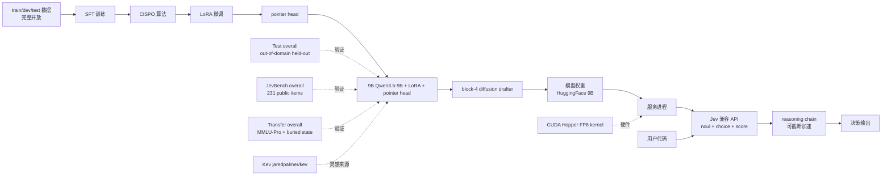

# PostHog/jeeves

## 一句话定位
Jeeves – Reasoning improves Jev-like decision models——9B reasoning + diffusion drafter + SFT+CISPO 训练 Jev-like 决策模型（JevBench public 0.935 vs Jev 0.866 + 完整训练代码 + 完整 train/dev/test 数据 + Jev 兼容 API + noul + choice + score）。

## 它解决的问题
Jev / System One 决策模型部署的痛点是 **「Jev-like 模型给出校准概率但准确性低 + 推理能力不足 + 训练数据 / 训练代码 / 评测细节不透明 + 多数 pipeline 用 reasoning 模型 fallback」**。PostHog/jeeves 用「9B Qwen3.5-9B + LoRA + pointer head + block-4 diffusion drafter + SFT + CISPO 训练 + 完整训练代码 + 完整 train/dev/test 数据 + Test overall 0.889 vs Kev-9B 0.822 / Jev 0.857 + JevBench public 0.935 vs Jev 0.866 + 0.3s/request 无 thinking / 3.3s 中位带 thinking on one H100 + CUDA (Hopper for FP8 kernel) + Jev 兼容 API（noul + choice + score）」是「reasoning + Jev-like 决策 + 训练数据透明 + 严肃工程化 + 推理增强 + 9B 模型 + 完整 benchmark」的具体路径。

## 为什么值得关注（2026-09-30）
- **Stars:** 257（截至 2026-09-30），1 天 257⭐，fork 11，fork/star 4.3%
- **Forks:** 11
- **License:** MIT（明确许可，商用清晰）
- **语言:** Python
- **活跃度:** created 2026-09-29，pushed_at 2026-09-29
- **规模:** 待核验（README 未明示 size）
- **HuggingFace Weights:** 9B（README 明示）
- **Topics:** 待核验（README 未明示 topics 数组）

## 热度来源判断
PostHog/jeeves 的热度是 **「Jev-like 决策模型严肃工程化 × reasoning 增强 × 9B 模型 × 训练数据透明 × SFT+CISPO × JevBench public 0.935 × PostHog 组织背书 × MIT 商用清晰」** 的强劲组合。Jev / System One 决策模型 2026 年是高热赛道，但官方 Jev 是「校准概率但准确性低 + 推理能力不足」——一个「9B reasoning + diffusion drafter + SFT+CISPO + 完整训练代码 + 完整 train/dev/test 数据 + JevBench public 0.935 + PostHog 组织背书 + MIT + Jev 兼容 API」的推理增强严肃工程化方案直击痛点。257 stars + 11 forks + fork/star 4.3% 反映社区高度参与——这正是「Jev-like + reasoning 增强」类项目的典型特征。1 天 257⭐ 反映 GitHub Trending reasoning 增强严肃工程化持续关注信号。热度**真实且具 PostHog 组织背书严肃工程化潜力**——但需警惕：PostHog 组织背书的「生产可用」门槛 + 9B 模型硬件门槛 + SFT+CISPO 工程化深度 + JevBench public benchmark 公平性 + reasoning chain 长度可截断加速的边界 + 商用清晰边界（README 明示「Inspired by Kev」）+ 与 TypeSafe 无关的兼容性。

## 关键技术亮点
1. **9B Jev-like model（Qwen3.5-9B + LoRA + pointer head）：** 9B 参数基座 + LoRA 微调 + pointer head
2. **Block-4 diffusion drafter：** 加速 inference（README 明示「Can be sped up by truncating chain length」）
3. **SFT + CISPO 训练：** SFT + CISPO 算法（README 明示「trained with SFT and CISPO」）
4. **完整训练代码 + 完整 train/dev/test 数据：** 全开放（README 明示「with the full training code and train/dev/test data」）
5. **Test overall 0.889 vs Kev-9B 0.822 / Jev 0.857：** out-of-domain + held-out, item-weighted 准确性大幅领先
6. **JevBench overall (231 public items) 0.935 vs Jev 0.866：** JevBench public 大幅领先
7. **Transfer overall 0.746：** MMLU-Pro + buried state 0.746（Jev 0.800 / Kev 0.579）
8. **Jev 兼容 API：** 与 Jev 相同的请求格式 + supports yes/no (noul) + multiple-choice (choice) + rating (score)
9. **0.3s/request 无 thinking / 3.3s 中位带 thinking on one H100：** 极速——推理增强但仍极速
10. **CUDA (Hopper for FP8 kernel)：** NVIDIA Hopper 架构 + FP8 kernel
11. **MIT 商用清晰**
12. **Inspired by Kev：** README 明示「Inspired by Kev (jaredpalmer/kev)」

## 架构师速览

| 决策问题 | 研究判断 | 证据边界 |
|---|---|---|
| 系统边界 | Jev-like 决策模型的 reasoning 增强——训练代码 + 训练数据 + 模型权重 + 评测代码 + benchmark | 仅基于 README 公开描述的 9B Qwen3.5-9B + LoRA + pointer head + block-4 diffusion drafter + SFT+CISPO + 完整 train/dev/test 数据 + Test overall 0.889 + JevBench overall 0.935 + Jev 兼容 API；具体 SFT+CISPO 实现细节、LoRA 配置、pointer head 结构未在档案中给出 |
| 主路径 | train/dev/test 数据 → SFT+CISPO 训练（9B Qwen3.5-9B + LoRA + pointer head）→ block-4 diffusion drafter → 模型权重（HuggingFace 9B）→ 服务进程 → Jev 兼容 API（noul/choice/score）→ Test/JevBench/Transfer benchmark 验证 | 主路径为 README 语义抽象；具体训练超参、CISPO 算法实现、扩散采样细节未在档案中给出 |
| 关键权衡 | 推理增强 + JevBench public 0.935 vs 9B 硬件门槛 + SFT+CISPO 工程化深度 + 与 TypeSafe 无关的兼容性 + Reasoning chain 长度可截断加速的边界 | 档案明示推理增强 + benchmark 领先 vs 硬件门槛 + 兼容性；CISPO 工程化深度未在档案中给出 |
| 最小 PoC | HuggingFace 下载 9B weights + 部署服务进程（CUDA Hopper FP8）+ 调用 Jev 兼容 API + 验证 noul/choice/score 三类 + 验证 reasoning chain 可截断加速 | PoC 范围由 README 「Highlights」+ 9B weights + Jev 兼容 API + 0.3s 无 thinking 推导；具体硬件门槛（Hopper FP8）、推理延迟、benchmark 验证标准待核验 |
| 证据边界 | stars / forks / license / created_at / pushed_at / language / description / HuggingFace Weights 来自 GitHub API + README；具体 SFT+CISPO 实现、LoRA 配置、pointer head 结构、扩散采样细节、size 数据均待核验 | GitHub API + README 可信；架构细节未在 README 中给出 |

## 架构启发
PostHog/jeeves 的核心启发是 **「Jev-like 决策模型应该 reasoning 增强、训练数据透明、benchmark 公开，正如严肃工程化决策模型的标准」**。当前 Jev / System One 决策模型生态多以「校准概率但准确性低 + 推理能力不足 + 训练数据 / 训练代码 / 评测细节不透明」为主——这违背严肃工程化决策模型用户利益——没人想要「准确性低 + 推理能力不足」的决策模型。PostHog/jeeves 尝试做「Jev-like 决策模型的 reasoning 增强严肃工程化标准层」，类似 DeepSeek-R1 之于 reasoning 模型严肃工程化。更深层的启发是：**Jev-like 类项目的价值在于「reasoning 增强 + 训练数据透明 + benchmark 公开 + PostHog 组织背书 + 9B 模型 + MIT + Jev 兼容 API + 严肃工程化」而非单纯 Jev 兼容**。257 stars + 11 forks 的结构，说明它已初步形成 Jev-like reasoning 增强严肃工程化飞轮。能否持续，取决于「PostHog 组织背书的'生产可用'门槛 + 9B 模型硬件门槛 + SFT+CISPO 工程化深度 + JevBench public benchmark 公平性 + reasoning chain 长度可截断加速的边界 + 与 TypeSafe 无关的兼容性 + MIT 商用清晰边界」。

## 架构图（MMD）

> 证据边界：此图只采用本档案已有可核验描述；"待核验"节点不应视为项目实现事实。

## 定位判断
**工具型项目（Jev-like 决策模型的 reasoning 增强）。** PostHog/jeeves 不仅是 Jev-like 模型，更试图成为「Jev-like 决策模型的 reasoning 增强严肃工程化参考」——类似 DeepSeek-R1 之于 reasoning 模型严肃工程化。若成功，它会成为 Jev-like 决策模型严肃工程化用户的默认入口，具有严肃工程化级价值。257 stars + 11 forks + fork/star 4.3% 已显示 Jev-like reasoning 增强严肃工程化飞轮雏形。但「工具化」取决于一个关键问题：PostHog 组织背书——若 PostHog 组织持续投入（PostHog 是产品分析公司），项目生命力强。目前定位是「最有影响力的 Jev-like reasoning 增强严肃工程化参考」，向严肃工程化级演进是合理路径。

## 风险 / 局限 / 泡沫点
- **PostHog 组织背书：** README 明示「Inspired by Kev」——PostHog 是产品分析公司，jeeves 是 Jev-like 决策模型而非 PostHog 产品分析功能——PostHog 组织背书强度需核验
- **9B 模型硬件门槛：** README 明示「CUDA (Hopper for the FP8 kernel)」——严肃工程化部署门槛高
- **SFT+CISPO 工程化深度：** README 明示「trained with SFT and CISPO」——具体 CISPO 算法实现细节未公开
- **JevBench public benchmark 公平性：** README 明示「(231 public items)」——benchmark 公平性需核验
- **reasoning chain 长度可截断加速的边界：** README 明示「Can be sped up by truncating chain length」——截断与准确性权衡需核验
- **与 TypeSafe 无关：** README 明示「Inspired by Kev (jaredpalmer/kev)」——与官方 Jev API 兼容性需持续跟进
- **topics 0 个（README 未明示 topics 数组）：** 描述密度低于 projects 标准
- **Transfer overall 0.746 较 Jev 0.800 略低：** 0.746 vs Jev 0.800 / Kev 0.579——Transfer 维度略低于 Jev
- **size 数据未明示：** GitHub API size 数据需核验

## 与同类项目的关系
- **vs TypeSafe AI 官方 Jev API：** 官方 SaaS + 校准概率但准确性低；PostHog/jeeves 是 reasoning 增强 + 9B 模型 + 训练数据透明
- **vs firelex/jeff：** Qwen3.5 / Gemma4 微调 + 254 选项 + 22ms RTX PRO 6000 / 28ms Apple M4 Max MLX；PostHog/jeeves 是 9B reasoning + diffusion drafter + SFT+CISPO
- **vs logan-markewich/jeff：** GLiFormer 400M encoder + TYPESAFE_BASE_URL drop-in replacement；PostHog/jeeves 是 9B reasoning + Jev 兼容 API
- **vs Kev (jaredpalmer/kev)：** Kev-9B；PostHog/jeeves 是 Kev-inspired 推理增强
- **vs AutoJev recipe：** 自动微调 recipe；PostHog/jeeves 是 9B reasoning + 完整训练代码 + 完整数据

## 是否值得持续跟踪
**值得跟踪（Jev-like 决策模型的 reasoning 增强严肃工程化）。** PostHog/jeeves 代表了 Jev-like 决策模型 reasoning 增强严肃工程化的诉求，无论其本身成败，这一方向是行业趋势。建议关注：PostHog 组织背书的「生产可用」门槛、9B 模型硬件门槛、SFT+CISPO 工程化深度、JevBench public benchmark 公平性、reasoning chain 长度可截断加速的边界、与 TypeSafe 无关的兼容性、MIT 商用清晰边界。对 Jev-like 决策模型严肃工程化用户，这个项目是获取 reasoning 增强 + 训练数据透明 + 9B 模型 + PostHog 组织背书 + Jev 兼容 API + 严肃工程化的实用来源，值得直接采用。对 Jev-like reasoning 增强严肃工程化观察者，它是「Jev-like + reasoning 增强」赛道的头部样本。

## 后续观察点
- 是否演化为 PostHog 产品分析功能（从 Jev-like 决策模型升级为 PostHog 集成）
- PostHog 组织背书的持续投入（README 明示「PostHog/jeeves」）
- 9B 模型硬件门槛的演进（README 明示「CUDA Hopper FP8 kernel」）
- SFT+CISPO 工程化深度的演进（README 明示「trained with SFT and CISPO」）
- JevBench public benchmark 公平性的演进（README 明示「231 public items」）
- reasoning chain 长度可截断加速的边界（README 明示「Can be sped up by truncating chain length」）
- 与 TypeSafe 无关的兼容性演进（README 明示「Inspired by Kev」）
- MIT 商用清晰的边界
- topics 覆盖的清晰度（README 未明示 topics 数组）

---
> 数据来源: GitHub API (2026-09-30) | Stars: 257 | Forks: 11 | License: MIT | 语言: Python | 创建: 2026-09-29 | HuggingFace Weights: 9B | 观察窗: 2026-09-29
