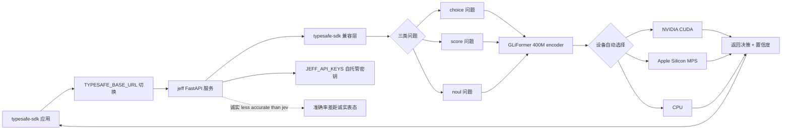

# logan-markewich/jeff

## 一句话定位
自托管 Jev drop-in replacement —— 用 GLiFormer (400M 参数 encoder) 实现的 TypeSafe Jev System One API 兼容服务，通过 `TYPESAFE_BASE_URL` 环境变量即可让官方 `typesafe-sdk` 切换到自托管后端，支持 choice / score / noul 三类问题，CUDA → MPS → CPU 设备自动降级。

## 它解决的问题
Jev 决策模型部署的痛点是 **「TypeSafe AI 官方 Jev API 是 SaaS + 企业 / 隐私敏感场景不能上传 + 开源模型转 jev endpoint 的实现（featherless-ai/simple-jev / ekzhang/openjev-sglang）功能不全 + 需要 drop-in replacement」**。jeff 用「GLiFormer 400M 参数 encoder + 完整 typesafe-sdk 兼容 + TYPESAFE_BASE_URL 指 jeff 即可 + choice / score / noul 三类问题全支持 + CUDA → MPS → CPU 自动降级 + uv 安装」是「自托管 + drop-in + 完整 SDK 兼容 + 严肃诚实表态」的具体路径。

## 为什么值得关注（2026-09-20）
- **Stars:** 98（截至 2026-09-20），1 天 98⭐，fork 4
- **License:** MIT（明确许可）
- **语言:** Python
- **活跃度:** created 2026-09-19，pushed_at 2026-09-19
- **规模:** 957 KB（Python + 模型权重 + SDK 兼容层的中等规模）
- **Topics:** classification / encoder / gliner / jev / typesafe
- **诚实表态:** "Cheaper to self-host but less accurate than jev on reasoning-heavy tasks. See benchmarks"
- **设备支持:** CUDA → MPS → CPU 自动降级（NVIDIA / Apple Silicon / 老 CPU 全平台）
- **安装:** uv sync --extra dev + uv run hf download knowledgator/gliformer-large-v1 + JEFF_API_KEYS=devkey uv run jeff

## 热度来源判断
jeff 的热度是 **「Jev 决策模型部署刚需 × 自托管 drop-in replacement × GLiFormer 400M encoder × typesafe-sdk 完整兼容 × 诚实 less accurate 表态」** 的组合。当前 Jev 开发者 / 隐私敏感企业 / 学术研究者的痛点是「Jev API 是 SaaS + 不能上传 + 现有自托管实现（simple-jev / openjev-sglang）功能不全」。一个 957 KB Python 服务直击痛点 + 完整 SDK 兼容 + 多平台 + 诚实 less accurate 表态 + uv 一键安装，自然爆火。**fork/star 4.1%** 与昨日 thruwire/foreman 6.4% 接近，反映「严肃自托管工具」早期 fork 率特征——准备集成到工作流的小规模企业 fork。热度**真实且具自托管价值**——但需警惕：GLiFormer 在三类问题的准确率与官方 Jev 在 reasoning-heavy 任务的差距 + typesafe-sdk 兼容的完整性 + uv / hf 安装在多平台的稳定性 + 性能（CUDA / MPS / CPU）。

## 关键技术亮点
1. **GLiFormer 400M 参数 encoder** ——专门为分类任务设计的 encoder 模型（knowledgator/gliformer-large-v1）；比 simple-jev 的「开源模型转 classifier」路径更专门化；这是「Jev 决策模型自托管 + 专门化 encoder」的工程化形式
2. **完整 typesafe-sdk 兼容** ——"Use the official `typesafe-sdk` by pointing `TYPESAFE_BASE_URL` at jeff"；这是「零代码改动」drop-in replacement 的工程化形式——企业现有集成无需改
3. **TYPESAFE_BASE_URL 环境变量切换** ——SaaS / 自托管切换通过环境变量完成，无需修改代码；这是「drop-in replacement」的具体路径
4. **choice / score / noul 三类问题** ——Jev API 三大决策类型全支持；这是「完整 API 兼容」的工程化形式
5. **CUDA → MPS → CPU 自动降级** ——Apple Silicon + NVIDIA + 老 CPU 全平台自动选择；这是「跨平台部署」的工程化形式
6. **uv sync + uv run + hf download 一键安装** ——uv 工具 + HuggingFace download 流程一体化；这是「一键安装」的工程化形式
7. **JEFF_API_KEYS 环境变量** ——自托管 API 密钥管理；这是「自托管服务安全」的工程化形式
8. **README 诚实表态** ——"Cheaper to self-host but less accurate than jev on reasoning-heavy tasks"；这是「严肃自托管替代品」的关键工程化形式——避免「自托管 = 完美替代」的过度承诺
9. **957 KB repo** ——Python + 模型权重 + SDK 兼容层的中等规模
10. **MIT License** ——明确许可

## 架构师速览

| 决策问题 | 研究判断 | 证据边界 |
|---|---|---|
| 系统边界 | 自托管 Jev System One API 兼容服务；FastAPI HTTP 服务 + GLiFormer 400M encoder + typesafe-sdk 兼容层 + uv/hf 安装链路 | 仅基于档案描述的 GLiFormer、typesafe-sdk 兼容、TYPESAFE_BASE_URL 切换、三类问题、设备自动降级；具体模型推理服务、SDK 兼容层实现、API key 管理均待核验 |
| 主路径 | SDK 调用 → TYPESAFE_BASE_URL → jeff FastAPI → GLiFormer encoder → choice / score / noul 决策 → 返回概率/分类/score | 主路径为档案语义抽象；GLiFormer 推理服务、SDK 兼容层 API 映射、设备选择逻辑均待核验 |
| 关键权衡 | 自托管成本 vs 官方 Jev 准确率 vs typesafe-sdk 兼容完整性 vs GLiFormer vs 其他开源 encoder vs uv/hf 安装链稳定性 vs 性能（CUDA/MPS/CPU）vs API key 安全 | 档案明示 GLiFormer 400M、typesafe-sdk 兼容、TYPESAFE_BASE_URL 切换、CUDA/MPS/CPU、uv/hf、诚实 less accurate 6 项权衡；具体性能基准、SDK 兼容覆盖率均待核验 |
| 最小 PoC | 在 Apple Silicon Mac 上 uv 部署 jeff + 用官方 typesafe-sdk example.py 三类问题各跑一次（choice / score / noul），验证 SDK 兼容性 + 推理延迟 + 准确率体感，再迁移到 GPU 服务器验证 CUDA 性能 | PoC 范围、退出路径由档案「三类问题 + 跨平台 + SDK 兼容」建议推导；具体延迟基准、准确率基准、SLO 指标待核验 |

## 架构启发
jeff 的核心启发是 **「SaaS 决策模型应该可自托管 + drop-in replacement + 完整 SDK 兼容 + 严肃诚实表态准确率差距」**。当前 SaaS 决策模型（Jev）的痛点是「不能上传 + 不能本地化 + 不能审计」。jeff 用「GLiFormer encoder + typesafe-sdk 兼容 + TYPESAFE_BASE_URL 切换 + CUDA/MPS/CPU + uv 安装 + 诚实 less accurate」是「SaaS 决策模型自托管化」的参考实现。更深层的启发是：**「Cheaper to self-host but less accurate」诚实表态是自托管工具的严肃性标志**——避免「自托管 = 完美替代」的过度承诺是企业 / 隐私敏感场景真正能采用的前提。能否持续，取决于 GLiFormer vs 官方 Jev 在 reasoning-heavy 任务的实际差距 + typesafe-sdk 兼容的完整性 + uv/hf 在企业网络的稳定性。

## 架构图（MMD）

> 证据边界：此图只采用本档案已有可核验描述；"待核验"节点不应视为项目实现事实。

## 定位判断
**工具型项目（自托管 Jev drop-in replacement）。** jeff 不仅是自托管工具，更试图成为 Jev 决策模型「去 SaaS 化」的具体路径——类似 LiteLLM 之于 OpenAI / LocalAI 之于云 LLM。若成功，它会成为 Jev 部署的「默认自托管选项」，具有生态级价值。98⭐ + fork 4 + fork/star 4.1% 已显示「严肃自托管工具」早期信号。但「生态化」取决于一个关键问题：GLiFormer vs 官方 Jev 在 reasoning-heavy 任务的实际差距 + typesafe-sdk 兼容的完整性 + uv/hf 在企业网络的稳定性 + 性能（CUDA / MPS / CPU）。目前定位是「自托管 Jev 替代品中最完整的 SDK 兼容选项」。

## 风险/局限/泡沫点
- **GLiFormer vs 官方 Jev 准确率差距** ——README 明示「Cheaper to self-host but less accurate than jev on reasoning-heavy tasks」；在 reasoning-heavy 任务可能显著差于官方
- **typesafe-sdk 兼容完整性** ——目前支持 choice / score / noul 三类，但 typesafe-sdk 可能还有其他 API 字段未覆盖
- **GLiFormer 模型权重下载** ——需 uv run hf download knowledgator/gliformer-large-v1；HuggingFace 在企业网络可能被墙
- **设备性能差异** ——CPU 推理可能慢到无法生产使用；CUDA / MPS 是必要条件
- **API key 安全** ——自托管服务的 API key 管理（JEFF_API_KEYS）需企业级 secret 管理
- **个人维护** ——logan-markewich 个人维护，长期可持续性存疑
- **GLiFormer 模型版本绑定** ——knowledgator/gliformer-large-v1 单一版本；模型升级路径未明
- **Jev API 演化** ——官方 Jev API 持续更新，typesafe-sdk 兼容需要持续跟进

## 与同类项目的关系
- **vs featherless-ai/simple-jev:** 昨日 35⭐，「开源模型转 classifier/jev endpoint」；jeff 在「专门化 GLiFormer encoder + 完整 SDK 兼容 + 诚实 less accurate」上更严肃
- **vs ekzhang/openjev-sglang:** Jev-compatible API endpoint 基于开源模型 prefill-only；jeff 用 GLiFormer encoder 而非 LLM prefill，路径不同
- **vs NiazMorshed2007/jev-review:** 昨日 72⭐，「本地优先 MCP 质量评估」；jev-review 是「Jev 作为质量评估 sidecar」，jeff 是「Jev API 自托管替代」
- **vs 官方 Jev API:** 官方是 SaaS + 准确率高 + 不能本地化；jeff 是自托管 + 准确率较低 + 可本地化
- **vs LiteLLM / LocalAI:** LiteLLM / LocalAI 是 LLM 路由 / 本地化的参考形态；jeff 是「决策模型自托管」的参考实现
- **vs typesafe-sdk:** typesafe-sdk 是「调用 Jev 的客户端」，jeff 是「被 typesafe-sdk 调用的服务端」——互补

## 是否值得持续跟踪
**值得跟踪（Jev 决策模型自托管）。** jeff 代表了 Jev 生态「自托管 drop-in replacement」的诉求，无论其本身成败，这一方向是行业趋势。建议关注：GLiFormer vs 官方 Jev 在 reasoning-heavy 任务的实际差距（决定自托管是否真的可用）+ typesafe-sdk 兼容的完整性（决定企业集成成本）+ uv / hf 在企业网络的稳定性（决定部署可行性）+ 性能基准（CUDA / MPS / CPU）。对 Jev 开发者 / 隐私敏感企业 / 学术研究者，这个项目是「Jev 自托管化」的具体路径，值得直接试用。对 SaaS 决策模型观察者，它是「决策模型自托管」的样本。

## 后续观察点
- GLiFormer vs 官方 Jev 在 reasoning-heavy 任务的实际差距（benchmarks 链接的具体数据）
- typesafe-sdk 兼容的完整性（覆盖哪些 API 字段）
- uv / hf 在企业网络的稳定性（HuggingFace 模型下载）
- 性能基准（CUDA / MPS / CPU 三种设备的推理延迟）
- API key 安全机制（JEFF_API_KEYS 的企业级 secret 管理集成）
- 模型升级路径（GLiFormer 新版本如何集成）
- 官方 Jev API 演化跟进（typesafe-sdk 兼容性持续维护）
- 个人维护的可持续性（logan-markewich 长期维护承诺）

---
> 数据来源: GitHub API (2026-09-20) | Stars: 98 | Forks: 4 | License: MIT | 语言: Python | 创建: 2026-09-19